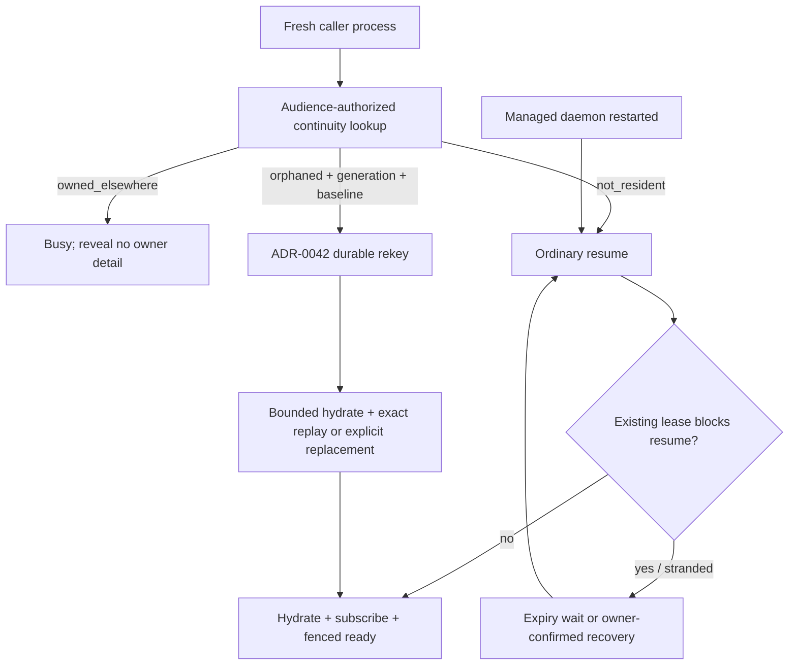

# ADR-0045 · Fresh-process managed-session reattach

**Status:** Proposed

**Implementation:** complete gate-off kernel; owner acceptance and production
caller adoption remain open

**Date:** 2026-08-17

**Owner:** Harrison / Cline runtime owner

**Related:** [ADR-0041](ADR-0041-cross-session-chat-catalog-authority.md),
[ADR-0042](ADR-0042-managed-session-reconnect-authority.md),
[caller adoption](../initiatives/cross-session-chat-management/caller-adoption-plan.md),
AUTH-035, REL-034, REL-040, REL-041

## Context

Accepted ADR-0042 defines the only durable transfer of a resident managed
session: a caller that knows the exact current writer generation requests a
lease rekey behind the resident guard and host barrier, then installs one new
runtime/lifecycle owner. The shared controller now proves that flow for a
replacement physical socket in a surviving caller process because it retains
the generation, runtime cursor, and operation state.

A fresh CLI, connector, or UI process has none of those hints. Its catalog
binding may identify the session, while the still-running daemon retains either
a live owner or an orphaned resident host. Calling ordinary lifecycle `resume`
conflicts with that residency. Calling ADR-0042 reclaim is impossible without
the expected generation, and inferring ownership from a PID, cache, binding, or
session ID would recreate the process-local takeover rejected by ADR-0042.

This case is different from a managed authority/daemon process restart. After
daemon loss the resident host and plaintext lease credential are gone, so
ADR-0042 correctly requires ordinary lease expiry/resume or confirmed
lost-lease recovery.

## Decision

### 1. Distinguish four failure domains

| Observed state | Allowed action |
|---|---|
| Replacement socket; caller process survives | Existing ADR-0042 controller flow |
| Fresh caller process; resident daemon has a live owner | Return non-enumerating busy; never steal |
| Fresh caller process; resident daemon has an orphaned owner | Read-only continuity lookup, then exact ADR-0042 durable reclaim |
| Managed authority/daemon process restarted | Treat as nonresident; ordinary resume, lease expiry, or confirmed recovery |

The fresh-process path does not amend the durable rekey algorithm and does not
create a second connection-delegation record. It only supplies an authorized,
sanitized observation needed to invoke the already accepted transition.

### 2. Add one audience-authorized continuity lookup

A strict read-only operation for one session returns exactly one state:

- `not_resident`;
- `owned_elsewhere`; or
- `orphaned`.

The server authorizes the active connection against the session's immutable
`audienceId` before revealing which state applies. Unknown and unauthorized IDs
return the same fixed denial. Principal/workspace equality and broad authority
class are insufficient.

Only `orphaned` includes the current sanitized writer generation and one bounded
runtime baseline cursor. The result contains no lease token/hash, connection
ID, PID, canonical path, client identity, profile secrets, pending prompt
content, transcript, or unrelated audience data. `owned_elsewhere` reveals no
owner detail. The lookup itself grants no mutation or subscription authority.

### 3. Reuse ADR-0042 for the authority transfer

After an `orphaned` result, the new process allocates a fresh reclaim operation
and sends the exact writer generation through the existing strict reclaim
command. The resident coordinator repeats every ADR-0042 requirement: inactive
prior connection, no active run, exclusive guard transition, nonterminal host
barrier, durable token rotation and generation advance, exact replay, and
post-commit orphan fencing.

An identical continuity result is not a reclaim receipt. A changed owner or
generation between lookup and mutation returns a stable conflict and requires a
new lookup. The client never substitutes stop/resume, confirmed revocation, or
raw catalog lease operations for a failed reclaim.

### 4. Hydrate and reconcile before ready

After durable transfer, the new process obtains bounded sanitized runtime state
and installs one exact-generation runtime subscription. It replays every
retained event after the server-provided baseline, including cancellation or
terminal events produced during the transition, before exposing a usable
session handle.

If retained event coverage no longer contains that baseline, the server must
explicitly require authoritative bounded state replacement plus a fresh atomic
runtime baseline. It must not jump silently to the current stream head. A turn,
approval, callback response, compaction, stop, or destructive lifecycle action
cannot begin before the replacement state and subscription report fenced ready.

### 5. Treat caches only as hints

A connector may persist the last sanitized session/cursor hint to reduce work,
but the server validates it against current audience, resident stream, and
writer generation. Stale, malformed, cross-instance, or future cursors fail
closed or trigger authoritative replacement. No cached generation authorizes a
reclaim, and no headless caller automatically revokes a durable lease.

### 6. Keep the extension behind the atomic managed release gate

The strict continuity and hydration operations have landed inside
`chat_runtime.v1` together with target authorization, resident implementation,
facade workflow, and the physical fault proof. Gate-on conformance fixtures
advertise the projection/lifecycle/runtime capability trio atomically; the
default production daemon still advertises none of them because
`managedChatLifecycleEnabled` remains hard-coded `false`.

This inert implementation does not constitute owner acceptance or production
exposure. Do not enable the production gate until this ADR is accepted and the
broader PC-0 through PC-8 all-protocol/all-caller release matrix passes.

## Rejected alternatives

| Alternative | Rejection |
|---|---|
| Resume by session ID | Conflicts with surviving residency and bypasses durable rekey |
| Return the current owner connection ID | Leaks ephemeral authority and invites process-local takeover |
| Persist lease credentials for restart | Expands secret lifetime and creates a second recoverable bearer |
| Let connectors revoke automatically | Headless policy cannot destroy a possibly live writer lease |
| Treat daemon restart like surviving residency | The host/token no longer exist; only expiry/resume or confirmed recovery is sound |
| Always wait for lease expiry | Safe but needlessly discards a healthy resident host after caller-only failure |

## Acceptance evidence

The technical acceptance matrix is implemented and green; explicit owner
acceptance remains the only ADR-local decision gate.

1. Audience-scoped catalog lookup, authority-keyed Core isolation, and fixed
   denial tests cover unknown, cross-audience, cross-connector, and
   same-transport/different-instance targets. Binding-capable policy templates
   cannot be minted generically: the trusted in-process issuer derives one
   stable opaque audience and server-only instance claim per installation, and
   startup fails if a binding-capable class omits that requirement.
2. Resident-adapter and managed-client tests return only fixed busy for a live
   owner and never include owner, generation, or cursor detail.
3. Orphan continuity returns only the exact generation and bounded baseline;
   adapter, client, and physical WebSocket tests prove one ADR-0042 durable
   rekey before hydration/subscription.
4. The two-socket physical test commits durable rekey, deliberately loses its
   successful reply while leaving the physical socket alive, retries the exact
   operation/generation, and proves the server performs one rekey before
   hydration, replay, and ready-before-handle.
5. Stale client cache fields reject before continuity lookup. Stale server
   generation, physical-generation change, replay eviction, readiness timeout,
   and disposal/cancellation regressions fail closed. An unknown initial
   reclaim outcome retains one operation intent and exact cancellation through
   hydration/subscription; it never substitutes a new reclaim or jumps to the
   stream head.
6. A physical Hub server close/start with a newly constructed managed factory
   classifies the session as nonresident, uses ordinary resume, rotates the
   runtime stream epoch, and rejects a subscription carrying the prior cursor.
7. Existing catalog tests prove lease-expiry takeover and owner-confirmed lost
   lease recovery without recoverable token storage or headless revocation.
8. Shared strict schemas, authenticated Hub routing, facade command assertions,
   and source inspection prove the path uses only projection, lifecycle, and
   runtime commands—never raw catalog/SQLite, a credential, connection ID, or
   legacy fallback.

Verification on 2026-08-17 passes Shared and both Core typechecks, targeted
Biome, Shared wire **4 files / 32 tests**, and the consolidated CA-2 Core matrix
**13 files / 197 tests**. That matrix includes managed facade/controller,
runtime wire/adapter/factory, installed-instance authority and pool isolation,
catalog known-ID denial, physical workspace upgrade, physical WebSocket
reclaim, and actual Hub restart. Focused SQLite evidence also passes audience
lookup **1/1** and lease expiry/confirmed recovery **2/2**. The complete catalog
test file contains an unrelated child-process fixture that requires a `bun`
executable unavailable in the current Codex runtime; the three CA-2 catalog
tests pass in isolation.

## Consequences

Fresh connector/UI processes can preserve a healthy resident daemon session
without weakening the accepted writer transition. The cost is one new strict
read-only authority surface, bounded replacement hydration, and an additional
cross-process fault matrix. Although the gate-off kernel is implemented,
production callers cannot select it until owner acceptance and PC-0 through
PC-8 completion; they retain the existing fail-closed expiry/resume or
confirmed-recovery behavior.
