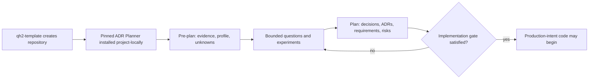

# adr-planner · Initiative index

**Status:** active (M0 owner acceptance; M1–M4 private proofs; M4 hardening and M6 distribution work open)
**ADRs:** [ADR-0036](../../adr/ADR-0036-adr-planner-plugin-boundary.md) (Accepted),
[ADR-0037](../../adr/ADR-0037-adr-planner-package-contract.md) (Proposed),
[ADR-0038](../../adr/ADR-0038-adr-planner-evidence-trust-boundary.md) (Proposed),
[ADR-0039](../../adr/ADR-0039-adr-planner-concern-catalog-and-rule-authority.md) (Proposed),
[ADR-0040](../../adr/ADR-0040-adr-planner-host-attested-workflow-authority.md) (Proposed),
[ADR-0044](../../adr/ADR-0044-adr-planner-install-attestation.md) (Proposed)
**PRD:** [ADR Planner](../../prd/prd-adr-planner.md)
**Owner:** Harrison / Drivecode

ADR Planner is a Cline package plugin that turns repository evidence and a
project brief into a proportionate, ordered decision plan before
production-intent code begins. `cline-drivecode` owns the plugin and its
evaluation assets. `qh2-template` installs a pinned project-scoped copy into
generated repositories.

The product has two deliberate phases:

1. **Pre-plan** profiles the use case, separates evidence from unknowns, finds
   material planning concerns, and orders discovery or experiments.
2. **Plan** resolves or routes those concerns into requirements, ADR
   candidates, risks, runbooks, and readiness obligations.

The plugin does not make every concern an ADR, does not infer missing facts,
and does not block simple projects on enterprise ceremony.

## Primary workflow

The MVP user is a technical lead or hands-on builder starting a production
application or material initiative in a repository generated from
`qh2-template`.

Brownfield feature planning and audit mode are required benchmark profiles,
but are secondary MVP workflows.

## Product boundary

| Owner | Responsibility |
|---|---|
| `cline-drivecode` | Plugin package, bundled planning skill, deterministic schemas and checks, templates, tests, benchmark development cases |
| `qh2-template` | Package coordinate and version/ref pin, fresh-repository install, forced upgrade command, generated configuration |
| Cline installer/runtime | Project-scoped materialization under `.cline/plugins`, discovery, sandboxing, skill injection |
| Evaluator owner | Held-out case briefs and gold labels outside the plugin source |
| Human decider | Accept/reject significant decisions and authorize crossing a lifecycle gate |

The target implementation is a bounded package plugin with a bundled skill.
The skill owns orchestration and explanation; deterministic code owns schemas,
normalization, validation, dependency ordering, and readiness calculation.
Milestone 1 will choose the exact package path after adding a production plugin
workspace role. The repository root itself is not installable as the plugin.

## Files

| File | Purpose |
|---|---|
| [milestone-0-benchmark-contract.md](milestone-0-benchmark-contract.md) | Milestone scope, definitions, gates, measures, and exit criteria |
| [labeling-handbook.md](labeling-handbook.md) | Gold-label schema and independent review protocol |
| [case-catalog.md](case-catalog.md) | Eight development cases and four held-out profiles |
| [labeling-pilot.md](labeling-pilot.md) | Independent four-case pilot, disagreements, and adjudication |
| [baseline/README.md](baseline/README.md) | Frozen prompt-only baseline, raw runs, audit manifest, normalization, and results |
| [case-manifest.json](case-manifest.json) | Versioned registry and hashes for all eight development inputs |
| [release-policy.md](release-policy.md) | Pre-registered release floors and automatic failure conditions |
| [owner-decision-packet.md](owner-decision-packet.md) | Remaining owner approvals in one auditable packet |
| [milestone-1-implementation-plan.md](milestone-1-implementation-plan.md) | Evidence-backed production package, schema kernel, plugin surface, and verification plan |
| [milestone-1-evidence.md](milestone-1-evidence.md) | Private package implementation, install/upgrade, discovery, test, and packaging evidence |
| [milestone-2-implementation-plan.md](milestone-2-implementation-plan.md) | Privacy-preserving repository evidence collection and six-dimension profiler design |
| [milestone-2-evidence.md](milestone-2-evidence.md) | M2 implementation, adversarial privacy tests, real-repository exercise, and installed sandbox evidence |
| [milestone-3-implementation-plan.md](milestone-3-implementation-plan.md) | Concern catalog, three-valued policy rules, ADR routing, dependency graph, and ordering design |
| [milestone-3-evidence.md](milestone-3-evidence.md) | M3 implementation, authority, graph, determinism, installed-package, and real-repository evidence |
| [milestone-4-implementation-plan.md](milestone-4-implementation-plan.md) | Host-attested session authority, canonical workflow compilation, routed outputs, and readiness design |
| [milestone-4-evidence.md](milestone-4-evidence.md) | M4 host-mediated private proof, rejected assumptions, lifecycle evidence, and production hardening gates |
| [milestone-6-implementation-plan.md](milestone-6-implementation-plan.md) | Reproducible candidate, template receipt, generated-repository, atomic-upgrade, and release-evaluation plan |
| [milestone-6-install-transaction-design.md](milestone-6-install-transaction-design.md) | Receipt-owned installer journal, swap, commit, and crash-recovery design |
| [milestone-6-transaction-contract.md](milestone-6-transaction-contract.md) | Frozen CLI, journal, attestation, schema-3 receipt, lock, and fault-injection contract |
| [milestone-6-evidence.md](milestone-6-evidence.md) | Exact runtime dependency and stable runtime-only template candidate evidence |

## Milestones

| Milestone | Outcome | Status |
|---|---|---|
| M0 | Output contract, benchmark, governance, prompt-only baseline protocol | active |
| M1 | Package skeleton, schemas, validators, fixtures, template install contract | private proof verified; owner decision pending |
| M2 | Evidence ingestion and six-dimension project profiler | private proof verified; ADR-0038 pending |
| M3 | Concern applicability, significance routing, dependency graph | private proof verified; ADR-0039 pending |
| M4 | Pre-plan and plan workflows, artifact generation, readiness gate | private proof verified; ADR-0040 and production hardening pending |
| M5 | Brownfield change-impact mode and history-aware planning | pending |
| M6 | Evaluation hardening, packaging, qh2-template fresh/upgrade tests | active; reproducibility and staged compatibility gate implemented; transaction open |

## Milestone 0 exit

- [x] Primary persona and workflow are explicit.
- [x] Core terms and lifecycle gates are operationally defined.
- [x] Six-dimension benchmark labels and severity rules are specified.
- [x] Eight development cases and four held-out profiles are cataloged.
- [x] All eight development briefs are frozen and content-addressed.
- [x] Negative, ambiguous, brownfield, and adversarial cases are represented.
- [x] Four development cases have two independent locked labels.
- [ ] The four pilot cases have owner-adjudicated gold.
- [x] Prompt-only baseline has been executed and structurally/stability scored.
- [ ] Gold-relative baseline scores have owner-adjudicated concern matching.
- [x] Gold-answer separation and change governance are specified.
- [x] Product ownership and installation boundary are accepted in ADR-0036.

## Open inputs

1. Publish or otherwise expose an immutable reviewed ADR Planner source pin for
   the canonical private
   [`harrison-quant-h2/qh2-template`](https://github.com/harrison-quant-h2/qh2-template).
   Local-source fresh-generation bootstrap is verified; the remote default is
   intentionally unset while the plugin worktree is uncommitted.
2. Name the second standing benchmark reviewer. Until then, two independent
   agents may pilot the process, but release gold requires a human owner.
3. Accept or amend ADR-0037. The private implementation proves
   `plugins/adr-planner`; the publication coordinate and registry authority
   remain unresolved.
4. Accept or amend the pre-registered evaluation policy before Milestone 1 is
   scored against it.
5. Accept or amend ADR-0038 and ADR-0039. Review ADR-0040's provisional host
   proof and explicit trust limits before acceptance. All private proofs are reversible;
   publication and template integration remain unauthorized.
6. Accept or amend ADR-0044 before enabling a production remote default. The
   exact-dependency, stable runtime-only candidate, and staged compatibility
   verification slices are implemented; structural receipt parsing,
   installed-runtime attestation, and atomic post-swap recovery are still open.
