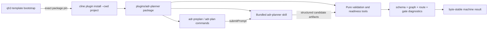

# ADR Planner Milestone 1 implementation plan

**Status:** private implementation proof verified; release and template
integration wait on M0 owner decisions and ADR-0037
**Architecture candidate:** [ADR-0037](../../adr/ADR-0037-adr-planner-package-contract.md)
**Product requirements:** [ADR Planner PRD](../../prd/prd-adr-planner.md)

## Outcome

Milestone 1 creates a production plugin package that Cline can discover from a
project-local install, exposes explicit pre-plan and plan entry points, and
owns deterministic schemas and validation without yet scanning a repository or
pretending to make planning judgments.

The milestone is successful when a fixture project can install the package,
discover its bundled skill and commands, validate good and bad machine
artifacts deterministically, and replace the install atomically at a new pin.

## Requirements in scope

| Requirement | Milestone 1 proof |
|---|---|
| `ADRPL-FR-001` | `/adr-preplan` and `/adr-plan` are registered and submit the bundled workflow prompt. |
| `ADRPL-FR-003` through `FR-005` | Versioned schema types exist for profile and concern records; no model classification logic yet. |
| `ADRPL-FR-009` and `FR-010` | Prerequisite validation and readiness calculation operate on supplied fixtures. |
| `ADRPL-NFR-001` | Validation, graph checks, normalization, and gate calculation are pure TypeScript. |
| `ADRPL-NFR-002` | Ten identical normalized inputs produce byte-identical machine output. |
| `ADRPL-NFR-004` | A critical unsupported inference cannot satisfy a blocker fixture. |
| `ADRPL-NFR-007` | Ordinary host startup tolerates plugin load failure; a requested readiness calculation returns blocked with diagnostics. |
| `ADRPL-NFR-009` | Package-content test proves no held-out brief, gold label, or evaluator private path is packed. |
| `ADRPL-NFR-010` | Run manifest schema requires plugin, evaluator, model, prompt, and case-set identities. |

Repository evidence ingestion, applicability inference, question generation,
artifact persistence, and brownfield history remain M2 through M5.

## Existing constraints

1. Package plugins declare entry points in `package.json.cline.plugins` and may
   bundle top-level `skills/` beside that manifest.
2. Project installs materialize under `.cline/plugins/_installed`; `--force`
   replaces an existing install through a staged rename with rollback.
3. The monorepo currently has SDK packages, apps, and SDK example plugins, but
   no production plugin workspace role.
4. Installing the Git repository root cannot select a plugin subdirectory.
5. Plugin commands are available on SDK, CLI, Kanban, and SDK-backed Hub
   surfaces. Current Cline documentation says plugin support does not yet apply
   to VS Code or JetBrains extensions.
6. The runtime provides structured `workspaceInfo`; plugin code must not derive
   the session workspace from `process.cwd()`.

## High-level design



The skill explains and orchestrates. Commands only start an explicit workflow.
Tools accept structured data and return structured diagnostics. None of these
surfaces silently accepts an ADR, scans ignored files, starts background work,
or installs dependencies during a planning run.

Starting `/adr-plan` is not ADR acceptance. The command can draft and validate
candidates, but an Accepted ADR or accepted business risk requires a separate
explicit human decision recorded by the host workflow.

## Proposed package boundary

```text
plugins/adr-planner/
├── package.json
├── tsconfig.json
├── README.md
├── src/
│   ├── index.ts                 # plugin registration only
│   ├── commands.ts              # explicit workflow prompts
│   ├── tools.ts                 # thin tool adapters
│   ├── schema/
│   │   ├── envelope.ts
│   │   ├── evidence.ts
│   │   ├── profile.ts
│   │   ├── concern.ts
│   │   ├── readiness.ts
│   │   └── manifest.ts
│   └── core/
│       ├── normalize.ts
│       ├── validate-graph.ts
│       ├── validate-routing.ts
│       ├── calculate-readiness.ts
│       └── canonical-json.ts
├── skills/
│   └── adr-planner/
│       └── SKILL.md
└── test/
    ├── schema.test.ts
    ├── graph.test.ts
    ├── readiness.test.ts
    ├── determinism.test.ts
    ├── plugin.test.ts
    └── package-content.test.ts
```

`src/index.ts` may import adapters and pure core modules, but core modules do
not import plugin APIs, filesystem state, clocks, randomness, environment
variables, or model clients.

## Machine contracts

Every artifact uses a common envelope:

```text
schemaVersion
artifactKind
runId
generatedAt                 # metadata; excluded from canonical decision hash
producer                    # package version + commit
inputDigest
payload
diagnostics
```

Milestone 1 freezes schemas for:

- evidence references and unsupported inferences;
- six-dimension project profiles;
- concern records using the labeling-handbook enums;
- prerequisite edges;
- question and experiment records;
- ADR candidates and significance reason codes;
- lifecycle readiness results; and
- evaluator/run identity manifests.

Canonical JSON recursively sorts object keys, preserves array order where order
is semantic, rejects non-finite numbers, and emits one trailing newline. A
decision digest excludes presentation timestamps but includes schema version,
normalized evidence, accepted decisions, and policy version.

Validation recalculates and compares the input digest before readiness. A
missing, stale, or mismatched digest blocks the requested calculation; package
installation integrity remains an installer/receipt responsibility rather than
being inferred from planning content.

## Plugin surface

| Surface | Contract | Authority |
|---|---|---|
| `/adr-preplan [brief]` | Submit the bundled pre-plan workflow prompt plus user input. | No direct writes or gate changes. |
| `/adr-plan [brief]` | Submit the bundled plan workflow prompt plus user input. | No direct ADR acceptance. |
| `adr_planner_validate` | Validate and normalize one supplied artifact or artifact set. | Pure computation. |
| `adr_planner_readiness` | Calculate one lifecycle gate from validated concerns and evidence. | May refuse/pass calculation; cannot authorize deployment. |

The package declares only `commands` and `tools`. It does not declare hooks,
rules, MCP, providers, network access, or automation events in M1.

## Readiness algorithm boundary

The model may propose concern classifications, but it may not choose the final
gate status. The pure calculator:

1. rejects schema-invalid or cyclic inputs;
2. selects applicable concerns at or before the requested lifecycle gate;
3. treats unknown applicability as unresolved when a critical outcome can
   change;
4. refuses evidence derived from critical unsupported inference;
5. blocks on unresolved `blocks` concerns;
6. reports warnings separately; and
7. emits pass, blocked, or not-applicable with exact concern and evidence ids.

An internal error returns a blocked result with a diagnostic. It never defaults
to pass.

## Failure behavior

| Failure | Ordinary Cline session | Requested planner operation |
|---|---|---|
| Package absent or cannot load | Host continues and reports plugin diagnostic. | Command/tool is unavailable; no readiness claim exists. |
| Artifact schema invalid | Unrelated work continues. | Validation fails and readiness is blocked. |
| Dependency cycle/dangling id | Unrelated work continues. | Readiness is blocked with exact edges. |
| Skill missing from package | Tools may still load. | Package smoke test and release fail. |
| Template install fails | Generated repository remains usable. | Bootstrap exits nonzero and does not write a successful install receipt. |
| Forced upgrade fails | Existing install is restored by staged replacement. | Pin remains unchanged; upgrade exits nonzero. |

Mutable configuration and planning artifacts never live inside the managed
`.cline/plugins/_installed` package directory. Upgrade preflights schema
compatibility and writes a new external install receipt only after package
discovery and skill smoke tests succeed.

## Evaluation isolation

Held-out evaluation runs use the same immutable candidate package but a fresh
workspace copy and fresh model session for every run. They inherit no prior
chat, memory, plugin cache, development output, or environment variable that
identifies gold. The planner has no filesystem or tool write access to the gold
store. Evaluator output is captured outside the candidate workspace.

## Work packages

### M1.1 · Production workspace

- Add `plugins/*` to Bun workspaces.
- Add plugin paths to root typecheck, test, format, lint, and CI filters.
- Create a private `0.0.0` development package with explicit `files` and
  package-content checks.
- Keep the package private and keep `qh2-template` free of the proposed npm
  coordinate until registry scope ownership is proven.
- Do not reuse `sdk/examples/plugins`; examples are not a production release
  role.

### M1.2 · Schema kernel

- Implement the allowed enums and discriminated artifact schemas.
- Add version dispatch and explicit unknown-version errors.
- Preserve unknowns and unsupported-inference severity.
- Add fixtures for every accepted and rejected enum combination.

### M1.3 · Deterministic policy kernel

- Canonicalize artifacts and calculate digests.
- Validate concern references and acyclic prerequisite graphs.
- Validate ADR significance reasons and artifact routes.
- Calculate readiness from concern state and evidence.
- Prove deterministic replay and critical-inference refusal.

### M1.4 · Plugin adapter and bundled skill

- Register the two namespaced commands using `submitPrompt`.
- Register thin validation/readiness tools against host contract types without
  a runtime SDK import; installed packages receive host APIs from Cline.
- Resolve the workspace only from `ctx.workspaceInfo.rootPath` when later
  milestones need it.
- Bundle one `skills/adr-planner/SKILL.md`; package tests verify discovery.

### M1.5 · Installation acceptance fixture

- Install from a local package directory into a temporary project with
  `cline plugin install --cwd`.
- Assert entry discovery and bundled skill discovery.
- Reinstall with `--force`; assert replacement and failure rollback.
- Assert mutable config and prior planning artifacts survive replacement.
- Preflight artifact schema compatibility and write the external install
  receipt only after entry and bundled-skill smoke checks pass.
- Pack the plugin and assert only public runtime files are present.
- Record the future npm coordinate as an unresolved publication gate until the
  namespace and release workflow are accepted.

## Verification matrix

| Test | Required proof |
|---|---|
| Unit | Every schema branch, graph diagnostic, route rule, and gate state. |
| Property | Key-order permutations normalize identically; generated DAGs remain acyclic after validation. |
| Replay | 10/10 byte-identical outputs for accepted fixtures. |
| Plugin | Exact capabilities, two commands, two tools, no hooks/rules/network. |
| Discovery | Package entry and bundled skill resolve from a temporary project install. |
| Upgrade | Successful replacement and restoration after induced failed replacement. |
| Content | No `baseline/`, `reviews/`, held-out ids, gold labels, or private evaluator paths in package tarball. |
| Isolation | Fresh held-out workspace/session has no development artifact, prior memory, or gold-store write path. |
| Regression | Root docs, typecheck, lint, package tests, CLI plugin tests. |

## Milestone 1 exit

- [ ] ADR-0037 package path and coordinate are accepted or amended.
- [x] Production plugin workspace participates in local and CI quality gates.
- [x] Versioned schemas cover every required machine artifact.
- [x] Graph, route, readiness, and canonicalization code is deterministic.
- [x] Explicit commands and bundled skill are discoverable.
- [x] Local fresh-install and forced-upgrade fixtures pass.
- [x] Package-content test proves evaluator separation.
- [x] No repository ingestion, hidden write, background hook, or network fetch
      has entered the milestone.

The implementation and command evidence for these checks is recorded in
[milestone-1-evidence.md](milestone-1-evidence.md). Checked items prove the
private development package; they do not accept ADR-0037, authorize publication,
or claim `qh2-template` integration.

## Revisit triggers

- Add VS Code or JetBrains support only when those hosts implement the same
  package-plugin contract and conformance fixture.
- Add repository reads in M2 behind ignore/secret/provenance policy.
- Add persistence in M4 after the artifact-root ADR is accepted.
- Revisit package extraction only when a second repository must develop the
  plugin independently or monorepo release coupling becomes material.
