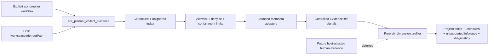

# ADR Planner Milestone 2 implementation plan

**Status:** private implementation proof verified; ADR-0048 owner decision pending
**Architecture candidate:** [ADR-0048](../../adr/ADR-0048-adr-planner-evidence-trust-boundary.md)
**Product requirements:** [ADR Planner PRD](../../prd/prd-adr-planner.md)
**Depends on:** M1 private package proof; ADR-0046 Accepted

## Outcome

Milestone 2 gives the explicitly invoked planner a bounded, local,
privacy-preserving view of repository metadata and turns collector-derived
evidence into an honest six-dimension project profile. Human assertions remain
outside the model-facing tool until the host can attest their provenance.

It does not yet generate planning concerns, questions, ADR candidates, or
readiness claims. Those remain M3 and M4.

## Requirement coverage

| Requirement | M2 proof |
|---|---|
| `ADRPL-FR-002` | Explicit collection tool emits provenance-bearing evidence from Git-visible, allowlisted repository metadata. |
| `ADRPL-FR-003` | Pure profiler maps controlled collector evidence into all six dimensions, using `unknown` when evidence is absent; the model-facing tool cannot submit evidence or assertions. |
| `ADRPL-NFR-001` | Candidate analysis, signal mapping, profile calculation, diagnostics, and normalization are pure TypeScript. |
| `ADRPL-NFR-002` | Ten identical fixtures produce byte-identical evidence and profile results. |
| `ADRPL-NFR-003` | Weak mappings remain unsupported inference rather than profile fact. |
| `ADRPL-NFR-005` | Git ignore semantics, allowlist, secret denylist, containment, symlink, size, count, and no-raw-output tests pass. |
| `ADRPL-NFR-007` | Missing workspace/Git and collection errors return blocked diagnostics without affecting ordinary Cline use. |

## System boundary



Trust boundaries:

1. Host chooses the workspace; plugin does not infer it.
2. Git chooses visibility; plugin adds a stricter read allowlist.
3. Adapters see bounded bytes; outputs contain only controlled signals.
4. The profiler sees evidence records, not files.
5. Model prose may present the profile but cannot silently alter it.

## Contracts

### `adr_planner_collect_evidence`

Input is an empty strict object. No path, glob, recursion, include-secret, or
override parameter exists.

Output:

```text
status                    collected | blocked
evidence[]                existing EvidenceRef contract
unsupportedInferences[]   weak repository implications, if any
diagnostics[]             fixed machine diagnostics
stats                     listed/candidate/read/emitted/skipped counts
```

The tool captures `workspaceInfo.rootPath` during plugin setup and passes the
tool-call abort signal into collection. It returns no timestamp, raw content,
Git stderr, package name, dependency name, script, environment value, or
absolute workspace path.

### `adr_planner_profile`

Input is an empty strict object. The tool invokes the same bounded collector
internally and does not accept evidence, paths, or human assertions from the
model. This prevents a caller from forging a repository id/digest or labeling
model-authored prose as a user/decision statement. Typed assertion schemas are
retained only for trusted kernel/evaluator use until a host-attested channel is
designed.

Output:

```text
evidenceCollection       complete bounded collection result
projectProfile           profile + unsupported inferences + diagnostics
```

If a dimension has no supported known value, it contains exactly `unknown` and
adds a stable unknown key. A known value and `unknown` cannot coexist.

## Candidate and read limits

Initial constants are policy, exported for tests:

| Limit | Initial value |
|---|---:|
| Git index output | 8 MiB |
| Git operation | 5 seconds |
| Listed paths | 100,000 |
| Candidate paths | 64 |
| Manifest depth | 3 path segments |
| Per-file content read | 256 KiB |
| Aggregate content read | 2 MiB |

Presence-only candidates consume no file-content budget. Any global index
limit blocks the collection rather than returning a misleading partial
inventory. Candidate-level denials are counted and skipped deterministically.

## Controlled signal taxonomy

The initial taxonomy covers:

- product surfaces: web, API, CLI, desktop, mobile, library, data pipeline,
  agentic system, and static content;
- runtime topology: static/edge, server, worker jobs, event-driven, and
  third-party hosted;
- repository context: monorepo, CI present, deployment descriptor,
  ownership file, security policy, language ecosystem, and open-source
  candidate.

Only signals with direct profile mappings populate dimensions. Repository
context signals remain evidence for M3 concerns. An open-source license is an
open-source *candidate*, not proof of delivery governance. Data trust,
lifecycle change, scale/reliability, and most governance values are expected to
remain unknown until a future host-attested brief/user/decision channel exists.

## Work packages

### M2.1 · Evidence and assertion schemas

- Add controlled repository signal, collection result, reserved profile
  assertion, and profile result schemas without changing the M1 artifact
  envelope version.
- Keep repository signals encoded as fixed claims in the existing
  `EvidenceRef` payload contract.
- Add exact dimension/value validation and evidence-reference checks.

### M2.2 · Pure metadata analyzer

- Convert normalized candidate descriptors into fixed evidence claims.
- Parse only bounded `package.json` structural fields and dependency-key
  membership; never emit field values or names. Treat every dependency mapping
  as a candidate unsupported inference.
- Generate stable evidence and inference ids from path plus signal.
- Sort and deduplicate all output.

### M2.3 · Workspace adapter

- Capture only `ctx.workspaceInfo.rootPath`.
- List Git-visible files with timeout/output limits.
- Apply allowlist, token-aware secret denylist, real-root containment, `lstat`,
  descriptor identity, no-follow, regular-file, mutation, count, and bounded
  read limits.
- Return fixed diagnostics and no partial result on global failure.

### M2.4 · Deterministic profiler

- Map only direct structural signals to the six-dimension enums.
- Validate controlled repository derivation and deterministically exclude
  duplicate-id conflicts.
- Preserve unsupported inference and explicit unknowns.
- Prove schema-order output and replay stability.

### M2.5 · Plugin and skill integration

- Register the two new tools while retaining commands/tools-only capability.
- Teach pre-plan to collect bounded evidence before profiling.
- Keep collection explicit; do not add hooks, rules, setup reads, persistence,
  telemetry, or network access.
- Extend installed-package smoke to invoke collection in a non-empty Git
  privacy fixture and verify deterministic output contains no canaries.

## Verification matrix

| Test | Required proof |
|---|---|
| Pure analyzer | Known manifests and presence candidates emit exact controlled signals. |
| Secret canary | Secret values in package scripts, ignored files, denied filenames, and unrelated source never occur in serialized output. |
| Ignore | Tracked/untracked visible candidates are considered; ignored candidates are absent. |
| Boundary | Symlink, parent swap, same-size replacement, concurrent append, path escape, non-file, oversized, over-count, timeout, non-Git, and missing workspace fail or skip as specified. |
| Provenance | Stable relative source, locator, digest, and evidence id identify every claim. |
| Profile | All six dimensions exist; absent evidence is unknown; forged evidence and caller-authored assertions cannot enter through the tool. |
| Ambiguity | Weak/open-source/deployment implications remain unsupported or contextual evidence. |
| Determinism | 10/10 collection and profile replay results are byte-identical. |
| Plugin | Exactly four tools and two commands; no hooks, rules, MCP, provider, network, or write surface. |
| Install | Fresh copied package discovers the skill and invokes both M2 tools against a tracked/untracked/ignored/secret privacy fixture. |
| Regression | M1 artifact validation/readiness, package archive, docs, links, workspace types, and CI remain green. |

## Milestone 2 exit

- [ ] ADR-0048 is accepted or the private implementation is explicitly allowed
      to remain a reversible proof.
- [x] Collection uses host workspace context and Git visibility only.
- [x] Allowlist, secret, symlink, containment, count, timeout, and byte policies
      have adversarial tests.
- [x] Outputs contain controlled signals and provenance but no raw content.
- [x] Profiler covers all six dimensions and preserves unknowns.
- [x] Collection and profiling are deterministic across ten replays.
- [x] Installed-package sandbox smoke invokes both M2 tools.
- [x] No background read, arbitrary path, write, persistence, telemetry
      evidence payload, or network access entered the plugin.

The proof and commands behind checked items are recorded in
[milestone-2-evidence.md](milestone-2-evidence.md). Checked items do not accept
ADR-0048 or authorize publication/template integration.

## Deferred to later milestones

- Concern applicability, significance, and prerequisite generation: M3.
- Question/experiment generation and complete workflows: M4.
- Artifact persistence and accepted-decision history: M4/M5.
- Brownfield Git history and change impact: M5.
- Non-Git workspace fallback and broader document parsing: separate evidence
  after benchmark need is demonstrated.
