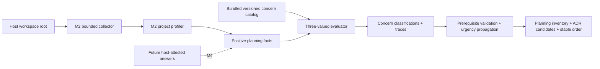

# ADR Planner Milestone 3 implementation plan

**Status:** private implementation proof verified; ADR-0039 owner decision pending
**Architecture candidate:** [ADR-0039](../../adr/ADR-0039-adr-planner-concern-catalog-and-rule-authority.md)
**Product requirements:** [ADR Planner PRD](../../prd/prd-adr-planner.md)
**Depends on:** M2 private evidence/profile proof; ADR-0036 Accepted

## Outcome

Milestone 3 turns bounded evidence into a deterministic, explainable planning
inventory. It evaluates a source-backed 12-concern nucleus with three-valued
rules, classifies concern disposition, retains non-ADR work, derives proposed
ADR candidates, validates prerequisites, propagates urgency, and emits a stable
dependency order.

M3 does not ask questions, accept human facts, calculate a passing readiness
gate, render or persist artifacts, generate ADR files, or claim that the
nucleus is the complete production catalog. Those remain M4 and later work.

## Requirement coverage

| Requirement | M3 proof |
|---|---|
| `ADRPL-FR-004` | Every bundled concern evaluates to applicable, not applicable, or unknown with a fixed rationale and trace. |
| `ADRPL-FR-005` | Evaluated concerns carry resolution, urgency, artifact route, lifecycle gate, criticality, significance, prerequisites, and readiness effect; active prerequisites are ordered. |
| `ADRPL-FR-006` | ADR candidates are derived only from applicable `adr` concerns with explicit permitted significance reasons. |
| `ADRPL-NFR-001` | Catalog validation, rule evaluation, routing, graph checks, urgency propagation, and ordering are pure TypeScript. |
| `ADRPL-NFR-002` | Canonical results and traces are byte-stable across repeated and permuted inputs. |
| `ADRPL-NFR-003` | Missing facts evaluate to unknown; dependency candidates and model prose never become catalog facts. |
| `ADRPL-NFR-004` | M3 does not calculate readiness pass; unresolved/unknown blockers remain visible for M4. |
| `ADRPL-NFR-005` | The public tool reuses the M2 collector and accepts no caller data. |
| `ADRPL-NFR-007` | Invalid catalog/context/graph state returns blocked with no partial authoritative plan. |

## System boundary



Authority boundaries:

1. The host selects the workspace.
2. The M2 collector and profiler produce repository-derived evidence and facts.
3. The package selects and validates the catalog.
4. Pure policy code selects applicability, routing, ADR significance, urgency,
   and ordering.
5. The model may explain the result but cannot submit policy or classification.

## Contracts

### Planning fact

```text
id              stable identifier
key             namespaced controlled characteristic
value           boolean, string, or non-empty string set
evidenceRefs[]  known evidence ids
```

A missing key is unknown. Duplicate identical facts deduplicate. Conflicting
values or ids are fatal. A versioned registry fixes key type, compatible rule
operators, and allowed authority source. Repository profile conversion emits
only positive facts; it never emits false from detector absence.

### Catalog rule

```text
constant(value)
equals(fact, value)
contains_any(fact, values[])
all(rules[])
any(rules[])
not(rule)
```

Every evaluation emits trace steps with a stable expression path, result,
observed value state, and evidence ids. Full steps remain auditable; question
lineage contains only decisive missing keys. No rule executes arbitrary code.

### Concern definition

```text
id, title, question, area, sequenceBand
applicabilityRule
classification:
  resolution, urgency, artifactRoute, lifecycleGate
  criticality, significanceReasons, readinessEffect
prerequisites[]
rationale, sourceRefs[]
```

Definitions contain policy. Evaluated `ConcernRecord` instances contain the
result for one context.

### `adr_planner_plan_concerns`

Input is an empty strict object. The tool internally collects evidence,
profiles the project, derives positive facts, and evaluates the bundled
catalog. Output contains:

```text
evidenceCollection
projectProfile
planningFacts[]
concernPlan:
  status, authority, catalogVersion, catalogDigest
  concerns[], traces[]
  adrCandidates[]
  orderedConcernIds[]
  unknownConcernIds[]
  notApplicableConcernIds[]
  diagnostics[]
```

## Nucleus catalog

| Band | Concern | Primary route | Main condition |
|---:|---|---|---|
| 10 | Product boundary and exclusions | requirement | always |
| 10 | Ranked quality priorities | plan | always |
| 20 | System/deployment responsibility boundary | ADR | always |
| 30 | Data authority and ownership | ADR | `data.persisted` |
| 30 | Retention and deletion semantics | requirement | persisted or personal data |
| 40 | Trust boundaries and privileged actions | ADR | sensitive data, external actors/dependencies, or mutation capability |
| 50 | External interface compatibility | ADR | externally consumed interface |
| 60 | Deployment and rollback strategy | plan | production delivery |
| 70 | Observability and operational signals | runbook | production delivery |
| 70 | Backup, restore, and recovery semantics | runbook | persisted data |
| 80 | Scale and service-extraction triggers | ADR | variable or material scale |
| 40 | Tenancy isolation | ADR | multiple tenants |

The nucleus is chosen to exercise universal, positive, negative, unknown,
composed, ADR, non-ADR, prerequisite, and urgency behavior. It is not the final
40–60 concern base catalog.

## Work packages

### M3.1 · Schema and catalog contracts

- Add strict planning fact, recursive rule, trace, catalog, and result schemas.
- Keep definition and evaluated-instance types separate.
- Validate source references, classifications, duplicate ids, and prerequisite
  references before evaluation.

### M3.2 · Three-valued rule engine

- Implement strong Kleene semantics and stable trace paths.
- Canonicalize facts independent of arrival order.
- Reject conflicts; preserve missing keys as unknown.
- Derive positive facts from M2 profile values without closed-world negatives.

### M3.3 · Concern evaluator and ADR filter

- Produce coherent applicable, unknown, and not-applicable concern records.
- Carry evidence and missing fact keys into each result.
- Generate ADR candidates only from applicable, significant ADR routes.

### M3.4 · Prerequisite graph and ordering

- Validate active prerequisite references and cycles; an unknown dependent with
  an inactive prerequisite remains uncertain rather than becoming a graph
  failure.
- Propagate earliest urgency from applicable dependents through active
  prerequisite edges; unknown dependents remain provisional.
- Topologically order by precedence with urgency, sequence band, and bounded
  ASCII code-unit id tie-breakers.
- Emit no partial authoritative plan after fatal findings.

### M3.5 · Nucleus and source registry

- Encode 12 source-backed concerns independently from benchmark gold.
- Add local CLI, multi-tenant SaaS, unknown, and adversarial contexts.
- Require positive, negative, unknown, boundary, duplicate, and permutation
  coverage before expansion.

### M3.6 · Plugin integration

- Register one bounded M3 tool and retain commands/tools-only capability.
- Update the skill to consume the inventory and ADR view without treating it as
  accepted or ready.
- Extend installed-package smoke to reject caller input, invoke the tool, check
  prerequisite order, and scan serialized output for privacy canaries.

## Verification matrix

| Test | Required proof |
|---|---|
| Rule truth table | Every operation has true, false, and unknown cases. |
| Open-world facts | Missing detector never produces false or not-applicable. |
| Catalog | Strict schema, unique ids, valid sources and prerequisites, no unconditional cycle. |
| Contrasting contexts | Local CLI and multi-tenant SaaS produce materially different applicability and ADR views. |
| Coherence | Not-applicable records use the complete inactive classification; unknown remains unresolved. |
| ADR filter | Applicable + ADR + significance only; non-ADR prerequisites remain in inventory/order. |
| Graph | Missing references, inactive prerequisites, and exact cycles block without partial plan. |
| Urgency | Earliest active urgency propagates backward; prerequisite always precedes dependent. |
| Determinism | Ten distinct input permutations are byte-identical; bounded ASCII ids use code-unit ordering. |
| Authority | Public tool rejects facts, evidence, catalog, rules, routes, and assertions; public library results are explicitly untrusted. |
| Install/privacy | Fresh installed package runs M3 on the non-empty fixture and emits no source/secret/evaluator canary. |
| Regression | M1–M2 tests, workspace types, package archive, docs, links, and CI remain green. |

## Milestone 3 exit

- [ ] ADR-0039 is accepted or the private proof is explicitly retained as
      reversible.
- [x] Strict catalog/rule/fact/result contracts are implemented.
- [x] Three-valued evaluation and open-world unknown behavior are proven.
- [x] Twelve source-backed nucleus concerns pass contrasting fixtures.
- [x] ADR filtering, graph validation, urgency propagation, and stable ordering
      pass adversarial tests.
- [x] Installed-package smoke invokes the bounded M3 tool and remains
      canary-free.
- [x] M1–M2 and package-boundary regressions remain green.

Checked items will be backed by commands and outputs in a separate M3 evidence
artifact. They do not accept ADR-0039, publish the package, or authorize
`qh2-template` integration.

## Deferred to later milestones

- Host-attested brief/user facts and material question generation: M4.
- Readiness-obligation compilation and final gate calculation: M4.
- Typed heterogeneous non-precedence graph edges: M4/M5.
- Full 40–60 base catalog and domain overlays: catalog expansion after nucleus
  precision review.
- Markdown/JSON persistence and proposed ADR skeleton files: M4/M5.
- Brownfield history, existing-ADR semantic coverage, and change impact: M5.
