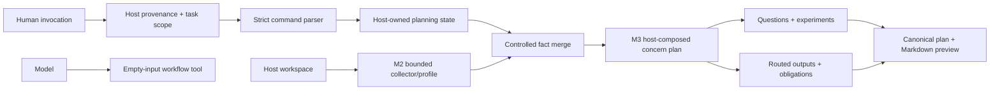

# ADR Planner Milestone 4 implementation plan

**Status:** provisional private host-mediated proof; production hardening open
**Architecture candidate:** [ADR-0050](../../adr/ADR-0050-adr-planner-host-attested-workflow-authority.md)
**Product requirements:** [ADR Planner PRD](../../prd/prd-adr-planner.md)
**Depends on:** M3 private concern-planning proof; ADR-0046 Accepted

## Outcome

Milestone 4 will turn the M3 inventory into a usable, bounded pre-plan/plan
walking skeleton. A host-owned task-scoped capability must provide controlled
attestations and gate selection; an empty-input tool can then compile a canonical planning artifact with
material questions, experiment plans, routed work, readiness obligations,
next actions, JSON, and Markdown.

The parser and deterministic compiler are now registered behind host-owned
session state. Host persistence is separate from planning-artifact persistence;
M4 still does not write plans or ADRs, parse arbitrary prose into authoritative facts,
accept ADRs or risks, ingest arbitrary evidence, prove production readiness,
or claim the 12-concern nucleus is complete.

## Requirement coverage

| Requirement | M4 proof |
|---|---|
| `ADRPL-FR-001` | `/adr-preplan` and `/adr-plan` select an explicit workflow and an empty-input compiler emits both machine and human views. |
| `ADRPL-FR-007` | Decisive missing fact keys compile to a bounded, impact-linked question queue. |
| `ADRPL-FR-008` | Experiment-routed concerns compile complete experiment records rather than guessed answers. |
| `ADRPL-FR-009` | Concerns, routes, ADR candidates, obligations, and next wave compile in dependency order into canonical JSON and Markdown. |
| `ADRPL-FR-010` | Unknown or unresolved blockers at/before the requested gate produce a deterministic blocked verdict. |
| `ADRPL-NFR-001` | Parsing, fact merge, question/experiment compilation, obligations, next wave, JSON, and Markdown are pure policy code. |
| `ADRPL-NFR-002` | Canonical output excludes time and is byte-stable across replay and attestation permutations. |
| `ADRPL-NFR-003` | Command attestations remain distinct from repository facts; conflicts block rather than select by source order. |
| `ADRPL-NFR-004` | Attestation alone never resolves implementation evidence or passes a blocker. |
| `ADRPL-NFR-005` | Compiler recollects through M2 and accepts an empty strict object. |
| `ADRPL-NFR-006` | Only explicit commands mutate ephemeral planning state; no ADR substance is accepted. |
| `ADRPL-NFR-007` | Invalid command batches are atomic; invalid compilation returns no partial authoritative artifact. |

## Boundary and data flow



Authority rules:

1. The host must supply workspace, task scope, actor provenance, and a
   non-forgeable state capability to both command and tool lifecycles.
2. Repository facts come only from M2 authentic evidence.
3. Human facts come only from host-proven human invocations; reaching a plugin
   command handler is insufficient.
4. The model may invoke compilation and explain output but cannot mutate facts,
   selected gate, policy, decisions, evidence, or readiness state.
5. Catalog and fact registries remain package-owned and digest/freeze guarded.

## Contracts

### Session snapshot

```text
revision
mode: preplan | plan
requestedGate
attestations[]:
  fact key/value
  controlled evidence id/source/claim
```

No timestamp, raw brief, arbitrary note, identity claim, or transcript is
stored. Snapshots sort by key.

### Material question

```text
id, factKey, question
changesConcernIds[]
changes: applicability | route | urgency | prerequisite | readiness
answerCommand
```

Only decisive M3 trace keys may appear. `answerCommand` is a controlled
template, not model-generated shell text.

### Experiment plan

```text
id, concernId, questionId?
hypothesis, method, metric, timebox
ownerState: unassigned
decisionRule, requiredEvidence
```

### Readiness obligation

```text
id, concernId, gate
ownerState, requiredEvidence[]
freshness: same-plan
blocking
status: unknown | pass | fail | waived | not_applicable
evidenceRefs[], rationale
```

M4-generated obligations begin unknown unless deterministic evidence policy can
prove another state. No user attestation is implementation proof.

### Canonical workflow plan

```text
schemaVersion, policyVersion
mode, requestedGate, authority
catalogVersion, catalogDigest
profile, planningFacts, concernPlan
questions, experiments, routedOutputs
readinessObligations, readinessSummary
nextWaveConcernIds, diagnostics
```

The tool returns canonical JSON and Markdown projections of this object plus
the bounded collection result. Volatile execution metadata remains outside.

## Work packages

### M4.1 · ADR and schemas

- Add ADR-0050 and this plan before implementation.
- Add strict attestation, question, experiment, routed-output, obligation,
  readiness-summary, and canonical-plan schemas.
- Extend concern-plan authority with `host-composed`.

### M4.2 · Host authority (blocking)

- Add a backward-compatible SDK command invocation context and bounded
  state-mutation request result.
- Add a SQLite extension-state store keyed by workspace, core session,
  extension, and key. Keep the store and extension ownership outside plugin
  source.
- Have interactive and connector command surfaces stamp invocation id, source,
  session/task, workspace, and actor provenance. Reject authoritative mutations
  when session or human provenance is absent.
- Bind commands to their host-known extension id; ignore extension ids supplied
  by plugin code.
- Have runtime plugin wrappers discard caller-supplied extension state, read a
  fresh snapshot for their closed-over session/extension ids, and inject it into
  tool context immediately before sandbox execution.
- Implement strict Boolean `key=value`, `status`, and `clear` parsing.
- Prove sharing through the real separate command/tool plugin loads.
- Prove new/reset/fork/session isolation, connector actor attribution, stale
  snapshot refresh, direct-import non-authority, and deletion behavior.
- Keep command briefs out of the canonical store.

Implemented in the private proof: host invocation context, SQLite state,
content-bound plugin installation identity, CAS revision checks, invocation
replay binding, sandbox-only state injection, caller-state overwrite, and real
separate command/tool load tests. Open hardening: authenticated connector
principals, deletion/retention, declarative consent or confirmation UI, signed
result receipts, and isolation from malicious same-user plugins.

### M4.3 · Deterministic compiler

- Merge repository facts and command attestations without precedence.
- Use the M3 catalog and host-composed evaluation path.
- Compile decisive questions and complete experiment records.
- Route applicable non-ADR work and compile readiness obligations.
- Select the smallest unblocked next wave.

### M4.4 · Rendering

- Emit canonical JSON with no timestamps or execution duration.
- Render stable accessible Markdown headings and lists.
- Return previews only; register no writer.

### M4.5 · Plugin workflow

- Register `/adr-attest` and `adr_planner_compile_workflow` only after the host
  capability and lifecycle tests pass.
- Update `/adr-preplan`, `/adr-plan`, skill instructions, README, package smoke,
  and exact command/tool surface tests.
- Preserve M1–M3 tools for compatibility and diagnostic use.

## Verification matrix

| Test | Required proof |
|---|---|
| Parser | Unknown/malformed/duplicate/over-limit batches do not mutate state. |
| Session | Same-value replay is idempotent; replacement and clear are explicit; separate plugin setups share only rows with the same host session and extension ids. |
| Lifecycle | New/reset/fork sessions and distinct connector thread sessions are isolated; resume of the same session sees the latest revision. |
| Provenance | Interactive and connector commands carry host-created actor/source/task context; missing session or non-human actor cannot mutate. |
| Authority | Tool payload and caller-created tool context cannot add facts or gates; direct source imports lack the host wrapper; natural brief is absent from canonical facts. |
| Fact merge | Equal repository/attested values merge; contradictions block without partial output. |
| Questions | Exactly decisive missing registered keys, each with affected concerns; bounded truncation is explicit. |
| Experiments | Strict complete record only for experiment resolution. |
| Obligations | Gate filtering, owner/evidence/freshness fields, and blocked unknowns are coherent. |
| Readiness | Attestation changes applicability but never resolves implementation or ADR acceptance. |
| Next wave | Only dependency-unblocked applicable concerns; stable maximum. |
| Determinism | Ten replays and distinct attestation permutations produce byte-identical JSON/Markdown. |
| No write | Plugin remains commands/tools only; no hook, writer, network, or persistence path. |
| Install/privacy | Fresh installed plugin shares command state with tool, rejects malicious payloads, clears state, and leaks no canary. |
| Regression | M1–M3 tests, workspace types, archive, docs, links, and CI remain green. |

## Milestone 4 exit

- [ ] ADR-0050 is accepted or the private proof is explicitly retained as
      reversible.
- [x] Host invocation provenance and task-scoped state are implemented in the
      SDK/runtime.
- [x] Strict M4 contracts and provisional host-mediated authority are implemented.
- [x] Explicit command attestations are atomic, bounded, persistent, and
      isolated by plugin session.
- [x] Question, experiment, routed-output, obligation, readiness, and next-wave
      compilation pass adversarial tests.
- [x] Canonical JSON and Markdown are byte-stable and contain no volatile or
      raw command data.
- [x] Fresh installed-package workflow proves real command/tool lifecycle
      state sharing and
      malicious-input rejection.
- [x] M1–M3 and package-boundary regressions remain green.

The checked items are backed by an M4 private-proof evidence artifact. They do
not accept ADR-0050, publish the package, write planning artifacts, or authorize
an immutable `qh2-template` plugin pin.

## Deferred

- Protected Markdown/JSON persistence and generated-region ownership.
- Proposed ADR skeleton preview/write and collision handling.
- Accepted-decision, waiver, risk, and implementation-evidence ingestion.
- Typed non-Boolean attestations and first-class host input UI.
- Host-owned declarative mutation consent or explicit confirmation UI.
- Signed result envelopes and independent authority verification.
- Authenticated connector principals, retention/deletion, and plugin-state
  migration policy.
- Existing ADR semantic coverage and brownfield change impact (M5).
- Base-catalog expansion and held-out release scoring.
