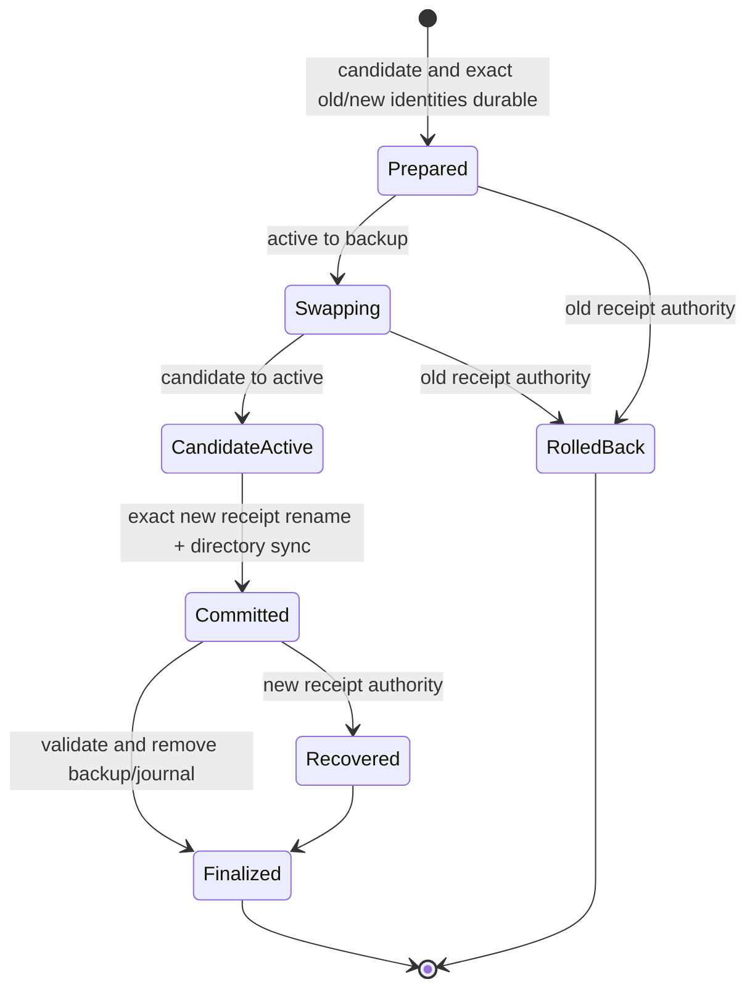

# ADR Planner install transaction design

**Status:** implemented for the project-local ADR Planner channel — coordinated
commit, real crash-process recovery, same-tree recovery, concurrent mutation,
adversarial path/digest/lock, and immutable local-Git A-to-B evidence pass  
**Decision:** [ADR-0054](../../adr/ADR-0054-adr-planner-install-attestation.md)  
**Milestone:** [Milestone 6](milestone-6-implementation-plan.md)  
**Frozen contract:** [Transaction contract](milestone-6-transaction-contract.md)

## Purpose

This design closes the gap between a compatible staged plugin and an atomic
`qh2-template` upgrade. The verifier proves a candidate's contained manifest,
sandbox load, parent-side registrations, exact runtime surface, and unchanged
complete install tree. The transaction then commits that verified tree and its
schema-3 receipt as one recoverable workspace mutation.

Verification is a compatibility gate, not a security sandbox. Dependency
installation and plugin `setup()` execute with user permissions, so production
use remains restricted to reviewed immutable artifacts and an explicit
dependency/lifecycle-script policy.

## Required invariants

1. The exact receipt bytes—not journal phase—select old or new authority.
2. Before receipt commit, recovery restores the byte-identical old install and
   receipt (including expected absence); after commit, it converges to new.
3. Candidate and backup trees never live beneath plugin discovery roots.
4. Recovery uses only persisted bytes and digests: no network and no plugin
   execution.
5. One workspace mutation lock covers the install, receipt, and recovery.
6. Unknown receipt bytes, tree digests, paths, or journal fields fail closed and
   preserve evidence.
7. ADR Planner contributes no MCP state. General MCP mutation is a separate
   transaction and cannot inherit these guarantees.
8. Recovery validates every present active, candidate, and backup tree before
   its first mutation.
9. Exact same-pin replay is a no-op; same-tree/different-host replacement uses a
   distinct content-addressed attestation and remains receipt-directed.
10. Generic uninstall cannot orphan a structurally receipt-bound install.

## Ownership boundary

| Owner | Durable responsibility |
|---|---|
| Cline installer | Non-discoverable staging, exact verification, workspace lock, old/new identity snapshot, journal, swap, attestation, receipt commit, recovery, cleanup |
| `qh2-template` | Immutable source selection, allowlisted runtime materialization, source-content intent, and exact ADR Planner expectations |
| Plugin runtime | Activation after committed discovery; no authority over install or receipt identity |

qh2 supplies a canonical eight-field source intent. Cline derives all attested
fields and writes the final receipt. There is no public prepare/commit/finalize
sequence and no caller-generated post-swap receipt.

## Authority lifecycle

### Stage and verify

- Materialize under `.cline/plugin-install-transactions/.staging`, a sibling of
  `plugins`.
- Reject missing, duplicate, escaping, symlinked, special, or undeclared entry
  paths.
- Sandbox-load and validate the complete parent contribution registry.
- Compare exact package, plugin, capability, command, tool, and skill sets.
- Reject MCP and rehash after verifier shutdown.

### Commit under the workspace lock

- Recover every earlier transaction before admitting a new one.
- Recheck non-force replacement eligibility under the lock, after recovery.
- Strictly validate an existing schema-1/2/3 receipt, then snapshot its exact
  bytes and the active tree digest.
- Persist candidate, old/new receipt copies, attestation, and journal; sync them.
- Compare-and-swap active identity, retain old as transaction backup, and move
  candidate to active.
- Rehash active, atomically write attestation, then atomically write the exact
  preconstructed schema-3 receipt. Receipt rename and parent-directory sync are
  the commit point.
- Revalidate all identities, delete backup, and remove the journal last.
- For an exact same-pin receipt, validate the existing attestation and discard
  private staging without writing a journal or swapping the active tree.

### Offline recovery

| Receipt identity | Physical identity | Action |
|---|---|---|
| exact old | active old | Remove known candidate and journal. |
| exact old | active missing, backup old | Restore backup. |
| exact old | active new, backup old/old absent | Remove known new; restore old when present. |
| exact new | active new | Validate attestation, remove old backup, finalize. |
| exact new | candidate new, active old/missing | Activate known candidate, validate, finalize. |
| other | any | Fail closed and preserve evidence. |
| either | unknown tree digest | Fail closed and preserve evidence. |

If old and next tree digests are equal, exact receipt bytes still select
authority. With old receipt authority, a known active tree already satisfies
rollback and is preserved; with new authority, it satisfies roll-forward.

Journal phase records where the writer last synced, but never overrides receipt
and content identity.

## Versioned contracts

- `cline-install-tree-v1` hashes entry type, relative path, mode bits, file
  bytes, and contained symlink target.
- Journal schema 1 rejects unknown fields and stores only revalidated relative
  workspace paths plus old/new digests.
- Attestation schema 1 binds transaction, installed tree, entries, exact
  verification report, plugin API version, and host version.
- Attestation files are content-addressed as
  `<transaction-id>-<attestation-digest>.json`; prior host evidence is never
  overwritten by a same-source replacement.
- qh2 receipt schema 3 retains the eight schema-2 source fields and adds the six
  transaction/attestation/runtime/host fields.
- Schema-1/2 receipts are valid old authority during migration; successful
  transactional writers always emit schema 3.

## Remaining acceptance work

The filesystem transaction acceptance work passes: two verified upgrades and a
receipt-bound uninstall serialize under one lock; two fresh non-force installs
admit exactly one commit; malformed/duplicate journals, unknown active/candidate/
backup digests, symlinked evidence/tree/storage roots, untrusted role paths,
unknown artifacts, malformed/multiple lock owners, and valid dead-owner reclaim
all have focused fixtures. The race was also repeated five consecutive times.

Release work remains outside this design slice: extend immutable A-to-B evidence
from local Git transport to the accepted production remote coordinate, define
dependency lifecycle-script/environment policy, run accepted release evaluation,
and obtain ADR/package/pin authority. This design does not claim a malicious
same-user security boundary.
