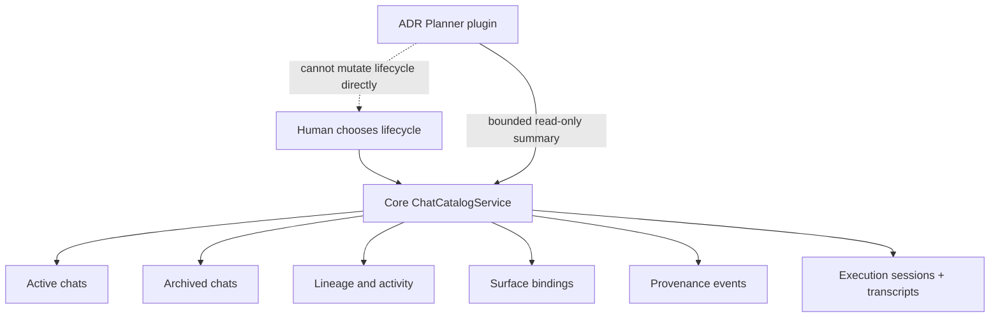

# Cross-session chat management

**Status:** active — production convergence; release gate off

**Decision:** [ADR-0051](../../adr/ADR-0051-cross-session-chat-catalog-authority.md) Proposed
**Research:** [Research 29](../../research/29-cross-session-chat-management.md)

## Outcome

Give Harrison one trustworthy place to organize current and historical Cline
chats across CLI, TUI, connector threads, resume, reset, fork, checkpoint
restore, and future plugin workflows.

Milestone 0 now has a substantial behind-gate authority kernel: catalog-backed
lifecycle, writer fencing, managed Hub workspace scope, production profile
resolution and continuity, durable
resident reconnect, trusted manual-compaction receipts, bounded runtime
delivery, admission-only managed starts, and the first profile-granted callback
broker with a physical WebSocket round trip and fail-closed cancellation matrix.
Range-aware assistant delivery now also passes strict sequence-range,
in-place/backpressure, stale-subscription-fence, and physical WebSocket proof.
One-shot cursor recovery now adds an atomic sequence-zero-capable baseline,
bounded immutable replay, exact physical-WebSocket forward-gap proof,
session-only runtime scope, pre-mutation journal admission, and policy-bounded
active subscription sources. Bounded-state reconciliation and exact source-
generation fencing now prevent subscription-control churn or stale setup output
from bypassing that bound. It is not a production cutover.
One shared Core controller now proves replacement-socket
register/reclaim/resubscribe ordering, including lost-reply reconciliation and
a second durable rekey before cursor replay. Reclaim send and subscription are
generation-fenced; physical loss starts bounded recovery immediately; retired
socket frames are dropped; and exact-operation cancellation either aborts
pre-durable waits or orphan-fences the committed successor even if its bounded
response receipt was evicted.

CA-2 now extends that controller to gate-off fresh-process reattach. A trusted
installed-instance issuer derives distinct opaque connector audiences; strict
continuity returns nonresident/live/orphaned state; an unknown initial reclaim
reply retries the exact durable intent; hydration precedes subscription; and a
handle appears only after fenced ready. Physical tests drop a committed reply
on a live socket and restart the Hub to prove ordinary resume, a new stream
epoch, and rejection of the old cursor.

CA-3 now closes the gate-off confirmation-authority kernel. One validated
managed command receives one invocation-scoped Core responder; the owner seam
sees only a frozen action/aggregate/revision/effects target and abort signal,
while all connection, workspace, operation, and invocation correlation remains
server-owned. Managed and direct prompts share bounds, retained callbacks
expire with command completion, and physical approve/decline/disconnect/
shutdown plus revision-race, replay, and injection tests fail closed. No
production owner surface has been selected or wired.

Production adoption of the controller, real connector-launcher audience
delivery, explicit ADR-0055 acceptance, broader non-admission operation replay,
production manual-compaction authority, owner-responder product wiring, bounded caller
residency, server-side isolation of managed rows from the legacy compatibility
lane, ADR-0014-conformant Drive room/fork/wave convergence, and every
interactive/connector caller still have to converge before the single release
gate can move.

CA-0 now also provides the inert production-caller seam: strict bounded
projection and reconciled lifecycle contracts, independent three-capability
preflight, a separate Core-owned `ManagedHubChatClient`, bounded resident and
unknown-operation state, ready-before-handle admission, and deterministic
admission/controller/transport disposal. Admission operation IDs stay leased
through runtime readiness, and projection continuation cursors are
single-consumer.

CA-1 now provides the matching gate-off server kernel: immutable audience and
event-time scope, copied-v4 restartable migration/quarantine, raw-catalog
denial, audience-before-disclosure checks, bounded projection snapshots, exact
retained lifecycle replay with delivery-admitted ready, and descriptive
admission profile authority. No production caller selects it, and all three
managed capabilities remain unadvertised.

## Mental model

The catalog answers “what work do I still care about?” Execution status answers
“what is the runtime doing?” A connector binding answers “where is this chat
currently reachable?” These questions must never share one state field.

## Artifact map

- [requirements.md](requirements.md) — behavioral, authority, migration, and
  verification contract.
- [milestone-0-plan.md](milestone-0-plan.md) — ordered implementation and proof
  plan.
- [m0-evidence-ledger.md](m0-evidence-ledger.md) — fresh local proof, adversarial
  review disposition, and unresolved release blockers.
- [production-convergence-plan.md](production-convergence-plan.md) — ordered
  owner-control-plane, protocol-parity, daemon-composition, and all-caller
  cutover plan.
- [caller-adoption-plan.md](caller-adoption-plan.md) — selected managed-client
  boundary, audience authorization, bounded projection/replay, fresh-process
  reattach, caller inventory, Drive convergence, unknown-outcome closure,
  ordered changesets, and all-caller proof matrix.
- [ca4-interactive-history-cutover-plan.md](ca4-interactive-history-cutover-plan.md)
  — audited interactive/history escape hatches, app-domain authority boundary,
  operation mapping, ordered gate-off implementation slices, and CA-4 proof
  matrix.
- [runtime-parity-companion-design.md](runtime-parity-companion-design.md) —
  PC-4 command/event, sanitization, callback, race, and reliability contract.
- [Research 29](../../research/29-cross-session-chat-management.md) — past-chat
  evidence and current-code audit.
- [ADR-0051](../../adr/ADR-0051-cross-session-chat-catalog-authority.md) — proposed
  source-of-truth decision.
- [ADR-0052](../../adr/ADR-0052-managed-session-reconnect-authority.md) — accepted
  durable resident reconnect authority.
- [ADR-0053](../../adr/ADR-0053-trusted-managed-manual-compaction.md) — proposed
  trusted host-owned manual-compaction transaction and replay contract.
- [ADR-0055](../../adr/ADR-0055-fresh-process-managed-session-reattach.md) —
  proposed audience-authorized fresh-caller-process discovery that reuses the
  accepted ADR-0052 durable rekey.

## Roadmap

| Milestone | Scope | Exit |
|---|---|---|
| M0 | Catalog, managed lifecycle/runtime authority, production composition, and caller convergence | Local/Hub conformance, runtime parity, all-caller cutover, and one atomic release gate |
| M1 | Active/Archived CLI and TUI, compatibility history | Users can triage, archive, activate, resume, fork, and inspect lineage |
| M2 | Connector binding migration and parity | Reset/config change preserve history; stale bindings use CAS |
| M3 | Handoff/context snapshots | Reviewed continuity artifact can seed a new chat without raw transcript replay |
| M4 | Reversible context swapping | Stable block handles, backing store, restore audit, privacy/retention policy |
| M5 | Per-file/per-agent projections | New chats can be routed to bounded derived knowledge without changing canonical history |

## Boundary with ADR Planner and qh2-template

`cline-drivecode` owns both capabilities, but ownership is intentionally split:

- core owns chat lifecycle, transcripts, bindings, leases, and audit;
- ADR Planner owns deterministic pre-planning policy and workflow compilation;
- qh2-template pins and installs the reviewed plugin into new repositories; and
- the plugin may later consume a bounded chat/handoff projection, never the raw
  global catalog or lifecycle writer.

## Owner decisions before final cutover

1. Legacy session triage/adoption policy.
2. Workspace identity across clones and hosted use.
3. Whether UI recommends `/new --archive-current` while plain `/new` remains
   preservation-safe.
4. Retention/purge defaults and operator recovery policy.
5. Whether the interactive-owner audience receives explicit workspace-wide
   administration while every headless/worker audience remains closed.
6. Drive coordinator, worker-profile, retention, and fenced parent-summary
   policy.
