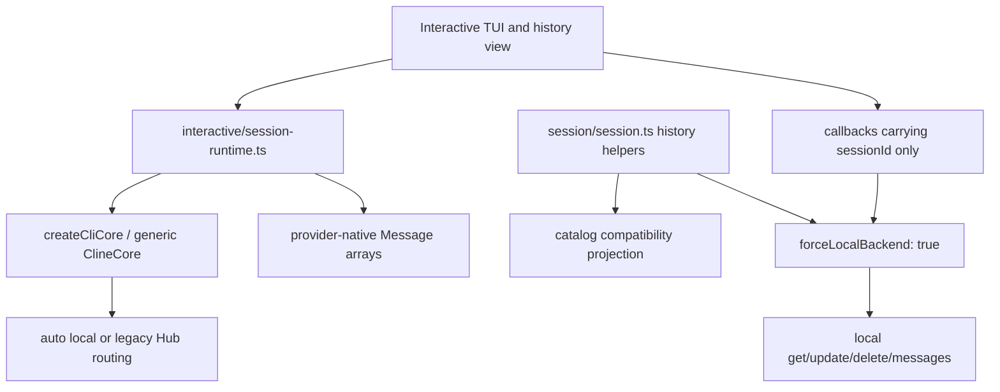
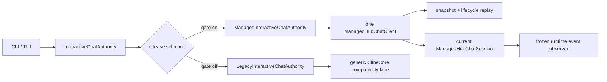

# CA-4 interactive and history atomic cutover plan

**Status:** CA4-A and CA4-B implemented behind the disabled release gate;
CA4-C independently closed; CA4-D0 implemented; the CA4-D1a data-projection
checkpoint is verified with independent review pending; D1a event/capability
closure and CA4-D1b through CA4-G remain pending

**Release posture:** `managedChatLifecycleEnabled` remains `false`

**Scope:** interactive CLI/TUI runtime, history projection and actions, and the
Core consumer seam required to preserve current interactive behavior

**Related requirements:** FR-054, FR-065 through FR-072, AUTH-022, AUTH-034,
AUTH-037, REL-031, REL-040 through REL-045

**Related decisions:** [ADR-0051](../../adr/ADR-0051-cross-session-chat-catalog-authority.md),
[ADR-0052](../../adr/ADR-0052-managed-session-reconnect-authority.md),
[ADR-0053](../../adr/ADR-0053-trusted-managed-manual-compaction.md), and
[ADR-0055](../../adr/ADR-0055-fresh-process-managed-session-reattach.md)

## Executive decision

CA-4 shall replace the interactive and history caller family as one atomic
authority boundary. It shall not add a managed branch to individual existing
helpers. One app-owned authority object will own caller selection, one
`ManagedHubChatClient`, the current managed session handle, lifecycle
projection state, operation identity, runtime-event adaptation, and disposal.

The production selector remains on the Legacy implementation while the release
gate is disabled. A test-only/injected managed selection may exercise the new
adapter behind that gate. When the release gate is eventually enabled, failure
of managed preflight, capability issuance, transport construction,
reconciliation, reattach, or readiness is terminal for that caller. It never
authorizes a generic Core, raw Hub, force-local SQLite, or direct artifact
fallback.

This plan does not accept ADR-0051 or ADR-0055, select the production owner
confirmation surface, or enable the production gate.

## Outcomes

CA-4 is complete only when:

1. fresh start, resume, config restart, reset/new, turn, queue/steer, fork,
   checkpoint restore, abort, compaction, shutdown, and missing-runtime
   recovery use one selected authority implementation;
2. managed history comes from one audience-bound projection snapshot and its
   exact lifecycle reconciliation stream;
3. managed actions retain `chatId`, `headSessionId`, `catalogState`, and
   `expectedRevision` from rendering through command admission;
4. current streaming, tool status, approval, `askQuestion`, pending-prompt,
   checkpoint, usage, and compaction behavior has an explicit managed mapping;
5. Legacy rows are visibly Legacy and read-only;
6. no managed target can reach generic `ClineCore` lifecycle/runtime methods,
   raw Hub commands, local update/delete, or direct artifact truth; and
7. the complete conformance matrix passes while the production release gate
   remains disabled.

## Scope boundaries

### In scope

- `apps/cli/src/runtime/interactive/session-runtime.ts` and its caller-facing
  contract;
- `apps/cli/src/runtime/run-interactive.ts`, chat commands, and TUI callbacks;
- CLI/TUI history loading, paging, display, resume, archive, activate, rename,
  purge, and export classification;
- the Core managed-session observation seam needed by an interactive caller;
- operation/run correlation, cancellation, startup, restart, and deterministic
  disposal in the interactive process; and
- negative guards around adjacent force-local helpers that could receive a
  managed target.

### Out of scope

- connector launcher/adapters, Drive workers, ACP, Zen, Agent, automation, Hub
  UI, and other CA-5 through CA-7 callers;
- accepting ADR-0055 or changing fresh-process reattach policy;
- choosing workspace identity across clones/worktrees;
- adding provider credentials, raw messages, tool payloads, paths, or catalog
  authority to the managed wire;
- silent adoption of Legacy sessions; and
- enabling or partially enabling a managed protocol family in production.

## Audit evidence

The audit was performed against the current CA-0 through CA-3 gate-off kernel.
It found three blocking API-shape gaps and several caller escape hatches.

### Current authority flow



The compatibility projection improves current history display, but it is not a
managed authority boundary. The same view still sends only a `sessionId` into
local delete/resume/export helpers.

### Audited caller inventory

| Surface | Current behavior | CA-4 disposition |
|---|---|---|
| `runtime/interactive/session-runtime.ts` | Creates generic Core; calls `start`, `send`, `stop`, `abort`, `restore`, `get`, `readMessages`, compaction mutation, hook ingest, and connection update; yolo and sandbox both force local even though the managed interactive profile already permits yolo | Replace behind an app port; managed implementation holds only `ManagedHubChatClient` and `ManagedHubChatSession`; keep yolo managed and decide sandbox explicitly |
| `runtime/session-events.ts` | Interprets generic `CoreSessionEvent` and legacy chunk shapes | Keep inside the Legacy adapter; add a separate exhaustive strict managed-event reducer |
| `utils/resume.ts` | Reads provider-native messages to seed another generic start | Legacy-only; managed resume/reattach hydrates through the strict facade |
| `runtime/run-interactive.ts` | Assumes provider-native turn messages; history delete calls local delete; resume receives a string ID | Consume app-domain turn/history types and authority-tagged targets |
| `runtime/interactive/chat-command-runner.ts` | `/new`, `/fork`, and config restart inherit generic runtime semantics; the command host supports `/abort` but this runner supplies no abort callback | Preserve command UX while routing structural managed operations and exact-run abort |
| `session/session.ts` | Lists a local catalog/manifest compatibility projection, but get/update/delete/artifact helpers force local Core | Keep as the explicit Legacy adapter; reject a managed target before helper entry; local Catalog/Legacy badges are caller preparation, not the managed audience projection |
| `commands/history.ts` and `history-command.ts` | `delete` removes a local session; `update` permits prompt, title, and arbitrary metadata | Managed title becomes catalog rename; managed prompt/metadata update is forbidden; destructive semantics require explicit product policy |
| `session/history-export.ts` | Reads a local provider-native `messages.json` artifact | Managed export uses a separately labeled bounded display projection or fails explicitly; never falls back to local artifacts |
| `tui/views/history-view.tsx` | Loads global helpers itself; callbacks carry `sessionId`; Left means delete | Inject one history controller; callbacks carry a frozen target; action labels depend on lifecycle and authority |
| `tui/types.ts` and `tui/hooks/use-local-command-actions.tsx` | Dialog result and resume callback remain string-only | Carry `ChatHistoryTarget` through keyboard, mouse, refresh, dialog resolution, and action admission |
| `main.ts --worktree --resume` | Reads the local row before changing worktree | Managed cross-worktree resume rejects until workspace identity policy is ratified |
| hook command/helper | Sends generic hook payloads through force-local Core | Must not address managed rows; managed host hooks remain daemon-owned |

### Core seam gaps and CA4-A disposition

`ManagedHubChatSession` receives and validates strict runtime events, but its
only current consumer is private correlation state for approvals and
capabilities. It exposes no listener to an interactive app. CA-4 therefore
cannot preserve assistant streaming, tool status, approvals, `askQuestion`,
pending prompts, usage, or compaction notifications without a narrow Core API
extension. The audit also found that strict pending-prompt update/remove
commands existed on the wire but not on the public session handle, and that the
current TUI approval dialog expects raw tool input while the managed event
deliberately exposes only a bounded summary.

CA4-A now implements the observation API on the managed session handle, not a
raw transport subscription:

```ts
subscribeRuntimeEvents(
  listener: (event: ManagedHubChatRuntimeEvent) => void | Promise<void>,
): () => void;
```

Required behavior:

- Core performs strict parsing, sequence/fence recovery, and internal
  approval/capability correlation before app delivery;
- the app receives a frozen sanitized event and no transport, subscription
  token, authority claim, or mutable internal object;
- registration is local and consumes no additional server source;
- independent registrations are bounded and each listener preserves accepted
  event order without a slow async listener blocking another listener;
- each listener retains at most one in-flight callback plus 256 queued events;
  overflow retires only that listener and reports sanitized
  `observer_overflow` evidence;
- listener failures, including rejected async error observers, are contained
  and reported through the facade error seam;
- unsubscription is idempotent;
- session/facade disposal clears queued and future delivery before releasing
  the controller; an already executing listener is not awaited or cancelled
  and retains no authority;
- the first listener receives a bounded ordered replay of events accepted
  before registration, including events accepted during fresh-process
  reattach; overflow before readiness rejects admission, and overflow before
  first registration rejects that registration; initial durable state still
  comes from reattach hydration and bounded read methods; and
- tests prove a stale physical subscription cannot reach a current app
  listener.

CA4-A also exposes strict `updatePendingPrompt` and `removePendingPrompt`
methods through the session handle. The summary-only approval presentation
adapter belongs in CA4-C/CA4-D; raw tool input shall not be added to the managed
wire to preserve the old dialog.

## Fixed architecture

### One ownership root



The selector is the only component allowed to know both implementations. The
runtime, history view, command handlers, and export controller consume the
port and cannot instantiate Core or Hub clients.

### Authority-tagged history model

Do not coerce a managed chat projection into `SessionHistoryRecord`. That type
implies provider/model, prompt, cost, raw session status, and artifact behavior
which the bounded managed projection intentionally does not expose.

The app model shall use a discriminated target:

```ts
type ChatHistoryTarget =
  | {
      kind: "managed";
      chatId: string;
      headSessionId: string;
      expectedRevision: number;
      catalogState: "active" | "archived";
    }
  | {
      kind: "legacy";
      sessionId: string;
    };

type ChatHistoryItem = {
  target: ChatHistoryTarget;
  title: string;
  lastActivityAt: string;
  lineageKind?: "root" | "fork" | "checkpoint_restore" | "config_restart" | "recovery";
  executionStatus?: "idle" | "running" | "blocked" | "failed";
  canResume: boolean;
  canArchive: boolean;
  canActivate: boolean;
  canRename: boolean;
  canPurge: boolean;
  canExport: boolean;
};
```

Exact field names may follow repository conventions, but the discriminant and
revision-bearing managed target are mandatory. A mutation conflict refreshes
the projection and asks the user to retry; destructive intent is never
silently replayed against a newer revision.

### App-facing ports

One composed authority owns two narrow views:

1. `InteractiveSessionAuthority` — start/resume/turn/restart/reset/fork/
   restore/abort/prompt/checkpoint/usage/compaction/shutdown plus runtime-event
   observation.
2. `ChatHistoryAuthority` — snapshot/page/reconcile plus resume/archive/
   activate/rename/purge/export classification using `ChatHistoryTarget`.

They share one disposal root and, in managed mode, one client. The history view
must not open a second client for refresh because continuation cursors and
lifecycle replay are bound to the first client's audience, query, connection,
and snapshot cut.

### Atomic release selection

Selection is an explicit release expectation, not “try managed and fall back.”

| Release expectation | Required behavior |
|---|---|
| Disabled | Construct only the Legacy authority. Do not obtain a managed capability or open a managed socket. |
| Enabled | Require public `/version` preflight, all three managed capabilities, one-time capability issuance, transport registration, projection reconciliation, and readiness. Any failure is a stable managed-startup error. |
| Selected managed session | Every subsequent read, mutation, callback, restart, and shutdown stays managed. No per-operation fallback exists. |
| Unknown/mismatched configuration | Fail before either authority starts. Never infer “disabled” from a missing daemon or capability. |

CA-4 may inject the enabled branch in tests while production remains disabled.
CA-8 will move daemon advertisement/routing and production caller selection in
one release-gate changeset.

## Operation mapping

| User/runtime intent | Managed authority | Required adaptation |
|---|---|---|
| Fresh chat | `ManagedHubChatClient.startRoot` | Generate stable operation/session IDs; pass only an authorized opaque profile and workspace-relative cwd |
| Resume from history | `ManagedHubChatClient.reattach` after ADR-0055 acceptance | Target the projected head session; let server continuity choose normal resume, busy denial, or exact orphan reclaim |
| Same-process normal resume | `ManagedHubChatClient.resume` where continuity proves nonresidency | Never infer writer availability from app cache |
| Model/mode/config change | `startRelated` with `relationKind: "config_restart"` | Create a successor using projected chat revision; do not preserve the old session ID or clone messages in the CLI |
| `/new` or reset | current session `reset`, then `startRoot` when a new chat is requested | Stop/unbind without archive; no local deletion |
| Turn | session `runTurn` | Subscribe first; adapt bounded attachments and sanitized turn summary; do not expect provider-native `messages` in the result |
| Queue/steer | session `runTurn` with `delivery` | Track operation to strict `run.started` correlation |
| Abort | session `abortRun` | Use the exact run ID. An abort arriving before `run.started` is queued only for that turn operation and is sent immediately after correlation; terminal completion cancels it |
| Approval | session `respondToApproval` | Exact session/run/approval correlation and fresh response operation ID; render only the managed summary, never raw tool input |
| `askQuestion` | session `respondToCapability` | Accept only the profile-granted capability and exact request; app callback never receives authority metadata |
| Pending prompts | session list/update/remove methods | Preserve bounded cursor and mutation IDs; no generic pending-prompt service |
| Messages | session `listMessages` | Use display-safe message domain; never cast to provider-native `Message[]` |
| Usage/context display | session `getUsage` plus turn summary | Display explicit input/output/cache/cost fields; do not reconstruct context size from raw messages |
| Checkpoints | session `listCheckpoints` | Use bounded checkpoint summaries |
| Manual compaction | session `runCompaction` | Daemon owns canonical transcript, provider, system prompt, and sidecar transaction |
| Fork | `startRelated` with `relationKind: "fork"` | New active chat and structural lineage; no CLI transcript clone or metadata-authored lineage |
| Checkpoint restore | client `restoreCheckpoint` | New active chat/session with restore lineage and bounded result only |
| Missing runtime/lost writer | reviewed `recovery` successor or `recoverLostLease` | Classify from strict server result; never rebuild from a local artifact |
| Archive | client `archiveChat` | Use projected revision; running chat requires explicit stop-and-archive intent |
| Activate | client `activateChat` | Use projected revision; archived resume activates through authoritative lifecycle flow |
| Rename | client `renameChat` | Catalog title only; prompt and arbitrary metadata remain immutable from this surface |
| Purge | client `purgeChat` | Archived/non-running plus trusted owner confirmation; no caller confirmation bit or local delete |
| Clean shutdown | session `stop`, then facade `dispose` | Drain callbacks/events and release writer/controller deterministically |

## Interactive behavior adaptation

### Runtime event reducer

The managed adapter shall reduce strict events into app-domain events currently
consumed by the TUI. The reducer must be exhaustive over the runtime wire
union. Unknown events are a version error, not ignored payload guessing.

| Strict event | App behavior |
|---|---|
| `assistant.delta` / `assistant.finished` | streaming assistant text and terminal message |
| `reasoning.*` | display only when profile-authorized; otherwise no fabricated reasoning |
| `tool.*` | tool status using bounded name/status/summary only |
| `approval.requested` | invoke current approval UX and respond through the session handle |
| `capability.requested` | invoke only the exact granted `askQuestion` adapter |
| `pending_prompts.changed` / `pending_prompt.submitted` | replace or update the TUI prompt queue |
| `usage.updated` | update explicit turn/aggregate usage |
| `compaction.*` | drive progress/result UI without local provider work |
| `run.*` | correlate turn, queue early abort, settle terminal state, and reject cross-run output |

The existing generic `AgentEvent` subscription may remain inside the Legacy
adapter. Managed mode gets a distinct exhaustive reducer so provider-native
event types do not become an accidental compatibility contract.

Plugin `SqliteExtensionStateStore` remains valid, invocation-scoped extension
state. It is not chat catalog/runtime authority and must stay isolated from
history routing; static no-SQLite assertions apply to managed chat fallback,
not unrelated plugin state.

### Hooks and profile changes

The current interactive runtime constructs hooks in the CLI and forwards hook
events through generic Core. In managed mode the trusted daemon profile owns
runtime hooks, tool policy, provider resolution, and credentials. The CLI may
render strict projected events and submit reviewed callback responses; it may
not send arbitrary hook payloads to reconstruct daemon behavior.

Likewise, `updateSessionConnection` has no managed mapping. A model/config
change selects a reviewed opaque profile revision and creates a
`config_restart` successor. It does not patch provider/model labels into a
session row after startup.

### Message and export semantics

Managed runtime messages are bounded display records, not canonical provider
messages. CA-4 shall introduce an app display-message type for resume UI,
checkpoint comparison, and managed export. Code that requires canonical
`Message[]`, `messages.json`, system prompts, raw tool input/output, or local
artifact paths must remain Legacy-only or report an explicit unsupported
managed operation.

The recommended managed export is a clearly labeled sanitized HTML/JSON
artifact containing catalog identity, lifecycle/lineage summary, and paginated
display messages. It must never silently claim to be the canonical provider
conversation.

## History behavior

### Loading and reconciliation

1. Open one managed client and obtain its authoritative initial projection.
2. Render the first page only after lifecycle reconciliation reports ready.
3. Follow opaque `nextCursor` values on the same snapshot ID and query; never
   re-run a global helper for each page.
4. Apply exact authorized lifecycle events after `snapshotSequence`.
5. If replay coverage is unavailable, atomically replace all managed rows from
   a new snapshot before reporting ready.
6. Merge Legacy compatibility rows only at the app view-model boundary and
   never let their IDs shadow or upgrade a managed target.

Numeric `--page` compatibility, if retained, must traverse opaque cursors from
page one within a single bounded client operation. It cannot synthesize an
offset or combine pages from different snapshot cuts.

### Action policy

| Row | Enter | Primary lifecycle action | Rename | Purge/delete | Export |
|---|---|---|---|---|---|
| Managed Active | resume/reattach head | archive | catalog rename | unavailable until archived and confirmation-capable | sanitized managed export |
| Managed Archived | activate then resume | activate | catalog rename | explicit purge only | sanitized managed export |
| Legacy | unavailable | unavailable | unavailable | unavailable | existing legacy artifact export |

The current Left-key “delete” behavior is not retained for managed rows.
Destructive purge requires an explicit label, effects preview, and the trusted
owner responder. A revision conflict refreshes the row and requires a new user
action.

## Ordered implementation slices

### CA4-A · Core runtime observation seam

**Status:** implemented behind the disabled production gate.

Files:

- `sdk/packages/core/src/hub/client/managed-chat-client.ts`
- `sdk/packages/core/src/hub/client/managed-chat-client.test.ts`
- the Core client export surface, if a new public event type is introduced

Deliver the frozen local listener API, listener containment, disposal, and
stale-fence tests. Do not expose transport subscription controls.

Current proof passes the focused managed client **34/34 tests**, the
client/runtime/controller regression matrix **4 files / 94 tests**, scoped
Biome, Core development plus public-smoke typechecks, and the Core bundle plus
declaration build. The new public session methods include pending-prompt
update/remove. The first independent review found three P1s in observer
backpressure, pre-registration replay, and rejected async error observers; all
three are now covered by bounded fail-closed implementations and regressions,
and independent re-review returned **PASS with no P0/P1/P2 findings**. No CLI
caller selects the facade.

### CA4-B · CLI domain contracts and Legacy adapter

**Status:** implemented behind the disabled release gate; caller migration is
owned by CA4-D and CA4-E.

Introduce authority-tagged history/runtime domain types, an operation-ID
factory, app-facing ports, and a Legacy adapter around existing behavior. Move
direct `createCliCore` and session helper use behind that adapter without
changing production selection.

This slice makes dependencies visible; it does not make Legacy mutable through
the managed view model.

The first contract now converts an explicit local compatibility row or strict
managed projection into the same frozen discriminated target. Catalog-shaped
input must contain a canonical chat ID, head session ID, Active/Archived state,
and safe expected revision; malformed catalog input fails as
`invalid_history_target` and cannot downgrade to Legacy. Stable keys use
`chatId` for managed successors and a namespaced session ID for Legacy rows.
The Legacy adapter exposes only bounded list and export, filters managed rows
out of the compatibility projection, rejects malformed catalog-shaped rows,
terminates raw `SessionHistoryRecord` data inside the adapter, returns frozen
authority-neutral items, and has no mutation surface. Export re-resolves the
session through an injected trusted authority resolver before artifact access;
missing, changed, or managed authority fails closed. Managed rows advertise no
resume/export action until the corresponding app ports and ADR-0055 policy are
available. Managed and Legacy item keys are namespaced, duplicate authority
keys fail instead of overwrite, and catalog lifecycle—not runtime status—drives
Active/Archived actions. The branded identity factory has a closed operation-
kind set, path-safe session/chat IDs, and explicit guidance that one generated
operation ID is retained for an exact intent retry. Focused contract proof
passes **5 files / 58 tests**; the combined chat-management matrix passes
**8 files / 151 tests**, scoped Biome passes, and the full CLI typecheck passes.

### CA4-C · Managed interactive adapter

**Status:** implemented and independently closed behind the disabled release
gate; caller migration remains pending.

One structural client port and one current session port now terminate Core
authority inside the adapter. The public surface returns only frozen app-domain
session identities, strict display/event projections, and bounded operation
results. It exposes no generic Core, raw Hub command, managed handle, provider-
native message, local artifact, credential, or transport object. The operation
factory is narrowed to implemented interactive actions; `resume`, `reattach`,
and recovery remain absent until ADR-0055 acceptance.

Every lifecycle/runtime request and result is checked through its strict Shared
schema at the app boundary. The event reducer performs a bounded acyclic graph
check, strict full-event validation, exact nested projection, iterative deep
freeze, and contiguous session-sequence enforcement. Session calls are counted
and generation-fenced across every await; structural operations require a
quiescent context. Disposal retires the current listener synchronously and the
transition promise is installed before dependency code can reenter.

A bounded SHA-256 digest-only intent journal and bounded active-attempt map
distinguish authoritative rejection from transport-unknown outcomes without
retaining request bodies. Runtime evidence is matched to the exact slot,
operation, and run epoch before an unknown result can be retained.
Root admission, structural successors, turn, reset/stop, abort, callback,
pending-prompt, and compaction retries accept only the identical operation ID
and normalized payload. Early abort retains one exact intent until run
correlation; unknown abort replies can retry without dropping `run.started`.
Mandatory predecessor cleanup failure cleans the successor and leaves the
adapter failed; explicit disposal propagates a fixed cleanup/dependency code.

Focused CA4-C proof passes **4 files / 104 tests**. The combined chat-management
matrix passes **8 files / 151 tests**, the expanded CLI/history regression
passes **11 files / 190 tests**, and the complete CLI unit suite passes
**139 files / 1,221 tests**. CLI typecheck, scoped Biome, static no-fallback
guards, and the hard-coded off gate pass. Unit tests use a fake structural
facade and assert exact commands, IDs, unknown-outcome retries, stale fences,
cleanup, sanitized errors, and data-boundary rejection.

Independent review first identified seven P1 and three P2 findings, then found
three narrower P1 race/result-classification gaps and two final P1
linearization/collision gaps on successive closure passes. The bounded observer,
generation lease, synchronous retirement, strict result/event validation,
cleanup propagation, active-evidence journal, operation-kind binding, and
post-await callback finalizer remediations are all covered by regressions. The
final read-only re-review returned **PASS with no actionable P0/P1/P2** and
reconfirmed that no request body, credential, reattach method, local fallback,
or enabled production gate exists.

### CA4-D · Interactive runtime and command migration

**Status:** D0 app-owned contract kernel implemented; D1a data projection and
Legacy read-seam preparation verified; D1a event/capability closure, D1b-D6,
and all caller wiring remain pending behind the disabled release gate.

Change `session-runtime.ts`, `run-interactive.ts`, chat commands, checkpoint UI,
and model-change flow to consume the app port and app-domain messages/events.
Delete managed assumptions about same-ID restart, transcript cloning, local
compaction, connection-label patching, and provider-native turn results.

```mermaid
flowchart LR
    D0["D0 App runtime contract"] -->|"closed app DTOs"| D1A["D1a Legacy projections"]
    D1A -->|"bounded Legacy kernel"| D1B["D1b Stateful Legacy adapter"]
    D1B -->|"locked app-port parity"| D1C["D1c Legacy caller cutover"]
    D1C -->|"authority-neutral callers"| D2["D2 Managed runtime bridge"]
    D2 -->|"managed event and action DTOs"| D3["D3 Turn and display cutover"]
    D3 -->|"authority-neutral runtime state"| D4["D4 Reset and config cutover"]
    D4 -->|"revision-bound target"| D5["D5 Structural and compaction cutover"]
    D5 -->|"bounded operation receipts"| D6["D6 Shutdown and negative fences"]
```



Source: `apps/cli/src/runtime/interactive/session-runtime.ts`,
`apps/cli/src/runtime/run-interactive.ts`, and
`apps/cli/src/chat-management/managed-interactive-adapter.ts`, with D1a
projection policy in `legacy-message-projection.ts` and
`legacy-runtime-projection.ts`.

Implement CA4-D in the following atomic order. Every slice remains injectable
only in tests; production selection belongs to CA4-F and the release gate stays
off.

1. **CA4-D0 · Freeze the app runtime contract.** Add an authority-neutral
   interactive runtime interface owned by `apps/cli`. Its results contain only
   frozen display messages, turn status/text, explicit usage, pending prompts,
   checkpoint summaries, compaction summaries, and `ChatHistoryTarget`
   identity. It must not mention `ClineCore`, `ManagedHubChatSession`, provider-
   native `Message`, `AgentEvent`, raw hooks, manifests, session rows, or local
   artifacts. Record an explicit `unavailable` state for context metrics that
   cannot be derived from the bounded projection; never reconstruct canonical
   context from display text.
2. **CA4-D1 · Preserve Legacy behind the contract.** Rename/extract the current
   generic-Core runtime as the Legacy implementation and adapt its outward
   values to the app contract without changing production behavior. Lock its
   existing tests before managed code is introduced. `run-interactive.ts` and
   `chat-command-runner.ts` depend only on the new interface after this slice.
   Execute it as three reviewable gates: D1a closes pure projection plus
   contract/event/capability policy; D1b adds the generation-fenced stateful
   Legacy adapter over a narrow kernel; D1c cuts the current callers to that app
   port while production still selects Legacy.
3. **CA4-D2 · Add the managed runtime bridge.** Compose
   `ManagedInteractiveChatAdapter` into a one-current-session UI runtime. Map
   strict runtime events to UI-safe streaming, approval, `askQuestion`, pending
   prompt, usage, and terminal state. Generate one operation intent per user
   action and retain that exact object only for the documented unknown-outcome
   retry. Do not expose the structural client/session ports to the TUI.
4. **CA4-D3 · Cut turn and display reads.** Replace `ClineCore.send`, raw agent
   event subscriptions, `readMessages`, `getAccumulatedUsage`, and message-
   derived context calculations on the managed branch. Turn completion uses
   the lifecycle summary plus ordered runtime events; transcript/history panels
   use paged display projections; usage uses `getUsage`. No managed value is
   cast to `Message` or `InteractiveTurnResult` through structural typing.
5. **CA4-D4 · Cut reset and configuration changes.** `/new` performs managed
   reset followed by lazy fresh-root admission. Model, mode, tool, plugin,
   skill, MCP, account, and policy changes create one revision-bound
   `config_restart` successor with a reviewed opaque profile. Delete same-ID
   restart, transcript carry-forward, generic hook ingestion, local provider
   resolution, and connection-label patching from the managed branch.
6. **CA4-D5 · Cut structural and compaction commands.** `/fork` calls managed
   fork; checkpoint restore calls managed restore and consumes bounded returned
   summaries; `/compact` calls managed compaction and never invokes the CLI
   compaction provider or writes a sidecar. Managed fresh-process resume remains
   an explicit unsupported action while ADR-0055 is Proposed. No missing-session
   recovery may clone local messages into a replacement.
7. **CA4-D6 · Fence shutdown and negative paths.** Abort is correlated to the
   active managed run, and shutdown performs one stop/dispose sequence. Enabled-
   expectation tests must prove unavailable capability/daemon, unsupported
   sandbox/yolo/force-local profiles, managed resume, malformed projections, and
   unknown outcomes fail without constructing Legacy. Static tests reject
   managed imports or calls to `createCliCore`, generic `start/send/stop/abort`,
   `loadInteractiveResumeMessages`, `compactInteractiveMessages`,
   `updateSessionConnection`, local checkpoint metadata, and session artifacts.

The current caller dependencies make D0-D6 intentionally ordered:

| Current assumption | Managed disposition | Owning slice |
|---|---|---|
| `Message[]` is the turn, transcript, context meter, restart seed, fork seed, and resume payload | Separate bounded display, usage, terminal, and structural projections; canonical messages never cross | D0-D3 |
| Config refresh stops and starts the same session ID, then patches provider/model labels | Revision-bound `config_restart` successor under daemon-owned profile authority | D4 |
| `/new` stops the current generic session and relies on later local start | Managed reset/unbind, then lazy fresh-root admission | D4 |
| Fork authors mutable metadata and clones transcript/compaction state | Managed structural fork and catalog lineage | D5 |
| Restore reads local checkpoint metadata and returns raw messages | Managed checkpoint summary plus structural restore | D5 |
| `/compact` invokes a CLI provider and persists a local sidecar | Trusted managed compaction command and bounded summary | D5 |
| Missing-session recovery and history resume reload local messages | Fail explicitly; reattach is unavailable until ADR-0055 acceptance | D5-D6 |
| Hooks, tool policy, credentials, approval, and `askQuestion` are passed into local Core construction | Daemon profile plus correlated managed callback brokerage | D2-D4 |

CA4-D exits only when a fake managed app port drives the same TUI command paths
without any generic-Core or local-artifact dependency, the unchanged Legacy
implementation still passes its locked matrix, and production still selects
Legacy with `managedChatLifecycleEnabled: false`.

D0 now lands `interactive-runtime-contract.ts` as a closed, versioned semantic
method surface over strict Shared and app-owned projections. It includes an
explicit available/unavailable context metric, authority-tagged session view,
bounded turn/prompt/message/checkpoint/usage/compaction results, semantic
configuration/fork/restore inputs, and no resume/reattach/recover method. Its
source guard rejects generic Core, provider-native message/event, hook,
connection-patch, local compaction, local transcript, session mutation, and
artifact authority. Focused proof passes **1 file / 3 tests**, CLI typecheck and
scoped Biome pass, and no caller imports the port yet.

The D1 compatibility audit found that only seven of the contract's 18 methods
could be mapped honestly by projection alone. In particular, hidden
missing-session recovery, synchronous fire-and-forget abort, constructor-bound
raw events, queued-turn correlation, file-content materialization, and
caller-owned restart mutations prevent an honest mechanical wrapper. D1 is
therefore split into data projection, stateful Legacy authority, and caller
cutover rather than introducing a nominal class that fabricates unavailable
state.

The first D1a checkpoint adds two one-way hostile-input projection boundaries.
`legacy-message-projection.ts` accepts unknown input, reads only own data
properties on ordinary objects/arrays, inspects at most 64 blocks, emits at
most 12 attachment summaries, uses generation-scoped synthetic message/tool
IDs, chooses the first tool block in source order, substitutes a static notice
for malformed messages, budgets each page below the Shared wire limit, and
never reads native IDs, file paths/bodies, image data, tool arguments/results,
provider signatures, metadata, or reasoning. Explicit top-level user/assistant
text is the authorized same-owner display channel; it is not represented as a
cross-principal DLP guarantee.

`legacy-runtime-projection.ts` separately projects pending prompts,
checkpoint summaries, direct and aggregate usage, compaction state/receipts,
and turn summaries. It drops checkpoint refs, canonical messages, compaction
messages/system prompts, raw tool calls, provider errors, and conversation
identifiers. The Legacy kernel now exposes authoritative prompt list/remove,
exact usage, compaction, and checkpoint-only reads needed by the future
adapter; no current caller uses these seams.

Focused D1a proof passes **4 files / 39 tests**. The integrated
chat-management matrix passes **11 files / 173 tests**, the locked Legacy
runtime/caller matrix passes **3 files / 31 tests**, and the complete pinned
CLI suite passes **142 files / 1,244 tests**. CLI typecheck, scoped Biome, wire
validation, `git diff --check`, the no-caller-import search, and the hard-coded
off gate pass. Independent D1a review remains pending. Safe notice/team event
shapes, the authority-neutral approval/question broker, awaited abort,
generation transition ingress, queued attachment lifetime, and the stateful
adapter remain explicit D1a/D1b work; production behavior and selection are
unchanged.

### CA4-E · History controller and UI migration

Inject history loading/actions into the TUI, replace string callbacks with
`ChatHistoryTarget`, add Active/Archived/Legacy action labels, enforce
revision-bound mutation, and split managed sanitized export from Legacy
artifact export. Update noninteractive history commands to the same controller.

### CA4-F · Atomic selector and adjacent escape-hatch guards

Compose Legacy in production while the gate is disabled and managed only in
tests. Add target guards to `session/session.ts`, `main.ts --worktree`, hook
helpers, and export helpers so a managed target cannot enter a force-local
operation. Define the shared release expectation seam for CA-8 without changing
the production gate.

### CA4-G · Physical conformance and adversarial review

Run a real CLI-domain adapter through one physical workspace WebSocket and the
managed Core factory. Prove streaming, callbacks, prompt mutation, usage,
checkpoint, compaction, structural fork/restart/restore, history reconciliation,
revision conflict, confirmation failure, disconnect, and shutdown. Then run an
independent P0/P1 review before claiming CA-4 complete.

## Verification matrix

### Core observation

- validated event reaches internal correlation before the app listener;
- listener receives a frozen copy and cannot mutate another listener's event;
- throwing listener does not break controller state or another listener;
- unsubscribe and double-unsubscribe are safe;
- handle/facade disposal prevents later delivery;
- stale subscription fence and retired socket output never reach the listener;
- bounded hydration/pre-registration replay reaches the first listener in
  accepted order, while admission or observer overflow fails closed without a
  claimed event that did not occur.

### Interactive runtime

- fresh start and ready-before-turn;
- fresh-process resume paths remain unavailable until ADR-0055 acceptance;
- config change creates one revision-bound `config_restart` successor;
- `/new` resets/unbinds and creates a new root without archive/delete;
- turn streaming, terminal result, queue, steer, and cross-run rejection;
- abort before and after `run.started`, plus completion/abort race;
- approval and `askQuestion` approve/deny/timeout/cancel paths;
- pending-prompt list/update/remove and event refresh;
- usage and context display use explicit usage, not raw messages;
- fork and restore create structural lineage without CLI transcript clone;
- managed compaction invokes no CLI provider or sidecar write;
- shutdown drains and disposes exactly once; and
- missing daemon/capability under enabled expectation fails without Legacy
  construction.

### History

- first page and every continuation share one snapshot/query/audience;
- exact event suffix updates ordering, title, lifecycle, head, and revision;
- unavailable replay replaces the complete managed snapshot before ready;
- selected row retains the rendered revision through mutation;
- stale rename/archive/activate/purge refreshes and requires retry;
- Active, Archived, and Legacy labels are independent of runtime status;
- Legacy rows expose no managed mutation callback;
- managed title rejects prompt/arbitrary metadata update;
- purge cannot be invoked by the old local delete callback;
- managed export never reads local `messages.json`; and
- a known managed ID cannot be used through local get/update/delete/export.

### Static and negative guards

For the managed branch, tests shall fail if it invokes or imports:

- generic `ClineCore.start`, `send`, `stop`, `abort`, or `restore`;
- raw `session.*`, `run.abort`, `approval.respond`, or `chat_catalog.*`;
- `forceLocalBackend: true` for a managed target;
- `deleteSession`, arbitrary `updateSession`, or direct session artifacts;
- local transcript cloning for fork/restart/recovery; or
- a fallback catch that constructs Legacy after managed selection.

## Owner decisions and release blockers

| Decision | Recommended default | Blocks |
|---|---|---|
| ADR-0055 fresh-process reattach | Review and explicitly accept only after owner approval | Production history resume and process restart |
| Trusted owner confirmation surface | Interactive TUI/CLI owner surface for CA-4, with target-only prompt contract | Running archive, purge, confirmed recovery |
| Interactive cross-audience administration | Keep closed-by-default until separately ratified | One workspace-wide view across connector/headless audiences |
| `history delete` semantics | Deprecate for managed rows; use archive and explicit purge language | Final command/TUI copy and compatibility behavior |
| Sandbox, `--data-dir`, VCR, and current force-local modes | Reject under enabled managed expectation unless a reviewed managed profile provides parity | Atomic selector behavior |
| Managed export | Sanitized display export with explicit provenance | History export parity |
| `--worktree --resume` workspace identity | Reject cross-worktree managed resume until clone/workspace identity is decided | Worktree resume |
| Pending-operation crash journal | Add bounded opaque intent journal before release if process-crash retry is required | Crash retry of unknown outcomes |
| Model/profile selection | Server-owned reviewed opaque profile and revision | Config restart parity |

These decisions do not block CA4-A through the gate-off portions of CA4-F. They
do block production CA-4 exit and therefore keep the release gate disabled.

## Rollout and rollback

1. Land each slice behind the disabled production gate with focused tests.
2. Keep the Legacy adapter behavior unchanged for production while managed
   tests mature.
3. Do not dual-write catalog and Legacy history or shadow-execute turns.
4. CA-8 enables daemon routing, capability advertisement, and caller selection
   together only after every caller family and compatibility isolation passes.
5. A rollback disables caller selection and managed advertisement together.
   It does not make managed rows visible or writable through Legacy; those rows
   remain isolated until managed authority is restored.

## Exit evidence

The CA-4 evidence ledger entry must include:

- exact focused and broad test commands/counts;
- Core and CLI typecheck/build results;
- physical WebSocket interactive/history proof;
- static negative-fallback proof;
- the unchanged disabled production gate location;
- owner-decision status without silently accepting a Proposed ADR; and
- an independent P0/P1 review disposition.
