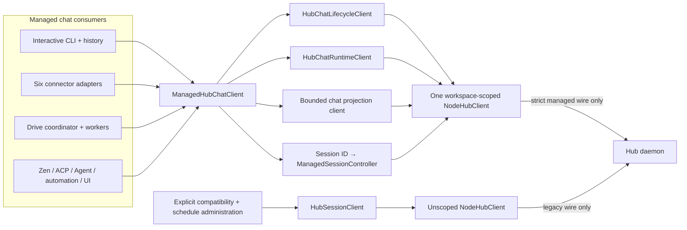

# Production caller adoption plan

**Status:** CA-0 through CA-2 plus the CA-3 confirmation-authority kernel are implemented behind the disabled gate; the production owner responder and caller cutover remain

**Scope:** PC-3 target authority through PC-8 client composition and caller convergence

**Release posture:** `managedChatLifecycleEnabled` remains `false`
**Related decisions:** [ADR-0051](../../adr/ADR-0051-cross-session-chat-catalog-authority.md),
[ADR-0052](../../adr/ADR-0052-managed-session-reconnect-authority.md),
[ADR-0053](../../adr/ADR-0053-trusted-managed-manual-compaction.md), and
[ADR-0055](../../adr/ADR-0055-fresh-process-managed-session-reattach.md)

## Outcome

Move every production chat caller onto one Core-owned managed Hub facade without
creating a hybrid authority path. Interactive CLI, history actions, connectors,
Zen, ACP, Agent, automation, and UI consumers must either use the complete
managed lifecycle/runtime contract or remain explicitly unscoped compatibility
consumers. No caller may select managed authority for one operation and then
fall back to `session.*`, `run.abort`, `approval.respond`, force-local SQLite,
or mutable connector JSON for another operation on the same chat.

The selected client boundary is a new `ManagedHubChatClient` working name in
the Core Hub client layer. It owns one workspace-scoped `NodeHubClient`, one
bounded read-only chat projection, one strict lifecycle adapter, one strict
runtime adapter, and one `ManagedSessionController` per resident session. It
does not expose raw catalog, generic Hub, or schedule commands.

`HubSessionClient` remains an unscoped legacy/compatibility client during the
cutover. Adding a `managed: true` flag to that class is rejected because its
surface combines raw chat lifecycle, runtime, metadata, deletion, generic
events, and schedules. The existing names also encode unsafe equivalences such
as `stopRuntimeSession` → `session.detach` that are deliberately false in the
managed model.

The facade may later be composed behind `ClineCore.chatLifecycle` so local and
Hub callers share one app-facing lifecycle vocabulary. That composition must
make generic `ClineCore.start/send/stop/abort/restore` fail closed for managed
sessions; it may not preserve source compatibility by silently translating or
falling back operation by operation.

## Evidence from the current code

| Surface | Current behavior | Required disposition |
|---|---|---|
| Core Hub client | `HubSessionClient` owns a private `NodeHubClient` and sends raw session/runtime commands alongside schedule commands | Preserve as unscoped compatibility; add a separate managed facade |
| Interactive CLI | `runtime/interactive/session-runtime.ts` uses generic `ClineCore.start/send/stop/abort/restore` through auto/local/legacy Hub routing | Replace the complete session lifecycle in the PC-6 work package / CA-4 changeset |
| History helpers | `session/session.ts` force-selects local Core for mutation and direct row/artifact access | Managed rows use catalog/lifecycle/runtime reads and mutations; legacy rows stay read-only pending adoption policy |
| Connector host | Six adapters instantiate `HubSessionClient`; shared runtime code sends raw create/input/detach/approval commands | Switch the shared host and all six adapters together |
| Connector binding | Thread JSON supplies `sessionId` and is consulted as lifecycle authority | Catalog binding is canonical; JSON becomes delivery, mute, and restart cache only |
| Zen | `runtime/run-zen.ts` sends `session.create` and `session.send_input` | Move to the Zen managed profile after facade conformance |
| Raw catalog on scoped sockets | The managed transport now rejects `chat_catalog.*` before catalog/Core entry; the production route remains unadvertised and gate-off | Preserve denial through atomic caller cutover; never expose the raw port |
| Lifecycle event continuity | Audience-filtered snapshot/replay/ready now exists behind the disabled gate with separate scanned and delivered cursors | Compose it only through the managed facade and preserve snapshot replacement on unavailable replay |
| Fresh-process reattach | Gate-off continuity classifies nonresident/live/orphaned state; initial reclaim, bounded hydration/replay, and ready-before-handle share one controller | Keep unadvertised until ADR-0055 acceptance and adopt only through the complete managed facade |
| Drive room/fork/wave | Room linking accepts a session ID; fork/wave handlers call the legacy `sessionHost` for worker create/turn/delete and parent injection | Classify explicitly; managed targets use structural lifecycle/runtime authority or reject before legacy host access |
| Other consumers | Agent, ACP, schedules, Hub UI, VS Code/desktop examples, and Kanban use generic Core or raw Hub surfaces | Classify each as managed or explicitly unscoped before release |
| Daemon | Managed composition and ten profiles are present, but the production gate is hard off | Keep off until the all-caller matrix passes |
| Reconnect | Core has a reviewed generation-fenced controller with durable reclaim and exact cancellation | Compose it once in the facade; callers must not recreate it |

The selector-free owner endpoint still issues only the daemon's default
interactive authority policy. A separate trusted in-process issuer now refuses
generic connector-template issuance, derives a stable opaque audience plus
server-only instance claim for each installed connector, and rejects binding
coordinates that do not match that claim. A connector still may not request an
authority class or instance through HTTP, `client.register`, or profile ID.
Production launcher/adapters do not yet consume this issuer, so connector
delivery remains a caller-cutover blocker rather than a missing authority
primitive.

## Target boundary



### Boundary rules

1. A physical scoped socket is owned by exactly one managed client facade and
   one server-issued audience. It never carries schedule or legacy session
   commands.
2. A facade owns zero or one controller for each resident session. A caller
   receives a session handle, not the raw transport or controller.
3. Start and resume are admission-only. The facade installs and awaits a strict
   session subscription before it returns a usable session handle, and no turn
   may begin before that readiness boundary.
4. Every session-affecting command captures the controller's exact registered
   connection generation. A newer socket causes rejection and recovery, not
   transparent send on a different owner.
5. Disposing one session releases only that session's subscription/controller.
   Disposing the facade cancels all controllers before disposing the shared
   transport.
6. Lifecycle and runtime errors remain sanitized but machine-classifiable.
   Callers may choose retry, recovery, or user explanation from a closed error
   taxonomy; they may not interpret a generic error as permission to fall back.
7. Catalog lifecycle events and session-scoped runtime events stay separate.
   Runtime events never use a global managed subscription.
8. Once the production managed gate is enabled, the unscoped compatibility
   lane is target-isolated. It may serve legacy sessions and schedules, but it
   cannot list, get, read, attach to, subscribe to, resume, update, compact,
   abort, detach, restore, or delete a catalog-managed session. Direct lookup
   must fail without revealing whether the managed target exists. The dormant
   implementation remains inert while the gate is off.
9. Server-side target authorization is independent of workspace authentication.
   A connector, Zen, ACP, automation, or worker credential cannot read events
   for or mutate another audience's chat merely because both use the same
   principal/workspace. Interactive cross-audience administration, if allowed,
   is one explicit privileged policy.
10. Production caller sockets reject every raw `chat_catalog.*` command. Read
    hydration uses a bounded audience-filtered projection; mutations use only
    the strict lifecycle facade. A client allowlist is defense in depth, not
    the authority boundary.
11. Lifecycle stream reconnect never resumes at “now.” It replays from an
    accepted durable catalog sequence or replaces local state from an atomic
    bounded snapshot before reporting ready.

## Proposed facade contract

The exact TypeScript names may change during review, but the ownership shape is
fixed.

### `ManagedHubChatClient`

The client owns:

- a capability-negotiation preflight;
- an injected `HubWorkspaceCapabilityProvider` whose credential already embeds
  the server-selected audience;
- one scoped `NodeHubClient`;
- one bounded audience-filtered read-only projection client;
- strict lifecycle and runtime wire adapters;
- a bounded map of resident `ManagedHubChatSession` handles/controllers;
- one lifecycle-event subscription;
- stable internal operation IDs for reclaim and callback responses; and
- deterministic shutdown and leak-free partial-construction rollback.

The client accepts an opaque start profile and, where authorized, an opaque
binding profile. A profile is a request inside the socket's immutable policy;
it is not authority. The server continues to reject any profile outside the
credential's audience.

The resident-session map is bounded separately from the catalog. One lifecycle
subscription and every active or in-flight runtime subscription consume the
server's per-connection source budget. Capacity must reserve the lifecycle
source and must not assume the server's configurable limit is always its
default of 256. Admission rejection fails closed; it does not open an
unfenced or global runtime stream.

Before requesting a one-time workspace capability or opening a scoped socket,
the client must probe the public pathless `/version` endpoint and verify that
the Hub independently advertises `chat_projection.v1`, `chat_lifecycle.v1`,
and `chat_runtime.v1`. CA-0 ratifies independent advertisement: each contract
can evolve, roll back, or remain unavailable separately, so generic Hub
protocol compatibility and lifecycle support never imply projection or runtime
parity. The probe runs before capability issuance and transport construction.

The projection is not `HubChatCatalogPort` and does not accept mutation, lease,
adoption, purge, confirmation, arbitrary workspace, or raw binding commands.
It exposes only strict bounded list/get hydration with an authoritative catalog
sequence used to reconcile `chat.changed` delivery.

### `ManagedHubChatSession`

A successful root, related start, checkpoint restore, resume, or recovery
returns a session handle that pins:

- session and chat identity;
- the latest sanitized writer generation and lease revision;
- the active registered connection generation;
- one managed-session controller and retained runtime cursor;
- the start-profile authority stamp returned by server behavior, never a
  credential; and
- pending run/callback/approval correlation state.

The handle exposes semantic operations such as `runTurn`, `abortRun`,
`respondToApproval`, bounded messages/checkpoint/usage/compaction reads, and an
explicit `stop` or `reset`. It does not expose `detach`, generic metadata
mutation, raw subscription, raw command, or delete.

Archive, activate, rename, purge, binding lookup/move, and fresh/related
admission remain facade-level lifecycle operations because they may exist
before or after one resident session handle.

## Resident set is not the chat catalog (`REL-039`)

Active/Archived organization and connector bindings may outlive every resident
runtime. The facade therefore cannot keep one controller for every catalog row
or every historical connector thread.

- Interactive CLI normally owns one resident session.
- A connector host owns a bounded warm set. A bound chat outside that set is
  resumed when a new message arrives.
- Capacity reclamation may quiesce and stop only an idle session with no run,
  approval, capability callback, compaction, pending mutation, or reconnect in
  flight. Stopping releases writer/runtime residency but preserves the catalog
  chat and connector binding.
- An active session is never silently evicted. If no safe slot is available,
  the new operation receives a stable capacity error and may be retried after
  an explicit drain.
- Clean shutdown drains the warm set and preserves bindings. Process crash uses
  the existing expiry/recovery policy; a PID or cached controller entry is not
  ownership evidence.
- The client and server must share a testable capacity contract or negotiate a
  conservative limit. A hard-coded assumption that all 256 server slots are
  available to runtime controllers is nonconforming.

## Audience-to-target authorization (`AUTH-035`)

Workspace authentication answers which workspace a socket may enter. It does
not answer which chats that audience may observe or mutate. The production
server currently authorizes raw catalog operations from the common owner
principal without carrying `authorityClassId`, and lifecycle
archive/activate/rename/purge accept a known chat ID without proving target
profile continuity. That is a release-blocking authority gap.

The caller cutover requires a server-owned target policy. `audienceId` is a
stable opaque target namespace, distinct from broad `authorityClassId`, profile
revision, policy epoch, and connection identity. A connector audience binds the
installed connector instance as well as transport kind; a process serving
multiple instances owns one facade/socket per audience unless a later reviewed
multi-audience broker performs the same per-target checks.

1. Root admission stamps the immutable server-issued `audienceId` carried by
   the connection policy. It is catalog authority, not mutable session metadata,
   caller input, or a hash that changes with ordinary policy revision.
2. Resume and `config_restart` retain that audience. Recovery and checkpoint
   restore cannot change it. A fork either inherits it or uses one explicitly
   authorized server-side delegation rule recorded as lineage; a caller cannot
   name the successor audience.
3. List/get projection, lifecycle events, binding lookup/mutation,
   archive/activate/rename/purge, continuity lookup, recovery, and every
   session-targeting operation authorize the current connection against the
   persisted target before returning whether the ID exists.
4. Connector audiences are confined to their connector transport and installed
   instance, not merely the six broad authority classes. Zen, ACP, automation,
   and future Drive-worker audiences are similarly closed.
5. The recommended interactive-owner policy may read and administer all chats
   in its enrolled local workspace so Harrison retains one cross-session view.
   That is an explicit privileged grant, not a consequence of sharing the
   owner principal; destructive operations still require their normal revision
   and confirmation policy.
6. Catalog events persist immutable target-audience delivery scope at commit so
   purge, head changes, profile revision, or chat-ID reuse cannot widen a later
   listener's view.
7. Production scoped caller sockets deny all raw `chat_catalog.*` commands,
   especially adopt, branch, binding, lease, and purge. A distinct internal
   host/admin port may retain those operations, but possessing a workspace
   capability is insufficient to invoke it.

Existing catalog rows are not silently assigned to the interactive audience.
Migration may derive an audience only from a complete immutable writer-fenced
profile stamp and an exact server-owned mapping. Missing or ambiguous rows are
quarantined as `audience_unassigned`: non-runnable, absent from ordinary
projection/events, and visible only through a bounded privileged migration
inventory. Historical events without target scope remain audit-only; an
explicit assignment or exact migration emits the first scoped migration event
and establishes a new snapshot cut.

Target denial is non-enumerating and occurs before catalog result projection,
confirmation, lease access, runtime host execution, or event delivery. Client
filtering is never counted as proof.

## Read projection and lifecycle reconciliation (`REL-040`)

The lifecycle wire deliberately contains mutations, not history hydration.
The existing raw catalog port is too powerful to expose to callers, and the
current `chat.changed` subscription begins at the source head without carrying
a durable sequence. A reconnect can therefore miss committed lifecycle events
unless the client refreshes authoritatively.

CA-0 introduces a strict `chat_projection.v1` working contract with only:

- bounded audience-filtered list by lifecycle state, activity order, and opaque
  page cursor bound to one short-lived server snapshot identity;
- bounded audience-filtered get by chat ID;
- sanitized chat/session/lineage/binding summaries required by UI; and
- an opaque audience/query-bound `snapshotId` plus authoritative
  `snapshotSequence` representing the catalog cut observed by every page.

The lifecycle event contract adds a monotonic durable `catalogSequence`, an
`afterSequence` subscription cursor, a listener-relative
`previousDeliveredSequence` chain, and a fenced ready acknowledgement carrying
the server's processed-through sequence. The server installs the
audience-filtered listener and replays the exact authorized suffix after the
accepted cursor before ready. Hidden events may create gaps in global sequence,
but every delivered event must chain from the prior delivered event or accepted
cursor. A sequence ahead of the source, malformed event, audience mismatch,
chain discontinuity, or unavailable coverage fails closed.

Client reconciliation is:

1. obtain a bounded snapshot identity and sequence, then page only within that
   identity;
2. subscribe from the snapshot sequence;
3. apply only exact chained events and advance the durable checkpoint to the
   fenced ready `throughSequence` after the server has processed the replay;
4. on reconnect, request replay from the last accepted event or ready
   checkpoint; and
5. if the protocol explicitly reports replay unavailable, discard the local
   projection and repeat snapshot → subscribe. Never silently jump to the
   current head.

Snapshot and replay queries share the same immutable audience predicate. An
expired, query-mismatched, audience-mismatched, or cross-connection snapshot
cursor forces a clean snapshot restart; it never falls through to a current
page. No result contains a canonical workspace path, raw transcript, lease
state/credential, provider configuration, or unrelated audience metadata.

## Operation identity and retry ownership

Operation identity is part of the application contract, not a transport
request ID.

1. The initiating workflow allocates an operation ID before its first side
   effect and retains it until a terminal result or explicit abandonment.
2. Fresh and related admission also allocate the session ID before sending.
   Transport retries reuse both values exactly.
3. The facade may generate IDs for process-local UI actions, but it must return
   or journal them before an unknown-outcome retry. Connectors should derive or
   persist IDs from trusted inbound event identity so process restart cannot
   duplicate one user turn.
4. A retry of the same intent reuses the ID. A changed prompt, target,
   revision, binding, confirmation effect, or profile creates a new operation.
5. `ManagedSessionController` alone owns reclaim operation IDs. A caller never
   supplies, stores, or reuses them.
6. Approval and capability responses use new response-operation IDs while
   retaining exact session, run, request, approval, and connection correlation.
7. Unknown outcome never authorizes a different command. In particular, a
   failed `stop` cannot become `session.detach`, and a failed purge cannot
   become local deletion.

A small pending-operation journal may be needed for interactive process crash
and connector restart. It is retry intent, not lifecycle authority: it may
store opaque IDs, command kind, target identity, and intent digest, but no
lease token, capability credential, canonical path, provider secret, or
confirmation grant.

## Command convergence map

| Legacy behavior | Managed operation | Required semantic change |
|---|---|---|
| `session.create` | `chat_lifecycle.start_root`, `start_related`, or `resume` | Caller states lifecycle intent and supplies stable operation/session IDs plus an authorized opaque profile |
| `session.send_input` | `chat_lifecycle.run_turn` | Controller must be ready first; operation ID and bounded attachments are required |
| `run.abort` | `chat_runtime.abort` | Exact current `runId`, session, operation, owner, and connection generation are required |
| `approval.respond` | `chat_runtime.approval.respond` | Exact run and approval correlation; one-shot response |
| `session.messages` | `chat_runtime.messages.list` | Bounded pagination and strict sanitized messages |
| `session.restore` | `chat_lifecycle.restore_checkpoint` | New branch session/chat identity and structural lineage |
| `session.detach` | no universal mapping | Choose client release, `stop`, `reset`, or process shutdown explicitly |
| `session.update` metadata | profile, binding, or catalog-specific operation | Generic metadata may not define profile, binding, lifecycle, or authority |
| `session.get/list` | catalog/history projection plus bounded runtime reads | Lifecycle truth comes from catalog; runtime state stays separate |
| `session.delete` | confirmation-backed `chat_lifecycle.purge` | Tombstone/cleanup transaction only; no direct local fallback |
| raw `chat_catalog.*` | strict read projection or lifecycle operation | Caller sockets cannot invoke catalog mutation/lease authority directly |
| generic event stream | strict lifecycle stream plus one strict runtime stream per session | No payload-shape guessing or global runtime subscription |
| head-only `chat.changed` join | sequence-cursored lifecycle reconciliation | Snapshot cut plus exact authorized replay before ready; no reconnect jump to now |
| pending prompt methods | `chat_runtime.pending_prompts.*` | Bounded, session-owned, stable mutation identity |
| compaction methods | `chat_runtime.compaction.*` | Profile-authorized host transaction and durable receipt |
| schedule methods | unscoped schedule client during M0 | Never share a managed socket; scheduled execution is classified separately |

## Unknown-outcome admission gap

The reconnect controller begins after a caller knows the committed writer
generation. Lifecycle admission currently registers the resident owner before
returning that sanitized result. If the socket closes after commit/registration
but before the reply reaches the caller, replay from a new connection can
reconcile the durable lifecycle operation but cannot silently inherit resident
ownership. Registering the new socket at the old generation would violate
ADR-0052, while the caller does not yet have the generation needed to reclaim.

CA-2 closes this gap in the gate-off kernel; the production caller rule is:

1. Exact lifecycle replay on a new socket returns the sanitized committed
   admission receipt, including writer generation, without transferring
   ownership.
2. The resident adapter preserves the disconnected owner as orphaned and does
   not reject a semantically exact replay merely because registration now
   targets another connection.
3. The client attempts an exact-generation initial subscription. If replay was
   the first durable admission on the new socket, it reaches ready normally.
   If the prior socket owns an orphaned committed admission, the server reports
   `session_reclaim_required` even though no runtime cursor exists yet.
4. The client enters an initial, cursorless reclaim mode only for that
   admission state. This is safe because starts are admission-only and the
   facade has not allowed a turn. An established session losing its stream
   still requires its retained cursor.
5. Durable reclaim advances the generation and binds the replacement socket.
6. A fresh strict subscription establishes its baseline and reaches ready.
7. Only then does the facade return the session handle or permit `runTurn`.

```mermaid
sequenceDiagram
    autonumber
    participant A as App workflow
    participant F as Managed Hub facade
    participant H as Hub lifecycle
    participant R as Resident authority
    participant S as Strict runtime stream

    A->>F: startRoot(operationId, sessionId, profile)
    F->>H: start_root fenced to connection G
    H->>R: durable admission + register owner G
    H--xF: committed reply is lost
    F->>H: replay same operation/session on connection G+1
    H-->>F: committed receipt; ownership not transferred
    F->>R: reclaim(expected writer generation)
    R-->>F: generation + 1, owner transferred
    F->>S: subscribe on exact connection G+1
    S-->>F: ready(initial cursor)
    F-->>A: usable managed session handle
```

The same unknown-outcome matrix now passes for root, related start, checkpoint
restore, resume, and lost-lease recovery. Turn, stop, reset, binding,
destructive lifecycle, approval, callback, pending-prompt, and compaction
operations still need an explicit replay classification before caller
adoption; no method receives an undocumented generic retry loop.

## Fresh-process established-session reattach (`REL-041`)

Initial admission recovery and same-process socket replacement do not solve a
connector or UI process restart. A new process has a catalog binding but no
trusted writer generation or runtime cursor. Calling lifecycle `resume` while
the daemon still retains an orphaned resident owner currently conflicts, while
calling reclaim without an authoritative generation/cursor is impossible.

This remains a proposed decision, not behavior accepted by ADR-0052. Its
complete gate-off implementation is inert: ADR-0055 must be accepted before a
production caller can select or advertise the continuity lookup. ADR-0052's
durable rekey algorithm remains unchanged. If the managed authority/daemon
process itself restarts, its existing expiry/resume or confirmed-recovery rule
continues to apply.

The selected design is a distinct server-authorized continuity lookup followed
by existing durable operations, not client-side ownership inference:

1. The fresh process resolves the catalog binding through its server-owned
   binding profile and audience.
2. A strict read-only continuity operation for that exact session returns one
   sanitized state: `not_resident`, `owned_elsewhere`, or `orphaned`. Only the
   orphaned case includes the current writer generation and current bounded
   runtime baseline cursor. The response is connection/target/audience-bound
   and is not a lease credential.
3. `owned_elsewhere` fails busy; the fresh process never steals a live owner.
4. `not_resident` enters ordinary lifecycle resume. If a daemon/process crash
   left a durable lease without resident authority, the reviewed lease-expiry
   or confirmed recovery policy applies; a connector does not auto-revoke it.
5. `orphaned` invokes the existing exact-generation durable reclaim. The
   server aborts/drains any orphan work under ADR-0052 and transfers only after
   the writer generation advances. A lost or timed-out initial reply retries
   the identical operation/generation through the shared controller; a failed
   preparation retains exact cancellation authority.
6. After transfer, the new process hydrates bounded runtime state, subscribes
   from the server-provided baseline, replays any events committed during the
   transition, and reaches ready before accepting a turn.
7. A daemon restart invalidates the in-memory stream ID and resident map, so it
   follows `not_resident`; it never treats a persisted client cursor as proof
   of continuity across a new runtime epoch.

A connector may retain sanitized display/cache hints, but the strict reattach
input currently rejects client-supplied cursor or writer-generation fields
before continuity lookup. Any later optimization must validate such hints on
the server and replace them with the authoritative fresh-process baseline.
Cursor or writer-generation cache is never authority. The continuity operation
itself passes the audience-to-target policy and does not reveal another
audience's session existence or live connection ID.

## Caller matrix and target disposition

Each connector row represents one authenticated installed instance. Multiple
instances of the same transport use distinct opaque audiences and facade/socket
owners even when one launcher process supervises them.

| Caller | Profile/audience | Target | Atomicity requirement |
|---|---|---|---|
| Interactive CLI/TUI | interactive owner | Managed | Fresh, resume, turn, restart, reset, fork, restore, recovery, abort, callbacks, reads, history, and shutdown switch together |
| CLI history commands/TUI history | interactive owner | Managed rows; read-only legacy projection | Archive/activate/rename/purge and resume use catalog authority; remove force-local managed mutation |
| Discord | connector Discord | Managed | Switch with the other five adapters and shared host |
| Google Chat | connector Google Chat | Managed | Switch with the other five adapters and shared host |
| Linear | connector Linear | Managed | Switch with the other five adapters and shared host |
| Slack | connector Slack | Managed | Switch with the other five adapters and shared host |
| Telegram | connector Telegram | Managed | Switch with the other five adapters and shared host |
| WhatsApp | connector WhatsApp | Managed | Switch with the other five adapters and shared host |
| Zen | Zen | Managed after headless conformance | Admission-only start, turn acknowledgement, terminal event, and shutdown |
| ACP | ACP | Decision required, expected managed | Preserve protocol callbacks and headless/interactive policy |
| Agent CLI | interactive or a distinct reviewed audience | Decision required | Must not inherit interactive authority accidentally |
| Automation execution | automation | Expected managed | Schedule administration remains separate from execution authority |
| Schedule administration | unscoped compatibility in M0 | Explicitly unscoped | Separate client/socket; server-enforced target isolation prevents discovery or use of managed sessions |
| Cline Hub UI | reviewed UI audience | Decision required | Managed history/runtime behavior or read-only observer; no raw mutation |
| Drive room linking/call UI | reviewed Drive coordinator or read-only UI audience | Decision required | Validate target audience and catalog membership before linking a managed session ID; no raw-session authority |
| Drive fork/tick/wave workers | proposed Drive-worker/automation audience | Expected managed or rejected for managed parents | ADR-0014 hard-boundary seed/promote/audit semantics run over managed related-session authority; ticks never create forks |
| VS Code/desktop/examples/Kanban | explicit per-product classification | Managed or compatibility | Examples cannot keep the release matrix green by bypassing production rules |

## Ordered changesets

### CA-0 · Gate-off managed client seam — selected first

Add the separate Core-owned facade, strict read-projection contract, and
conformance harness without changing a production CLI caller or the daemon
gate.

Implementation order inside the changeset is dependency-first:

1. define and exhaustively validate the Shared projection request/result and
   chained lifecycle event/ready envelopes;
2. add transport-injected strict projection and lifecycle clients with no
   daemon route or capability advertisement;
3. compose those clients with the existing runtime client/controller behind
   `ManagedHubChatClient` and its bounded resident registry; and
4. prove construction, readiness, command allowlists, replay bookkeeping, and
   disposal through fakes plus the unchanged gate-off legacy suite.

CA-0 does not add an audience column, authorize a server target, expose a raw
catalog command, wire a production caller, or advertise any managed
capability. Those server semantics begin in CA-1 after the contract is
reviewable.

Primary files:

- `sdk/packages/core/src/hub/client/managed-chat-client.ts` and its test;
- a strict `chat-projection` Shared wire/client pair and tests, named during
  implementation review;
- `sdk/packages/shared/src/session/chat-lifecycle-event-wire.ts` for the
  durable sequence/readiness contract;
- `sdk/packages/core/src/hub/client/chat-lifecycle-client.ts` and its test for
  exact connection-generation command fencing and structured sanitized errors;
- `sdk/packages/core/src/hub/client/managed-session-controller.ts` and its test
  only where the facade requires a reviewed readiness/ownership extension;
- `sdk/packages/core/src/hub/client/index.ts` and
  `sdk/packages/core/src/index.ts` for the deliberate public export; and
- Hub capability metadata/client preflight tests if runtime version negotiation
  requires a shared contract change.

Required proof:

1. Missing managed capability fails before capability issuance or WebSocket
   creation.
2. The constructor cannot accept a daemon token as workspace authority and
   cannot accept an authority-class selector.
3. No method can emit a command outside the strict
   projection/lifecycle/runtime sets, and raw `chat_catalog.*` is absent.
4. Lifecycle commands can be fenced to an exact registered connection
   generation just like reclaim/runtime commands.
5. A session handle becomes usable only after controller readiness.
6. One facade manages multiple independent session controllers without one
   handle closing the shared transport.
7. A simulated transport-unknown result retains the exact operation intent and
   fails closed without substitution; CA-2 proves end-to-end reconciliation.
8. Callback and approval responses preserve exact correlation and are one-shot.
9. Partial construction, failed readiness, per-session dispose, and global
   dispose leave no socket, subscription, timer, or controller behind.
10. Projection snapshot/sequence validation and lifecycle replay/readiness fail
    closed without exposing the mutation-capable catalog port.
11. Existing `HubSessionClient` and every gate-off legacy test remain unchanged.

CA-0 is an inert composition seam, not caller adoption and not permission to
enable the gate.

#### CA-0 implementation checkpoint

The gate-off seam now exists in Shared and Core:

- Shared owns strict byte- and count-bounded `chat_projection.list/get`
  schemas, snapshot/continuation rules, explicit nested summary counts, and
  additive chained lifecycle cursor/event/ready envelopes;
- Core owns generation-fenced projection and lifecycle adapters plus the
  separate `ManagedHubChatClient`, one shared runtime adapter, a bounded
  resident registry, ready-before-handle admission, bounded unknown-operation
  intent retention, exact callback correlation, single-consumer continuation
  cursors, and drain-before-transport disposal;
- `NodeHubClient` can carry a fresh lifecycle cursor and parse its fenced ready
  acknowledgement on every physical subscription; and
- public `/version` probing and conformance fakes prove preflight ordering,
  strict command families, snapshot/replay rejection, bounded state, and
  partial-construction cleanup.

Admission operation identity remains leased until its session controller is
ready, not merely until the lifecycle reply arrives. Global disposal marks and
drains pre-controller and runtime-starting admissions, and controller disposal
retains any exact reclaim-cancel request already launched by a failure path.
These are completion barriers: late replies cannot create a resident handle or
make a consumed continuation cursor reusable. Applied lifecycle state remains
private until its corresponding checkpoint advances; projection observers never
receive an event projection labeled with the preceding checkpoint.

CA-1 now supplies the server-side projection handler, retained audience replay
source, copied-v4 migration, raw-catalog denial, and sanitized admission
authority projection. The daemon release gate remains false and no production
caller or capability advertisement selects the route. Included lineage and
binding arrays remain bounded summaries with authoritative total counts, not a
claim that nested drill-down pagination is complete.

### CA-1 · Audience authorization and projection reconciliation

**Implemented checkpoint (gate off):** schema v5 persists immutable audience
ownership and event-time projection scope; a two-phase restartable migration
freezes strict v1 profile evidence before reconciliation; exact mappings assign
once while missing/ambiguous evidence remains non-runnable; explicit human
assignment appends the first scoped event without reactivating the revoked
writer. Managed sockets deny raw catalog commands before port entry. Strict
projection list/get uses audience/query/connection-bound in-memory snapshot
continuations over one SQLite cut. Lifecycle replay advances a scanned cursor
across foreign and legacy gaps, chains only delivered audience events, and
acknowledges ready only after downstream delivery admission. Successful
admission returns the descriptive profile ID/revision, authority class, policy
epoch, and mode ceiling; policy digests and credentials remain private.

Persist immutable chat/event audience scope, deny raw catalog commands on
production caller sockets, and apply target authorization to every strict read,
event, lifecycle mutation, binding, continuity, recovery, and runtime entry.
Add the bounded snapshot sequence plus exact lifecycle-event cursor replay
defined above. Prove connector-to-connector, connector-to-interactive,
headless-to-owner, known-ID, post-purge, chat-ID-reuse, and malformed-event
denial. Principal/workspace equality alone is a negative test, not authority.

The schema migration backfills only an unambiguous immutable profile stamp.
Every other existing row becomes `audience_unassigned`; it cannot run, bind, or
appear in ordinary projection/event delivery. Historical unscoped events remain
audit-only, and the migration or later explicit owner assignment appends the
first scoped event. Crash/restart, mixed old/new rows, ambiguous stamps, and
idempotent rerun must pass before any caller uses the new projection.

CA-1 selects closed-by-default administration: the ordinary interactive-owner
audience cannot cross audience boundaries merely because tenant, principal,
workspace, or authority class match. A future workspace-wide owner policy
requires explicit ratification and a distinct reviewed policy/test matrix;
until then no caller receives it.

Primary server surfaces are:

- `sdk/packages/shared/src/session/chat-catalog.ts`, the new projection wire,
  and `chat-lifecycle-event-wire.ts` for strict records and migration-safe
  envelopes;
- `sdk/packages/core/src/chat-catalog/sqlite-chat-catalog-service.ts` and
  `chat-catalog-event-source.ts` for schema migration, immutable scope,
  snapshot cuts, and ordered replay;
- `sdk/packages/core/src/chat-catalog/chat-catalog-authority.ts` and
  `sdk/packages/core/src/hub/server/workspace-managed-cline-core-factory.ts` for
  target-policy evaluation before host behavior;
- `sdk/packages/core/src/hub/server/hub-server-transport.ts` and the
  `handlers/chat-catalog-handlers.ts`, `chat-lifecycle-handlers.ts`, and
  `chat-lifecycle-event-handlers.ts` siblings for raw denial and strict route
  composition; and
- `sdk/packages/core/src/hub/daemon/chat-management-composition.ts` for the
  inert capability/route seam, which remains unadvertised and gate-off
  throughout CA-1.

The migration acceptance fixture is a copied pre-audience SQLite database, not
a schema-only mock. It passes separate-connection phase restart, metadata
mutation after the evidence cut, idempotent rerun, exact backfill, ambiguous
and malformed quarantine, explicit owner assignment, snapshot filtering, and
event-replay conformance.

### CA-2 · Admission reconciliation and fresh-process reattach — implemented behind gate

The gate-off implementation closes unknown-outcome admission for all five
admission commands and adds cursorless initial reclaim only for an
admission-only session that has never exposed a usable handle. Its fault matrix
proves a lost lifecycle reply cannot duplicate a chat/session, strand an
unrecoverable owner, register a new owner without a durable generation change,
or permit a turn before readiness. Non-admission facade methods still require
the operation-by-operation replay classification above.

The implemented server surfaces are the managed Core factory's
runtime-registration wrapper, resident adapter exact-replay handling, strict
Shared continuity/hydration wire, and the Core-owned facade/controller.

CA-2 also implements the fresh-process continuity operation and three-way
`not_resident`/`owned_elsewhere`/`orphaned` flow. The production caller matrix
must additionally prove clean connector restart and no automatic headless lease
revocation through the real launcher/adapters.

The matrix now proves active-owner refusal, exact lost-reply reclaim
reconciliation, events/hydration before ready, stale-cache rejection, replay
eviction cancellation, a physical fresh socket, an actual Hub restart/new
stream epoch, lease-expiry takeover, and owner-confirmed recovery. Production
connector restart still awaits CA-5 launcher/adopter wiring. CA-2 remains
unadvertised and cannot be selected until proposed ADR-0055 is accepted.

### CA-3 · Trusted confirmation responder — authority kernel implemented behind gate

The server-owned portion is now implemented. Strict lifecycle validation
creates a responder only for one confirmation-capable command and stable
operation. Core may submit only its normalized target; the server checks the
command, aggregate, observed revision, and effects before invoking a shared
bounded coordinator. The owner callback receives only a deeply frozen action,
aggregate, revision, normalized effects, and abort signal. Connection,
workspace, profile, command, invocation, and operation correlation remain
server-side. The same command-lifetime signal participates in the final catalog
mutation fence and is retired when dispatch settles.

Archived resume is additionally bound through the audience-authorized
session-to-chat projection and a deterministic activation step derived from the
resume operation; a trusted Core cannot prompt for an unrelated chat or newer
revision under that command.

The fault matrix now proves caller confirmation-field injection rejection,
mismatched Core-target rejection, approve/decline over a physical workspace
WebSocket, timeout/throw sanitization, physical disconnect, epoch revoke,
shutdown, stale revision before side effects, retained-callback rejection,
post-approval disconnect/revoke before catalog entry, exact-operation replay
without a second side effect, and one shared
per-connection budget across managed and direct prompts.

CA-3 is not a production UI completion claim. Harrison still needs to select
the owner surface—CLI/TUI, desktop Hub, connector conversation, or local owner
console—and that surface must be composed through the inert trusted callback.
Until then omission remains default-deny, callers send neither `confirmed` nor
a credential, and the release gate stays off.

### CA-4 · Interactive and history atomic cutover

The detailed audit, target app boundary, operation map, ordered implementation
slices, owner decisions, and proof matrix are frozen in
[ca4-interactive-history-cutover-plan.md](ca4-interactive-history-cutover-plan.md).

Replace the complete generic Core lifecycle in
`apps/cli/src/runtime/interactive/session-runtime.ts`. Route strict events,
approvals, `askQuestion`, pending prompts, usage, checkpoints, compaction, and
abort through the session handle. Replace force-local mutation for managed
rows in `apps/cli/src/session/session.ts`, command/history utilities, and the
TUI history view. Preserve legacy rows as explicitly labeled, read-only
compatibility data until Harrison selects the adoption policy.

This changeset must contain negative assertions against generic
`ClineCore.start/send/stop/abort/restore`, raw Hub commands, `session.delete`,
and local SQLite fallback for a managed row.

Primary caller surfaces are:

- `apps/cli/src/runtime/interactive/session-runtime.ts` and its test;
- `apps/cli/src/runtime/interactive/chat-command-runner.ts` and its test;
- `apps/cli/src/session/session.ts` and its test;
- `apps/cli/src/commands/history.ts`, `history-command.ts`, and their tests;
- `apps/cli/src/utils/chat-commands.ts`, history/plugin chat utilities, and
  their tests; and
- `apps/cli/src/tui/views/history-view.tsx` plus the checkpoint/history UI
  integration that invokes the runtime.

### CA-5 · Connector audience delivery and all-six cutover

First deliver connector-specific one-time capabilities from a trusted host
boundary. The preferred design is a daemon/launcher broker that maps an
already authenticated installed connector instance to one server-selected
opaque audience, authority class, and closed profile set, then returns only a
short-lived one-time credential through a private process channel. The
connector request must not carry a selectable audience/class, workspace path,
workspace ID, or arbitrary profile.

Then update the shared connector host, runtime-turn stream, session runtime,
task updates, and thread-binding layer once; switch all six adapter
constructors together. Catalog `binding.get/bind/reset` becomes canonical.
JSON retains serialized delivery state, mute controls, and an optional cached
session hint, but a hint is always checked against the catalog and cannot move
or clear a binding.

Config changes create one `config_restart` successor and CAS-move the binding.
A missing resident runtime creates one `recovery` successor. Reset quiesces,
unbinds, and releases without archive. Clean shutdown preserves the binding.
The shared host also owns one bounded resident-session warm set: it resumes a
bound nonresident chat on demand and quiesces only safe idle residents under
capacity pressure.

Primary shared connector surfaces are:

- `apps/cli/src/connectors/connector-host.ts` and its test;
- `apps/cli/src/connectors/session-runtime.ts` and its test;
- `apps/cli/src/connectors/runtime-turn.ts` and its test;
- `apps/cli/src/connectors/thread-bindings.ts`, `task-updates.ts`, and
  `common.ts`; and
- the Discord, Google Chat, Linear, Slack, Telegram, and WhatsApp adapter
  constructors and their conformance fixtures.

### CA-6 · Drive room, fork, tick, and wave convergence (`AUTH-036`)

Classify Drive as its own caller family. Room linking must resolve a managed
session through the audience-filtered projection and validate catalog
membership before storing the room relationship. A room/session link conveys
no runtime, lifecycle, or binding authority.

For managed parents, replace direct `sessionHost.startSession`, `runTurn`, and
`deleteSession` in fork/tick/wave paths with one reviewed server-owned Drive
coordinator while preserving accepted ADR-0014. Only a Do-item claim, wave-batch
item start, or review gate may create a worker; director replan ticks,
Spotlight/rank changes, and mute/UI events never fork. At a legal boundary the
coordinator creates a clean managed related session with structural `fork`
lineage and a closed Drive-worker profile, then sends a bounded `SeedPacket` as
the first managed turn. This is the authority substrate beneath
`drive.fork.*`, not CLI `/fork`, checkpoint restore, full-message clone, or the
legacy `session.fork` surface.

Ticks may advance an already admitted worker but cannot create one. Terminal
work produces the ADR-0014 `PromotePacket`; only its bounded summary reaches the
parent through an exact fenced operation, while raw worker turns never enter
`roomTranscript`. Worker stop, archive-then-drop retention, `auditHandle`,
artifact URI retention, path-disjoint contracts/worktree isolation, and audit
GC remain the Drive policy above managed lifecycle. Raw delete is forbidden.
Every worker cannot widen paths, tools, or audience from room payloads.

Until that path passes conformance, Drive link/fork/tick/wave commands reject a
catalog-managed target before room mutation or legacy host access and the UI
shows an explicit unavailable state. They may continue only for proven legacy
targets in the compatibility lane.

Primary surfaces include `apps/cline-hub/src/server/hub.ts`,
`drive-calls.ts`, the webview Drive session hook, Core
`drive-room-handlers.ts`, `drive-fork-handlers.ts`,
`drive-wave-executor.ts`, and their room/fork/wave tests.

### CA-7 · Remaining consumer classification and compatibility isolation

Move Zen and each approved Agent/ACP/automation/UI consumer to its reviewed
audience and facade. Split schedule administration from managed automation
execution. Mark intentionally unscoped consumers in code and tests, including
why they cannot address a managed session. Remove examples that imply raw Hub
commands are a supported managed path.

Before gate enablement, enforce the distinction at the server rather than only
through official clients. Unscoped `session.list` must omit catalog-managed
rows; direct legacy get/messages/attach/runtime/mutation requests for a managed
session must return a non-enumerating rejection; and legacy wildcard events
must not project managed session activity. Generic start/restore must not claim
an already catalog-managed identity. This check must use durable catalog/writer
enrollment, not mutable metadata or a process-local resident map.

The classification inventory includes `apps/cli/src/runtime/run-zen.ts`,
`run-agent.ts`, `apps/cli/src/acp/acpAgent.ts`, Core's `HubRuntimeHost` and
`HubUIClient`, `apps/cline-hub`, `apps/vscode`, the VS Code and desktop
examples, and Kanban's SDK boundary. Any raw `NodeHubClient` used only for Drive
room control remains subject to CA-6 and must prove it neither receives
workspace-scoped chat authority nor addresses a managed target.

### CA-8 · One release-gate changeset

After all prior exits pass, change command routing, event routing, capability
advertisement, and caller selection together for projection, lifecycle, and
runtime. The changeset must contain the complete all-caller E2E matrix and
negative fallback assertions. It must not include new protocol behavior or
unresolved migration logic.

## Verification matrix

### Core client conformance

- strict request/result/event validation for every facade method;
- exact command allowlist and proof that no legacy command is sent;
- strict bounded projection list/get validation, including page limits,
  audience filtering, `snapshotSequence`, and rejection of mutation-shaped
  fields;
- raw `chat_catalog.*` denial for every production caller audience, including
  the interactive owner;
- known-ID and enumeration-resistant audience denial across projection,
  lifecycle events, lifecycle mutations, binding, continuity, recovery, and
  runtime routes;
- explicit proof that the ordinary interactive-owner policy remains confined
  to its own audience; any later cross-audience administration policy must be
  separately ratified and must not bypass confirmation or revision checks;
- exact-stamp audience migration, ambiguous-row quarantine, audit-only legacy
  events, explicit owner assignment, and restart/idempotency proof;
- capability preflight before scoped credential acquisition;
- fresh one-time credential per physical reconnect;
- exact connection-generation fencing for lifecycle and runtime commands;
- one controller per session, multi-session reconnect, and bounded disposal;
- resident-map admission, safe idle drain, active-session non-eviction, and
  source-capacity rejection below an overridden server limit;
- stable operation replay for reply loss before and after durable commit;
- initial admission loss → sanitized receipt → durable reclaim → ready;
- snapshot → cursor replay → fenced ready lifecycle reconciliation, including
  exact suffix replay and authoritative snapshot replacement when replay is
  unavailable;
- fresh-process `not_resident`/`owned_elsewhere`/`orphaned` continuity lookup,
  exact reclaim, bounded runtime hydration, and ready-before-turn behavior;
- runtime gap recovery and replacement-socket reclaim remain distinct;
- callback, approval, abort, stop, reset, and compaction cancellation races;
- no credential, canonical path, provider secret, or unrelated session data in
  request, result, event, error, log, telemetry, or pending-operation journal;
- unscoped legacy list/get/messages/subscriptions cannot discover a managed
  row, and every generic mutation/runtime route rejects a managed target before
  host execution.

### Interactive/history conformance

- fresh start, resume, same-chat config restart, reset/new, turn, steer/queue,
  abort, shutdown, fork, restore, and missing-session recovery;
- streamed assistant/tool state, approvals, `askQuestion`, pending prompts,
  checkpoint reads, usage, and authorized compaction;
- archive, activate, rename, purge, stop-and-archive, and confirmation failure;
- catalog ordering, Active/Archived state, lineage, and workspace filtering;
- initial state comes from the bounded projection and reconnect either replays
  every authorized lifecycle event after `snapshotSequence` or replaces local
  state from a new authoritative snapshot before the UI reports ready;
- managed rows never use force-local update/delete or direct artifact truth;
- legacy rows remain visibly Legacy and cannot be mutated through managed UX.

### Connector conformance

- all six audience/profile pairs reject cross-namespace use;
- two instances of the same connector transport reject each other's bindings,
  projection rows, lifecycle events, continuity, and runtime targets;
- catalog binding wins over stale/missing/conflicting JSON;
- first contact, restart resume, config successor, missing-runtime recovery,
  reset, clean shutdown, and process crash;
- a fresh connector process distinguishes nonresident, live foreign owner, and
  orphaned resident state without cached generations becoming authority;
- lifecycle projection and event delivery never reveal another connector,
  interactive, ACP, Zen, automation, or Drive-worker chat;
- streamed reply, tool status, approval response, abort, and terminal error;
- one adapter-to-physical-WebSocket-to-managed-Core suite parameterized over
  all six adapters; and
- no generic create/send/detach/approval/delete or local fallback.

### Drive conformance

- room linking resolves through the bounded projection and rejects a managed
  target before persisting any relationship when coordinator authority is
  absent or mismatched;
- Drive-worker admission records structural fork lineage under a closed
  server-issued audience only at an ADR-0014 hard boundary and cannot widen
  paths, tools, profile, or target audience from a room payload;
- director ticks never create forks; legal workers start from a bounded
  `SeedPacket`, terminate in a retained/auditable `PromotePacket`, and never
  merge raw turns into the parent transcript;
- worker turns, stop, archive-then-drop retention, audit lookup, and bounded
  parent-summary promotion use reviewed managed operations with exact operation
  and writer fences plus required path/worktree isolation; and
- no managed Drive path calls legacy `sessionHost.startSession`, `runTurn`,
  `deleteSession`, or direct parent input, while proven legacy rooms retain an
  explicit compatibility path.

### Fault and stress conformance

- disconnect before send, after send/before commit, after commit/before reply,
  during stream readiness, during callback/approval, and during shutdown;
- daemon restart, capability expiry/replay, epoch revoke, retired-socket frame,
  delayed old callback, and receipt-cache eviction;
- lifecycle disconnect after snapshot, during replay, and after commit/before
  delivery; exact suffix recovery or authoritative snapshot replacement must
  converge without a silent jump to the current head;
- fresh client-process restart against a surviving resident daemon, orphan
  reclaim with events during transfer, live-owner refusal, and daemon restart
  with a new runtime epoch;
- two sessions reclaiming concurrently on one facade;
- duplicate inbound connector delivery and connector process restart;
- connector histories larger than the resident limit, on-demand resume, safe
  idle eviction, and bounded source/controller/pending-operation growth; and
- repeated stress runs for the narrow timeout/cancellation cases.

The latest reconnect proof baseline is Shared **54 files/503 tests** and Core
**9 files/236 tests**. Independent review found no actionable P1/P2 in the
newest timeout, real-adapter receipt-eviction, verification, and writer-tail
cancellation proofs; the reviewed focused files passed **103/103**, and the
four new cases passed **20/20** executions across five concurrent stress runs.
That is transport/adapter authority evidence, not full lifecycle caller E2E.

## Rollout and rollback

Before CA-8, every changeset is inert or test-selected while the production
gate remains off. Reverting a caller-wiring changeset therefore restores the
legacy lane without changing production routing.

After CA-8, rollback is fail-closed:

1. stop admitting new managed actions;
2. drain or orphan-fence active managed owners using the proven protocol;
3. preserve catalog and session artifacts without dual-writing legacy state;
4. keep managed rows read-only if the managed runtime is unavailable; and
5. restore a prior managed-capable release or perform an explicit reviewed
   migration before re-enabling writes.

Turning the gate off must never reinterpret an existing managed chat as a
legacy session or make force-local deletion an emergency fallback.

## Ratified CA-0 decisions and remaining owner decisions

1. **Facade boundary — ratified for CA-0:** use a separate
   `ManagedHubChatClient` and keep `HubSessionClient` unscoped. No managed mode
   or raw-command escape hatch is added to the compatibility client.
2. **Protocol negotiation — ratified for CA-0:** advertise and require
   `chat_projection.v1`, `chat_lifecycle.v1`, and `chat_runtime.v1`
   independently. The production gate must still switch all required routes
   and advertisements atomically after their separate contracts pass.
3. **Target-audience policy:** persist an immutable audience on every chat and
   event; authorize every target before existence is disclosed. Ratify a stable
   opaque `audienceId` distinct from authority class/profile revision/epoch and
   bind connector audiences to installed instances. The recommended policy
   gives only the interactive owner explicit workspace-wide
   administration, while all headless and worker audiences remain closed.
   Existing rows backfill only from an exact immutable profile stamp; ambiguous
   rows remain quarantined for explicit owner assignment.
4. **Projection and event continuity:** accept a separate bounded
   `chat_projection.v1` plus durable lifecycle `catalogSequence`, replay cursor,
   and fenced ready contract. Exposing `HubChatCatalogPort` or joining at the
   current event head is rejected.
5. **Fresh-process reattach:** accept ADR-0055's audience-authorized three-state
   continuity lookup and reuse the existing ADR-0052 durable reclaim path.
   Cached client cursors, process IDs, raw connection IDs, and automatic
   headless lease revocation are rejected as ownership evidence.
6. **Confirmation product surface:** choose the production owner responder and
   its interruption/reconnect behavior. The implemented target-only host seam
   is fixed; no product surface may receive hidden server correlation or let a
   managed caller attest its own approval.
7. **Connector audience delivery:** choose the trusted daemon/launcher broker
   and private process channel. A client-selectable HTTP audience is rejected.
8. **Drive authority:** choose the server-owned Drive coordinator, closed
   worker profile, ADR-0014 SeedPacket/PromotePacket and hard-boundary mapping,
   worker retention/audit behavior, and fenced parent-summary operation. Until
   accepted and proven, managed room/fork/tick/wave access remains unavailable
   rather than falling back to `sessionHost`.
9. **Pending-operation durability:** choose the minimum process-crash journal
   needed by interactive and connector workflows; it remains token-free retry
   intent, never catalog authority.
10. **Resident capacity:** choose how the client learns a conservative source
   budget and the connector warm-set/idle-drain policy. Catalog or binding
   count must never imply resident controller count.
11. **Reasoning and checkpoint comparison:** decide what production profiles and
   UIs may display before their event/caller conformance is declared complete.
12. **Legacy adoption:** Harrison selects whether and how old sessions become
   cataloged. Caller cutover must not infer lineage or lifecycle from mutable
   metadata.
12. **Admission authority projection (resolved in CA-1):** a successful start
    returns strict profile ID/revision, authority class, policy epoch, and the
    canonical mode ceiling. The handle freezes that descriptive state. Policy
    digests, audience selectors, and credentials are excluded; server
    enforcement remains authoritative.
13. **Nested projection drill-down:** decide whether authoritative total counts
    plus bounded included session/binding summaries are sufficient for M1, or
    add separate audience-filtered nested pagination. The top-level snapshot
    cursor must not be overloaded for nested collections.

## Release exit

Caller adoption is complete only when:

- every production consumer is classified and covered by its target matrix;
- every managed operation runs through the facade and controller;
- every production caller socket rejects raw `chat_catalog.*`, while the
  bounded projection hydrates only audience-authorized state;
- cross-audience known-ID, lifecycle-event, binding, continuity, recovery, and
  runtime attempts fail before existence or host behavior is observable;
- pre-audience rows are either exactly migrated or quarantined, never inferred
  from mutable state, and cannot execute or leak through ordinary projection;
- lifecycle reconnect proves snapshot-sequence reconciliation, exact replay,
  fenced readiness, and safe snapshot replacement;
- fresh-process nonresident, owned-elsewhere, orphaned, and daemon-restart
  reattach paths pass without treating a cache as authority;
- the unknown-outcome matrix passes for every mutating command;
- interactive/history and all six connectors pass physical E2E with negative
  fallback assertions;
- managed Drive room/fork/tick/wave behavior passes the coordinator matrix, or
  those commands reject managed targets before room mutation and legacy host
  access;
- confirmation, compaction authorization, callback handling, binding
  authority, and shutdown are production-composed;
- no scoped socket emits or accepts a legacy command;
- no unscoped compatibility socket can discover, read, subscribe to, or mutate
  a managed session;
- the release gate is the only remaining change; and
- CA-8 enables routing, events, advertisement, and caller selection atomically.
