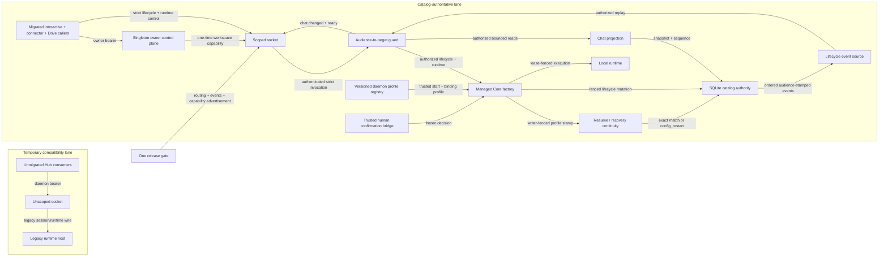

# Production convergence plan

**Status:** active; catalog/runtime plus CA-1 target authority, CA-2 reattach, and CA-3 confirmation-authority kernels implemented behind the gate; owner responder and caller convergence open; release gate off

**Scope:** Milestone 0 production composition and caller cutover
**Decision record:** [ADR-0041](../../adr/ADR-0041-cross-session-chat-catalog-authority.md)

## Target topology



Source: `sdk/packages/core/src/hub/server/`, `sdk/packages/core/src/chat-catalog/`,
`apps/cli/src/runtime/`, and `apps/cli/src/connectors/`.

- The compatibility lane is temporary but explicit; factory presence alone
  cannot alter it.
- After the managed gate is enabled, compatibility is target-isolated:
  unscoped consumers may use legacy sessions and schedules but must not
  discover, read, subscribe to, or mutate a catalog-managed session.
- A managed socket never receives the legacy runtime surface after the gate is
  enabled.
- The control plane accepts neither workspace paths nor workspace IDs. It can
  mint only for exactly one trusted startup enrollment.
- Catalog events and runtime events are separate projections with separate
  payload allowlists.
- Production caller sockets expose neither raw `chat_catalog.*` nor the catalog
  port. Target authorization occurs on the server before reads, events,
  mutations, bindings, continuity, recovery, or runtime behavior.

## Decisions fixed for this cutover

1. **Preserve full interactive behavior.** The managed protocol gains a narrow
   runtime-control/event companion for streaming, approvals, abort, attachments,
   pending prompts, required reads, and compaction. Final-response-only behavior
   is not an acceptable silent downgrade.
2. **Use a singleton owner control plane for M0.** A mode-`0600` discovery bearer
   may request a fresh one-time capability only when the daemon has exactly one
   trusted startup-enrolled workspace. The request carries no selector. Zero or
   multiple registrations fail closed.
3. **Keep staged coexistence.** Unscoped sockets retain the legacy surface while
   callers migrate. Gated scoped sockets receive only bootstrap bookkeeping and
   sanitized managed protocols.
4. **Keep destructive confirmation server-owned.** Clients never send a
   `confirmed` claim. Archive, activate, purge, and lost-lease recovery complete
   only through a trusted prompt correlated to the active scoped connection.
5. **Enable once.** Production caller selection, projection/lifecycle/runtime
   command and event routing/subscriptions, and every managed capability
   advertisement switch together only after the all-caller conformance matrix
   passes.

## Current implementation state

| Cluster | State | Evidence / remaining boundary |
|---|---|---|
| Catalog, lifecycle, leases, purge, restore | complete kernel | Local/hub authority and mutation-fence suites |
| Ordered lifecycle events | audience replay kernel implemented; caller adoption open | Schema v5 event-time audience/projection scope, scanned/delivered cursors, exact suffix replay, and fenced ready exist behind the disabled gate |
| Managed Core pool and 14 lifecycle commands | complete kernel | Authority-keyed pool and strict v1 adapter |
| Legacy/managed coexistence | routing implemented; target isolation open | Unscoped traffic remains legacy and gated scoped traffic is managed, but gate-on legacy list/read/event paths must hide catalog-managed targets before release |
| Managed lifecycle client | gate-off facade implemented; production adoption open | Strict bounded projection, lifecycle reconciliation, admission authority handles, and runtime controllers exist; all-caller composition does not |
| Cross-process capability acquisition | implemented kernel | Owner-authenticated singleton endpoint and fresh-per-socket provider |
| Daemon composition | implemented inert | Canonical catalog host/factory ownership; production profiles composed; trusted responder may be injected but omission declines; release gate off |
| Trusted confirmation authority | gate-off kernel implemented; product surface open | One command-scoped Core responder, target-only owner prompt, shared bounds, final mutation fence, physical approve/decline/disconnect/shutdown, revision-race, replay, and injection proof pass; no production owner UI selected |
| Production profile authority | profile continuity and closed-default target authorization implemented | Ten stable profiles/classes, installation-derived connector audiences, audience-keyed pool isolation, writer-fenced continuity, sanitized admission authority, raw-catalog denial, and known-ID audience checks exist; production launcher delivery and any future owner-wide admin policy remain open |
| Managed read projection | implemented behind gate | Audience-filtered list/get, connection/query-bound snapshot identity/sequence, exact chained lifecycle replay, and delivery-admitted ready exist; production advertisement/caller selection remain off |
| Fresh-process reattach | complete gate-off kernel; [ADR-0045](../../adr/ADR-0045-fresh-process-managed-session-reattach.md) Proposed | Audience-authorized nonresident/live-owner/orphan continuity, exact lost-reply ADR-0042 reclaim, bounded hydration/replay, ready-before-turn, and physical daemon-restart/new-stream proof pass; acceptance and caller adoption remain |
| Runtime parity companion | in progress | Strict v1 wire, scoped dispatch/events, resident ownership, admission-only starts, fenced additive delivery, bounded cursor recovery, durable reconnect/fresh-reattach orchestration, close-on-loss outbound bounds, durable compaction receipts with atomic exact-sidecar replay, and one profile-granted `askQuestion` callback with physical WebSocket/cancellation conformance are implemented; production compaction authorization, reasoning/checkpoint product policy, caller adoption, and all-caller conformance remain |
| Interactive/history convergence | open | Raw `ClineCore` and force-local session mutation remain |
| Connector convergence | open | JSON binding authority and raw `HubSessionClient` remain |
| Drive convergence | open | Managed room links and fork/tick/wave paths still reach unscoped IDs and legacy `sessionHost` operations |
| Release gate | off | Must remain off through final all-caller E2E |

## Ordered work packages

### PC-0 · Safe coexistence

**Exit:** configuring the factory while the gate is off changes no legacy
command or subscription behavior. With the gate on, only authenticated scoped
sockets enter managed routing; unscoped consumers remain in an explicit tested
compatibility lane. That lane filters catalog-managed rows from generic list
and event projections and rejects direct legacy access to a managed target
before host execution.

### PC-1 · Owner capability delivery

**Exit:** every physical managed socket obtains a fresh one-time capability
from the active Hub URL. The endpoint is bearer-authenticated, POST-only,
`no-store`, selector-free, singleton-only, pathless, replay-resistant, and
covered through reconnect and daemon-restart tests.

### PC-2 · Inert daemon composition

Compose, but do not advertise or route:

- one durable catalog host over the daemon's exact storage identity;
- one trusted startup enrollment for the daemon workspace;
- one authority-keyed managed Core factory;
- production start and binding profile resolvers;
- a fail-closed confirmation bridge; and
- deterministic shutdown disposal for catalog, pool, prompts, and server.

**Exit:** a production daemon can start with all managed dependencies and the
gate off while existing clients continue to pass unchanged.

### PC-3 · Opaque production profiles and target audiences

**Status: profile resolution, continuity, the closed-default CA-1
audience-to-target kernel, and trusted installation-bound capability issuance
are implemented behind the gate; connector launcher delivery and production
caller adoption remain open.**

Define stable profile IDs for interactive CLI, each connector namespace, ACP,
Zen, and automation. Credentials and OAuth refresh remain daemon-owned. Profile
resolution supplies model/runtime/tool policy; payloads may override only the
explicit wire allowlist. Binding profiles normalize transport namespace,
instance, channel, thread, and participant scope.

**Exit:** unknown profiles, cross-namespace binding requests, path/session
overrides, missing credentials, and unsafe tool-policy widening all fail closed.
Resume, lost-lease recovery, fork, checkpoint restore, and recovery lineage must
reuse the persisted profile ID, revision, authority class, policy epoch, and
mode ceiling. Only an explicit revision-CAS `config_restart` successor may
change revision, epoch, and effective policy within the same profile ID and
authority class. Cross-profile or cross-class reprofiling remains forbidden.

The implemented CA-1 kernel persists one immutable opaque `audienceId`, stable
across profile revision/epoch and distinct from broad authority class. Every
managed read, event, lifecycle mutation, binding, continuity, recovery, and
runtime composition receives that audience from authenticated host scope;
known foreign IDs fail like unknown IDs, and managed sockets reject raw
`chat_catalog.*` before port entry. Existing rows backfill only from frozen,
exact writer-fenced profile evidence; all others remain non-runnable
`audience_unassigned`, their old events stay audit-only, and explicit human
assignment creates the first scoped event without reviving the writer. The
ordinary interactive owner remains audience-confined. Binding-capable templates
fail startup unless marked installation-bound, cannot use the generic issuer,
and derive a stable opaque audience plus server-only instance claim through a
trusted in-process issuer; mismatched binding coordinates reject. CA-5 must
wire the real connector launcher to that issuer. Any workspace-wide owner
administration requires later explicit ratification and negative tests.

### PC-4 · Managed runtime parity companion

The implementation contract is
[runtime-parity-companion-design.md](runtime-parity-companion-design.md).
Shared `chat_runtime.v1` request/result/event schemas are the first deliverable;
Hub routing and Core adapters must consume those schemas rather than duplicate
or loosen them.

**Implemented checkpoint:** exhaustive strict Shared schemas; lifecycle-owned
bounded inline attachments; authenticated runtime command dispatch; lifecycle
plus runtime event multiplexing; a resident adapter that admits only sessions
successfully started/resumed by managed lifecycle; run-generation-bound abort;
connection/session/run-bound one-shot approvals; sanitized prompt, message,
checkpoint, usage, and compaction reads; pathless assistant/tool/usage events
with monotonic process/session sequences; connection-owned managed-session
authorization; generation-bound Core event/approval projection; disconnect
abort fencing; periodic run heartbeat; transport-sized attachment contracts;
byte-bounded close-on-loss outbound delivery; client sequence-gap detection
with fail-closed stream release; accepted durable resident reclaim; durable
manual-compaction receipts with an atomic sidecar-head commit and exact-sidecar
replay; and the first closed-world, profile-granted
`tool_executor.askQuestion` callback broker. Callback requests and results are
capability-specific, bounded, one-shot, and fenced by exact connection,
session, run, capability, and authoritative expiry. Managed start profiles no
longer accept a prompt; every callback-capable turn enters through
`chat_lifecycle.run_turn` after ownership registration. One physical
workspace-scoped WebSocket now proves fresh one-time capability acquisition,
registration, callback event/response, terminal turn, stop-time cancellation,
and late-response rejection. Stop cancels before Core stop, disconnected-owner
reclaim cancels before retry, resident writer-authority loss cancels while the
Core run is still unsettled, and disposal consumes pending work. The socket
adapter also orders earlier subscription-control frames before later commands
without serializing commands behind an active turn. The release gate remains
hard off. Range-aware assistant delivery now coalesces only adjacent queued
deltas in place, declares exact inclusive sequence coverage, retains endpoint
metadata, and carries a fresh subscription fence through the physical socket so
stale queued output cannot enter a replacement listener.
Cursor-anchored bounded recovery now deep-freezes and journals each singleton
before delivery, captures an atomic sequence-zero-capable baseline, replays one
exact retained suffix before readiness, and repairs one genuine forward gap
through a second fenced subscription over the physical workspace WebSocket.
Replay admission failure closes without readiness, every physical fence has an
acknowledgement watchdog, and stale/evicted/mismatched/repeated recovery fails
terminally. Runtime subscriptions are now session-scoped while global managed
subscriptions remain lifecycle-only. Delayed readiness accepts only a same-
stream cutoff between the requested and already delivered cursors. Runtime
journal metadata is reserved before durable lifecycle admission, and the
central WebSocket policy bounds active plus in-flight source subscriptions per
connection before source creation. Socket ingress converges through one
bounded-state reconciler: superseded controls do not accumulate behind source
setup, every physical source is tied to an exact admission generation,
post-await ingress changes force another cleanup sweep, and an obsolete source
cannot emit through a reused fence.

Replacement-socket orchestration now lives in one Core Hub
`ManagedSessionController`. Node exposes the registered physical connection
generation and atomically rejects a fenced subscription admitted against any
other generation. The controller preserves a stable reclaim operation across
lost replies, interprets `ownerTransferred: false` only as committed-generation
reconciliation, performs a second durable rekey with a new operation before
subscribing, and carries the retained cursor into the fresh fence. Every wait
shares one bounded transition deadline. Physical loss notifies the controller
before transport auto-retry, reclaim and subscribe both require the same
registered generation, and retired sockets cannot route queued output. Dispose
sends an exact-operation reclaim cancellation on that generation: pre-durable
waits abort, while a committed successor becomes orphaned, without closing the
shared transport. The current owner retains the exact reclaim intent until a
later durable transition supersedes it, so bounded replay-receipt eviction
cannot make post-commit cancellation return a false negative.

**Still required for PC-4 exit:** production callers must adopt the shared
controller; a decision on whether reasoning projection is authorized;
production profile authorization and the remaining race matrix for manual
compaction; any checkpoint-compare UX required by the caller matrix; and
interactive/connector conformance proving callback handling and that no legacy
runtime command is used on a scoped socket.

The implementation order, selected separate managed-facade boundary, audited
caller inventory, command replacement map, unknown-outcome admission gap, and
all-caller proof matrix are frozen in
[caller-adoption-plan.md](caller-adoption-plan.md). The first changeset is an
inert Core client seam; it does not switch a caller or enable this gate.

#### Completed PC-4 slice · Range-aware additive delivery

Additive coalescing precedes the recovery coordinator. Replacing delta N with
delta N+1 would manufacture a gap even if their text were concatenated, while
moving a merged entry behind an intervening tool or terminal event would reorder
the stream. The now-frozen, still-unadvertised contract is:

1. `sessionSequence` is the inclusive end. A singleton omits
   `sessionSequenceStart`; an additive event may declare an exact inclusive
   start, capped at 256 source events. The client advances only when that start
   is the next expected sequence.
2. Merge only adjacent queued `assistant.delta` events with the same
   session/run/kind, in place, under soft pressure. Never merge across tool,
   approval, callback, prompt, compaction, run-terminal, or subscription
   boundaries. Keep reasoning deltas disabled until display authorization is an
   explicit profile decision.
3. Reject malformed, redundant-singleton, overlapping, regressing, cross-run,
   oversize, or noncontiguous ranges. Reaching a merge limit starts a new
   singleton; if required output cannot enter the hard byte bound losslessly,
   close the socket.
4. Fence each strict subscription with a fresh opaque transport ID captured by
   its server listener and echoed on every physical event frame. The Node client
   ignores stale, missing, or mismatched IDs and regenerates the wire fence on
   reconnect.

Primary implementation/test surfaces are Shared `chat-runtime-wire`, Core
`bounded-outbound-channel`, `browser-websocket`, `NodeHubClient`, and
`chat-runtime-client`. Evidence covers Unicode byte accounting, adjacent merge
order, semantic barriers, endpoint metadata, declared range acceptance,
true-gap/overlap rejection, stale-subscription fencing, and a physical
workspace WebSocket.

#### Completed PC-4 slice · Cursor-anchored bounded recovery

A fresh subscription does not request historical replay, but readiness captures
an atomic baseline after its live listener is installed; a quiet resident
session therefore begins at `(streamId, 0)`. The frozen recovery cursor is
`(streamId, last accepted sessionSequence)`. Its per-resident-session epoch
survives durable writer rekey and changes when the authority is unregistered,
recreated, restarted, or safely rolled over, so a numeric sequence cannot
manufacture continuity.

The managed adapter records validated singleton events before delivery in a
sanitized journal bounded per session and per workspace runtime. A resume
subscription atomically validates retained coverage, installs its listener,
enqueues the exact contiguous suffix, and emits a fence-bound ready/rejected
status. The client releases a first genuine forward-gap stream and performs one
cursor resume. A repeated gap, stale epoch, eviction floor, cursor-ahead value,
replay discontinuity, rejection, acknowledgement timeout, or cancellation is
terminal. No provider execution, replacement state snapshot, transcript
reconstruction, or persistence replay is permitted.

The ready cutoff is a source-head acknowledgement, not necessarily the newest
frame already visible to the client. A recovery accepts it only when stream IDs
match and `requestedSequence <= readySequence <= deliveredSequence`; any value
outside that closed interval fails terminally. Strict runtime consumers must
name one session. A global managed subscription is valid only on the explicit
lifecycle-reconciliation cursor lane and is lifecycle-only, preventing a
replacement socket from appearing healthy while old resident owners silently
stop contributing runtime output.

The journal's 1,024-session metadata limit is pre-admission: lifecycle paths
that can create or resume resident state reserve a reference-counted slot before
the durable Core call. Separately, the WebSocket resource policy defaults to
256 active or in-flight source subscriptions per connection, enforced in both
the socket adapter and Hub transport before source construction. The adapter's
desired set is bounded at ingress and reconciled without an append-only control
queue. Source callbacks and installed handles retain the exact admission
generation, so unsubscribe/resubscribe cannot inherit or receive output from a
superseded source even when an unrelated source setup is unresolved.

Automatic recovery is same-connection only. After physical disconnect, the
Node transport reports `session_reclaim_required` and does not race a cursor
subscription ahead of durable owner transfer. The shared controller registers,
reclaims with the expected writer generation, and creates a new strict
subscription only after ownership reaches that exact socket. Retained
sanitized events remain replayable across that successful in-process rekey;
live fanout remains current-owner-only.

Fresh-process reattach uses the same controller in initial-reclaim mode. The
facade first obtains a target-authorized three-state continuity result; a live
owner returns busy, nonresidency uses ordinary resume, and only an orphan
supplies generation/baseline for durable reclaim. The controller retains one
operation across a lost initial reply, performs bounded hydration before its
first subscription, and exposes the handle only after fenced ready. Physical
evidence drops a committed WebSocket reply without closing the socket and
separately restarts the Hub to prove ordinary resume, a new stream ID, and old
cursor rejection. This slice remains unadvertised pending ADR-0045 acceptance.

#### Completed PC-4 slice · Physical reconnect/reclaim orchestration

Place one managed-session controller in the Core Hub client layer so CLI,
connectors, and future UIs do not each invent reconnect authority. The
controller owns only sanitized continuity state: session ID, current writer
generation, last accepted runtime cursor, connection generation, and stable
reclaim operation intent. It never receives a lease credential.

The required transition is:

1. Observe terminal `session_reclaim_required` from the old strict runtime
   subscription and retain its last accepted cursor.
2. Confirm the replacement Node socket has completed `client.register`; do not
   send a runtime subscription yet.
3. Invoke `chat_runtime.session.reclaim` once with a stable operation ID and the
   exact expected writer generation. A lost reply retries the same intent.
4. Validate that the sanitized receipt advances the writer generation exactly
   once. If it reports `ownerTransferred: false`, generate a new operation and
   durably rekey from that committed generation. Only
   `ownerTransferred: true` for the same registered socket permits a new strict
   subscription whose initial physical frame carries the retained cursor.
5. Accept replay only under the preserved stream epoch and matching ready
   cutoff. Advance controller state only after that readiness boundary.
6. A newer connection generation invalidates the prior physical transfer and
   requires another durable rekey. Abort the entire transition on explicit
   stop/dispose, authority revoke, changed reclaim intent, cursor rejection, or
   exhaustion of the shared transition deadline. If an operation is active on
   the still-live captured connection, send
   `chat_runtime.session.reclaim.cancel` before discarding local state. The
   server may unwind only before durable work; after commit it must retain the
   new writer generation and orphan its connection owner.

The sequence contract is:

```mermaid
sequenceDiagram
    autonumber
    participant C as Managed-session controller
    participant N as Node Hub transport
    participant H as Core Hub server
    participant A as Managed-session authority
    participant R as Strict runtime stream

    C->>N: connect()
    N->>H: client.register(capability, client)
    H-->>N: registered(connectionGeneration)
    N-->>C: registered(connectionGeneration)
    C->>H: session.reclaim(operationId, expectedWriterGeneration)
    H->>A: durable rekey + owner CAS
    A-->>H: reclaimResult(writerGeneration, ownerTransferred)

    alt Reply reaches the same registered connection
        H-->>C: reclaimResult(nextGeneration, true)
    else Reply or physical connection is lost after commit
        H--xC: reply unavailable
        C->>N: reconnect()
        N->>H: client.register(freshCapability, client)
        H-->>N: registered(newConnectionGeneration)
        C->>H: session.reclaim(sameOperationId, sameExpectedGeneration)
        H-->>C: committedReceipt(nextGeneration, false)
        C->>H: session.reclaim(newOperationId, nextGeneration)
        H->>A: second durable rekey + owner CAS
        A-->>C: reclaimResult(nextNextGeneration, true)
    end

    C->>R: stream.subscribe(freshFence, lastAcceptedCursor)
    R-->>C: exact retained event suffix
    R-->>C: ready(streamEpoch, cutoffSequence)
    C-->>C: enter ready state

    opt Controller disposed while reclaim is active
        C->>H: session.reclaim.cancel(sameOperationId, expectedGeneration)
        alt Durable callback not started
            H-->>C: cancellation accepted; unchanged generation reopened
        else Durable successor committed
            H->>A: finish successor installation
            H-->>H: orphan committed owner
        end
    end
```

`ownerTransferred: false` is a reconciliation receipt only. It advances the
controller's known generation but never authorizes a subscription. Every
physical owner change still consumes a new operation ID and a new durable
writer generation.

The controller must single-flight reconnect per session, bound every wait,
isolate stale command/subscription callbacks by generation, and preserve the
same reclaim operation ID across a lost reply without issuing parallel rekeys.
If the replacement socket drops during reclaim, it must reconnect and replay
the same durable intent before subscribing; command failure must not downgrade
to unanchored live join. The reclaim command itself is generation-fenced, so it
cannot silently send on a socket newer than the one the controller captured.

**Slice exit:** a physical test proves wire order `client.register →
chat_runtime.session.reclaim reply → cursor stream.subscribe → replay → ready`,
including one event emitted while disconnected, lost reclaim reply, a second
disconnect during reclaim, and no generic runtime or credential-bearing
fallback. Component and resident-authority tests prove explicit cancellation
both before the durable callback and immediately after commit.

**Implementation checkpoint:** the shared reclaim result now reports
`ownerTransferred`; the resident authority stores a reconciliation receipt even
when rekey commits before target loss; Node reports loss immediately,
generation-fences command and subscription admission, drops retired-socket
frames, and avoids phantom unsubscribe after reconnect rejection; the strict
runtime client exposes cursor/readiness/reclaim callbacks and accepts an
external initial cursor; and the controller implements the sequence and exact
cancel companion above. A forced one-entry receipt cache proves that a second
session may evict the first response receipt without evicting the first live
owner's exact cancellation authority.
Shared **54 files/503 tests** and the focused Core authority/reconnect matrix
**9 files/236 tests**, including a real three-socket workspace WebSocket, pass
with both package typechecks and builds, scoped Biome, Drivecode document
checks, and Mermaid validation. The production release gate remains hard off
pending caller adoption and the other PC-4 exit items.

The final independent authority re-review found no actionable P1/P2 after all
five review traces were remediated. Its three proof-scope observations are now
closed by controller timeout-to-cancel **5/5**, a second physical WebSocket test
using the real adapter and forced receipt eviction **14/14**, and host **84/84**
coverage that isolates verification, producer, and writer-tail cancellation.
Startup settlement remains a documented defensive invariant: the public API
cannot admit a writer transition as `active` before startup has settled.

Add strict versioned operations and events for:

- streamed assistant text and tool status;
- approval request/response;
- turn abort and pending-prompt mutation;
- image/file attachments with bounded schemas;
- messages, checkpoints, usage, and compaction reads/actions; and
- connection-scoped capability callbacks required during runtime bootstrap.

Every command is scoped to the active identity and managed session. Runtime
events must not carry catalog credentials, canonical paths, provider secrets,
or unrelated session data.

**Exit:** the current interactive and connector behavior matrix can run without
any `session.*`, `run.abort`, or `approval.respond` call on a scoped socket.

### PC-5 · Confirmation bridge

The gate-off authority kernel now routes one exact Core request through a
server-owned, command-lifetime responder and exposes only a frozen target plus
abort signal to the owner callback. Hidden connection/workspace/operation
correlation stays server-side; managed callers cannot submit approval state.
Direct and managed prompts share one bounded coordinator. Headless operation
declines by default, and disconnect, revoke, timeout, daemon shutdown, command
completion, or target revision change retires the decision before mutation.

Remaining work is product composition: select and wire the actual trusted owner
surface without expanding its target-only contract.

**Exit:** archive, activate, purge, and recovery are demonstrated through the
real production responder, including decline, timeout, replay, and revoke races.

### PC-6 · Interactive and history atomic cutover

Cut fresh start, resume, config restart, reset, turn, fork, checkpoint restore,
abort, shutdown, archive, activate, rename, and purge to one managed facade.
Managed history rows never fall back to force-local update/delete. Existing
legacy rows remain read-only until the adoption policy is decided.

Initial and paged history state comes from the bounded audience-filtered
projection. Every page remains on one audience/query-bound snapshot cut.
Reconnect subscribes after the snapshot sequence and reaches ready only after
exact authorized chained replay, or replaces local state from a new
authoritative snapshot when retained coverage is unavailable.

**Exit:** CLI command, TUI, and Hub UI conformance tests contain negative
assertions against generic lifecycle and direct SQLite fallbacks.

The facade is a separate Core-owned `ManagedHubChatClient` working name, not a
mode on the schedule-capable legacy `HubSessionClient`. Its first gate-off
changeset and later caller sequence are specified in
[caller-adoption-plan.md](caller-adoption-plan.md).

CA-0 implements that inert client seam, CA-1 supplies its server-side
projection/replay and admission-authority contracts, and CA-2 supplies
unknown-outcome admission plus fresh-process continuity/hydration/reclaim. Its
public pathless preflight requires independent `chat_projection.v1`,
`chat_lifecycle.v1`, and
`chat_runtime.v1` advertisement before capability issuance or socket
construction. The daemon intentionally advertises none of the complete trio
while the release gate is off; production callers therefore cannot select the
implemented route before the remaining convergence packages pass.

### PC-7 · Connector host atomic cutover

Change the shared host once, then switch Discord, Google Chat, Linear, Slack,
Telegram, and WhatsApp together:

- catalog binding becomes canonical;
- JSON remains a delivery/mute cache;
- restart resolves and resumes the binding;
- config changes create one `config_restart` successor and CAS-move binding;
- missing runtime creates one `recovery` successor;
- reset unbinds and stops without archive; and
- clean shutdown releases writers while preserving bindings; and
- a bounded connector warm set resumes bound nonresident chats on demand and
  quiesces only safe idle residents under source-capacity pressure; and
- a fresh connector process distinguishes nonresident, live-owner, and orphaned
  state through server-authorized continuity before reclaim or resume.

**Exit:** one adapter-to-WebSocket-to-managed-Core suite passes for all six and
proves no raw session lifecycle, metadata binding authority, or delete fallback.

### PC-8 · Remaining consumers, Drive, and gate enablement

Classify Agent, Zen, ACP, schedules, Cline Hub UI, VS Code examples, and tests as
managed or explicitly unscoped compatibility consumers. Managed clients require
`chat_lifecycle.v1` negotiation before opening a scoped path.

Drive is an explicit caller family. Managed room links resolve through the
bounded projection, and managed fork/tick/wave workers use a reviewed
server-owned coordinator and closed worker profile as the authority substrate
beneath accepted ADR-0014. Forks occur only at its hard boundaries, start from
a bounded `SeedPacket`, preserve path/worktree isolation and audit retention,
and terminate in a `PromotePacket` whose bounded summary is fenced into the
parent. Director ticks never create forks. Until that proof exists, Drive
rejects managed targets before room mutation or legacy `sessionHost` access.

**Exit:** the complete matrix passes, then one change enables routing, event
subscription, and capability advertisement together.

## Conformance matrix

| Proof | Legacy unscoped | Managed scoped, gate off | Managed scoped, gate on |
|---|---:|---:|---:|
| Legacy commands | allowed | allowed during staged setup | denied |
| Legacy subscriptions | allowed | allowed during staged setup | denied |
| Lifecycle commands | denied | denied | allowed |
| Lifecycle events | legacy only | legacy only | strict `chat.changed` |
| Raw `chat_catalog.*` | denied for caller sockets | denied for caller sockets | denied for caller sockets |
| Bounded chat projection | unavailable | test-selected only | audience-filtered snapshot + sequence |
| Cross-audience known target | n/a | denied in test seam | denied before existence disclosure |
| Lifecycle reconnect gap | legacy contract | test-selected only | exact replay or snapshot replacement before ready |
| Runtime companion | unavailable | test-selected only | allowed after parity gate |
| Legacy access to a managed target | denied / hidden once gate is on | existing legacy contract | denied / hidden |
| Workspace path in request/result | existing legacy contract | existing legacy contract | forbidden |
| Direct local fallback after managed failure | n/a | forbidden | forbidden |

## Open questions

1. Legacy adoption/triage remains a separate owner decision; M0 must not infer
   catalog lineage from age or mutable session metadata.
2. The confirmation-authority kernel is fixed, but the trusted owner surface
   still needs a product choice: CLI/TUI, desktop Hub, connector conversation,
   or a local owner console. That surface receives target display data only.
3. Profile policy changes bump the daemon-owned profile revision and connection
   policy epoch. Existing managed sessions do not silently inherit the change;
   they require an explicit `config_restart` successor. Model credentials stay
   daemon-owned and are resolved lazily without entering the wire contract.
4. Multiple simultaneous workspace enrollments are intentionally deferred; the
   singleton endpoint returns conflict rather than accepting a selector.
5. Ratify whether the interactive-owner audience receives explicit
   workspace-wide administration; no other audience inherits it from the
   shared principal/workspace.
6. Ratify the Drive coordinator, worker profile, retention policy, and fenced
   parent-summary operation before managed Drive execution is enabled.

## Release prohibition

Do not enable `managedChatLifecycleEnabled`, advertise `chat_lifecycle.v1`,
`chat_runtime.v1`, or `chat_projection.v1`, or pin the implementation into
`qh2-template` as production-ready until PC-0 through PC-8 pass. Kernel
availability is not caller convergence.
