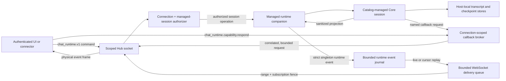
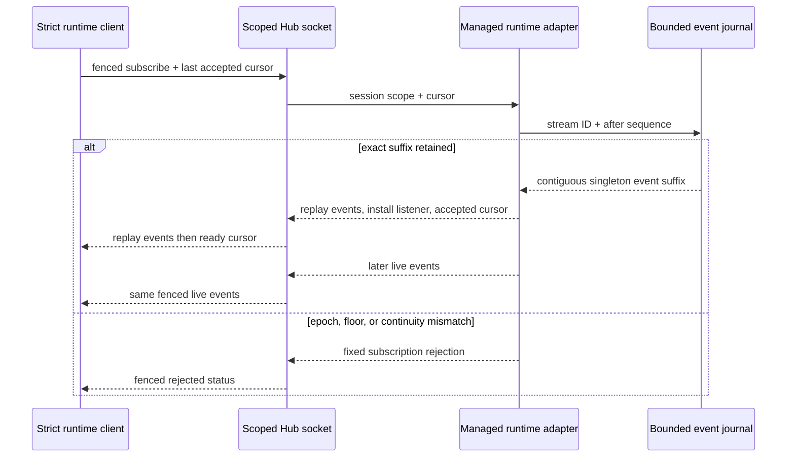
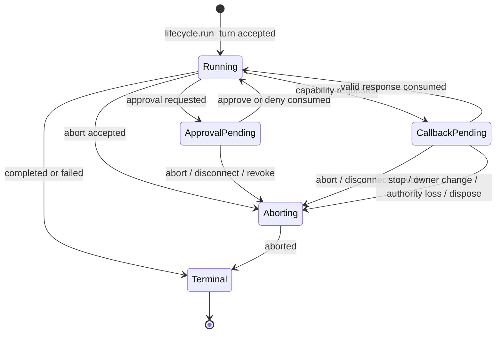

# Managed runtime parity companion

**Status:** implementation contract for PC-4

**Protocol:** `chat_runtime.v1` commands and `chat.runtime` events

**Depends on:** the PC-2 production profile and PC-3 managed lifecycle wire
**Release posture:** partially implemented and tested behind the existing
hard-off managed release gate until PC-8

## Implementation checkpoint

The v1 wire, scoped Hub routing/event multiplexing, resident managed-session
adapter, run/abort/approval correlation, inline attachment materialization and
cleanup, connection-owned managed-session authorization, generation-bound Core
event/approval projection, sanitized streaming/read projections, periodic run
heartbeat, byte-bounded close-on-loss transport behavior, client sequence-gap
detection, the strict client adapter, accepted durable reconnect reclaim,
durable manual-compaction receipts with atomic exact-sidecar replay, and the
first closed-world profile-granted callback are implemented. The callback
slice supports only `tool_executor.askQuestion`; it has capability-specific
request/result schemas, one-shot exact-owner correlation, authoritative expiry,
fixed cancellation, a physical workspace-WebSocket event/response round trip,
and stop/reclaim/resident-authority-loss/disposal race proof. Range-aware
assistant-delta coalescing now preserves exact session-sequence coverage,
semantic event order, endpoint metadata, and a per-subscription transport
fence through a physical workspace WebSocket. Cursor-anchored bounded recovery
now journals sanitized singleton events before delivery, acknowledges an
atomic sequence-zero-capable baseline, and repairs one genuine forward gap
through an exact retained replay over a physical workspace WebSocket. A
physical reconnect still requires caller-level register, durable reclaim, and
fresh cursor subscription ordering; the transport rejects automatic cursor
resubscribe with `session_reclaim_required`. The remaining compaction race
matrix and all-caller conformance are intentionally still fail-closed. This
document describes the full PC-4 target, not a claim that the exit criteria are
complete.

Reconnect authority is specified by
[ADR-0052](../../adr/ADR-0052-managed-session-reconnect-authority.md). A
process-local owner-map replacement was rejected because it cannot durably
transfer writer authority or drain background producers. The strict reclaim
command now lands with lease-token-proven rekey, exclusive guard transition,
nonterminal host write barrier, replay receipt, shared owner coordinator, and
focused race proof. Its presence does not enable the global managed-chat gate.

## Outcome

The runtime companion preserves the interactive behavior users already rely on
without reopening the legacy generic Hub authority. A connection that selects
managed chat routing can stream a turn, answer an approval, abort, edit queued
prompts, inspect sanitized history/checkpoints/usage, request compaction, and
service explicitly granted runtime callbacks. It cannot use `session.*`,
`run.abort`, or `approval.respond` as an escape hatch.

The protocol is deliberately narrower than the in-process Core API. It carries
only presentation-safe projections and operation receipts. Canonical paths,
catalog credentials, provider credentials, checkpoint refs, raw tool payloads,
raw provider messages, and full compaction state never cross this boundary.

## Context and topology

Source: `sdk/packages/shared/src/session/chat-runtime-wire.ts`,
`sdk/packages/core/src/hub/server/workspace-managed-runtime-adapter.ts`, and
`sdk/packages/core/src/hub/server/browser-websocket.ts`.

The socket identity is authoritative. Payload fields never select a principal,
tenant, workspace root, connector namespace, or policy. The server resolves a
`sessionId` through the authenticated connection's managed-session registry and
rejects a command unless the session is both visible to and actively owned by
that identity.

## Command contract

Every mutating command includes a caller-generated `operationId` for tracing and
idempotency. Every command includes one path-safe `sessionId`. The server returns
one strict result schema; unknown input and output fields are rejected.

| Command | Purpose | Result | Important invariant |
|---|---|---|---|
| `chat_runtime.abort` | Abort the active turn | abort receipt | Requires the current run ID; cannot abort a later run after a race |
| `chat_runtime.approval.respond` | Resolve one pending tool approval | resolution receipt | Approval is bound to connection + session + run + approval ID and consumed once |
| `chat_runtime.pending_prompts.list` | Read queued/steering prompts | sanitized prompt list | Attachment contents and host paths are not returned |
| `chat_runtime.pending_prompts.update` | Change text, mode, or delivery | mutation receipt + list | At least one mutable field is required |
| `chat_runtime.pending_prompts.remove` | Remove one pending prompt | mutation receipt + list | Prompt is bound to the same managed session |
| `chat_runtime.messages.list` | Page presentation history | bounded message page | No provider-native message, raw tool payload, hidden reasoning, or metadata blob |
| `chat_runtime.checkpoints.list` | Read restore points | bounded checkpoint list | No git ref, object ID, canonical path, or workspace diff |
| `chat_runtime.usage.get` | Read session and aggregate usage | usage summary | Finite non-negative values only |
| `chat_runtime.compaction.get` | Read compaction summary | summary or `null` | No system prompt or compacted/raw messages |
| `chat_runtime.compaction.run` | Ask trusted runtime to compact | terminal completed/skipped result | Client cannot upload or replace compaction state |
| `chat_runtime.capability.respond` | Resolve one host callback | response receipt | Request must be outstanding on this connection, session, run, and capability |

`chat_lifecycle.run_turn` is the only managed turn-start operation. PC-4
extends it with an optional inline attachment bundle. This avoids creating a
second turn authority while removing the legacy filesystem-path attachment
shape. Managed start/resume profiles are admission-only and reject `prompt`, so
runtime ownership and the capability manifest are registered before any turn
can request a callback.

## Event contract

All runtime notifications use the single event name `chat.runtime` and a strict
discriminated `payload.kind`. The envelope has `eventId`, an opaque `streamId`,
`sessionId`, timestamp, and monotonic process/session sequence numbers. A
cursor is the pair `(streamId, sessionSequence)`. Each resident session has one
process-local event epoch: its stream ID remains stable across a durable writer
rekey, but changes after unregister/recreate, adapter restart, or safe sequence
rollover. This prevents false continuity across a recreated authority.
`sessionSequence` is the inclusive range end. A
singleton omits `sessionSequenceStart`; only the WebSocket delivery layer may
add that field to declare a contiguous compressed range, and only for
`assistant.delta`. A range spans at most 256 source events. Its endpoint event
ID, timestamp, process sequence, session sequence, stream ID, and run ID remain
authoritative. Consumers advance only when the stream ID matches and the
declared start is the next expected sequence. An overlap, regression, malformed
singleton, oversize range, or stream-epoch mismatch is terminal.

Every strict runtime subscription requests a transport fence. The client mints
a fresh opaque subscription ID for each physical subscription and reconnect;
the server echoes it outside the event envelope. Queued or in-flight output
from a released subscription therefore cannot enter a new logical listener.
Legacy unfenced subscriptions retain their existing behavior and cannot feed a
fenced runtime listener. A normal first subscription omits a recovery cursor,
installs the listener, and receives an atomically captured fence-bound `ready`
baseline; a quiet resident session is explicitly `(streamId, 0)`. A resume
subscription carries the last accepted cursor and receives its exact retained
suffix before `ready`, or a fixed `rejected` status. Every physical fenced
subscription has an acknowledgement watchdog.
The strict runtime API always names one session. Unfiltered managed
subscriptions carry lifecycle events only; they are never wildcard runtime
subscriptions.

| Event family | Kinds | Exposed data |
|---|---|---|
| Run | `run.started`, `run.heartbeat`, `run.aborted`, `run.completed`, `run.failed` | operation/run IDs, elapsed time, safe reason/error summary |
| Assistant | `assistant.delta`, `assistant.finished` | bounded display text |
| Reasoning | `reasoning.delta`, `reasoning.finished` | bounded display text only when policy allows it |
| Tool | `tool.started`, `tool.updated`, `tool.finished` | tool call ID, public tool name, status, safe summary/error |
| Approval | `approval.requested`, `approval.resolved` | approval ID, tool identity, policy label, safe summary, decision |
| Prompt queue | `pending_prompts.changed`, `pending_prompt.submitted` | sanitized prompt projections and attachment counts/names |
| Accounting | `usage.updated` | strict usage summary |
| Compaction | `compaction.started`, `compaction.completed`, `compaction.skipped`, `compaction.failed` | operation ID and safe summary/fixed reason |
| Callback | `capability.requested`, `capability.cancelled` | request ID, granted capability name, bounded JSON request, expiry |

Terminal run events are emitted exactly once per accepted run. Under soft
pressure, only the globally newest queued `assistant.delta` for the exact same
subscription/session/run/kind may absorb the next contiguous range. The queue
edits that entry in place; tool, approval, capability, prompt, compaction,
terminal, reply, subscription, and cross-run boundaries prevent a merge.
Reasoning deltas remain uncoalesced and undisplayed until profile policy
explicitly authorizes them. Reaching the text or 256-event range limit starts a
new singleton. If required non-replayable output cannot fit the hard byte bound,
the socket closes.

### Cursor-anchored bounded recovery

The process-local runtime authority deep-freezes and records each validated
singleton event in a sanitized in-memory journal before live delivery. The
journal is bounded per session (**512 events / 2 MiB**), per workspace runtime
(**2,048 events / 8 MiB**), and to **1,024 resident-session metadata entries**.
Eviction advances an explicit per-session floor; it never changes an event or
silently treats an unavailable cursor as current state. No provider request,
transcript reconstruction, or persistence replay participates.
Lifecycle paths that can create or resume resident state reserve a
reference-counted metadata slot before invoking Core. Exhaustion therefore
fails before durable session or writer-lease side effects.

Source: `sdk/packages/core/src/hub/client/chat-runtime-client.ts`,
`sdk/packages/core/src/hub/server/browser-websocket.ts`, and
`sdk/packages/core/src/hub/server/workspace-managed-runtime-adapter.ts`.

The adapter replays to a stable journal head, catching events emitted
reentrantly during replay, then installs the live listener and captures the
accepted cursor in the same synchronous boundary. The socket enqueues every
replay event before `ready`; if any replay or readiness frame cannot enter the
hard-bounded outbound queue, it closes the socket and never reports success.
The socket's subscription-control barrier keeps a later command behind that
installation.

A strict client may perform at most one explicit forward-gap recovery per
logical subscription. It releases the failed physical subscription,
resubscribes with the last accepted cursor, and accepts only the exact
contiguous replay. Readiness can be serialized after newer contiguous live
events; its cutoff is valid only when stream IDs match and
`requestedSequence <= readySequence <= deliveredSequence`. A stale/unknown
epoch, evicted cursor, cursor ahead of the journal, replay discontinuity,
rejection, acknowledgement timeout, cancellation, cutoff outside that
interval, or second gap is terminal.

This automatic repair is deliberately same-connection only. A disconnected
socket has lost resident-owner authority. The Node transport mints no cursor
resume on its replacement connection and reports `session_reclaim_required`.
The higher-level caller must register the replacement client, complete
`chat_runtime.session.reclaim` under the expected durable writer generation,
and only then create a fresh cursor-bearing subscription. The per-session
stream epoch remains stable across that successful durable rekey, so retained
sanitized events—including terminal/cancellation events produced while the old
owner was orphaned—may replay to the newly authorized owner. Live fanout always
remains restricted to the current owner.

## Sanitized projections

### Attachments

Attachments are inline and transport-neutral:

- image: enumerated media type plus raw base64 only;
- file: one safe display filename, optional media type, and UTF-8 text content;
- no data URLs, URLs, absolute paths, relative paths, file handles, or provider
  upload IDs;
- at most four images and eight files;
- at most 512 KiB encoded data per image, 256 KiB of UTF-8 content per file,
  and 640 KiB for the complete bundle;
- the complete serialized turn request is capped at 768 KiB so every
  schema-valid request fits beneath the default 1 MiB WebSocket frame limit.

The receiving host copies accepted content into session-local memory or a
session-scoped temporary store. It never interprets the display filename as a
filesystem path.

### Messages and pending prompts

Messages expose a stable ID, sequence, role, timestamp, bounded display text,
attachment summaries, and optional tool status. Pending prompts expose the same
safe attachment summaries. The projection intentionally excludes provider
messages, tool input/output, chain-of-thought, API payloads, arbitrary metadata,
and file paths. Pagination is cursor based, capped at 200 rows, and defaults to
50.

### Checkpoints and compaction

Checkpoint rows contain only `createdAt`, `runCount`, and optional `kind`.
Compaction state contains only a version, update time, source/compacted message
counts, and optional opaque conversation ID. The action is `compaction.run`;
there is no managed equivalent of legacy `session.compaction.update`.

## Callback authority

Runtime bootstrap may install only capabilities granted by the server-selected
production profile. Workspace/profile payloads cannot add capability names.
For each callback the broker records:

`connectionId + sessionId + runId + requestId + capability + expiry + state`.

Only the same live connection may answer it. Responses are JSON-only, bounded
in depth, breadth, string size, and serialized size. A generic JSON envelope is
transport, not authority: the named capability adapter validates its own result
schema before invoking Core. Disconnect, session stop, abort, revocation,
timeout, owner transition, resident writer-authority loss, and daemon shutdown
atomically cancel unresolved callbacks.

The first implemented manifest is the immutable closed-world grant
`callbacks: ["tool_executor.askQuestion"]`, issued only by the interactive
production profile revision 2 / authority policy epoch 2. Its exact request is
`{ question, options }` and its exact result is `{ answer }`; both are
UTF-8-bounded and reject extension fields. The broker discards
`AgentToolContext`, private workspace metadata, and every function from the
wire projection. Unknown names, duplicate grants, client-selected grants,
ungranted resident use, malformed results, wrong owner/run/capability,
duplicates, abort races, and responses after the recorded expiry fail closed.
There is no generic callback invocation or progress protocol in this slice.

## State and race rules

- Approval and callback resolution is compare-and-consume; duplicate and late
  responses fail with a stable not-found/expired error.
- Abort first fences new work, then cancels prompts/approvals/callbacks, then
  delegates to Core. A concurrent terminal event wins only once.
- Stop cancels an active run and its callbacks before awaiting Core stop, so a
  Core turn blocked on a host callback cannot deadlock until callback timeout.
- Each physical socket orders an earlier subscribe/unsubscribe frame before a
  later command. Every subscription listener captures an immutable delivery
  epoch and optional opaque transport fence. Independent commands remain
  concurrent, allowing callback response and abort commands to resolve a
  still-running turn.
- Pending-prompt updates operate on a stable prompt ID. Submission/removal that
  wins the race causes a later mutation to fail rather than affect another row.
- Sequence numbers are allocated after authorization and before publication.
- Command replies and events may race; clients reconcile by IDs and treat
  command receipts as authoritative for their own operation.
- A replacement physical connection cannot inherit a resident session merely
  by presenting its ID. Reclaim atomically proves the prior connection
  inactive, compares the durable writer generation, rejects an active run, and
  transfers runtime plus lifecycle ownership together. The operation is
  implemented behind the gate. Cursor-bearing transport subscriptions fail
  closed after reconnect until that reclaim has completed; caller convergence
  remains release-blocking.

## Reliability, limits, and observability

- Commands use the Hub's request deadline and return stable machine-readable
  error codes. Compaction and callback requests have explicit expiry.
- Event buffers are bounded per connection and measured by serialized bytes.
  Replaceable snapshots may be replaced; additive assistant text merges only
  in place across an exact contiguous range and never consumes an in-flight or
  non-adjacent entry.
- Active source subscriptions are also bounded by the central WebSocket
  resource policy (default **256 per connection**). Active and asynchronously
  installing sources count toward the same cap in both the socket adapter and
  Hub transport; rejection occurs before source creation.
- A runtime event that cannot enter the bounded outbound queue closes the socket
  immediately, and failed replay admission can never be followed by `ready`.
  The strict client resumes a first genuine same-connection forward gap from
  its epoch-bearing cursor once; unavailable or repeated recovery fails
  terminally. Every physical fenced subscription has a ten-second readiness
  watchdog.
- Runtime results and events are rejected above a 768 KiB final serialized
  UTF-8 budget. Pending prompts paginate, message pages stop at a byte budget,
  and Unicode display text is byte-truncated before projection.
- Metrics cover authorization denials, schema rejections, dropped/coalesced
  deltas, sequence gaps reported by clients, pending approval/callback gauges,
  callback expiry, abort latency, and compaction outcomes.
- Logs use connection/session/operation/request IDs but never attachment bodies,
  prompts, assistant text, raw tool payloads, callback payloads, or credentials.

## Rejected alternatives and tradeoffs

1. **Reuse generic `session.*` commands.** Rejected because their broad records,
   arbitrary payloads, file paths, and mixed authorization are the boundary PC-4
   is intended to remove.
2. **Return only the final assistant response.** Rejected because it silently
   breaks approvals, tool progress, steering, abort, and connector behavior.
3. **Expose raw Core events and provider messages.** Rejected because those
   types are not a stable public protocol and contain secrets, paths, and
   implementation detail.
4. **Let clients write compaction state.** Rejected because it imports hidden
   prompts/messages and lets an untrusted surface rewrite runtime continuity.
5. **Upload files by host path.** Rejected because a remote caller could turn a
   display feature into daemon filesystem read authority.
6. **Build a replacement state snapshot after a gap.** Rejected for v1 because
   independent message, prompt, approval, callback, tool, and partial-delta
   stores cannot provide one atomic through-sequence. Exact bounded replay of
   already-sanitized events preserves semantics without provider or persistence
   work. Durable replay remains deferred unless operational evidence justifies
   its storage and retention cost.
7. **Replace delta N with delta N+1.** Rejected because sequence-aware clients
   would report manufactured loss even if the replacement concatenated text.
8. **Remove and append a merged delta.** Rejected because it can move text
   behind an intervening tool, callback, or terminal event.
9. **Use only a socket-local subscription epoch.** Rejected because already
   queued or in-flight output could reach a newly installed listener. The
   transport fence must survive serialization and be checked by the client.
10. **Resume with only a session sequence.** Rejected because a recreated
    process-local event authority can reuse a numeric sequence and manufacture
    false continuity. Resume cursors include the opaque stream epoch.

## Verification and exit evidence

PC-4 is complete only when tests prove:

1. request/result/event registries are exhaustive and reject unknown fields;
2. traversal, paths, credentials, authority claims, oversize attachments, raw
   tool payloads, provider messages, compaction bodies, and cross-session IDs
   fail closed;
3. approval/callback replay, wrong-connection, wrong-session, timeout,
   disconnect, abort, and revoke races fail closed;
4. event sequencing, delta coalescing, terminal delivery, and read recovery work
   under a slow subscriber;
5. interactive and shared connector conformance suites use only managed
   lifecycle/runtime operations on a scoped socket; and
6. the production release gate remains off until the later atomic cutover and
   rollback milestones are satisfied.

Current evidence satisfies the callback portion of items 1–3 and the
same-connection range/recovery portion of item 4 through physical
one-time-capability WebSockets plus component race tests. Cursor recovery now
has exact retained-suffix replay, a delayed-ready interval check, session-only
runtime scope, pre-admission journal reservations, and a central 256-source
connection bound. The socket adapter reconciles a bounded desired set rather
than appending subscription-control work: superseded admissions settle, every
physical source is bound to one admission generation, stale sources cannot
emit through a reused fence, and reconciliation returns through physical
cleanup after an in-flight ingress change.

Replacement-socket recovery now runs through one Core Hub controller. It waits
for registered physical generation, retries one durable reclaim intent across
an uncertain reply, treats `ownerTransferred: false` as observation only, and
performs a fresh-operation durable rekey before admitting the cursor fence.
Command send and subscription admission compare the exact physical generation
atomically, physical loss starts the controller deadline immediately, and a
retired socket cannot deliver queued output. Exact-operation cancellation
propagates through pre-durable guard/host waits; after commit it orphan-fences
the successor without closing the shared transport. The live owner retains its
exact reclaim intent independently of the bounded replay-receipt cache.
Component tests cover cancellation before and after commit, late completion,
malformed generation, stable-intent retry, and post-commit cancellation after
forced receipt eviction; a real three-socket workspace WebSocket proves fresh
capability/registration, lost reply, second disconnect, receipt reconciliation,
second rekey, exact retained replay, and ready ordering.

Shared typecheck/build and the complete **54 files/503 tests** pass. Core
typecheck/smoke/build, the earlier delivery-hardening **10 files/218 tests**,
the replacement-authority **9 files/236 tests**, and the focused Browser
WebSocket **23/23 tests** pass. The earlier delivery review returned **Ship**;
the replacement-socket reviews found five P1 races now covered by the matrix
above, and final independent re-review found no actionable P1/P2. It retained
lower-severity proof expansions for timeout-driven cancel, physical
cancel/eviction integration, and each pre-durable wait phase; controller **5/5**,
physical WebSocket **14/14**, and host **84/84** follow-ups now close them. Startup
settlement is a defensive invariant that public transition admission cannot
observe as unresolved. The latest default
full-Core run had one unrelated crash-fixture timing
failure while **2,328 tests passed and 14 were skipped**; repeated runs failed
at different timing-sensitive
assertions in `plugin-install-transaction.test.ts`, while an earlier clean
full run in this checkpoint passed before the final two Browser-only
regressions. Physical register/reclaim/resubscribe orchestration is now
implemented behind the gate. Production controller adoption, items 5–6, and
all-caller callback handling remain the PC-4/release boundary; the daemon gate
stays hard off.
