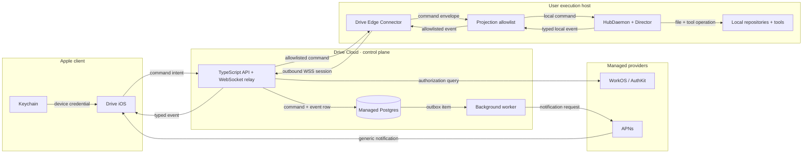
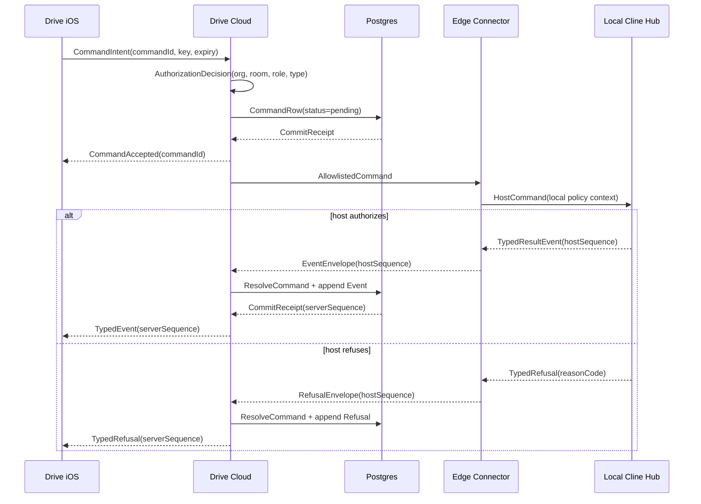

# drive-cloud-beta · hybrid control-plane delivery plan

**Status:** active — boundary specification and decision reconciliation only
**Purpose:** define the smallest secure Drive Cloud beta that connects the
standalone Apple client to a user's local Cline execution host without moving
repositories, tools, models, prompts, credentials, or Director authority into
the cloud.

Delivery status remains authoritative in
[`claims-registry.yaml`](../../delivery/claims-registry.yaml). This initiative
is an implementation design and dependency breakdown beneath the canonical
[`portfolio-now`](../portfolio-now/) sequencer; it must not become a second
status board or task bank.

**Related decisions:**
[ADR-0009](../../adr/ADR-0009-runtime-topology-local-cloud.md),
[ADR-0013](../../adr/ADR-0013-state-partition.md),
[ADR-0016](../../adr/ADR-0016-distribution-and-positioning.md),
[ADR-0021](../../adr/ADR-0021-drive-credential-onboarding.md),
[ADR-0025](../../adr/ADR-0025-enforced-authority.md),
[ADR-0026](../../adr/ADR-0026-evidence-backed-done.md),
[ADR-0029](../../adr/ADR-0029-room-hotpath-redesign.md), and
[ADR-0032](../../adr/ADR-0032-path-h-ops.md).

## Target system



- This is the target topology, not current shipped-state evidence.
- Drive Cloud is an identity, tenancy, routing, durable-metadata, invitation,
  and push control plane. It is not an agent runtime.
- The connector opens the network connection outbound. No desktop listener is
  exposed to the public internet.
- The allowlist is a security boundary: raw hub frames, source, diffs, terminal
  output, prompts, tool inputs/outputs, model identifiers, endpoints,
  credentials, reasoning, audio, and transcripts must not cross it.
- Cline remains the only component that executes work, approves local tool
  policy, and grants or revokes the temporary `Presenter` title.

## Decision gate before runtime implementation

The proposed topology is directionally compatible with Drive's single-writer
and local-authority rules, but it is not already authorized by the current ADR
set. Contract tests and threat-model prototypes may proceed; production cloud
runtime work waits for the following reconciliation.

| Topic | Current repository decision | Required resolution |
|---|---|---|
| Hosted topology | ADR-0016 accepts Path H as a hosted single-writer room service; ADR-0032 is still Proposed. | Decide whether the outbound connector + local Cline host replaces Path H, supplements it, or is a separate deployment profile. Accept or amend ADR-0032 accordingly. |
| Multi-human rooms | ADR-0016 and `DEC-mobile-consumer-owner` keep multi-human rooms out of scope. | The collaborator invitation slice remains non-selectable until an accepted ADR explicitly authorizes organization tenancy and multi-human room access. |
| Identity and credentials | Cline has a WorkOS device-authorization seam in [`cline.ts`](../../../../../../sdk/packages/core/src/auth/cline.ts), while ADR-0021 remains Proposed. | Confirm current secret-hygiene evidence, accept the onboarding posture, and define iOS Authorization Code + PKCE behavior in a system authentication session. |
| Durable cloud events | ADR-0013 defines a host-owned event log and one room writer. | Define the cloud log as a strict projection with independent retention, not a second source that can rewrite host truth. |
| Room and approval authority | ADR-0025 requires every declared authority to have a refusal consumer. | Name the cloud refusal, connector refusal, and final host refusal points for every command class. |
| Delivery truth | ADR-0026 makes claims-registry evidence authoritative. | Reuse the existing GP claims below; add or amend a claim only through the registry owner after deduplication. |
| App Store login | Apple login requirements depend on which primary-account login methods the app exposes. | Review the final AuthKit configuration against current [App Review Guideline 4.8](https://developer.apple.com/app-store/review/guidelines/) before TestFlight review. |

### Gate G0 exit

G0 closes when the accepted decision record states:

1. which deployment profile owns the cloud relay;
2. whether the first beta is same-account only or multi-human;
3. the cloud/host authority matrix;
4. the event, transient-content, command, TTL, and retention boundaries;
5. identity, tenant, device, host, room, and revocation ownership; and
6. rollback behavior that leaves local Cline usable when Drive Cloud is down.

## Beta journey

The first supported journey is deliberately narrow:

1. A tester signs in to Drive iOS and Cline with the same Cline-backed account.
2. Cline registers a host and establishes an outbound connector session.
3. The tester selects an opaque repository or folder target exposed by that
   host and creates or joins a room.
4. The phone starts or resumes a managed chat, or starts a call from a preset.
5. Typed work and session events stream to the phone; conversation bodies are
   relayed transiently and are not added to the cloud event log.
6. A bounded approval request displays its scope, revision, and expiry; the
   response is authorized in cloud and re-authorized by the host.
7. A `presenter.request` remains only a request. Cline alone may create an
   exclusive, temporary, auditable `Presenter` title grant.
8. Either side may disconnect and resume from a room sequence cursor without
   duplicate visible durable events.
9. The tester can revoke the phone, host, or room and observe prompt refusal on
   the next command or reconnect.
10. Push notifications wake the user for invitations and approvals without
    placing sensitive content in the APNs payload.

Inviting a second user as member or observer is a target beta capability, but
it remains behind the multi-human decision gate above. The same-account,
multi-device path must pass before collaboration expands the trust surface.

### Explicit non-goals

- cloud-hosted coding agents;
- public room links;
- pixel or screen streaming;
- raw Cline Hub protocol proxying;
- durable cloud conversation transcripts;
- cloud storage of source, diffs, terminal output, prompts, tool payloads,
  provider/model details, credentials, or reasoning;
- Drive-owned billing or pricing chrome;
- cross-region failover for the private beta; and
- Kafka, Kubernetes, or an independent service per domain.

## Authority model

| Component | May | Must refuse |
|---|---|---|
| Drive iOS | Request safe commands; render typed projections; retain an unacknowledged transient message for retry. | Arbitrary hub commands, stale approvals, expired grants, or mutation while its authoritative state is stale. |
| WorkOS / AuthKit | Authenticate an identity and provide organization-membership context. | Drive room or host execution decisions not represented by its identity/authorization contract. |
| Drive Cloud | Authorize organization and room access; bind devices and hosts; sequence allowlisted events; persist safe command metadata; route intents; expire, deduplicate, and revoke. | Tool execution, model selection, repository access, prompt rewriting, Director policy inspection, Presenter grants, unknown commands, unknown fields, and cross-tenant access. |
| Drive Edge Connector | Maintain an outbound session; translate the explicit cloud projection to local commands; project allowlisted local events. | A command outside the compiled allowlist, a revoked/expired cloud credential, workspace mismatch, or payload that fails the local schema. |
| Cline Hub / Director | Resolve targets; apply local policy; execute or reject; own room truth; issue title grants; emit audited local events. | Any cloud instruction that exceeds the local user's authority, host policy, current room revision, or resource grant. |
| Postgres | Enforce tenant keys, unique sequences, idempotency constraints, and atomic command-result/event commits. | Rows without tenant/room scope, duplicate identities/sequences, or payloads outside an allowlisted schema. |

Initial access vocabulary:

- `Owner` manages the organization, hosts, membership, rooms, retention, and
  revocation.
- `Member` may create/join rooms and use allowed chat/call commands.
- `Observer` receives typed projections and may join calls without mutation.
- `Approver` is an independent, resource-scoped permission. Membership alone
  never implies approval authority.

WorkOS organization membership can provide tenant context, while Drive Cloud
must still enforce room-scoped authorization in its own resource model. WorkOS
documents the relevant [device authorization](https://workos.com/docs/authkit/cli-auth),
[user and organization](https://workos.com/docs/authkit/users-organizations),
and [role and permission](https://workos.com/docs/authkit/roles-and-permissions)
primitives; using them does not remove the host-side refusal requirement.

## Command path



The database transaction that resolves a command and appends its result event
is atomic. Delivery is at-least-once; idempotency and cursor deduplication make
the user-visible projection effectively once.

### Command classes

| Intent | Cloud persistence | Host authorization | Special rule |
|---|---|---|---|
| `call.start` | Durable safe metadata | Room, target, roster, and preset policy | Starting a call grants no execution or Presenter authority by itself. |
| `chat.send` | Durable envelope only; message body stays transient | Active target, conversation, model/provider readiness, and local policy | iOS retains the body until host receipt and resends with the same idempotency key after reconnect. |
| `approval.respond` | Durable approval id, actor, decision, scope/revision digest, and expiry; sensitive display body stays transient | Original approval, current resource revision, approver scope, and local policy | A stale, expired, already-resolved, or differently displayed revision fails closed. |
| `presenter.request` | Durable request metadata and eventual outcome | Coordinator exclusivity, title scope, resource grants, and expiry | Cloud never creates the `Presenter` title grant. |

The boundary specification may add commands, but the default is deny. A mobile
client cannot send raw Hub message names or a generic `execute` payload.

### The no-transcript reliability tradeoff

Conversation bodies cannot be both absent from durable cloud storage and
guaranteed recoverable by the cloud after a process loss. The beta resolves
that tension explicitly:

1. `chat.send` is *queued on device* while only transiently present in cloud.
2. The cloud persists command identity, digest, routing metadata, expiry, and
   status, but not the body.
3. The phone shows *delivered* only after the host acknowledges the body.
4. If the relay fails first, the phone resends the body with the same command
   id and idempotency key.
5. If the phone disappears before host receipt, the command expires rather
   than pretending that cloud can reconstruct it.

Therefore “no lost accepted command” means no loss after the responsible
durable boundary has acknowledged it: cloud-accepted safe commands and
host-acknowledged transient chat. G0 must freeze these state names so the UI
does not call a memory-only relay durable.

## Cloud data model

Start with one managed Postgres database. JSONB is permitted only inside a
versioned, strict, allowlisted payload schema; it is not a schema escape hatch.

| Domain | Tables | Authority and data rule |
|---|---|---|
| Tenant identity | `organizations`, `users`, `organization_memberships` | Local projection of provider identifiers and membership state; no passwords or provider tokens. |
| Devices and routing | `devices`, `hosts`, `host_connections` | Revocable device/host identities, public metadata, last-seen/lease state, and routing state; no local path inventory. |
| Rooms and access | `rooms`, `room_memberships`, `sessions`, `invitations` | Opaque target references and resource authorization; the host resolves the actual path and remains room writer. |
| Durable delivery | `events`, `commands`, `command_results` | Safe typed projections, idempotency, room order, expiry, and result linkage; no transcript or raw execution payload. |
| Notification and security | `push_tokens`, `audit_entries` | Encrypted push token material plus metadata-only security events and actor/resource references. |

Every durable event contains:

```text
event_id
organization_id
room_id
server_sequence
host_id
host_sequence
schema_version
event_type
actor_id
occurred_at
ingested_at
payload
```

Every command contains:

```text
command_id
organization_id
room_id
host_id
requested_by
type
payload
idempotency_key
expected_room_version
expires_at
status
result_event_id
```

Required database constraints:

- unique `(room_id, event_id)` for replay idempotency;
- unique `(host_id, host_sequence)` for connector retry deduplication;
- unique command id and tenant-scoped idempotency key;
- monotonic room-local `server_sequence` allocated inside the append
  transaction;
- organization and room foreign keys on every resource row;
- strict payload validation before insertion, with unknown fields rejected;
- atomic command result + event append; and
- indexes for tenant/room membership, pending commands by host/expiry, event
  catch-up by room/sequence, and revocation lookup.

Application authorization always scopes queries by tenant and resource. G0
must decide whether Postgres row-level security is added as defense in depth;
RLS must not be treated as a substitute for application and host checks.

### Durable, transient, and prohibited data

| Class | Examples | Storage rule |
|---|---|---|
| Durable safe projection | room/session lifecycle, host availability, safe work category/outcome, title grant metadata, approval state, refusal code, cursor | Postgres with version, tenant scope, and retention. |
| Transient relay | chat body, assistant response body, approval display details that may contain source context | Memory only in cloud; payload logging disabled; retained by endpoint devices/host only as their own policies permit. |
| Host-only | repository paths, source, diffs, terminal output, prompt text, Director internals, tool definitions/inputs/outputs, provider/model identifiers, endpoints, keys, reasoning, audio | Rejected at the projection boundary and by cloud schema. |

Automated forbidden-field tests cover at least `prompt`, `apiKey`, `token`,
`toolInput`, `toolOutput`, `modelId`, `endpoint`, `fileContent`, `diff`,
`transcript`, `reasoning`, and spelling/casing variants. Tests must inspect the
entire payload union, including nested objects and arrays, not only top-level
keys.

## Time, ordering, and expiry

| Control | Source of authority | Beta posture |
|---|---|---|
| Room order | Cloud transaction allocating `server_sequence` | Strictly increasing per room; clients fold only after schema validation. |
| Host retry order | Connector-owned `host_sequence` | Deduplicated per host; gaps cause catch-up or an explicit incompatible state. |
| Event time | `ingested_at` for retention; `occurred_at` for display | Client or host clocks never decide authority or retention. |
| Device/host connection | Cloud lease and heartbeat | Ephemeral; loss marks unavailable and triggers reconnect with jitter. Exact lease is a G0 configuration, not a protocol constant. |
| Command | Required `expires_at`, type-specific maximum | Pending while a valid host route may recover; expired commands produce a terminal event and are never executed later. |
| Approval | Approval expiry plus displayed-revision digest | Short-lived and single-use; any scope or revision change requires a new approval. |
| Presenter title | Host-issued grant and expiry | Exclusive, temporary, and revocable; cloud projects the result but cannot extend it. |
| Invitation | Explicit expiry and revocation | One-time acceptance; multi-human gate must be accepted first. |
| Directory cache | Revision/ETag plus bounded soft TTL | Cache may accelerate display but mutation authorization always reads authoritative membership/revocation state. |
| Typed work/session events | Cloud retention policy | Proposed beta default: 30 days, subject to privacy review and deletion semantics. |
| Security audit records | Cloud retention policy | Proposed beta default: 90 days, metadata only, subject to privacy/legal review. |

Retention deletion is a scheduled, observable operation. A cursor older than
the retained boundary returns a typed `cursor_expired` result and a fresh safe
snapshot; the client must never silently skip the gap.

## Interfaces and protocol rules

The boundary specification freezes behavior before endpoint names. The likely
surface is:

- HTTPS for authentication bootstrap, device/host registration, room
  directory, invitations, revocation, command submission, and cursor catch-up;
- WSS for host availability, routed command delivery, and typed event stream;
- an explicit supported-schema-version handshake on every device and connector
  session;
- bounded payload and batch sizes, backpressure, rate limits, and stable typed
  refusal codes; and
- generic APNs payloads that cause the app to fetch authorized detail after
  launch rather than exposing it on a lock screen.

Exact URLs are not frozen here. The contract should cover resource operations
equivalent to:

```text
hosts.register / hosts.list / hosts.revoke
rooms.create / rooms.list / rooms.join / rooms.revoke
commands.submit / commands.get
events.catch_up / events.stream
invitations.create / invitations.accept / invitations.revoke
devices.revoke / account.delete
```

Protocol invariants:

1. No generic raw-frame or arbitrary-command endpoint exists.
2. Unknown command/event types, fields, or unsupported schema versions fail
   closed before persistence or local dispatch.
3. The event catch-up cursor and live subscription establish a barrier so an
   event cannot fall between the two.
4. At-least-once delivery is expected; clients deduplicate by event id and
   sequence and commands by idempotency key.
5. Reconnect reports `live`, `catching_up`, `host_offline`, `cloud_offline`,
   `cursor_expired`, `revoked`, or `incompatible` honestly.
6. Revocation invalidates active streams and future bootstrap; cached room
   data never authorizes a mutation.

The existing iOS writer client already demonstrates a strictly-after cursor
and idempotent replay shape in
[`WriterClient.swift`](https://github.com/drive-mode/drive-ios/blob/main/Sources/WriterClient.swift).
The cloud client should preserve that fold model while replacing local polling
with authenticated catch-up plus stream.

## Deployment shape

The private beta stays operationally small:

- one TypeScript modular monolith exposing REST and WebSocket endpoints;
- one background-worker process from the same codebase for APNs, invitation
  delivery, expiry, deletion, and retry;
- one managed Postgres cluster with encrypted backups and point-in-time
  recovery if the selected provider supports it;
- WorkOS/AuthKit for account identity;
- APNs for notifications;
- a managed secrets service for server credentials; and
- one region, with reconnect-aware clients and an explicit beta residency
  statement.

Proposed repository ownership, subject to G0:

| Slice | Likely owner |
|---|---|
| Mobile-safe schemas, compatibility fixtures, and forbidden-field guard | `sdk/packages/shared/src/drive/cloud/` |
| Drive Cloud service and worker | `apps/drive-cloud/` |
| Connector policy, projection, reconnect, and host registration | `sdk/packages/core/src/drive-cloud/`, composed by Cline host entry points |
| Standalone Apple auth, Keychain, directory, command, cursor, and WSS client | `drive-mode/drive-ios` repository |
| Cross-repository synthetic environment and release evidence | `drive-mode/drive-dev` repository |

Do not introduce Kafka, Kubernetes, a separate event bus, or independent
identity/room/command services for the first 20–100 testers. Redis or NATS is a
measured follow-up only when multiple cloud instances require cross-instance
WebSocket fanout and Postgres/outbox metrics show the need.

### Cost and performance posture

- Keep one logical device stream and one logical connector stream per active
  installation; multiplex rooms over each connection.
- Bound payloads and catch-up batches before optimizing infrastructure.
- Batch notification, expiry, and retention work in the worker.
- Store safe events once; derive room/session views rather than duplicating
  materialized transcripts.
- Cache low-risk directory projections, never authorization decisions.
- Use reconnect jitter and visibility-aware client activity to avoid synchronized
  wakeups.
- Capacity tests include the upper synthetic envelope of 50 hosts each
  producing a 10-event/second room burst, while storage planning uses measured
  average event size and activity rather than an invented forecast.

Initial service objectives:

| Objective | Beta target |
|---|---|
| Private population | 20–100 users |
| Concurrent connections | 50 phones and 50 hosts |
| Per-active-room burst | 10 safe events/second |
| Phone-to-host relay | median under 500 ms |
| Host-to-phone event delivery | median under 1 second |
| Accepted command durability | no loss at the acknowledged durable boundary |
| Recovery | no duplicate visible durable events after network loss |
| Control-plane availability | 99.5% monthly |

These are acceptance targets, not promises of the underlying identity, push,
or network providers. Measure end-to-end percentiles and error budgets before
adding infrastructure.

## Failure and recovery contract

| Failure | Required user-visible behavior | Required system behavior |
|---|---|---|
| Cloud unavailable | `cloud_offline`; local Cline remains usable. | Stop accepting cloud commands, retain client retry state, reconnect with jitter, and do not expose the host. |
| Host unavailable | `host_offline`; queued-safe commands show expiry. | Keep only durable safe commands pending; transient bodies stay on device; expire rather than execute stale work. |
| Connector restart | `catching_up`, then live or incompatible. | Resume from host/cloud sequences, deduplicate retries, and replay safe results. |
| Duplicate command/event | No duplicate bubble, approval, or title transition. | Uniqueness and idempotency constraints return the original terminal result. |
| Cursor behind retention | Explicit history-gap explanation. | Return `cursor_expired` plus a current safe snapshot; never pretend the missing range was replayed. |
| WorkOS outage | Sign-in or authorization unavailable; existing session behavior is explicit. | Follow a documented fail-closed cache policy; no stale membership may create new authority. |
| Postgres failover | Reconnecting state; no false success. | Acknowledge only committed work; retry idempotently after connection recovery. |
| APNs failure | In-app state still correct; notification may be delayed. | Retry within expiry, record provider outcome, and keep APNs off the authority path. |
| Revocation during a stream | Immediate access-ended state. | Close the stream, reject pending/future commands, rotate credentials as required, and audit the actor/resource. |
| Schema mismatch | Update-required/incompatible state. | Reject unsupported versions and preserve old data; no permissive unknown-field parsing. |

## Security, privacy, and operations gates

### Security

- Threat-model compromised phone, stolen refresh token, malicious connector,
  cloud operator access, cross-tenant object reference, replay, schema
  smuggling, stale approval, and lock-screen disclosure.
- Store iOS tokens in Keychain and host credentials in platform credential
  storage; never place a durable secret in a URL.
- Bind connector credentials to a host and organization; make device and host
  revocation independently enforceable.
- Apply authentication, tenant/resource authorization, command allowlisting,
  rate limits, payload caps, expiry, and local re-authorization in that order.
- Keep cloud logs metadata-only with payload logging disabled and automated
  redaction tests.
- Run dependency, secret, SAST, tenant-isolation, and projection-boundary
  checks before an external tester is admitted.

### Privacy

- Publish the durable/transient/prohibited matrix in product-facing policy.
- Provide account deletion, host/device/room revocation, and any required data
  export before external testing.
- Define deletion propagation for WorkOS, Postgres, backups, APNs tokens, and
  local host state without implying that cloud can delete a disconnected local
  repository.
- Keep push text generic and require authenticated fetch for detail.
- Verify retention defaults, subprocessors, region, privacy manifest, and App
  Store disclosures against actual deployed behavior.

### Operational evidence

- Health/readiness checks distinguish API, WebSocket admission, Postgres,
  WorkOS, APNs, and worker backlog.
- Metrics cover command acceptance/result latency, event ingestion/delivery,
  connector/device connection counts, reconnects, cursor gaps, duplicate
  suppression, pending/expired commands, forbidden-field refusals,
  unauthorized attempts, worker age, APNs outcomes, and deletion jobs.
- Traces use command/event/room correlation ids without recording payloads.
- Alerts have an owner and runbook for authorization spikes, cross-tenant
  guard failures, database saturation, event lag, expiry backlog, backup
  failure, and provider outage.
- Restore, deletion, revocation, and incident-response drills are release
  evidence, not post-launch intentions.

## Six-system ownership check

| System | Beta responsibility | Exit evidence |
|---|---|---|
| People | Tester, organization owner, observer/member if accepted, approver, support DRI, security reviewer, privacy owner, release owner | Role/refusal matrix, support route, escalation owner, reviewer tenant, and consent copy agree. |
| Data | Identity references, room access, commands, safe events, cursors, audit, retention, deletion | Schema catalog, data-flow review, forbidden-field tests, restore/deletion evidence, and no-transcript contract pass. |
| Hardware | iPhone/iPad, one or more Mac execution hosts, cloud compute/database | Physical-device reconnect, background/foreground, host sleep/wake, clock skew, storage pressure, and thermal/network tests pass. |
| Software | Drive iOS, Drive Cloud, connector, Cline Hub/Director, WorkOS, Postgres, APNs | Version handshake, conformance fixtures, refusal paths, observability, and rollback pass. |
| Processes | Invite/revoke, approve, incident, deploy, migrate, restore, delete, support, TestFlight review | Runbooks and evidence owners are named and rehearsed. |
| Networks | HTTPS/WSS, outbound connector, cellular/Wi-Fi transitions, provider links | TLS, no inbound host exposure, backpressure, rate limits, reconnect, proxy/NAT, and outage behavior pass. |

## Delivery map

The rows below decompose the architecture without copying claim status. Select
work from the claims registry; this table contributes dependencies and exit
evidence only.

| Milestone | Existing claim linkage | Depends on | Exit evidence |
|---|---|---|---|
| **B0 Boundary and decision freeze** | `claim:drv-golden-path-contract`, `claim:drv-release-services` | — | G0 closes; schemas, commands, forbidden data, authority, retention, transient-content states, and rollback are accepted and versioned. |
| **B1 Identity, tenancy, device, and host trust** | `claim:drv-host-trust`, `claim:drv-release-services` | B0 | Same account registers/revokes phone and host; tenant/room object access tests fail closed; secrets remain in platform storage. |
| **B2 Cloud skeleton and durable safe log** | `claim:drv-managed-chat`, `claim:drv-return-loop` | B0, B1 | REST/WSS health, migrations, strict event append/catch-up, command outbox, expiry, idempotency, atomic result commit, and metadata-only logs pass. |
| **B3 Outbound edge connector and target projection** | `claim:drv-host-trust`, `claim:drv-target-resolution`, `claim:drv-managed-chat` | B0–B2 | Host registers outbound, projects allowlisted events, resolves opaque targets, refuses unknown/stale commands, and resumes sequences after restart. |
| **B4 Standalone iOS cloud binding** | `claim:drv-ios-managed-chat`, `claim:drv-return-loop` | B1–B3 | System auth, Keychain, host/room directory, target-aware composer, catch-up + WSS stream, transient retry, and honest offline/revoked/incompatible states work on a physical device. |
| **B5 Chat, calls, approvals, and Presenter request** | `claim:drv-managed-chat`, `claim:drv-remote-call-binding`, `claim:drv-presenter-native` | B3, B4 | Real chat/call flows use host authority; approval revision/expiry binding and exclusive host-issued Presenter grants pass conformance; no pixels or raw hub frames cross. |
| **B6 Same-account private beta** | `claim:drv-cross-repo-conformance` | B1–B5 | One deterministic environment proves sign-in, host/target, chat, call, approval, reconnect, push fetch, revocation, refusal, and cleanup across Cline, cloud, connector, and iOS. |
| **B7 Multi-user collaboration** | No selectable claim until the ADR gate accepts multi-human rooms | B6 + accepted multi-human decision | Invitation, member/observer access, removal, concurrent presence, and revocation pass tenant-isolation and audit tests. |
| **B8 Operational/TestFlight beta** | `claim:drv-release-services`, `claim:drv-cross-repo-conformance` | B6; B7 only if collaboration is in scope | Rate limits, dashboards, alerts, backups/restore, privacy/deletion, accessibility, App Review evidence, support and incident runbooks, and go/no-go review pass. |

### Reviewable implementation slices

1. Accept/amend the topology and authority decision; publish the cloud boundary
   contract.
2. Add mobile-safe schemas, golden fixtures, compatibility negotiation, and
   nested forbidden-field tests.
3. Add identity/tenant middleware, device/host registration, revocation, and
   tenant-isolation tests.
4. Add the service skeleton, migrations, strict safe-event append/catch-up,
   health, and metadata-only telemetry.
5. Add durable command state, transactional outbox/result handling, expiry,
   and idempotency.
6. Add the outbound edge connector, local allowlist/refusal adapter, target
   resolution, and reconnect/replay.
7. Add iOS system auth, Keychain, host/room directory, and revocation.
8. Add iOS catch-up + WSS fold, transient chat retry, lifecycle recovery, and
   truthful failure UI.
9. Add managed chat, call preset, approval binding, and Presenter-request
   integration against real host authority.
10. Add APNs, generic notification fetch, deletion/export, retention, rate
    limits, dashboards, backups, and incident runbooks.
11. Add invitations and member/observer collaboration only after B7 becomes
    selectable through an accepted decision and deduplicated claim.
12. Add cross-repository conformance, load/fault/security evidence, physical
    device validation, reviewer tenant, and TestFlight go/no-go.

Each slice must state which claim it advances. A UI preview, schema alone, or
cloud stub remains partial evidence until its refusal, failure, and recovery
path passes.

## Acceptance gates

### Product

- Chat and Call are reachable without scrolling after selecting an opaque
  host target.
- The user can distinguish queued-on-device, cloud-accepted, host-accepted,
  refused, expired, and delivered states.
- Reconnect restores durable typed work without visible duplicates; missing
  transient conversation history is labeled rather than fabricated.
- Revoking a phone, host, collaborator, or room prevents new authority and
  terminates active access promptly.
- Presenter ownership is exclusive, temporary, auditable, and host-issued;
  no pixel capture is introduced.

### Contract and security

- TypeScript and Swift decode the same golden safe-event and command fixtures.
- Unknown type/field/version, nested forbidden key, cross-tenant resource,
  replayed command, stale approval, expired grant, and revoked stream tests all
  fail closed.
- A cloud compromise does not expose repository contents, tools, prompts,
  provider/model configuration, Director internals, or credentials from the
  designed data stores and logs.
- Cline can reject every command that Cloud authorized; Cloud cannot bypass or
  mint host authority.

### Reliability and operations

- Kill/restart phone, connector, cloud process, and host independently; the
  resulting state matches the failure contract.
- The synthetic capacity envelope meets the beta objectives without unbounded
  memory, queue, catch-up, or database growth.
- Backup restore, retention expiry, account deletion, device/host revocation,
  and provider outage drills produce auditable evidence.
- Local Cline continues to work when Drive Cloud is unavailable or disabled.

## First artifact: cloud boundary specification

Before service code, add a versioned boundary document and fixtures that name:

1. every durable safe event and transient relay frame;
2. every allowed command intent and stable refusal code;
3. complete payload schemas, size limits, versions, and compatibility rules;
4. the forbidden-field/deep-payload scanner and test corpus;
5. identity, organization, room, device, host, target, and approver scopes;
6. command state transitions, acknowledgement meanings, idempotency, expiry,
   and atomicity;
7. cursor catch-up/subscription barrier and retention-gap behavior;
8. Presenter request versus host-issued title-grant behavior;
9. retention, deletion, audit, logging, and APNs disclosure; and
10. TypeScript/Swift golden fixtures plus a cross-repository conformance
    command.

That artifact is complete only when security, iOS, Cline host, data, and
operations owners can each point to a refusal path and an observable recovery
state. It is the entry gate for B1–B5, not documentation written after them.

## Open decisions

1. Does the hybrid connector topology replace hosted Path H, supplement it, or
   become a distinct profile?
2. Is the first external beta same-account only, or does it include the
   decision-gated member/observer collaboration slice?
3. Which organization and permission facts remain WorkOS-authoritative, and
   which resource-scoped facts live only in Drive Cloud?
4. Which region, managed Postgres offering, backup policy, and subprocessors
   satisfy the beta privacy posture?
5. What are the per-command, approval, invitation, connection, and cache TTLs?
6. Which safe work summaries are useful enough to retain without leaking tool
   or repository content?
7. How does account deletion handle disconnected hosts and backup-retention
   windows honestly?
8. Which team owns on-call, security response, privacy requests, WorkOS/APNs
   configuration, and TestFlight reviewer support?

Do not resolve these by accidental implementation. Close them in G0 or retain
the related capability outside the beta.
