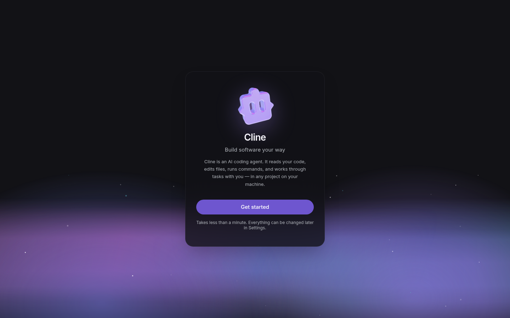
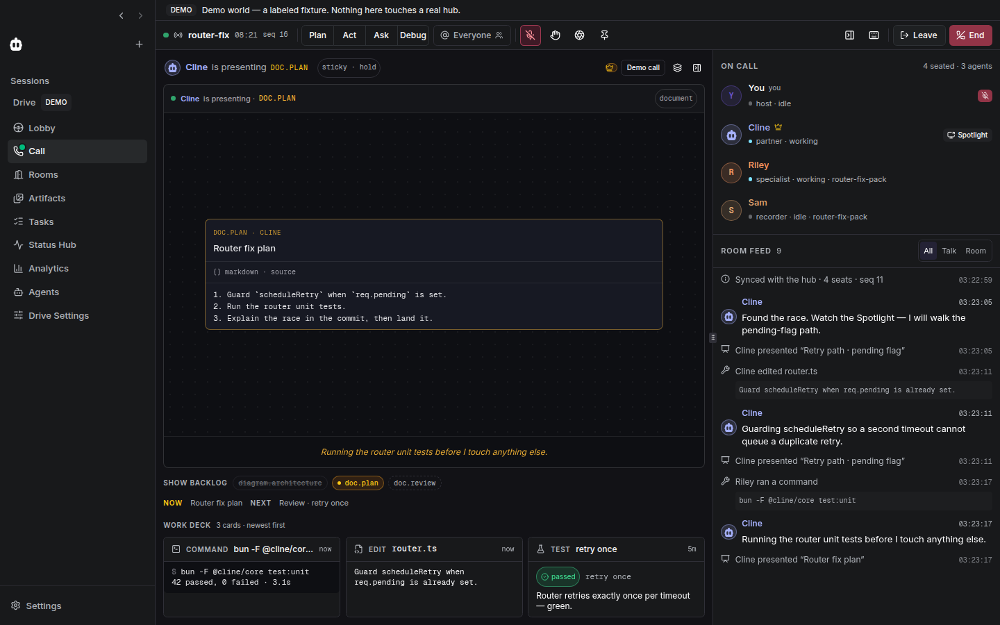
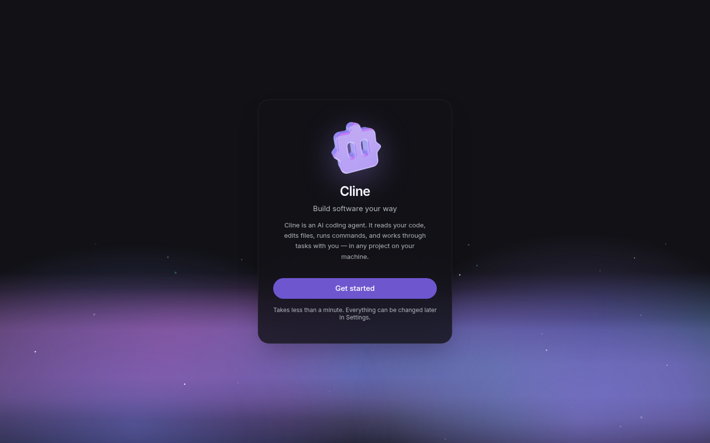
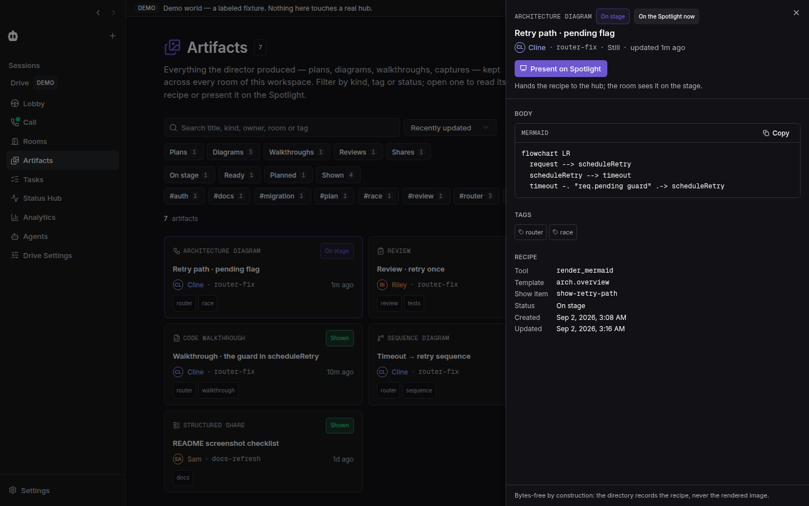
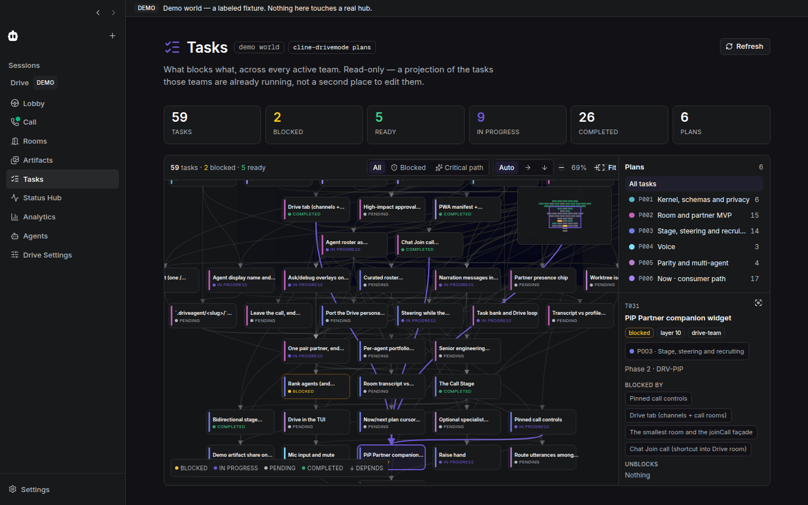
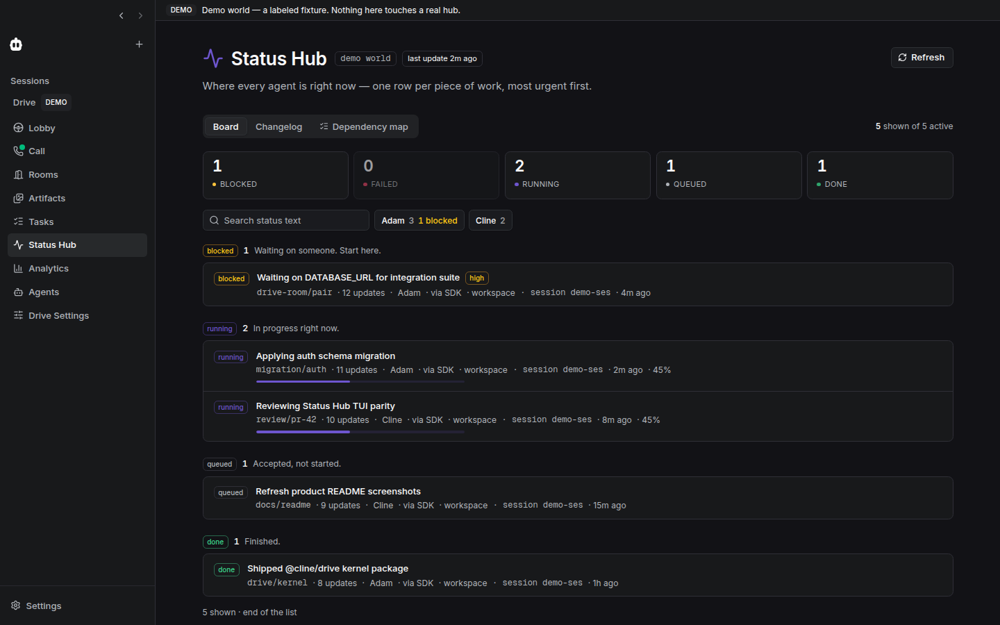
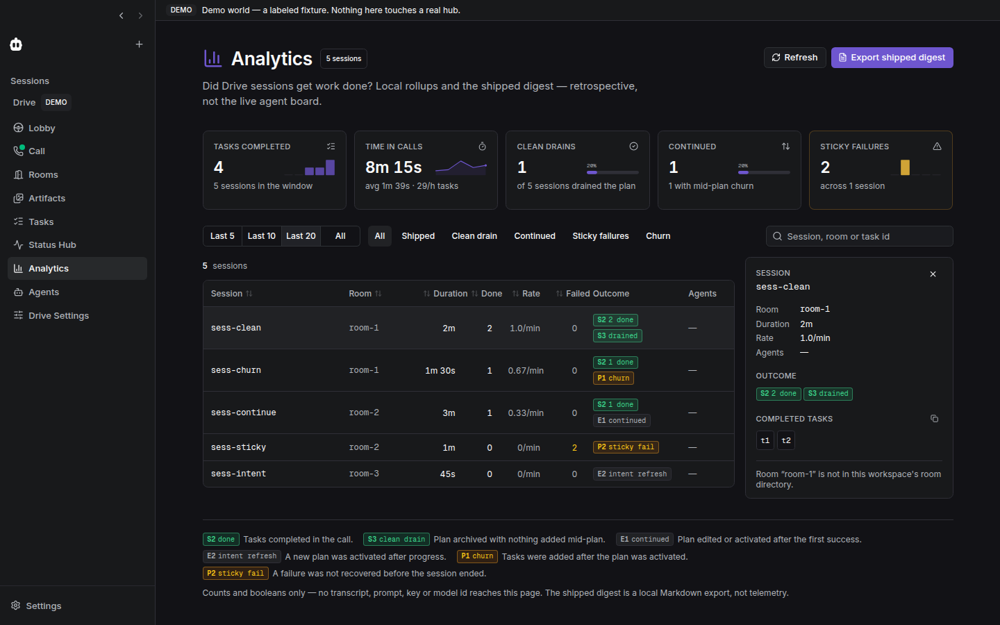
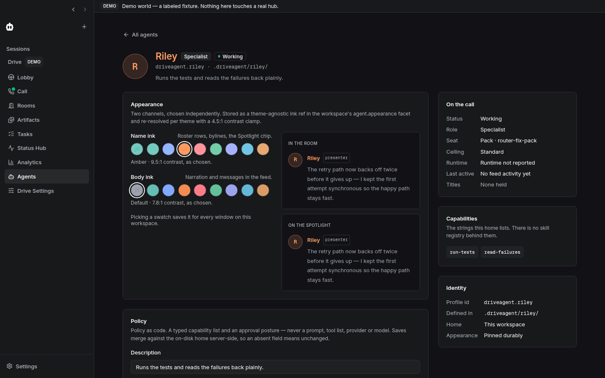
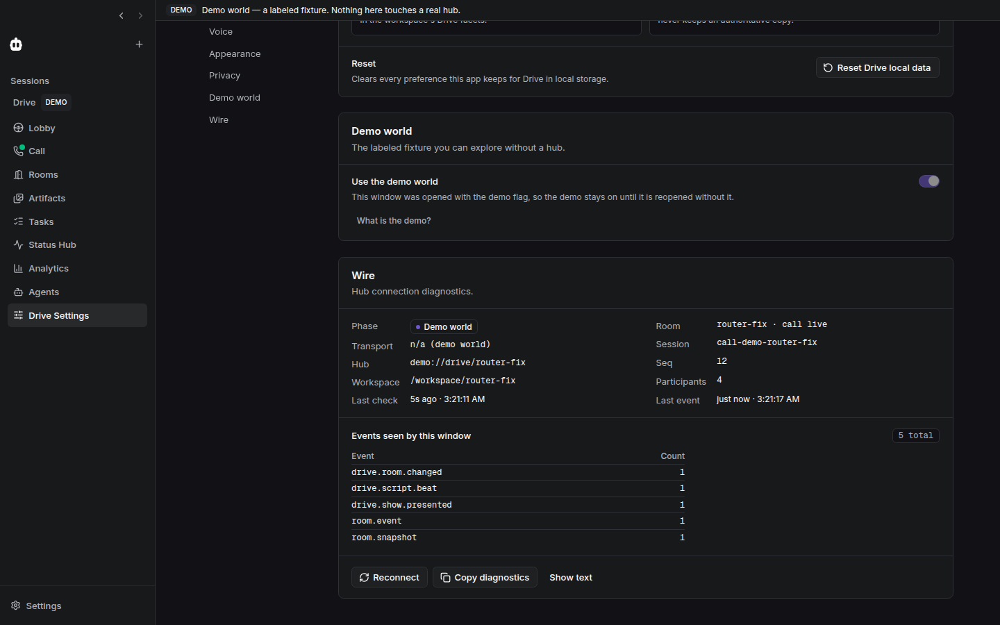
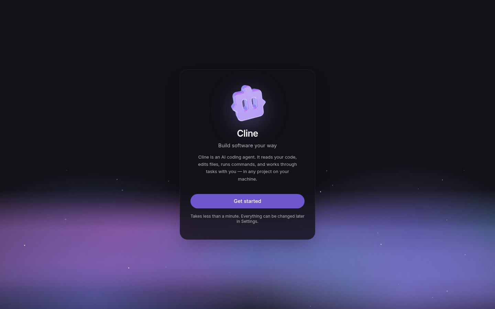

# drive-desktop · Drive Mode inside the Cline desktop app

**Status:** landed on PR #42 (desktop Drive surfaces complete; review pending)
**Product parent:** [multi-device](../multi-device/) (desktop lane)
**Sibling client plans:** [drive-web](../drive-web/), [ios-native-client](../ios-native-client/)
**Code:** `apps/examples/desktop-app/` (`@cline/code`, Tauri + Bun sidecar + Next.js webview)

## Outcome

A fully working, local Drive Mode **inside the upstream Cline desktop app**,
not beside it: a **Drive** view next to Chat and Sessions with the sections
Lobby, Call + Spotlight, Rooms, Artifacts, Tasks, Status Hub, Analytics,
Agents and Drive Settings. It runs against the real Cline Hub the desktop
sidecar already owns, and ships a labeled demo world so every surface is
alive with no hub room, no credentials and no network.

The vocabulary and the rules are the family's, unchanged: **Spotlight** is
the user-facing surface, **stage** the typed wire projection, **Presenter** a
temporary exclusive title, **Director** host policy. The Spotlight never
streams pixels. The hub is the only writer. Prompts, tool allowlists,
providers, endpoints, keys and model ids never reach the UI.

## Architecture

```text
Tauri shell ─▶ Bun sidecar ──NodeHubClient──▶ Cline Hub daemon (single writer)
                 │  sidecar/drive.ts                     ▲ room.*, drive.*, status.updated
                 │  drive_call / drive_command /         │
                 │  drive_status / drive_rooms_list /    │
                 │  drive_bank / drive_session_rollups / │
                 │  drive_agent_home / drive_agent_profiles / drive_config
                 │  + drive_hub_event fan-out
                 ▼  ws /transport
Next.js webview  webview/lib/drive/
                   drive-client.ts   typed wrappers over desktopClient.invoke/subscribe
                   drive-source.ts   DriveDataSource port (hub | demo)
                   room-state.ts     pure fold: room_snapshot / room.event via reduceRoom
                   demo-world.ts     labeled demo: router-fix room, beats, board, rollups
                   drive-prefs.ts    per-viewer prefs (cline.code.drive.prefs.v1)
                   use-drive-hub.tsx DriveHubProvider / useDriveHub
                 webview/components/views/drive/   one file per section
```

Design points, each with the reason it is that way:

- **The sidecar is the bridge, not a second daemon.** It already holds a
  `NodeHubClient` against the shared hub; `sidecar/drive.ts` exposes the
  Drive surface through it behind allowlists, so no arbitrary hub command
  name can be forwarded, and hub errors cross as `"<code>: <message>"`.
- **Room truth is folded, never owned.** The webview applies
  `room_snapshot` and `room.event` with the kernel's `reduceRoom`; an
  out-of-order `seq` marks `needsResync` and the provider re-asks with
  `call_get_room`. Nothing in the webview is authoritative.
- **Demo is a port implementation, wired at the composition root.**
  `createDemoDriveSource()` mutates its room only through `reduceRoom` and
  emits the same events the hub does, so the UI behaves identically live and
  offline. `?demo=drive` / `NEXT_PUBLIC_CLINE_DRIVE_DEMO=1` is parsed in
  `app/page.tsx` only; views never read demo flags.
- **Sanitized agent data.** Agent-home and profile replies are stripped the
  way the hub dashboard strips them (no prompt bodies, no paths); runtime
  badges are family + location only.
- **Desktop kit, not a third design system.** Surfaces use the app's
  shadcn/Radix primitives and `@cline/ui` tokens; agent ink comes from the
  kernel's facet resolver.

## Run it

```bash
bun install --frozen-lockfile && bun run build:sdk
cd apps/examples/desktop-app
bun run dev:sidecar      # Bun sidecar, discovers/starts the hub, ws://127.0.0.1:3126/transport
bun run dev:web          # Next.js webview on http://localhost:3125
# Drive: ⌘D / Ctrl+D, or http://localhost:3125/?view=drive&section=lobby
# Demo world: http://localhost:3125/?demo=drive&view=drive&section=call
bun run dev              # the native Tauri window (needs Rust ≥ 1.85)
```

Verify:

```bash
bunx vitest run sidecar/drive.test.ts webview/lib/drive webview/components/views/drive --config vitest.config.ts
bunx tsc -p webview/tsconfig.json --noEmit
bun run typecheck        # sidecar
```

## Delivery

| Slice | Files | Status |
|---|---|---|
| Sidecar bridge | `sidecar/drive.ts`, `commands.ts`, `context.ts`, `ARCHITECTURE.md` | landed |
| Webview foundation + navigation + demo world | `webview/lib/drive/*`, `app/page.tsx`, `components/agent-sidebar.tsx`, `components/views/drive/drive-view.tsx` | landed |
| Lobby + Rooms | `views/drive/lobby-view.tsx`, `rooms-view.tsx`, `room-preview-card.tsx` | landed |
| Call + Spotlight (strip, roster, Presenter, feed, show rail, work deck) | `views/drive/call-view.tsx`, `call-strip.tsx`, `spotlight.tsx`, `roster.tsx`, `participant-sheet.tsx`, `presenter-controls.tsx`, `room-feed.tsx`, `drive.css` | landed |
| Status Hub + Tasks (board, changelog, dependency map) | `views/drive/status-view.tsx`, `status-row.tsx`, `status-filters.tsx`, `tasks-view.tsx`, `dependency-map.tsx` | landed |
| Analytics + Artifacts | `views/drive/analytics-view.tsx`, `sessions-panel.tsx`, `artifacts-view.tsx`, `artifact-detail.tsx` | landed |
| Agents + Drive Settings | `views/drive/agents-view.tsx`, `agent-profile.tsx`, `agent-appearance-editor.tsx`, `agent-policy-editor.tsx`, `drive-settings-view.tsx` | landed |

Every section walks headless in both the demo world and against a live
hub with no console errors; the pure-logic modules under
`webview/lib/drive/` carry 300+ Vitest cases, and `sidecar/drive.test.ts`
covers the bridge.

Out of scope for this slice: native menu/tray entries for Drive, a separate
Drive window, voice transport (WebRTC), and any persistence the hub does not
already have.

## What it looks like

Demo world (labeled fixture, no hub) unless noted; captured headless at 1440×900.

| | |
|---|---|
|  Lobby |  Call + Spotlight |
|  Rooms |  Artifacts (detail sheet) |
|  Tasks (dependency map) |  Status Hub (board) |
|  Analytics (drill-down) |  Agents (profile) |
|  Drive Settings (wire diagnostics) |  Lobby against a live hub |

## Upstream-sync debt this track paid down

Landing the desktop path from source exposed that `apps/cli`,
`apps/vscode` and `apps/examples/desktop-app` had been synced from a newer
upstream than `@cline/core`. The fixes ride the same PR because the Drive
gate could not go green without them: barrel re-exports the consumers
already import, `readSupersededHubDiscovery`, `cline connect
--cleanup-instance`, `preserveUpdatedAt` on session annotations (the fork's
store forbids raw session-table writes), `isUnusableSessionError`,
`onShutdownRequested` on the hub websocket server, and the
`drive_project_map_get` command name and dispatch.
