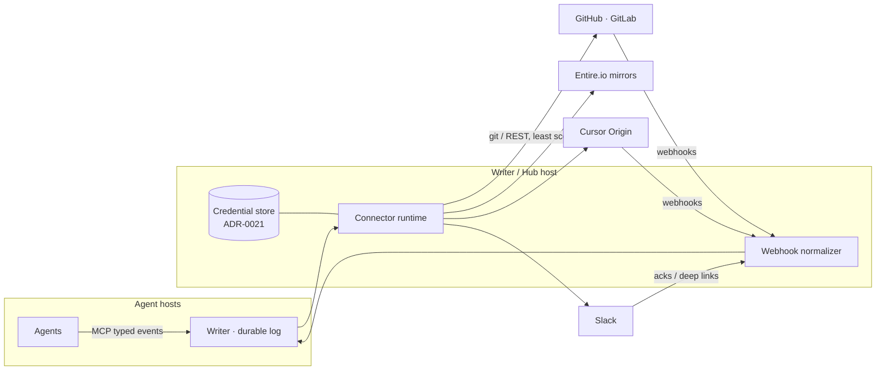

# integrations-vcs · Version control + external connections as adapters

**Status:** plan (opened 2026-08-17)
**Stance:** git is the substrate; everything else — GitHub, GitLab, Entire.io, Cursor Origin, Slack — is an **adapter** behind one connector runtime, one credential store, one event vocabulary.
**Related:** [ADR-0021](../../adr/ADR-0021-drive-credential-onboarding.md) (credential onboarding — the store and wire patterns this reuses), [ADR-0010](../../adr/ADR-0010-provider-harness-byok.md) (BYOK / fail-closed egress), [ADR-0009](../../adr/ADR-0009-runtime-topology-local-cloud.md) (topology + egress classes), [mobile-consumer](../mobile-consumer/) (phone never holds secrets), `drivemode-mcp` hard rules (events only; no keys in MCP), [task-bank-drive-loop](../task-bank-drive-loop/) (tasks the map draws come from somewhere)

## Why this exists

Drive's wedge is **event-sourced shared work you steer**. The work itself lives
in git; the people you answer to live in Slack. Today neither is a first-class
citizen: rooms assume a local repo, and interrupts die if your phone isn't open.

Two market facts sharpen this from "nice roadmap" to "system design now":

1. **Agent swarms break classic forges.** Parallel agents cloning and pushing
   against one repo is exactly Drive's workload, and it is the workload
   [Entire.io](https://entire.io/blog/an-entirely-new-git-hosting-network)
   (distributed git-compatible mirror network; GitHub stays origin) and
   [Cursor Origin](https://cursor.com/changelog/origin-code-hosting)
   (agent-scale forge: repos, PRs, GitHub sync) were both launched to serve in
   2026. We should not bet the product on any one of them — we should make the
   forge a **capability-probed adapter** and win on whichever the developer
   already uses.
2. **Interrupt latency is the product.** "Median 40s to answer" only holds if
   the ask reaches the human where they are. That is a comms adapter (Slack
   first), not a new surface.

## Locks

These are constraints, not aspirations. They inherit existing hard rules.

1. **Git is the substrate.** Every room/workspace is a plain git repo. A bare
   remote over SSH/HTTPS is the **tier-0 adapter** and always works with zero
   integration. Provider adapters *add* capabilities (PRs, checks, webhooks);
   they never become load-bearing for core drive loops.
2. **Connectors run in the host/hub — never in agents, never over MCP.** MCP
   stays a façade that appends **typed events**. Tokens, webhook secrets, and
   provider clients live on the daemon side of the socket, same as ADR-0021's
   "keys never cross the webview socket on the send path."
3. **One credential store.** Connector credentials reuse the ADR-0021
   machinery (`ProviderSettingsManager`-class durable store, `0600`, atomic
   writes; save/OAuth/catalog wire frames). We do **not** grow a second
   secrets path for VCS/comms.
4. **Device-code first for auth.** ADR-0021 already found that loopback
   redirects open the wrong computer's browser for remote daemons. Every
   connector flow must work when the browser is not on the daemon host:
   GitHub/GitLab device flow, Slack app-install handoff. Phones approve;
   phones never store provider secrets (mobile-consumer lock).
5. **Least scope, revocable, audited.** Minimal scopes per capability
   actually enabled; disconnect is one tap; every connector *write* (push, PR
   open, Slack post) lands in the durable log like any other work event.
6. **Schemas reject secret-shaped payloads.** The protocol already rejects
   raw audio/transcript keys; extend the same zod posture to token-shaped
   fields so a credential cannot ride an event even by accident.
7. **No lowest-common-denominator UI.** Surfaces render what the adapter
   probes as available. No fake "PR" button on a bare remote.

## The shape

- **Outbound:** connector runtime executes provider actions on behalf of a
  room (push, open PR, post interrupt), each recorded as an event.
- **Inbound:** webhooks normalize into the same event vocabulary
  (`work.vcs.*`, `comms.*`) and flow to Spotlight beats, Status Hub, task map
  edges, and Needs-you — no provider-specific UI code paths.

## VCS adapter capability matrix

Adapter interface = auth + a set of independently probed capabilities:

| Capability | Tier-0 remote | GitHub | GitLab | Entire.io | Cursor Origin |
|---|---|---|---|---|---|
| clone / fetch / push | ✅ | ✅ | ✅ | ✅ (read-optimized mirrors; **origin stays GitHub**) | ✅ |
| PR / MR lifecycle | — | ✅ | ✅ | — (defers to origin) | ✅ (early beta) |
| Review comments | — | ✅ | ✅ | — | partial / beta |
| Checks / CI status → beats | — | ✅ | ✅ | — | TBD (probe) |
| Webhooks / events in | — | ✅ | ✅ | TBD | ✅ (GitHub sync) |
| Agent-swarm read scale | ssh limits | rate limits | rate limits | **the point** (claims ~25× Origin on reads) | designed for it |
| Auth for us | ssh key / PAT | **GitHub App** + device flow | OAuth app + PAT | pairs with GitHub auth | Cursor account |

Reading of the market row: **Entire.io is infrastructure** (a read accelerator
under a GitHub-origin adapter, valuable once we run many agents per room), and
**Cursor Origin is a peer forge adapter** (their GitHub sync means a GitHub-first
build covers mixed teams day one). Sources:
[Entire launch](https://entire.io/news/entire-launches-distributed-git-network-for-the-agent-era) ·
[The New Stack](https://thenewstack.io/entire-git-for-agents/) ·
[Cursor Origin changelog](https://cursor.com/changelog/origin-code-hosting) ·
[The Register](https://www.theregister.com/ai-and-ml/2026/07/08/former-github-ceo-launches-competitor-designed-for-the-age-of-vibe-coding/5268694)

## Comms adapters — Slack first

| Flow | P0 shape | Deliberately not |
|---|---|---|
| Interrupt out | DM (or channel) post: agent, ask, age + **deep link into the Needs-you conversation** | Inline approve in Slack — approvals stay on Drive surfaces until authority UX is settled (owner decision #3) |
| Call summary | Room close → thread post: beats, decisions, PR links | Full transcript export (privacy-strict: transcripts are never stored) |
| Presence | `/drive status` slash command → Status Hub snapshot | Bidirectional chat bridge |

The deep link *is* the security model: Slack carries the pointer, Drive holds
the authority, the phone (or hub) renders the conversation where approving is
already safe.

## New event packs

- `packs-vcs`: `work.vcs.push`, `work.vcs.pr_opened`, `work.vcs.review_comment`,
  `work.vcs.checks_update` — checks feed the Spotlight **TESTS / RESULT** beats
  and the task map's state rings, so CI truth and directed narrative stay one
  thing.
- `comms.interrupt_routed`, `comms.ack` — Needs-you knows an ask was delivered
  to Slack and answered from wherever.

## Priorities

| Rank | Component | Why first |
|---|---|---|
| **P0** | Tier-0 remote polish (ssh/PAT, push/fetch health in Status Hub) | Universal; zero-integration story must be flawless |
| **P0** | **GitHub App adapter**: device-flow connect, PR open/status, webhooks → `work.vcs.*` | Where the developers are; unlocks checks-as-beats |
| **P0** | **Slack interrupts out** + deep links | Directly moves the product metric (time-to-answer) |
| **P0** | Connections settings surface (hub + phone read-only state, connect/disconnect) | Trust requires visible, revocable state |
| P1 | GitLab adapter (self-hosted friendly) | Second forge proves the adapter seam is real |
| P1 | Checks → Spotlight beats + task-map edges | The visual payoff of P0 webhooks |
| P1 | Slack ack → resolves Needs-you | Close the loop without leaving Slack authority-free |
| P2 | Entire.io read-mirror under GitHub origin | Matters at many-agents-per-room scale, not before |
| P2 | Cursor Origin adapter | Probe-limited beta surface; GitHub sync covers interim |
| P2 | Generic webhook-in (CI systems beyond forges) | After the normalizer exists |

**Non-goals now:** building a forge, multi-provider write fan-out, inline Slack
approvals, per-agent provider identities (agents act as the room, attributed in
the log).

## Open owner decisions

| # | Decision | Default leaning |
|---|---|---|
| 1 | GitHub App vs OAuth-only for P0 | App (org install, fine-grained, webhook identity) with device-flow fallback |
| 2 | Connector custody on hosted path H | Same store, host-side KMS; never on device — needs ADR alongside ADR-0021 |
| 3 | Slack inline approve (Deny/Allow buttons in Slack) | Defer; deep link P0, ack-only P1 |
| 4 | Entire.io: silent infra vs user-facing "connect" | Silent infra flag per room |

## Sequence

- [ ] ADR: connector runtime + credential-store generalization (extends ADR-0021, constrained by ADR-0009/0010 egress)
- [ ] Zod: `packs-vcs`, `comms.*`, secret-shape rejection
- [ ] Tier-0 remote health in Status Hub
- [ ] GitHub App: connect (device flow) → PR open → webhook normalizer
- [ ] Slack app: interrupt out + deep link; Connections surface (hub, then phone)
- [ ] GitLab; checks-as-beats; Slack ack
- [ ] Scale spike: Entire.io mirror under a swarm room; Origin probe

## Relationship

| Doc | Job |
|---|---|
| This file | Integration stance, capability matrix, priority order |
| [ADR-0021](../../adr/ADR-0021-drive-credential-onboarding.md) | The credential store + flows this generalizes |
| `drivemode-mcp` README | Hard rules the connector runtime must not break |
| [mobile-consumer](../mobile-consumer/) | Phone-side constraints (no secrets on device) |
