# ios-native-client · live Apple client for Drive

**Status:** active plan
**Product parent:** [mobile-consumer](../mobile-consumer/) (MC6)
**Parity tracker:** [multi-device](../multi-device/)
**Architecture:** [architecture.md](architecture.md)
**Delivery stack:** [delivery.md](delivery.md)
**Verification:** [testing.md](testing.md)

## Outcome

Turn the standalone [`drive-ios`](https://github.com/drive-mode/drive-ios)
preview into a secure, live client of the Drive room owned by Cline/Hub.
The in-tree `apps/drive-ios` fixture has been deleted — do not recreate it.

The first useful release is deliberately narrow:

1. discover or configure a Hub endpoint;
2. authenticate a paired device;
3. list real rooms;
4. join one room read-only;
5. fold a snapshot plus ordered deltas;
6. show stale, reconnecting, incompatible, and preview states honestly.

Only after that read path is proven do native controls gain authority: raise
hand and leave, approval/deny, text steering, then voice.

## Current truth

- The iOS 17 SwiftUI shell exists and demonstrates Open, Home, Call, Approval,
  Browse, and Settings.
- Every iOS data surface is backed by `DemoSession` / `DemoData`; there is
  no network client or live Hub state.
- The shared Xcode scheme now includes application, unit-test, and UI-test
  targets, with a green Xcode 26.6 Simulator baseline in CI.
- All three targets use Swift 6 language mode with complete concurrency
  checking. The fixture delay task is explicitly owned and cancellable.

The shell is therefore a completed **demo slice**, not a completed product
client. The [multi-device matrix](../multi-device/MATRIX.md) keeps fixture-only
iOS cells at `wip` until live evidence exists.

## Binding decisions

| Decision | Choice |
|---|---|
| Runtime ownership | Hub remains the single writer for room state. |
| Model ownership | The iOS app never calls Loco, MLX, Ollama, or a model provider directly. |
| Client seam | SwiftUI observes a `DriveStore`; the store depends on a swappable `DriveClient` protocol. |
| Preview seam | `FixtureDriveClient` remains available for previews and deterministic UI tests, always labeled Preview. |
| Live seam | `HubDriveClient` uses a paired, scoped Mobile Drive Gateway; it never receives the core daemon token. |
| First live slice | Room directory + room snapshot + ordered delta recovery, read-only. |
| Local transport | HTTP(S) is suitable for bootstrap and health; WSS is the default live stream. MCP is not room signaling. |
| Physical-device security | No unauthenticated LAN bind, broad ATS exception, or durable secret in a URL. |
| Shared Apple code | Extract a small Swift package only for domain, client, and transport code; keep SwiftUI composition in the app. |
| macOS | Reuse the package later only if a native companion has a job the Hub/Tauri surface cannot satisfy. |

## System boundary

```mermaid
flowchart LR
  subgraph AppleClient["Apple client"]
    DriveApp["DriveApp · SwiftUI"]
    DriveStore["DriveStore · main actor"]
    DriveClient["DriveClient · protocol"]
    FixtureClient["FixtureDriveClient"]
    HubClient["HubDriveClient"]
    SecureStore["Keychain credential store"]
  end

  subgraph DriveRuntime["Drive runtime"]
    MobileTransport["MobileTransport · HTTPS + WSS"]
    MobileGateway["Mobile Drive Gateway · allowlist"]
    HubTransport["HubTransport · loopback /hub"]
    HubDaemon["HubDaemon · single writer"]
    RoomPlane["RoomPlane · snapshots + deltas"]
    ClineRuntime["Cline runtime · agents + tools"]
  end

  subgraph ModelPlane["Proposed local model plane + current cloud plane"]
    Loco["Loco · proposed local model router"]
    LocalModels["MLX / local models"]
    CloudModels["Cloud model providers"]
  end

  DriveStore -->|ViewState| DriveApp
  DriveApp -->|UserIntent| DriveStore
  DriveStore -->|ClientIntent| DriveClient
  DriveClient -->|PreviewClient| FixtureClient
  DriveClient -->|LiveClient| HubClient
  SecureStore -->|DeviceCredential| HubClient
  HubClient -->|MobileProfileFrame| MobileTransport
  MobileTransport -->|MobileProfileFrame| MobileGateway
  MobileGateway -->|HubCommandEnvelope| HubTransport
  HubTransport -->|HubTransportFrame| HubDaemon
  HubDaemon -->|RoomSnapshot + DriveEvent| RoomPlane
  RoomPlane -->|RoomControlState| ClineRuntime
  ClineRuntime -.->|OpenAIRequest · proposed| Loco
  Loco -.->|MLXRequest · proposed| LocalModels
  ClineRuntime -->|ProviderRequest| CloudModels
```

_Provenance: accepted single-writer and topology decisions in
[ADR-0009](../../adr/ADR-0009-runtime-topology-local-cloud.md),
[ADR-0016](../../adr/ADR-0016-distribution-and-positioning.md), and
[ADR-0029](../../adr/ADR-0029-room-hotpath-redesign.md), plus the current
fixture-only SwiftUI source in
[`drive-ios`](https://github.com/drive-mode/drive-ios). Dashed Loco edges are
proposed by the separate
[Loco DriveCode port plan](https://github.com/harrison-quant-h2/loco/blob/main/docs/plans/04-cline-drivecode-port.md);
they are not current DriveCode evidence._

## What this unlocks

The native app is a human control surface over Cline/Hub orchestration. The
separate Loco/host track can extend that runtime without changing the phone:

- Cline starts and owns the Drive session.
- After their proposed adapters land, Cursor, Claude, Codex, or JCode can
  request bounded local-agent jobs through the host integration track.
- Cline/Hub owns room sequence, gates, stage projection, and execution state.
- Once integrated, Loco can route eligible agent calls to Nemotron, Qwen, GLM,
  or other local model servers without exposing those servers to the phone.
- The phone can watch planner and implementer activity, receive approval gates,
  interrupt safely, and leave without stopping the room.
- Swapping a local model changes the runtime profile, not the iOS networking or
  UI architecture.

## Scope by evidence gate

### Now · trustworthy live glance

- Install and pin a supported Xcode toolchain.
- Add unit and UI-test targets.
- Introduce the `DriveClient` seam while preserving fixture behavior.
- Accept the Mobile Drive Gateway ADR and its least-authority external profile.
- Freeze a minimal, versioned mobile projection of the existing Drive wire.
- Decode golden room snapshots generated by the TypeScript source of truth.
- Connect Simulator to a local Hub in a debug-only configuration.
- Route that connection through a development Mobile Drive Gateway; direct
  `/hub` access is test-only evidence, never the app architecture.
- Render real room directory, roster, Spotlight activity, and connection state.
- Recover from sequence gaps by replacing state from a fresh snapshot.

**Exit:** a Simulator joins a real coding session, survives Hub restart, and
never presents fixture data as live.

### Next · safe physical-device control

- Pair an iPhone with a local or hosted Hub using a one-time flow.
- Store a revocable, least-privilege credential in Keychain.
- Add raise-hand and leave-without-loss commands.
- Add explicit approve and deny flows with server-authoritative policy.
- Add text steering and deep-link join.
- Exercise background/foreground and Wi-Fi/cellular transitions.

**Exit:** a physical iPhone can control a real session without a shared URL
secret, blanket transport exception, duplicated command, or stale approval.

### Later · voice and Apple expansion

- Add muted-on-join hold-to-talk and local/cloud STT under
  [ADR-0009](../../adr/ADR-0009-runtime-topology-local-cloud.md).
- Add privacy-safe notifications only after path H has an authenticated push
  design.
- Evaluate a macOS companion after the shared client core is stable.
- Consider Live Activities only after session-return evidence justifies them.

**Exit:** each capability has a measured user workflow, privacy behavior, and
rollback path. Android remains gated by the existing multi-device backlog.

## Non-goals

- Running a 30B model on the iPhone.
- Exposing a local OpenAI-compatible model endpoint directly to the phone.
- Replacing Hub sequencing with MCP, peer-to-peer writes, or a second room bus.
- Building native versions of every Hub settings and analytics page.
- Allowing approvals while the client is stale or lacks an authoritative gate.
- Persisting audio, transcripts, source snapshots, or model credentials by
  default.
- Starting a macOS rewrite before the iOS client contract is proven.

## Documents and ownership

| Document | Owns |
|---|---|
| [architecture.md](architecture.md) | Components, wire state machine, transport/security, macOS boundary |
| [delivery.md](delivery.md) | Stacked PR sequence, dependencies, per-slice gates |
| [testing.md](testing.md) | Contract, workflow, device, security, and performance verification |
| [multi-device/BACKLOG.md](../multi-device/BACKLOG.md) | Cross-device work status |
| [multi-device/MATRIX.md](../multi-device/MATRIX.md) | Evidence-based feature maturity |

## Start condition

The implementation stack starts only after:

1. full Xcode is installed and `xcodebuild -version` succeeds;
2. an iOS Simulator runtime is available;
3. Bun is installed at the repository-pinned version;
4. the docs and Mermaid gates are green;
5. the first code PR stays below ten changed files.

No model installation is required to build the client seam. A live local-model
workflow is added to the production-work test pack once the read-only Hub path
is green.
