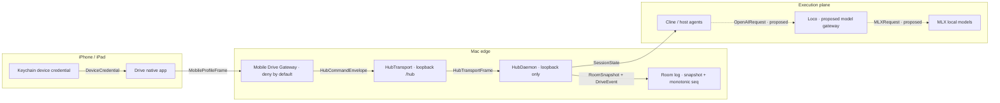
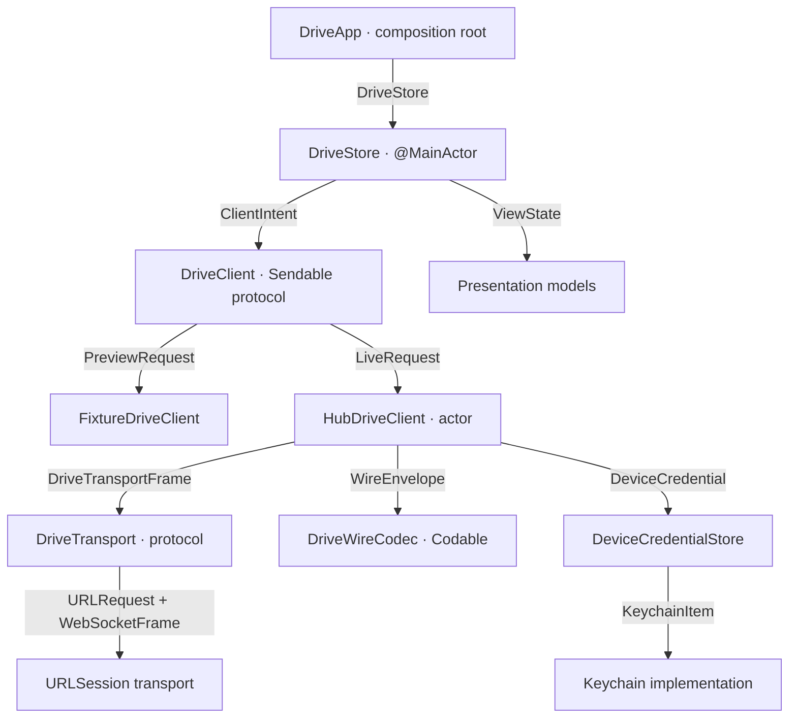
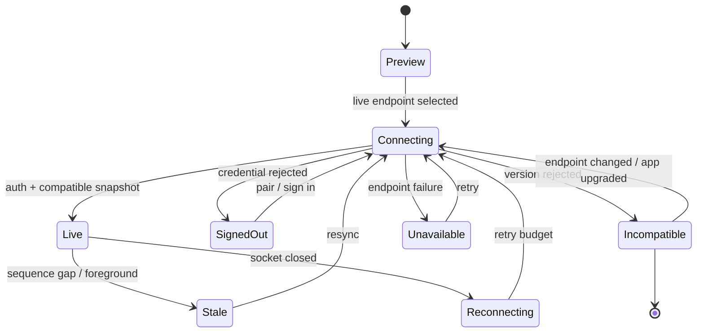

# ios-native-client · architecture

**Status:** proposed implementation architecture
**Parent:** [README.md](README.md)
**Delivery:** [delivery.md](delivery.md)
**Verification:** [testing.md](testing.md)

## One-line design

Build a native SwiftUI projection of a Drive room behind an async
`DriveClient` interface, and expose only a least-authority mobile profile
through a paired Mobile Drive Gateway. Hub remains the single writer; Cline and
its configured providers remain the current agent/model plane. Loco is a
separate proposed provider/subagent integration.

## Invariants

1. **One writer.** Native clients never reduce competing authoritative state or
   write a room log.
2. **One model boundary.** Model selection and provider credentials remain in
   Cline (and later Loco behind Cline if its separate integration lands). The
   app receives room facts, not provider keys.
3. **One semantic wire.** Local gateway and hosted path H share the same
   versioned room snapshot/event semantics.
4. **Least authority.** Mobile credentials authorize named capabilities and
   opaque workspace/room IDs, not arbitrary Hub commands or filesystem paths.
5. **Snapshot authority.** A complete snapshot plus room sequence is the
   convergence point after join, reconnect, foreground, gap, or version change.
6. **Honest state.** Preview, live, stale, reconnecting, incompatible, signed
   out, and unavailable are separate UI states.
7. **No hidden persistence.** Audio, transcript text, source snapshots, and
   model credentials are not persisted by default.

These invariants extend [ADR-0013](../../adr/ADR-0013-state-partition.md),
[ADR-0016](../../adr/ADR-0016-distribution-and-positioning.md), and
[ADR-0029](../../adr/ADR-0029-room-hotpath-redesign.md); they do not introduce
a second room writer.

## Why the existing sockets are not the mobile API

The core daemon `/hub` socket is a broad command dispatcher authenticated by a
daemon token. The dashboard `/browser` socket is a second, webview-oriented
protocol with desktop/settings commands and query-string `roomSecret`
support. Authentication on either surface does not create a deny-by-default
mobile command allowlist.

Direct exposure would give a phone more authority than it needs and creates
four concrete problems:

- the daemon token can reach session, provider, settings, MCP, filesystem, and
  other commands outside Drive glance;
- current endpoints are loopback `ws://`, not a physical-device TLS boundary;
- existing room commands can accept caller-provided `workspaceRoot`;
- dashboard bridging can drop the event tail from `call_get_room` and has
  room-ambiguous backpressure keys.

The source evidence is
[`sdk/packages/shared/src/hub.ts`](../../../../../../sdk/packages/shared/src/hub.ts),
[`drive-room-handlers.ts`](../../../../../../sdk/packages/core/src/hub/server/handlers/drive-room-handlers.ts),
[`browser-websocket.ts`](../../../../../../sdk/packages/core/src/hub/server/browser-websocket.ts),
and
[`apps/cline-hub/src/server/drive-calls.ts`](../../../../../../apps/cline-hub/src/server/drive-calls.ts).

## Runtime topology

_Provenance: current loopback daemon/auth implementation in
[`sdk/packages/core/src/hub`](../../../../../../sdk/packages/core/src/hub/),
accepted room semantics in
[ADR-0029](../../adr/ADR-0029-room-hotpath-redesign.md), and the separate
[Loco DriveCode port plan](https://github.com/harrison-quant-h2/loco/blob/main/docs/plans/04-cline-drivecode-port.md).
Both the Mobile Drive Gateway and dashed Loco edges are proposed new work._

The gateway is an edge adapter in the existing Cline Hub process or package,
not a second daemon, model router, MCP server, or room writer. It holds the
daemon credential on the Mac and maps a narrow mobile operation to one
allowlisted Hub command.

### Environment profiles

| Profile | Endpoint | Authentication | Notes |
|---|---|---|---|
| Preview | none | none | Deterministic fixtures; visibly labeled Preview. |
| Simulator development | Mac loopback gateway | injected short-lived test credential | Debug build only; direct daemon access is never the composition root. |
| Physical device, local | LAN/private-network gateway over WSS | one-time pairing → revocable Keychain credential | Requires a transport/pairing ADR and real-device threat tests. |
| Hosted path H | Internet WSS hosted writer | Cline account/device credential | Same room semantics; tenant, entitlement, and operations work remains under ADR-0032. |

## Is HTTP the right transport?

Yes, at the edge and with the right split.

| Mechanism | Use here | Decision |
|---|---|---|
| HTTPS | discovery, pairing, capabilities, health, finite snapshot requests | Use. |
| WSS | ordered events and request/reply frames while the app is active | Use first. |
| Unix domain socket | same-Mac process IPC only | Cannot connect an iPhone; retain existing loopback Hub transport. |
| XPC | future native macOS daemon ownership | Defer; irrelevant to iOS and the current Tauri workbench. |
| Network.framework / QUIC | custom cross-device transport | Defer until WSS measurements reveal a real problem. |
| MCP | model/tool interoperability | Never use as the room event bus. |

WSS is intentionally replaceable behind `DriveTransport`; the app does not
couple SwiftUI to URLSession.

## Apple module boundary

_Provenance: current composition in standalone
[`drive-ios`](https://github.com/drive-mode/drive-ios),
and the repository's existing port/conformance pattern in
[`sdk/packages/drive/src/hostPort.ts`](../../../../../../sdk/packages/drive/src/hostPort.ts)._

### Responsibilities

| Component | Owns | Must not own |
|---|---|---|
| SwiftUI views | rendering, navigation, user intent | sockets, JSON, model/provider state |
| `DriveStore` | screen state, selected room, connection truth, cancellable tasks | credentials, transport implementation |
| `DriveClient` | async room list/get/watch API and later scoped commands | concrete URLSession details |
| `HubDriveClient` actor | request IDs, sequence cursor, resync, reconnect policy | UI mutation outside the main actor |
| `FixtureDriveClient` | deterministic preview/test scenarios | implicit fallback from live failure |
| `DriveWireCodec` | versioned Codable envelopes and explicit decode failures | hand-authored alternate room semantics |
| `DeviceCredentialStore` | get/save/delete scoped device credential | provider/model secrets |
| Mobile Drive Gateway | authn/authz, workspace mapping, room filter, backpressure, audit | room state ownership or arbitrary command forwarding |

The initial client core is a small local `DriveKit` Swift package. Its value
is test and concurrency isolation now; macOS reuse is a later benefit, not the
reason to over-generalize it. If package creation plus app injection exceeds
the file limit, those land as two consecutive semantic PRs.

## Minimal mobile profile

The external profile wraps existing Hub room semantics but does not expose the
raw dispatcher.

| Capability | Hub mapping | Mobile constraint |
|---|---|---|
| `rooms:list` | `call_list_rooms` | Gateway injects a server-mapped workspace; client never supplies a path. |
| `room:get` | `call_get_room` | Authorized room only; reply always includes snapshot and mandatory `seq`. |
| `room:watch` | `room.snapshot` / `room.event` | Gateway filters by room and keys backpressure by room ID. |

Every request has a request ID. Every room message has a room ID and monotonic
sequence. Credentials are short-lived, device-bound, revocable, scoped, and
never placed in a URL.

Explicitly excluded from the read profile:

- `workspaceRoot` or any client-supplied filesystem path;
- provider keys, provider settings, MCP, plugins, desktop commands;
- session deletion, arbitrary run abort, terminal, file, or git operations;
- room mutations and approval responses.

Mutation scopes are added one at a time after B02: self hand state, self leave,
text steer, gate resolve, voice ingress, then any run control. Server policy is
authoritative even when the app UI hides a command.

## Contract strategy

The TypeScript/Zod definitions remain the source of truth. Swift uses native
`Codable`; it does not embed Node, bridge `HubUIClient`, or use a
TypeScript FFI.

1. Generate canonical JSON fixtures for supported request, reply, snapshot,
   event, and error cases from TypeScript.
2. Validate those fixtures against Zod in the Hub test suite.
3. Decode the identical files in Swift tests.
4. Re-encode supported Swift commands and validate them in TypeScript.
5. Fail closed to `incompatible` for unknown protocol versions.
6. Tolerate additive unknown fields inside a supported version.

The room directory must become a typed schema before native code treats it as a
contract; the current browser bridge's `unknown[]` is not sufficient.

## First-slice consistency algorithm

The first read-only slice avoids porting the complete TypeScript room reducer
into Swift.

1. `room:get` installs snapshot `N` and `lastSeq = N`.
2. A duplicate event with `seq <= lastSeq` is ignored.
3. A next event with `seq == lastSeq + 1` marks the projection dirty and
   schedules a coalesced authoritative `room:get` refresh.
4. A gap with `seq > lastSeq + 1` immediately marks the UI stale, disables
   mutations, and forces snapshot replacement.
5. Reconnect, Hub restart, foreground, and credential refresh also force
   snapshot replacement.
6. Native delta folding is introduced only if measured refresh cost or latency
   fails the production-work gate.

This trades some read traffic for correctness and a much smaller first client.
The gateway must coalesce invalidations and guarantee room-specific
backpressure so a busy room cannot replace another room's snapshot.

Before physical-device release, the mobile profile must explicitly distinguish
a continuous cursor from a snapshot replacement after retained history. Until
that field exists, any uncertain cursor is treated as replacement.

## Client state machine

_Provenance: ADR-0029 snapshot/delta contract and the app's requirement to
distinguish fixture, live, and failure states. State names are proposed._

Only `Live` may enable a capability authorized by the gateway. The B02 client
authorizes no mutations, so it remains read-only even while live.

## Lifecycle and concurrency

- `HubDriveClient` is an actor; request correlation, reconnect timers, and
  sequence cursors are isolated there.
- `DriveStore` is main-actor isolated and receives immutable presentation
  values.
- JSON/network work stays off the main actor.
- Swift task cancellation closes the associated wait or stream; it does not
  imply server-side run cancellation.
- On background, suspend the live stream and invalidate voice capture. On
  foreground, reconnect and replace from a snapshot.
- Mac sleep/wake, app background/foreground, Wi-Fi changes, and credential
  expiry are normal state transitions, not fatal crashes.
- Adopt Swift 6 strict concurrency in a dedicated PR after a green baseline;
  no `@unchecked Sendable` waiver without an inline rationale and test.

## Pairing and credential boundary

The physical-device flow requires its own proposed ADR before code:

1. Hub displays a one-time QR/deep link containing endpoint identity and a
   short-lived pairing challenge, not a reusable room secret.
2. The app proves the challenge over HTTPS.
3. Gateway issues a per-device, revocable credential with a capability set and
   opaque workspace mapping.
4. The app stores it in Keychain with the narrowest practical accessibility
   class.
5. Gateway records only what is required for device identity, expiry,
   revocation, and audit.
6. Unpairing deletes both server authorization and local credential.

The ADR must choose and test the local TLS identity approach: private-network
tunnel, Bonjour plus pinned gateway identity, or another design that does not
train users to accept arbitrary certificates. A broad ATS exception is
rejected.

## Privacy and guardrails

- Core daemon and dashboard remain loopback-only.
- Gateway parses a separate mobile schema and denies unknown operations.
- Error messages never include local paths, tokens, prompt bodies, or provider
  details.
- Logs redact authorization and pairing material.
- App storage may retain endpoint label, device identifier, user preferences,
  and a Keychain reference. Room content remains in memory for the first slice.
- Approval UI is disabled while stale and resolves a specific authoritative
  gate ID exactly once.
- Push, Live Activities, background audio, and cached transcripts are absent
  until separately designed and consented.

## macOS direction

Keep the existing Hub/Tauri surface as the Mac workbench. Do not add Catalyst
or a native macOS target merely because the Swift package can compile there.

Reconsider a small native Mac companion only if iOS evidence identifies a
distinct job such as menu-bar room status, native notifications, or
approval-only interaction. It would consume the same `DriveClient`; XPC or a
Unix socket becomes relevant only if that app takes responsibility for local
daemon lifecycle. That change requires a separate ADR.

## Rejected alternatives

- **Direct iPhone → Loco/model server:** leaks model authority and bypasses
  room policy/state.
- **Direct iPhone → core `/hub`:** daemon token authenticates too much
  authority.
- **Reuse dashboard `/browser`:** broad, webview-specific, and not a stable
  least-authority native contract.
- **Embed Node/TypeScript in iOS:** unnecessary runtime and review surface;
  contract fixtures provide interoperability.
- **Port the full reducer immediately:** high drift risk before measurements
  justify it.
- **Create a native macOS rewrite now:** duplicates mature desktop surfaces
  before the mobile client seam is proven.
