# ios-native-client · stacked delivery plan

**Status:** ready for implementation after workstation gate
**Architecture:** [architecture.md](architecture.md)
**Test strategy:** [testing.md](testing.md)
**Cross-device queue:** [multi-device/BACKLOG.md](../multi-device/BACKLOG.md)

## Delivery rule

Every change lands as a semantic, reviewable PR with **ten or fewer changed
files**. A child PR targets its parent while both are open. Before the parent
merges, retarget each open child to the parent's base (normally `main`); then
merge the parent and rebase the child onto the updated base. This prevents
GitHub from auto-closing a child when a merged parent branch is deleted.
Product status advances only from evidence in the relevant gate.

This plan separates four kinds of work that should not be hidden in one diff:

- Apple project/toolchain foundations;
- Swift client architecture;
- typed Hub/gateway contract and security;
- product capabilities and production-work measurement.

## Dependency map

```mermaid
flowchart LR
  P0["P0 · planning truth"] -->|Prerequisite| X0["X0 · Xcode baseline"]
  X0 -->|Prerequisite| X1["X1 · Swift 6"]
  X1 -->|Prerequisite| I1["I1 · client seam"]
  I1 -->|Prerequisite| G0["G0 · gateway ADR"]
  G0 -->|Prerequisite| C1["C1 · golden wire"]
  C1 -->|Prerequisite| G1["G1 · read-only gateway"]
  G1 -->|Prerequisite| I2["I2 · live transport"]
  I2 -->|Prerequisite| I3["I3 · B02 live glance"]
  I3 -->|Prerequisite| I4["I4 · recovery + lifecycle"]
  I4 -->|Prerequisite| G2["G2 · pairing service"]
  G2 -->|Prerequisite| I5["I5 · physical-device pairing"]
  I5 -->|Prerequisite| M1["M1 · hand + leave"]
  M1 -->|Prerequisite| M2["M2 · approvals"]
  M2 -->|Prerequisite| V1["V1 · voice"]
  I4 -->|Prerequisite| A1["A1 · accessibility + quality"]
  A1 -->|Decision input| MAC["MAC · native Mac decision"]
```



_Provenance: current fixture-only application, multi-device B02 priority,
accepted Hub single-writer decisions, and the four architecture/product/test
audits summarized in [README.md](README.md)._

## Stack protocol

For each slice:

1. Start from the last unmerged branch in this stack.
2. Name the branch with the slice ID and one outcome.
3. Make semantic commits; do not mix generated project changes with a feature
   unless Xcode requires them together.
4. Verify changed-file count before push:

   ```bash
   git diff --name-only <base>...HEAD | wc -l
   ```

5. Run the slice checks plus [testing.md](testing.md) gates.
6. Open the PR against the immediate parent branch and state that dependency.
7. Before merging a parent, retarget open children to the parent's base. Merge
   the parent, rebase children onto the updated base, rerun checks, and continue
   in dependency order.
8. Update [MATRIX.md](../multi-device/MATRIX.md) only when its evidence rule is
   met.

If a slice needs more than ten files, split by contract/adapter/UI or
production code/tests. Do not evade the rule by omitting tests.

## P0 · planning truth — this PR

**Branch:** `ios/01-native-live-client-plan`
**Intent:** document the native boundary, least-authority gateway, stack, and
evidence gates; correct fixture-only parity claims.

**Gate**

- Initiative index links this plan.
- Mermaid and Drive docs checks pass.
- Multi-device matrix says `wip` for fixture-only iOS cells.
- No app or runtime source changes.

## X0 · reproducible Xcode baseline

**Suggested branch:** `ios/02-xcode-test-baseline`
**PR title:** `build(ios): establish simulator test baseline`

**Scope**

- Install/select the latest stable full Xcode supported by the project.
- Record `xcodebuild` commands in the app README.
- Add shared scheme plus unit and UI-test targets.
- Add one unit smoke test and one launch/navigation UI smoke test.
- Add a pinned macOS/Xcode CI job or document the exact runner if CI
  credentials are not yet available.
- Keep code signing optional for Simulator.

**Gate**

- Headless unsigned Simulator build succeeds.
- Unit and UI smoke tests run from the command line.
- CI watches `apps/drive-ios/**`.
- The PR records exact Xcode, Swift, simulator, and destination versions.

## X1 · Swift 6 concurrency baseline

**Suggested branch:** `ios/03-swift6-concurrency`
**PR title:** `build(ios): enable Swift 6 strict concurrency`

**Scope**

- Move the target from Swift 5 mode to Swift 6.
- Enable complete concurrency checking.
- Make current fixture navigation/tasks cancellable and actor-correct.
- Do not add networking.

**Gate**

- Zero strict-concurrency errors.
- No blanket `@unchecked Sendable`, warning suppression, or global mutable
  escape.
- Existing fixture journey remains visually and behaviorally unchanged.

## I1 · injectable client and presentation seam

**Suggested branch:** `ios/04-drive-client-seam`
**PR title:** `refactor(ios): inject Drive client and store`

**Scope**

- Make `DriveApp` the composition root.
- Add a main-actor `DriveStore`.
- Define an async, Sendable, initially read-only `DriveClient`.
- Add `FixtureDriveClient`; move global `DemoData` reads behind fixture
  presentation values.
- Extract a small local `DriveKit` package for the client protocol, fixtures,
  and tests. If package creation plus app injection exceeds ten files, split
  I1 into two consecutive semantic PRs.
- Previews inject fixtures and never open sockets.

**Gate**

- The same `ContentView` can run against an injected fixture or test spy.
- Views do not reference `DemoData` or networking APIs.
- Fixture failures never silently replace live failures.
- Package tests run independently if `DriveKit` is extracted.

## G0 · decide the Mobile Drive Gateway

**Suggested branch:** `architecture/36-mobile-drive-gateway`
**PR title:** `docs(architecture): decide the mobile Drive gateway`

**Scope**

- Add a proposed ADR covering gateway placement, external profile, local TLS
  identity options, pairing, credential scopes, workspace mapping,
  subscription filtering, backpressure keys, and path H parity.
- Threat-model direct `/hub`, `/browser`, URL secrets, raw paths, replay,
  cross-room leakage, certificate failure, and revocation.
- Decide whether the first physical-device route uses a private-network tunnel
  or a locally pinned gateway identity.

**Gate**

- Security review agrees the core daemon remains loopback-only.
- External operations are deny-by-default and path-free.
- Credential lifecycle and revocation are testable.
- No gateway code lands while the ADR remains materially undecided.

## C1 · canonical mobile wire contract

**Suggested branch:** `protocol/01-mobile-drive-golden-contract`
**PR title:** `test(drive): publish native mobile wire fixtures`

**Scope**

- Start from the accepted G0 external profile, not the broad internal Hub
  dispatcher.
- Type the room directory instead of forwarding `unknown[]`.
- Define the supported mobile subset of v1 request/reply/event envelopes.
- Generate golden JSON for room list, room get, snapshot, event, duplicate,
  gap, unsupported version, authorization error, and malformed payload.
- Validate the fixtures with repository Zod schemas.
- Decode/encode the same fixtures in Swift tests.

**Gate**

- G0 is accepted before the external profile is frozen.
- TypeScript→JSON→Swift and Swift→JSON→TypeScript paths pass.
- Every room message has room ID and sequence.
- Unknown protocol version produces an explicit incompatible state.
- Additive unknown fields in v1 do not crash the client.

## G1 · read-only development gateway

**Suggested branch:** `gateway/01-readonly-mobile-profile`
**PR title:** `feat(hub): add read-only mobile Drive profile`

**Scope**

- Add `rooms:list`, `room:get`, and room-filtered `room:watch`.
- Map an opaque workspace ID to a server-owned path.
- Require request IDs, room IDs, and sequence numbers.
- Key coalescing/backpressure by room.
- Inject the daemon token internally; never return it.
- Bind loopback only in this slice and use an injected development credential.

**Gate**

- Unknown operations and raw paths are rejected.
- Attempts to call providers, MCP, settings, session deletion, files, tools, or
  desktop commands fail authorization tests.
- Two busy rooms cannot replace each other's snapshots.
- Core and dashboard listeners remain loopback-only.

## I2 · native live transport

**Suggested branch:** `ios/05-readonly-live-transport`
**PR title:** `feat(ios): connect to the read-only Drive gateway`

**Scope**

- Implement `HubDriveClient` actor, `DriveTransport`, URLSession HTTP/WSS
  adapter, request correlation, cancellation, and wire decoding.
- Add explicit Preview, connecting, live, stale, reconnecting, incompatible,
  signed-out, and unavailable states.
- Connect Simulator to G1 through dependency-injected debug configuration.
- No room mutations.

**Gate**

- Fixture and live clients pass the same client contract suite.
- Network/JSON work is off the main actor.
- Cancellation, timeout, and socket close are distinguishable.
- B02 cannot send an unapproved command even through a crafted UI action.

## I3 · B02 live glance

**Suggested branch:** `ios/06-live-room-glance`
**PR title:** `feat(ios): render live Drive room glance`

**Scope**

- Replace fixture room directory and selected-room snapshot with live
  presentation values.
- Show roster, current work/Spotlight summary, status, and freshness.
- Treat room events as coalesced invalidations and refresh authoritative
  snapshots; do not port the full reducer yet.
- Keep Preview selectable for demos and tests.

**Gate**

- A real planner/implementer coding session appears on Home and Call.
- UI never labels cached/fixture/stale values Live.
- Ten-minute event activity does not lose room identity or sequence.
- Multi-device F01 advances only when Simulator evidence is attached.

## I4 · reconnect, gaps, and app lifecycle

**Suggested branch:** `ios/07-room-recovery`
**PR title:** `feat(ios): recover Drive room state across lifecycle changes`

**Scope**

- Handle duplicates, sequence gaps, retained-history replacement, gateway and
  Hub restart, background/foreground, Mac sleep/wake, and retry budget.
- Coalesce snapshot invalidations and cancel obsolete work.
- Add a measured decision: keep snapshot refresh or introduce a minimal native
  reducer in a separate future PR.

**Gate**

- No invented intermediate state after a gap.
- Foreground always reauthorizes and replaces from an authoritative snapshot.
- Concurrent rooms remain isolated under pressure.
- Long production-work scenario records reconnect time, refresh rate, memory,
  energy, and event-to-render latency.

## G2 · pairing and physical-device edge

**Suggested branch:** `gateway/02-device-pairing`
**PR title:** `feat(hub): pair scoped mobile Drive devices`

**Scope**

- Implement the accepted G0 pairing flow, expiry, revocation, scope checks, and
  audit.
- Add WSS and the selected local endpoint identity.
- Add QR/deep-link bootstrap without reusable credentials in the URL.
- Keep daemon/dashboard loopback-only.

**Gate**

- Unpaired, expired, replayed, revoked, wrong-room, and wrong-workspace
  credentials fail.
- TLS/certificate failure cannot be bypassed in a release build.
- Logs and URLs contain no credential.

## I5 · physical iPhone pairing

**Suggested branch:** `ios/08-paired-device`
**PR title:** `feat(ios): pair with a local Drive gateway`

**Scope**

- Add pairing scanner/deep-link flow and Keychain credential storage.
- Add Local Network and Bonjour declarations only if selected by G0.
- Exercise device loss, unpair, certificate rotation, network transition, and
  background recovery.

**Gate**

- A physical iPhone joins a real session through authenticated WSS.
- Removing the device on Mac makes the next request fail and clears local
  live state.
- No broad ATS exception, query-string secret, provider key, or daemon token.

## M1 · self controls

**Suggested branch:** `ios/09-self-controls`
**PR title:** `feat(ios): add scoped hand and leave controls`

**Scope**

- Add raise/lower hand and leave-without-loss as separate gateway scopes and
  client methods.
- Attach command IDs and authoritative receipts.
- Keep run abort and end-room absent.

**Gate**

- Duplicate/retried commands are idempotent.
- A device can mutate only its paired human participant in an authorized room.
- Leave never means end.

## M2 · approval gate

**Suggested branch:** `ios/10-approval-gates`
**PR title:** `feat(ios): resolve authoritative Drive approvals`

**Scope**

- Fetch complete gate context, display blast radius, and resolve a named gate
  once.
- Disable actions while stale or after expiry/resolution.
- Add allow-once and deny first; persistent policy changes remain desktop-only.

**Gate**

- No stale, replayed, cross-room, or already-resolved gate can execute.
- Server policy remains authoritative.
- VoiceOver completes the full approval journey.

## V1 · muted-on-join voice

**Suggested branch:** `ios/11-hold-to-talk`
**PR title:** `feat(ios): add privacy-safe hold to talk`

**Scope**

- Request microphone permission at intent time.
- Start muted; press/hold admits text only after STT succeeds.
- Select local/cloud STT legally under the active deployment profile.
- Keep raw audio out of Hub events and persistent logs.

**Gate**

- Denied permission has a complete text fallback.
- Backgrounding stops capture immediately.
- Local profile never uses platform-cloud Web Speech.
- Voice ingress is mute-gated and attributed to the paired human.

## A1 · accessibility and release quality

This can branch after I4 and merge before physical beta.

**Scope**

- Dynamic Type including accessibility sizes.
- VoiceOver labels/order; minimum 44-point controls.
- Correct contrast, light/dark, Reduce Motion, smallest supported iPhone,
  iPad, portrait, and landscape.
- App icon, signing configuration documentation, localization foundation.
- Instruments baselines for launch, memory, energy, animation, and long room
  sessions.

**Gate**

- The journeys in [testing.md](testing.md) pass with assistive settings.
- Baselines are stored and later PRs fail on agreed regressions.

## MAC · native macOS decision

Do not start this as an implementation stack. Write a short decision record
only after I4/A1 evidence answers:

- Is there a menu-bar, notification, or approval job the Hub/Tauri app cannot
  satisfy?
- Is the Swift client core stable across local and hosted endpoints?
- Would Catalyst distort the phone composition?
- Does a native app need daemon lifecycle ownership, implying XPC/UDS?

Default: keep Hub/Tauri as the Mac workbench and reuse no UI merely for parity.

## Merge order and status updates

- Merge P0, X0, X1, I1, G0, C1, G1, I2, I3, I4 in dependency order.
- G2/I5 may begin only after G0 is accepted and I4 is green.
- M1, M2, and V1 remain separate authority expansions.
- A1 can progress beside G2 once I4 stabilizes the view models.
- Update B02 and F01 only after I3 evidence; update F06/F07 after M1, F03
  after M2, and F04/F05 after V1.
- Never mark `done` from screenshots or fixture/UI presence alone.
