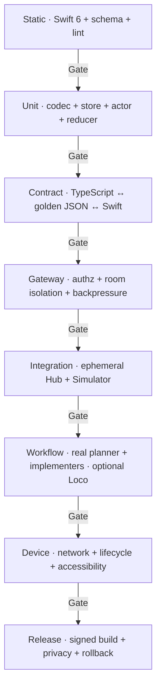

# ios-native-client · testing and production-work evaluation

**Status:** required gates
**Architecture:** [architecture.md](architecture.md)
**Delivery:** [delivery.md](delivery.md)

## Quality thesis

The client is successful when it makes real local-agent coding work easier to
observe and control, not when it merely passes a synthetic model benchmark.
Tests therefore combine deterministic contract/security checks with repeated
production-work scenarios using the same planner/implementer workflows the
owner runs from Cline first and, once their separate adapters land, Cursor,
Claude, Codex, or `jcode.sh`.

Model quality and token speed are recorded as runtime context, while native
client quality is judged on truth, latency, recovery, authority, accessibility,
and energy use.

## Test layers



_Provenance: repository conformance patterns in
[`sdk/packages/drive/src/conformance`](../../../../../../sdk/packages/drive/src/conformance/),
Hub transport tests, and the production-work evaluation goal for Loco._

## Gate matrix

| Layer | Runs on each PR | Runs before physical beta | Evidence |
|---|---|---|---|
| Swift build | affected iOS PR | yes | pinned Xcode destination and log |
| Swift unit tests | affected iOS PR | yes | result bundle |
| Swift UI smoke | UI/project PR | yes | result bundle + failure screenshots |
| TypeScript schema/golden tests | wire/gateway PR | yes | Bun test output |
| Gateway authorization | gateway PR | yes | allow/deny matrix |
| Hub↔gateway↔Swift integration | transport onward | yes | ephemeral-run trace |
| Production-work pack | B02 onward | yes | redacted run record |
| Physical-device matrix | pairing onward | yes | device/OS/network record |
| Accessibility | UI capability PR | yes | VoiceOver/Dynamic Type checklist |
| Instruments | recovery/release PR | yes | baseline summary, not raw private data |
| Docs/Mermaid | documentation PR | yes | docs gate output |

## Deterministic contract suite

Golden fixtures are generated from and validated by the TypeScript/Zod source
of truth, then consumed unchanged by Swift.

Required fixture cases:

- empty and populated room directory;
- authoritative room snapshot at sequence N;
- next event N+1;
- duplicate event N;
- gap N+2;
- `call_get_room` with event tail;
- retained-history replacement;
- two rooms with overlapping sequence values;
- malformed payload and missing required sequence;
- unsupported protocol version;
- unauthorized, expired, revoked, and wrong-room credentials;
- server unavailable, timeout, and cancellation.

Contract assertions:

1. Swift decodes every supported valid fixture.
2. Swift rejects missing identity/sequence and unknown top-level versions.
3. Swift tolerates additive fields in supported v1 payloads.
4. Swift-encoded requests validate against Zod.
5. Gateway never forwards a raw `workspaceRoot`.
6. Room-specific backpressure cannot replace another room's snapshot.
7. Redaction tests prove credentials, paths, provider data, prompts, and source
   contents are absent from diagnostic output.

## Swift unit and concurrency suite

### `DriveWireCodec`

- request/reply correlation;
- error decoding without leaking server internals;
- version negotiation and capability decoding;
- large-but-valid payload boundary;
- invalid UTF-8/JSON and cancellation.

### `HubDriveClient` actor

- one in-flight request per ID;
- reply before/after timeout race;
- task cancellation versus socket close;
- duplicate event idempotence;
- next event invalidates once;
- event burst coalesces snapshot refreshes;
- gap enters stale before refresh;
- reconnect and foreground replace state;
- room A and room B keep independent cursors;
- retry budget terminates in unavailable instead of looping forever.

### `DriveStore`

- all state mutation is main-actor isolated;
- preview never reports Live;
- stale/incompatible/signed-out disable every mutation;
- changing endpoint cancels old work and clears incompatible state;
- selecting another room cannot display the prior room snapshot;
- leave does not end a room;
- gate resolution is exactly once when that feature lands.

### Swift 6 policy

- complete concurrency checking is required;
- no blanket `@unchecked Sendable`;
- no detached task without ownership/cancellation rationale;
- no network or JSON decode on the main actor;
- Thread Sanitizer runs on focused store/client tests where supported.

## Gateway security suite

The gateway test harness starts with no capabilities and adds one scope per
case.

### Read profile allowlist

- allow `rooms:list` only for the credential's server-mapped workspace;
- allow `room:get` and `room:watch` only for an authorized room;
- require request ID and room sequence;
- reject arbitrary Hub command names;
- reject client paths and unknown payload fields where they alter authority.

### Mandatory deny cases

- provider/account/API-key settings;
- MCP, plugins, skills, hooks, desktop commands;
- file, terminal, git, and tool execution;
- session delete, arbitrary run abort, room end;
- a different workspace or room;
- replayed pairing challenge;
- expired/revoked credential;
- missing/bad TLS identity;
- credential in query string;
- downgrade from WSS in a release profile.

### Mutation expansion

Each later scope gets a dedicated matrix:

- hand state: self only;
- leave: paired human in current room only;
- text steer: current session/room with idempotency key;
- approval: named unresolved gate, visible blast radius, once only;
- voice text ingress: paired human, mute-gated;
- run control: absent until separately decided.

Security tests run against both local gateway and hosted path H adapters when
the hosted writer exists.

## Integration harness

The integration runner should launch:

1. an isolated Hub with a temporary workspace and room log;
2. the loopback development Mobile Drive Gateway;
3. a deterministic paired test device;
4. the iOS Simulator app with injected endpoint;
5. an optional fake or local Loco profile after the separate DriveCode adapter
   exists.

The harness records command IDs, room ID hash, sequence, payload byte count,
gateway decision, connection state, and timestamps. It does not record tokens,
source, prompt bodies, transcript text, credentials, or raw audio.

Required integration cases:

- empty room then first live room;
- join snapshot and sustained event activity;
- Hub restart and gateway restart independently;
- app background/foreground;
- Mac sleep/wake where automation permits;
- network loss during snapshot and during event stream;
- two concurrent rooms and an event storm;
- malformed/unsupported gateway reply;
- credential expiration during an active room;
- fixture→live→fixture switching with no data bleed.

## Production-work scenario pack

These are actual coding jobs against disposable or approved test repositories.
Each run records the exact runtime profile so models remain swappable.

### W1 · planner + one implementer

Start a normal feature task through the preferred host. Seat one planner and
one implementer. Before the Loco adapter lands, use equivalent Cline-configured
models; afterward, use Loco aliases such as `local-planner` and
`local-implementer`.

Verify the phone shows:

- room arrival and correct participants;
- planner work followed by implementer work;
- current task/stage changes;
- completion or blocked state;
- leave and return without losing the room.

### W2 · planner + parallel implementers

Run two to four implementation agents against isolated worktrees. Use a task
with meaningful tool activity, tests, and a merge/review step.

Verify:

- event bursts do not freeze or reorder the UI;
- agent/room identity remains correct;
- snapshot refreshes are coalesced;
- gateway and app memory stabilize;
- model throughput pressure does not cause cross-room data loss.

### W3 · model swap behind Loco

After the separate Loco adapter lands, run the same bounded coding task twice
while swapping the Loco model mapping (for example, a candidate planner or
implementer model). Do not alter the iOS endpoint or build.

Verify:

- client behavior is model-agnostic;
- run record captures model ID, quantization, backend, context, input/output
  token rate, and concurrency;
- quality differences are visible in task outcome, retries, gate count, and
  elapsed work—not misattributed to mobile transport.

### W4 · interruption and approval

After M1/M2, raise a hand during a tool sequence, then resolve an approval with
a known blast radius.

Verify:

- the interrupt targets the correct room/human;
- stale/replayed gate actions cannot execute;
- the server receipt updates the phone exactly once;
- denying a gate leaves an understandable next state.

### W5 · adverse lifecycle

During W1 or W2, background the app, change Wi-Fi, sleep/wake the Mac, restart
Hub, and revoke/re-pair the device.

Verify:

- no stale state is labeled Live;
- no command is duplicated;
- reconnect converges from an authoritative snapshot;
- revoked credentials stop access immediately enough for the accepted ADR.

### W6 · long local session

Run a real multi-agent coding session long enough to include compaction, tests,
review, and at least one blocked/recovery cycle.

Verify:

- sequence and room identity remain correct;
- memory/energy/network curves are bounded;
- return-to-session remains useful;
- event-only presentation loss from snapshot refresh is measured and logged as
  a reducer decision input.

## Run record

Store a redacted Markdown or JSON record outside private source logs with:

| Group | Fields |
|---|---|
| Build | commit, PR, Xcode, Swift, app configuration, device/OS |
| Runtime | Hub/gateway commits, local/hosted profile |
| Models | role alias, resolved model ID, quantization, backend, context |
| Agents | planner/implementer count, max concurrent requests |
| Work | scenario ID, repo fixture, task outcome, tests, retries, gates |
| Model speed | prompt/input tok/s, output tok/s, time to first token, aggregate tok/s |
| Drive path | room events, gaps, snapshots, refreshes, bytes |
| Mobile | time to useful room, event-to-render, reconnect, memory, energy, crashes |
| Safety | auth denials, stale action attempts, redaction result |

Never store credentials, unredacted prompts, proprietary source, transcript
text, or raw audio in the evaluation artifact.

## Performance methodology

Separate model/runtime latency from client latency:

```text
host intent
  → model queue / prefill / decode
  → tool and Hub commit
  → gateway receive / filter / send
  → iOS receive / decode / store / render
```

Capture timestamps at each observable boundary. Report:

- model time-to-first-token and input/output tokens per second;
- Hub commit-to-gateway send;
- gateway send-to-iOS receive;
- iOS receive-to-visible update;
- snapshot request rate, bytes, and coalescing ratio;
- reconnect-to-useful-snapshot;
- main-thread hangs/hitches;
- app and gateway memory high-water marks;
- device energy impact for active and backgrounded states.

I3/I4 establish baselines with at least three repeat runs per workflow. Later
PRs fail when a median or p95 metric regresses more than the agreed threshold
(default review trigger: 20%) without an accepted explanation. Security,
correctness, and stale-state failures are zero-tolerance and cannot be traded
for speed.

Native delta folding is approved only if measurements show snapshot
invalidation is materially harming latency, bandwidth, energy, or event
fidelity. The decision must include before/after workflow records.

## Accessibility and device matrix

Current fixture audit identified fixed-point type, sub-44-point controls, low
contrast, always-on navigation motion, portrait-only configuration, and no
real app icon. These are release blockers, not cosmetic follow-ups.

Required matrix:

- smallest supported iPhone, current standard iPhone, and iPad;
- portrait and landscape;
- light and dark appearance;
- Dynamic Type through accessibility sizes;
- VoiceOver Open→Home→Call→Approval→Leave;
- Reduce Motion and Increase Contrast;
- denied Local Network, camera, microphone, and notification permissions;
- Wi-Fi only, Wi-Fi transition, and hosted cellular path where available.

Every interactive target is at least 44×44 points. Information cannot depend
on color alone. A release build must not ship a fixture Reduce Motion toggle
that disagrees with the system preference.

## Command baseline

X0 must replace the destination names below with pinned available values and
prove them in CI:

```bash
xcodebuild -version
xcodebuild -project apps/drive-ios/Drive.xcodeproj -scheme Drive -showdestinations
xcodebuild -project apps/drive-ios/Drive.xcodeproj -scheme Drive -destination 'platform=iOS Simulator,name=<pinned simulator>' build
xcodebuild -project apps/drive-ios/Drive.xcodeproj -scheme Drive -destination 'platform=iOS Simulator,name=<pinned simulator>' test
```

If `DriveKit` is extracted:

```bash
swift test --package-path apps/drive-ios/Packages/DriveKit
```

Repository contract/docs gates:

```bash
bun run check:drivecode-docs
bun run test:drivecode-docs
bun sdk/scripts/validate-mermaid.ts docs/drivecode/plans/cline-drivemode/initiatives/ios-native-client/README.md
bun sdk/scripts/validate-mermaid.ts docs/drivecode/plans/cline-drivemode/initiatives/ios-native-client/architecture.md
bun sdk/scripts/validate-mermaid.ts docs/drivecode/plans/cline-drivemode/initiatives/ios-native-client/delivery.md
bun sdk/scripts/validate-mermaid.ts docs/drivecode/plans/cline-drivemode/initiatives/ios-native-client/testing.md
```

## Baseline status

X0 and X1 are now proven in GitHub CI: the shared scheme builds and runs its
unit and UI tests on Xcode 26.6 with an iPhone 17 Pro Simulator, and all targets
compile in Swift 6 language mode with complete concurrency checking. Local
contributors still need to select a full Xcode installation with
`DEVELOPER_DIR` or `xcode-select`; a shell pointed at Command Line Tools alone
cannot run the Simulator suite. Swift-package, live-Hub, physical-device, and
production-work gates remain unclaimed until their delivery slices land.

## Release gate

Physical beta requires all of the following:

- reproducible signed physical-device and unsigned Simulator builds;
- contract, gateway authorization, integration, and production-work packs
  green;
- accepted Mobile Drive Gateway/pairing ADR;
- authenticated WSS and Keychain credential with tested revocation;
- zero provider/model secrets, daemon tokens, URL credentials, or raw paths;
- stale and incompatible states fail closed;
- accessibility/device matrix green;
- Instruments and long-session baselines recorded;
- a documented rollback to fixture-only app and/or gateway disable switch.
