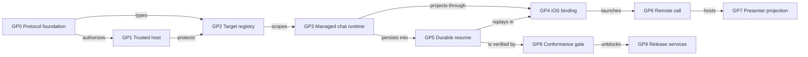

# portfolio-now · golden-path implementation map

**Status:** active
**Purpose:** one dependency-backed execution map for the architecture work that
turns the shipped Drive protocol seams into a connected user journey. Delivery
status remains authoritative in
[`claims-registry.yaml`](../../delivery/claims-registry.yaml); this initiative
orders those claims and defines their acceptance evidence.

**Related:** [reference architecture](../../../../reference/architecture.md),
[mobile consumer](../mobile-consumer/), [multi-device](../multi-device/),
[iOS native client](../ios-native-client/), [room hot path](../drive-hotpath/),
[ADR-0037 sensing](../../adr/ADR-0037-invocation-scoped-sensing.md)

## Happy path and golden path

The happy path is the ideal user journey:

> Open Drive → establish trust → choose a target → start or resume a managed
> chat → receive typed work events → approve or redirect → optionally start a
> call and grant Presenter → leave → resume without losing durable work.

The golden path is the supported, observable, and recoverable implementation
route that makes that journey dependable. It proves one real vertical slice
across iOS, the Cline host, the writer contract, durable storage, and agent
execution before expanding the surrounding surfaces.

## Architecture dependency map

Caption: solid arrows are hard delivery dependencies. A task may be developed
in parallel, but it cannot be accepted before its incoming dependencies pass.

Six-system tags keep each task honest: **P** people, **D** data, **H** hardware,
**S** software, **Pr** process, and **N** network.

## Now · prove one connected vertical slice

| Task | Claim | Owner | Systems | Depends on | Acceptance evidence |
|---|---|---|---|---|---|
| **GP0 Protocol foundation** | `claim:drv-golden-path-contract` | Protocol maintainers | D, S, Pr | — | Lifecycle and title fixtures pass in Cline, collaboration-harness, and drivemode-mcp; leave/end cleanup and coordinator-idempotent end agree. |
| **GP1 Trusted host** | `claim:drv-host-trust` | Cline host + security | P, D, S, Pr, N | GP0 | A fresh client pairs with an authenticated host, stores the credential in platform secure storage, reconnects after restart, and cannot mutate another workspace. |
| **GP2 Target registry** | `claim:drv-target-resolution` | Cline host | D, S, N | GP0, GP1 | The host resolves opaque repository/folder references, returns access posture and connection state, rejects stale grants, and never exposes raw host paths unnecessarily. |
| **GP3 Managed chat runtime** | `claim:drv-managed-chat` | Cline runtime | P, D, S, Pr, N | GP2 | Create/list/send/cancel/resume operate against a real conversation catalog; assistant output, approval requests, failures, and terminal state arrive as ordered typed events. |
| **GP4 iOS managed-chat binding** | `claim:drv-ios-managed-chat` | drive-ios | P, H, S, N | GP3 | Work opens to the selected target, sends through the managed runtime, renders live assistant/work events, exposes truthful offline/error states, and never substitutes seeded data. |
| **GP5 Durable resume** | `claim:drv-return-loop` | Hub persistence | D, S, Pr, N | GP3, GP4 | Kill and restart host and client; reconnect from a cursor without duplicates or gaps, restore the conversation and approvals, and label any expired transient state. |
| **GP8 Cross-repo conformance** | `claim:drv-cross-repo-conformance` | Release engineering | P, D, H, S, Pr, N | GP1–GP5 | One `drive-dev` scenario boots deterministic fixtures and verifies schemas, event folds, auth refusal, reconnect, target loss, chat completion, and cleanup across all four repositories. |

### Now exit gate

A reviewer can complete the golden path against a synthetic repository from a
fresh install without source edits, local-only fake state, manual database
seeding, or knowledge of a developer port. The same evidence bundle must show
the normal journey, permission denial, host loss, retry, and resume.

## Next · add live collaboration

| Task | Claim | Owner | Systems | Depends on | Acceptance evidence |
|---|---|---|---|---|---|
| **GP6 Remote call binding** | `claim:drv-remote-call-binding` | Cline host + clients | P, D, H, S, N | GP4, GP5 | Default preset and configurator join the real room; roster, leave/end, reconnect, and call history are host-authoritative. |
| **GP7 Native Presenter projection** | `claim:drv-presenter-native` | Cline + drive-ios | P, D, H, S, Pr, N | GP6 | Exclusive, expiring grants transfer/revoke through the coordinator; Spotlight projects typed `stage` events; Presenter-specific conformance passes; no pixel capture; the signed Director descriptor is fetched rather than fabricated locally. |

## Release · prove production truth

| Task | Claim | Owner | Systems | Depends on | Acceptance evidence |
|---|---|---|---|---|---|
| **GP9 Release services** | `claim:drv-release-services` | Account, data, and iOS release owners | P, D, H, S, Pr, N | GP8 | Real auth/deletion, Billing/Usage/Analytics projections, consent, privacy manifest, reviewer tenant, accessibility evidence, and the App Store release gates agree with production behavior. |

## Later · valuable, not a golden-path dependency

| Work | Why later / entry condition |
|---|---|
| Invocation-scoped sensing from Cline #15 / ADR-0037 | Preserve the Proposed decision, but keep it non-selectable and write no runtime sensor code until the ADR is accepted and a denylist, visible per-session arming, union-wide forbidden-field guard, retention policy, and audit tooling exist. |
| Downloadable Core AI/MLX coding models | Revisit after the bounded Apple system-model spike is validated on supported hardware. |
| Automatic A/B testing | Requires consent, stable assignment, exposure/outcome events, guardrails, and a data-policy revision. |
| Showcase expansion and hosted feedback | Does not unblock target-aware chat, resume, or call coordination. |
| Multi-region cloud optimization | Start only after production traffic and SLOs identify a real bottleneck; keep the first hosted topology simple. |

Merging Cline #15 records a design option; it does **not** authorize collection,
background sensing, or runtime implementation.

## Delivered foundation and superseded queue

The previous consumer-path sequencer proved the native/PWA shell: `?app=1`,
hold-to-talk, compact call strip, landscape, raise hand, leave-without-loss,
Safari STT, Preview labeling, PWA metadata, Browse lite, mobile diagrams, and the
standalone iOS smoke loop. Those tasks remain historical evidence and are not
reopened here.

Two old open rows are subsumed rather than duplicated:

- `NOW-IOS-GLANCE` → **GP4 iOS managed-chat binding**.
- `NOW-HOTPATH-D5` → **GP1 Trusted host**, **GP3 Managed chat runtime**, and
  **GP6 Remote call binding**.

The Status Hub `?demoPlans=1` fixture still renders those historical `NOW-*`
IDs. It is a showcase, not the current delivery board, until it projects the
claims registry.

This is the zero-sum scope trade: sensing, Showcase, App Store submission, and
cloud optimization stay out while GP1–GP5 and GP8 prove the core journey.

## Operating the map

1. Select work only from a claim in the registry; do not mint a parallel task
   list or re-seed the historical DriveKanban graph.
2. Update the claim first when status changes. `verified_shipped` requires a
   real repository evidence path and command under ADR-0026.
3. Keep each PR on one dependency edge or one vertical acceptance scenario.
4. A UI seam may be `active_partial`; it is not complete until the named host,
   persistence, security, and failure evidence passes.
5. Reflect device capability changes in the multi-device matrix, but keep this
   file as the only sequencer for the golden-path implementation.

## Hand back

Start with **GP1 Trusted host** and **GP2 Target registry** in parallel with the
test harness for **GP8**. Once those contracts are stable, drive **GP3 → GP4 →
GP5** as one end-to-end slice. Do not pull GP6, GP7, GP9, or sensing into Now
unless they unblock that slice.
