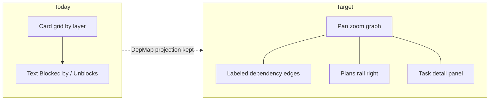
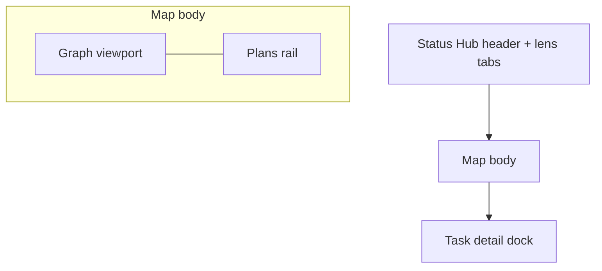
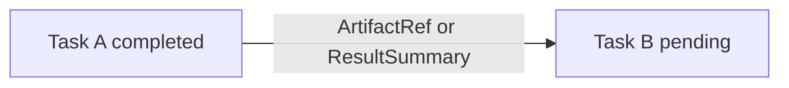

# Status Hub Dependency map · UX experience

Product experience for [DRV-DEP-MAP](../../features/DRV-DEP-MAP.md). Grounded in the shipped lens (`status-view.tsx` + `dependency-map.tsx` + `buildDependencyMap`), which today is a **two-column card list** with a text detail aside — not a spatial graph.

## Jobs to be done

1. **See the chain** — understand prerequisite order without reading every card.
2. **Trace the handoff** — know what artifact / result flows along an edge.
3. **Group by plan** — spot which tasks belong to which plan without leaving the map.
4. **Inspect one task** — open details without losing graph context.

## Current → target

Caption:

- Pure `buildDependencyMap()` stays the topology source; UI grows viewport + annotations.
- Team runtime remains the writer; Status Hub still only transports and presents.
- Plans and edge artifacts are **optional annotations** on the projection — missing data never invents membership or labels.

## Composition (first viewport)

One Status Hub page, Dependency-map lens active:

| Region | Role | Rules |
|---|---|---|
| **Graph viewport** | Spatial DAG of task nodes + edges | Full remaining width left of the rail; pan / zoom / scroll live here |
| **Plans rail** | List of plans with color swatches | Fixed right column (~240–280px); never overlays nodes |
| **Task detail** | Selected-node inspector | Dock below the map (default) or slide-over on narrow widths; does not cover the rail |

Hero budget for this lens: graph + plans rail + optional one-line map summary (“N tasks · B blocked · R ready”). No second dashboard of stats inside the viewport.

## Graph viewport

### Spatial model

- **Layout:** left-to-right layers from `DependencyNode.layer` (prerequisites on the left, dependents on the right). Vertical order within a layer stays deterministic (title, then key) so screenshots and tests stay stable.
- **Nodes:** compact chips (title + status glyph). Not large marketing cards. Status color follows existing Status Hub state language; **plan color** is a separate accent (left edge or ring).
- **Edges:** bezier or orthogonal polylines from prerequisite → dependent. Arrowheads point toward the dependent (work flows forward).
- **Integrity:** cyclic / missing-ref nodes keep today’s warning banner; cycle edges use a distinct stroke (dashed destructive) so topology stays honest.

### Navigation

| Input | Behavior |
|---|---|
| Drag on empty canvas / middle-drag | Pan |
| Wheel over viewport | Zoom toward cursor (with ctrl/meta if the host needs unmodified wheel for page scroll) |
| Pinch | Zoom |
| `+` / `−` buttons | Discrete zoom |
| `Fit` | Frame all nodes (or selection if any) |
| Trackpad scroll when zoomed out past fit | Scroll the page / outer container — do not fight the host |
| Click node | Select + open detail |
| Click empty canvas | Clear selection (keep plan filter if any) |
| Click edge | Select edge; detail shows artifact payload when present |

Default zoom should fit the active graph on first open. Persist nothing until we prove users need remembered camera (open question).

### Node visual states

| State | Treatment |
|---|---|
| Default | Surface chip, status text/dot |
| Hover | Stronger stroke; tooltip with full title if truncated |
| Selected | Primary focus ring; incident edges thicken |
| Plan-filtered in | Plan accent at full opacity |
| Plan-filtered out | Dimmed (~40% opacity), still focusable |
| Ready / waiting / blocked / completed | Status glyph + label; blocked draws attention without hijacking plan color |
| In cycle | Warning badge; stays layer 0 per model |

## Edges and artifacts

Edges answer **what is passed**, not only **that a dependency exists**.

Caption:

- Label is a short artifact name or result summary when the projection provides one.
- Empty label → draw the edge without inventing copy (topology still visible).
- Hover / edge-select reveals fuller payload in the detail dock (path, kind, truncated summary).

### Data contract (projection only)

Do **not** scrape task titles for edge labels. Prefer, in order:

1. Explicit edge annotation on the dependency projection (future field such as `artifactLabel` / `resultSummary` keyed by `fromKey → toKey`).
2. Team mission-log / handoff evidence already attached to the downstream task, when the snapshot exposes it.
3. Unlabeled edge.

Until (1) or (2) lands, ship labeled edges in the **demo fixture** only, and keep production edges unlabeled rather than guessing.

## Plans rail (right)

Plans live **to the right of the graph** so membership is scannable without covering nodes.

| Element | Behavior |
|---|---|
| Plan row | Color swatch + title + task count + status (draft / active / closed when known) |
| Click plan | Toggle plan filter: highlight members, dim others |
| Multi-select | Optional: hold modifier or multi-toggle to union plans |
| `All tasks` | Clear plan filter |
| Hover plan | Soft-preview highlight without committing filter |

### Plan color on nodes

- Each plan gets a stable color from a small categorical palette (distinct from status green/red/purple so “in progress” ≠ “plan accent”).
- Node shows the **primary plan** accent (active plan if among memberships; else first stable plan id).
- Rail remains the authority for “which plan is this?” — node accent is a glance cue.

### Membership source

| Source | When |
|---|---|
| `DrivePlan.taskIds` from task bank snapshot | Preferred once bank is available to this lens |
| Demo plan groups (phase / initiative buckets) | `?demoPlans=1` / CLI demo adapters only |
| No plan data | Rail shows empty state; graph still works |

Tasks with no plan membership render without a plan accent and appear only under `All tasks`.

## Task detail (on node select)

Detail dock content, in order:

1. Title + status + ready/waiting/cycle flags  
2. Plan chips (click jumps / filters rail)  
3. Description / summary  
4. **Blocked by** — node chips that select on activate  
5. **Unblocks** — same  
6. **Incoming / outgoing artifacts** — labels from selected incident edges  
7. Assignee / team attribution when present  

Keyboard: after Tab into the graph, arrows move among nodes in layer-major order; Enter/Space toggles selection; Escape clears selection; Home/End first/last. No bare-letter hotkeys.

## Responsive and density

| Width | Behavior |
|---|---|
| Wide (≥ ~1100px) | Graph | Plans rail side-by-side; detail under graph |
| Medium | Narrower rail; node titles truncate with tooltip |
| Narrow | Plans rail collapses to a top drawer / sheet; graph full width; detail as bottom sheet |

TUI Status Hub keeps a list/dialog lens ([CLI parity](../../features/DRV-CLI-PARITY.md)); this interactive canvas is **hub webview first**. Do not block hub UX on TUI graph parity.

## Accessibility (non-negotiable)

Carry forward nest README contracts:

- Nodes are real buttons (or `role="button"` with keyboard support), not paint-only shapes.
- Selection announced via polite live region (prerequisites, dependents, plan names).
- Integrity warnings use `role="alert"`.
- Graph viewport is `aria-labelledby` the map heading; provide a skip link “Skip graph camera” to the plans rail / detail for users who do not need pan/zoom.
- Motion: pan/zoom follow `prefers-reduced-motion` (instant camera jumps, no easing).

## Anti-goals

- Not a scheduling / Gantt editor.
- Not Show backlog sticky diagrams or agent portfolio knowledge graph.
- Not a second place to mutate tasks or plans (read-only projection).
- Not unlabeled “pretty spaghetti” — prefer layered LR layout over force-directed chaos for operational graphs.

## Open questions

1. Persist camera (pan/zoom) per workspace, or always fit-on-open?
2. Multi-plan membership: primary accent only vs striped dual accent?
3. First production artifact source: extend shared projection vs mission-log evidence only?
4. Should plan filter also dim edges that leave the selected plan set?

## Success signals (qualitative)

- A new operator can point to the critical path and the blocking artifact without reading the full card list.
- Plan membership is obvious from the rail + node accents within one glance.
- Keyboard-only review of the map remains possible after the canvas lands.
