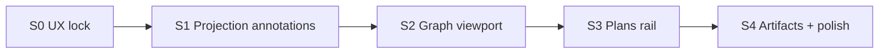

# status-dependency-graph · Delivery slices

Implements [DRV-DEP-MAP](../../features/DRV-DEP-MAP.md) against the [UX.md](UX.md) experience. No calendar estimates — slice by dependency and verifiable exit.

## S0 · UX lock (docs)

- Land DRV + initiative UX + HTML wireframe.
- Exit: `bun run check:drivecode-docs`; Mermaid validated; wireframe linked from design/wireframes README.

## S1 · Projection annotations

- Extend pure dependency projection with optional `planIds[]` per node and optional edge artifact labels keyed by `from → to`.
- Keep team runtime untouched; annotations come from bank/demo adapters at the composition root.
- Exit: `@cline/shared` tests; `bun run build:sdk`.

## S2 · Graph viewport + selection

- Replace card grid with layered LR graph in hub webview.
- Pan / zoom / fit; click node → detail dock; preserve keyboard + live region.
- Exit: hub component tests for empty, select, integrity banner; manual smoke on `?demoPlans=1&statusMode=dependency-map`.

## S3 · Plans rail

- Right rail lists plans with colors; filter highlights members.
- Node plan accents wired to projection `planIds`.
- Exit: rail empty state + filter tests; screenshot refresh.

## S4 · Artifacts + polish

- Edge labels when annotation present; edge select in detail.
- Demo fixture supplies sample artifacts; production stays unlabeled until a real source exists.
- Responsive rail collapse; reduced-motion camera; DEMO.md + assets updated.
- Exit: DEMO runbook path works; a11y smoke (keyboard + alert + live region).
