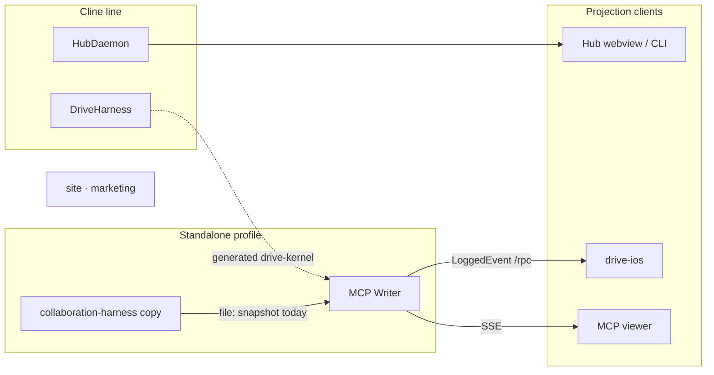
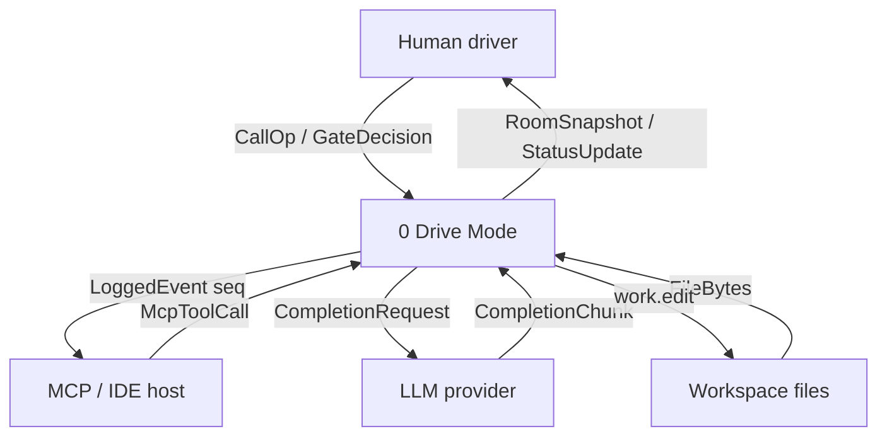
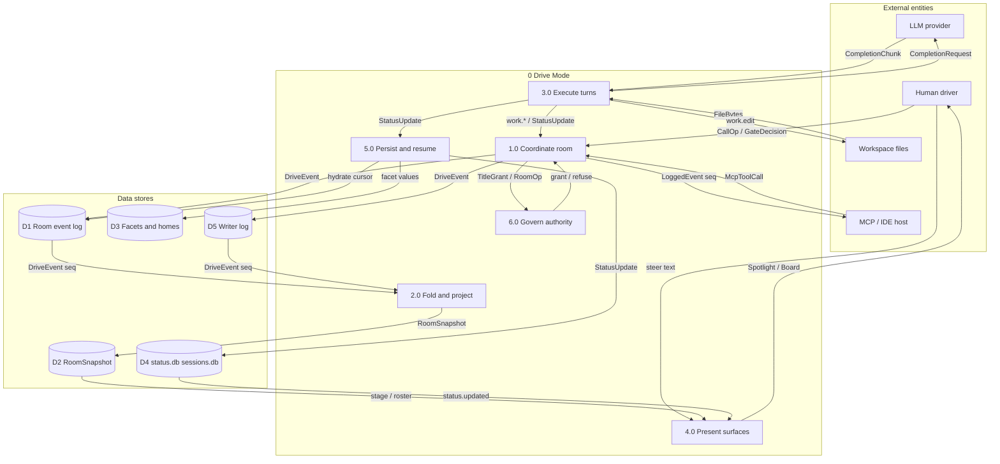
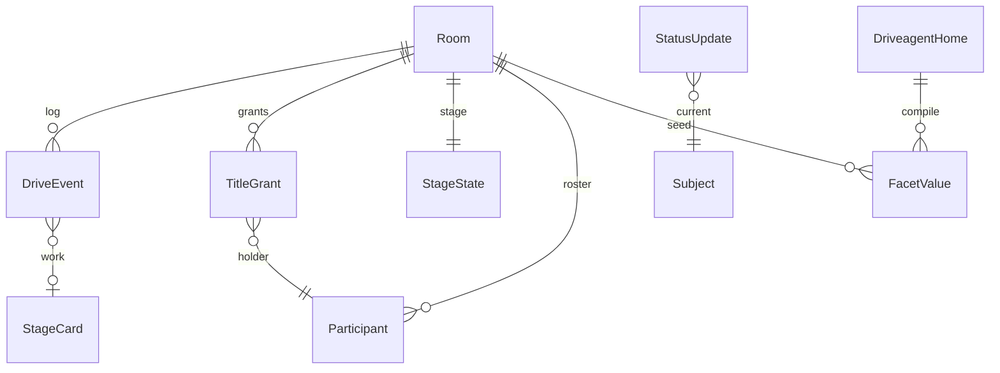
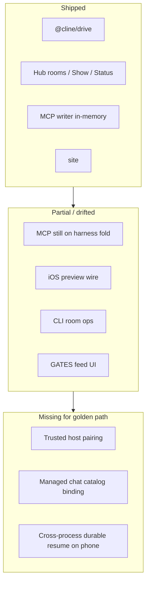

# Information system analysis · Drive Mode family

**Document type.** Family-wide information system analysis (structured analysis + architecture).
**Audience.** SE leads, PMs, implementers, reviewers, future second-host authors.
**Status.** Living analysis. Ground-truthed 2026-08-24 against the five Drive Mode checkouts in this workspace.
**Method.** Yourdon/DeMarco structured analysis (functional decomposition, DFD-0, DFD-1) plus ISO-style ISA (actors, data dictionary, interfaces, NFRs, FMEA, as-is/to-be).
**Diagram grade.** Parse-validated Mermaid (same gate as `@cline/drive` `validateMermaidSource`).
**Cline-product companion.** [SYSTEMS-ANALYSIS.md](SYSTEMS-ANALYSIS.md) remains the Cline-only deep dive. This file is the family view.

Companion docs: [HANDOFF.md](../../../HANDOFF.md), [NEXT-STEPS.md](NEXT-STEPS.md), [architecture.md](../../../reference/architecture.md), [ADR-0013](../adr/ADR-0013-state-partition.md), [ADR-0056](../adr/ADR-0056-d1b-kernel-protocol-superset.md), [ADR-0057](../adr/ADR-0057-room-state-authority.md), [repo-ownership](../initiatives/repo-ownership/README.md), [portfolio-now](../initiatives/portfolio-now/README.md), [06-sdk-leverage.md](../../drivecode-sdk/delivery/06-sdk-leverage.md).

---

## 1. Executive summary

Drive Mode is a **voice-first, events-first pair-programming collaboration system**. A human steers; agents publish typed work onto a shared **Spotlight**; a single writer folds an append-only log into a `RoomSnapshot`. It is **not** a hosted SaaS, **not** an orchestrator of autonomous fleets, and **not** a prompt warehouse.

The family is five repositories plus two parked IDE hosts:

| Piece | Role in the information system |
|---|---|
| `cline-drivecode` | Cline host + canonical kernel (`@cline/drive`) + Hub daemon (Cline-line room authority) |
| `collaboration-harness` | Retired pure kernel. Docs archived; GitHub not archived. Still the live fold behind MCP |
| `drivemode-mcp` | Standalone MCP writer + reference viewer. In-memory log. Independent of `@cline/*` |
| `drive-ios` | Native App Store candidate. Preview polls MCP `/rpc`; production fails closed |
| `site` | Static marketing (drivemode.ai). No operational data. Outside the DFD boundary |
| `cursor-drive` / `claude-drive` | Parked hosts. Linked from the site. Not in this workspace’s wire path |

**Two runtime profiles share one intended fold and must not share one room.**

| Profile | Writer | Fold today | Clients | Durability |
|---|---|---|---|---|
| **A · Hub-backed** | Hub daemon | `@cline/drive` `reduceRoom` | Hub webview, CLI TUI, VS Code | JSONL room log + SQLite |
| **B · MCP standalone** | Writer process | `collaboration-harness` `reduceRoom` | MCP hosts, iOS Debug | In-memory; reset on restart |

When both are live for the same `roomId`, **Hub wins** ([ADR-0057](../adr/ADR-0057-room-state-authority.md)). Do not merge snapshots. Do not CRDT.

| Dimension | Finding |
|---|---|
| Protocol maturity | High in Cline; MCP still on a drifted harness copy |
| Host maturity | High for local Hub rooms / Show / Status; golden-path chat+trust not connected |
| Client maturity | Hub UI medium–high; CLI partial; iOS preview-only; site not a client |
| Highest family risk | The drifted fold is the one iOS actually runs |
| Architectural spine | **Harness proposes → Host commits → Apps project** |
| Product proof still open | [portfolio-now](../initiatives/portfolio-now/README.md) GP1–GP5 / GP8 |

**Recommendation.** Treat this document as the family as-is. Close the kernel consume path (`drivemode-mcp` → `@drive-mode/drive-kernel`) before expanding iOS onto Hub. Do not reopen a second writer.

---

## 2. Purpose, scope, and objectives

### 2.1 Problem the system solves

Solo agent chat is a private transcript with tools. Drive Mode makes that work a **shared call**: presence, addressable partners, interruptible turns, a stage of structured work, temporary exclusive Presenter authority, and privacy-strict defaults.

### 2.2 In scope

- All five family repositories in this workspace
- Both runtime profiles (Hub-backed and MCP standalone)
- Canonical vs drifted fold (`@cline/drive` vs `collaboration-harness`)
- Marketing site as a business function (FDD only; not a DFD process)
- Parked hosts as adjacent systems

### 2.3 Out of scope (binding)

- Second daemon / identity on `:7891`
- Pixel / WebRTC agent Spotlight
- Dual-writer CRDT
- Prompts, tool allowlists, API keys, endpoints, or model IDs on the room wire
- Durable audio or transcripts without an explicit visible debug setting
- Inventing a hosted multi-tenant cloud as current as-is (Drive Cloud is a later initiative)

### 2.4 Analysis objectives

1. Name every piece and the data it actually reads/writes.
2. Decompose functions independently of repository boundaries.
3. Draw a balanced DFD-0 and DFD-1 that survive both runtime profiles.
4. Record authority, privacy, and drift as first-class findings, not footnotes.

---

## 3. System inventory

### 3.1 Repositories



Caption:

- Solid `drive-kernel` edge is the **intended** consume path (ADR-0056). Dashed in as-is: MCP still uses `file:../../../collaboration-harness`.
- `site` has no wire into either profile.
- Source: `initiatives/repo-ownership/README.md`; MCP `apps/writer/package.json`.

### 3.2 Cline packages and apps (Profile A)

| Piece | Path | Verb |
|---|---|---|
| `@cline/shared` | `sdk/packages/shared/src/drive/` | Define schemas |
| `@cline/drive` | `sdk/packages/drive/` | Propose / fold (pure) |
| `@cline/core` hub | `sdk/packages/core/src/hub/` | Commit |
| `@cline/agents` + `@cline/llms` | `sdk/packages/agents/`, `llms/` | Execute turns |
| `@cline/cline-hub` | `apps/cline-hub/` | Project dashboard |
| `@cline/cli` | `apps/cli/` | Project TUI; spawn Hub |
| `claude-dev` | `apps/vscode/` | Extension host |
| `@cline/drivecode-demo` | `apps/drivecode-demo/` | Edge-only demo adapters |
| `@drive-mode/drive-kernel` | generated `sdk/dist-bundle/drive-kernel/` | Kernel distribution for non-Cline hosts |

### 3.3 Standalone pieces (Profile B)

| Piece | Path | Verb |
|---|---|---|
| Writer store | `drivemode-mcp/apps/writer/src/store.ts` | Append + fold |
| Room service | `.../roomService.ts` | Packs + MCP behavior |
| HTTP / RPC | `.../http.ts` | `/rpc`, `/events`, `/snapshot` |
| MCP stdio | `.../mcp-stdio.ts` | Proxy to writer URL |
| Viewer | `drivemode-mcp/apps/viewer/` | Project roster + Spotlight |
| Packs | `packages/packs-*` | Validate `work.*` payloads |
| iOS `WriterClient` | `drive-ios/Sources/WriterClient.swift` | Poll `events_since`; client-side fold |

---

## 4. Stakeholders and actors

### 4.1 Stakeholders

| Stakeholder | Interest | Success signal |
|---|---|---|
| Human driver | Steer a call-shaped pair session | Golden-path proof (GP1–GP5) |
| Less-experienced builder | Guidance without a join wizard | SDLC guide on demand |
| Agent author | Portable homes, one runtime | Compile + recruit without a second prompt store |
| Privacy-conscious user | No silent retention | Forbidden-key schemas + fail-closed Release iOS |
| Fork maintainer | One fold, one writer per room | MCP on `drive-kernel`; Hub authority when both live |
| App Store reviewer | Honest production channel | `AppConfiguration` production empty of seeds |
| Future second host | Consume kernel, adapt `DriveHostPort` | Generated bundle + conformance kit |

### 4.2 Runtime actors (DFD external entities)

| Actor | Type | What it may originate | What it must not own |
|---|---|---|---|
| Human driver | Primary | Steer, approvals, join/leave, title requests | Authoritative `RoomSnapshot` |
| MCP / IDE host | External system | MCP tool calls (Cursor, Claude Desktop, Claude Code, Cline) | Room fold |
| LLM provider | External system | Completion chunks | Room events, prompts-on-wire |
| Workspace files | External store | File bytes the agent reads | Drive event log |

Internal actors (inside the system boundary, shown as processes on DFD-1): HubDaemon, DriveHarness, Agent runtime, Writer, client projections, iOS `AppStore`.

---

## 5. Functional decomposition

Functions are **jobs the family performs**, not repository names. A function may be implemented twice (Hub vs Writer) but it is still one function.

```mermaid
flowchart TD
  DriveModeFamily["Drive Mode family"]
  Collaborate["F1 Collaborate in a room"]
  HostCoordinate["F2 Host and coordinate"]
  AgentExecute["F3 Execute agent work"]
  McpPublish["F4 Publish from MCP hosts"]
  MobileSteer["F5 Steer from mobile"]
  ProtocolKernel["F6 Define protocol and fold"]
  SiteMarket["F7 Position the product"]
  PresenceRoster["F1.1 Presence and roster"]
  SpotlightStage["F1.2 Spotlight and stage"]
  InterruptAddress["F1.3 Address and interrupt"]
  TitlesSessions["F1.4 Titles and sessions"]
  HubCommit["F2.1 Commit room ops"]
  StatusDirector["F2.2 Status Hub and Director"]
  FacetsHomes["F2.3 Facets and Driveagent homes"]

  DriveModeFamily --> Collaborate
  DriveModeFamily --> HostCoordinate
  DriveModeFamily --> AgentExecute
  DriveModeFamily --> McpPublish
  DriveModeFamily --> MobileSteer
  DriveModeFamily --> ProtocolKernel
  DriveModeFamily --> SiteMarket
  Collaborate --> PresenceRoster
  Collaborate --> SpotlightStage
  Collaborate --> InterruptAddress
  Collaborate --> TitlesSessions
  HostCoordinate --> HubCommit
  HostCoordinate --> StatusDirector
  HostCoordinate --> FacetsHomes
```



Caption:

- F7 is a business function of the family. It does **not** appear on the DFDs.
- F6 is the definition site for F1–F5. Drift in F6 is a family defect, not a local MCP bug.
- Source: `sdk/packages/drive/src/`, `apps/writer/src/roomService.ts`, `drive-ios/Sources/Store.swift`, `site/dist/index.html`.

### 5.1 Function catalog

| ID | Function | Primary implementation | Secondary / partial |
|---|---|---|---|
| F1.1 | Admit presence, roster, mute | Hub `call_*` / Writer `room_join` | iOS projects `control.join` |
| F1.2 | Project Spotlight from typed stage | `reduceRoom` + `projectStage`; Hub Show director | MCP viewer; iOS `SpotlightDirector` |
| F1.3 | Address set + interrupt / raise-hand | Hub + kernel policies | Writer `address_set` / `interrupt_*` |
| F1.4 | Exclusive Presenter + session registry | Hub title policy + log-carried `control.session_*` | Writer titles; iOS title events only |
| F2.1 | Single-writer commit of `RoomOp` | `createClineDriveHost` | Writer `append` (Profile B only) |
| F2.2 | Status changelog + planned Show | `StatusService`, Show/Do bags | Not in MCP/iOS |
| F2.3 | Durable facets + compile homes | Hub drive-config | Not in MCP |
| F3 | Agent loop, tools, `report_status` | `@cline/agents` + core | MCP hosts run their own agents |
| F4 | Map MCP tools → pack-validated events | `drivemode-mcp` roomService | Cline is not this writer |
| F5 | Native steer / poll / fail-closed | `drive-ios` | Preview writer only |
| F6 | Schemas + `reduceRoom` + host port | `@cline/drive` | Harness copy (to retire) |
| F7 | Public positioning | `site` `dist/` | No runtime |

### 5.2 Balancing note

F1 is the collaboration primitive the product name refers to. F2 and F4 are **two hosts** of F1, not two products. F5 is a client of whichever host it is paired with. F3 is Cline’s existing runtime; Drive wraps it rather than replacing it. F6 must stay a single definition site ([repo-ownership](../initiatives/repo-ownership/README.md)).

---

## 6. Level 0 data flow diagram (context)

Process 0 is the Drive Mode information system — both profiles, all clients, kernel included. External entities are the only things that may exist outside that bubble.



Caption:

- `site` is omitted: it exchanges no operational data with process 0.
- `cursor-drive` / `claude-drive` are omitted: parked hosts, not on this wire.
- Discovery files (`~/.cline` hub discovery, `~/.drivemode/writer.json`) are internal.
- Source: hub transport + MCP `/rpc` + iOS `WriterClient` + Cline session/tool loop.

### 6.1 Context statement

Humans and IDE hosts propose. LLM providers complete. The workspace is the agent’s files, not the room log. Drive Mode is the only authority for room order (`seq`), Presenter exclusivity, and (in Profile A) durable resume.

---

## 7. Level 1 data flow diagram

Process 0 explodes into six processes. External entities are unchanged. Stores are shown because they are how the two profiles differ.



Caption:

- D1 is Profile A (JSONL under `.cline/drive/rooms/<id>/`). D5 is Profile B (in-memory). **A room uses one, never both.**
- 2.0 must be one algorithm. Today Profile A calls `@cline/drive`; Profile B calls the harness copy.
- 3.0 is Cline-owned in Profile A. In Profile B the MCP host’s own agent loop sits outside 3.0 and enters via 1.0 as `McpToolCall`.
- Source: `DriveRoomStore`, `createWriterStore`, `reduceRoom`, `StatusService`, `WriterClient`.

### 7.1 Process specifications (mini IPO)

| Process | Input | Process | Output |
|---|---|---|---|
| **1.0 Coordinate room** | `CallOp`, `McpToolCall`, pack payload, title request | Validate; assign `seq`; refuse if room ended (until successful join); never let clients pick ids/permissions | `DriveEvent` to D1 or D5; `LoggedEvent seq` to MCP host |
| **2.0 Fold and project** | `DriveEvent` + prior snapshot | Pure `reduceRoom`; Presenter required for agent stage; leave/end revoke live grants; cards survive `control.end` | `RoomSnapshot` into D2 |
| **3.0 Execute turns** | `CompletionChunk`, `FileBytes`, address set | Agent loop + tools; `report_status` attribution from tool context | `work.*`, `StatusUpdate` |
| **4.0 Present surfaces** | D2 stage/roster, D4 updates | Project Spotlight, Board, TUI, viewer, iOS working sets | Human-visible projections; local chrome only |
| **5.0 Persist and resume** | Appended events, facet puts, status publish | Atomic facet write; SQLite status/session; hydrate snapshot from log | Cursor-addressable history (Profile A). Profile B: D5 only, lost on restart |
| **6.0 Govern authority** | Title request, Director overlay, gate decision, forbidden keys | Host mints grants; exclusive Presenter; signed non-exportable Director; schema-reject audio/transcript keys | `control.title_*`, refuse, sanitized descriptor |

### 7.2 Profile overlay

| DFD-1 element | Profile A | Profile B |
|---|---|---|
| 1.0 | Hub `call_*` / `drive.*` via `HubServerTransport` | Writer `/rpc` + stdio proxy |
| 2.0 | `@cline/drive` | `collaboration-harness` (intended: `@drive-mode/drive-kernel`) |
| 3.0 | In-process Cline runtime | External MCP host (not this repo) |
| 4.0 | Hub webview, CLI, VS Code | MCP viewer, iOS Debug |
| 5.0 | D1 + D3 + D4 | D5 only |
| 6.0 | `clineDriveHost` + `directorPolicy` + `agentTitlePolicy` | Writer title tools; iOS also has a hand-written Swift title model |

### 7.3 DFD balancing check

| DFD-0 flow | DFD-1 path |
|---|---|
| Human → `CallOp / GateDecision` | Human → 1.0 |
| Drive Mode → `RoomSnapshot / StatusUpdate` | 4.0 → Human (via D2 / D4) |
| MCP host → `McpToolCall` | McpHost → 1.0 |
| Drive Mode → `LoggedEvent seq` | 1.0 → McpHost |
| Drive Mode ↔ LLM | 3.0 ↔ LlmProvider |
| Drive Mode ↔ Workspace | 3.0 ↔ Workspace |

No DFD-0 flow is dropped. No new external entity is introduced.

---

## 8. Data architecture

### 8.1 Persistence lanes ([ADR-0013](../adr/ADR-0013-state-partition.md))

| Lane | Store | Writer | Survives restart |
|---|---|---|---|
| Durable event log | D1 `.cline/drive/rooms/<id>/events.jsonl` | Hub only | Yes (Profile A) |
| Live snapshot | D2 process memory | Fold of D1/D5 | Rebuildable in A; lost in B |
| Durable facets | D3 `facets.v1.json` | Hub | Yes (A) |
| Status / sessions | D4 `~/.cline/data/db/*.db` | `StatusService` / session store | Yes (A) |
| Standalone log | D5 writer memory | Writer | **No** |
| Driveagent homes | `.driveagent/<slug>/` | Human + compile pipeline | Yes (source) |
| Forbidden durable | audio, transcripts, artifact bytes | — | Must not |

**Seeding rule.** Durable facets may seed live state at room create. They must not overwrite live mid-call.

### 8.2 Domain sketch



Caption: Status subjects are not a foreign key to rooms. A room may publish `subject = "drive-room/<id>"` by convention only.

### 8.3 Event tracks

| Track | Representative types | Notes |
|---|---|---|
| `control` | join/leave/end, mute, stage, mode, address, raise_hand, `title_*`, invite, `session_*`, `interrupt_ack` | Leave/end must revoke live Presenter |
| `conversation` | `message`, `narration` | MCP keeps a 200-entry RAM feed; events with text still hit D5 |
| `work` | `edit`, `command`, `test_result`, `plan_step`, `decision`, `generic` | MCP maps `work.plan`/`work.test` to kernel names |
| `presence` | speaking, typing, status | Signaling only |
| `media` | `media.artifact` in Cline | Harness enum exists; **no `media.*` events** in the harness union |

**Vocabulary (load-bearing):**

| Term | Meaning |
|---|---|
| Spotlight | User-facing shared surface |
| stage | Typed wire projection (`StageState`) |
| Presenter | Temporary exclusive Agent Title (`stage.present`) |
| Director | Host policy; clients get a signed, non-exportable descriptor + `pace` / `handoffs` |

### 8.4 Data dictionary (DFD flows and stores)

| Name | Form | Origin | Sink | Notes |
|---|---|---|---|---|
| `CallOp` | Hub command (`call_join`, `call_leave`, …) | Human via 4.0 | 1.0 | Clients do not assign room ids |
| `GateDecision` | Approve / deny / allow-session | Human | 1.0 / 6.0 | Deny forces replan |
| `McpToolCall` | JSON-RPC tool + args | MCP host | 1.0 | Stdio is a façade over `/rpc` |
| `LoggedEvent` / `DriveLogEnvelope` | `{ seq, roomId, event }` | 1.0 | MCP host, 2.0 | Envelope is the Cline name; `LoggedEvent` superseded |
| `DriveEvent` | Versioned union, `.strict()` | 1.0 | D1 / D5 | Forbidden keys must fail parse |
| `RoomSnapshot` | Folded room | 2.0 | D2 → 4.0 | Rebuildable from D1 |
| `TitleGrant` | `{ grantId, title, expiresAt, … }` | 6.0 | log + D2 | One Presenter per stage scope |
| `StatusUpdate` | `{ seq, subject, state, headline }` | 3.0 / 5.0 | D4 → 4.0 | Attribution from tool context |
| `CompletionRequest` | Provider prompt/tools | 3.0 | LLM | Never a Drive event |
| `work.edit` | Path + diff facts | 3.0 | Workspace / stage | Stage is facts, not pixels |
| `FileBytes` | Workspace contents | Workspace | 3.0 | Untrusted in LocalAI prompt |
| D1 | JSONL + checkpoint | 1.0 / 5.0 | 2.0 | Profile A resume cursor |
| D5 | In-memory array | 1.0 | 2.0 | Profile B; non-goal: SQLite |

---

## 9. Logical architecture

```text
Presentation     Hub webview · CLI TUI · VS Code · MCP viewer · iOS
                      project only
Host binding     @cline/core hub  |  drivemode-mcp Writer   (exactly one live)
                      commit
Kernel           @cline/drive  (= generated @drive-mode/drive-kernel)
                      propose / fold
Contracts        @cline/shared drive schemas
Agent runtime    @cline/agents + llms   or   external MCP host loop
```

**Does / does not**

| Component | Does | Does not |
|---|---|---|
| `@cline/drive` | `reduceRoom`, policies, host port, compile/score | FS, sockets, prompts |
| Hub | Single Cline-line writer; discovery, not a port identity | Pixel share; second room Map |
| MCP writer | Standalone Profile B; pack validation | Import `@cline/*`; survive restart |
| iOS `WriterClient` | Poll + project | Own room truth; production loopback |
| `site` | Static CSP-locked page | Forms, JS, analytics, API |

---

## 10. Physical / deployment view

### 10.1 Profile A — developer machine

```text
Developer machine (localhost)
├── HubDaemon ............. discovery file + per-process token
├── Hub dashboard ......... printed URL; explicit ports fail closed
├── CLI ................... auto-spawns Hub
├── Workspace FS
│   ├── .cline/drive/rooms/<id>/events.jsonl
│   ├── .cline/drive/facets.v1.json
│   └── .driveagent/<slug>/
└── ~/.cline/data/db/{status,sessions,cron,connectors}.db
```

### 10.2 Profile B — preview wire

```text
MCP host  --stdio--> mcp-stdio --HTTP /rpc--> Writer (ephemeral port)
                                              | D5 memory
                                              +-- SSE --> viewer
                                              +-- /rpc events_since --> iOS Debug
iOS Debug default writer URL: http://127.0.0.1:4600
Writer docs: port is not identity; prefer ~/.drivemode/writer.json
```

Those two port stories **disagree**. Debug iOS will miss a writer that bound an ephemeral port unless `DriveWriterBaseURL` is pointed at the printed URL.

### 10.3 Site

Cloudflare Pages project `drivemode`, `dist/` as source and artifact. CSP `default-src 'none'` plus `_headers` (nosniff, DENY framing, HSTS preload, camera/mic/geo denied). No script, no forms.

---

## 11. Interface catalog

### 11.1 Profile A — Hub

| Group | Examples | Handler family |
|---|---|---|
| `call_*` | join, leave, end, mute, stage, address, mode, seat, packs | `drive-room-handlers.ts` |
| `drive.*` live/show | `spotlight.set`, mute/deafen, `show.*`, `do.enqueue`, script | `drive-handlers.ts` |
| `drive.presenter.*` | grant, transfer, revoke, status | Implemented in `drive-handlers.ts` |
| `drive.fork.*` / `drive.wave.*` / `driveplan.*` | claim/promote, wave run, DriveRun | dedicated handlers |
| `status.*` | publish, query, board, summary, prune | `status-handlers.ts` |
| config / bank / home / privacy | facet put, bank ops, homes, memory-only debug retention | dedicated handlers |

**Finding P-IF1.** `hub-server-transport.ts` enumerates `drive.*` commands into `handleDriveCommand` and **does not list** `drive.presenter.*`. Handlers and unit tests exist. Live WS dispatch for Presenter commands is therefore unverified at the transport switch — `drive.spotlight.set` remains the documented compatibility alias.

### 11.2 Profile B — Writer RPC / MCP

| Primitive | Tools |
|---|---|
| Presence | `room_join` `room_leave` `room_end` `room_snapshot` |
| Roster / address | `roster_list` `roster_set_profile` `address_set` |
| Spotlight | `stage_publish_work` `stage_set_sharer` |
| Titles | `title_grant` `title_transfer` `title_revoke` |
| Interrupt / mode | `interrupt_raise` `interrupt_ack` `mode_set` `mode_get` |
| Sessions | `room_invite` `session_create` `session_schedule` `session_start` `session_end` |
| Resume / packs | `events_since` `pack_set` `pack_list` |
| Narration | `conversation_publish` |

HTTP: `/health` `/snapshot` `/rpc` `/events?since=` `/api/raise-hand`.

**Finding P-IF2.** Five packs exist on disk (`coding`, `demo-ops`, `tasks`, `artifacts`, `direction`). `pack_set`’s MCP schema enum still lists only `coding | demo-ops`.

### 11.3 iOS

`POST {writerURL}/rpc` tool `events_since`. Client-side `apply(wireEvent:)` — **not** `reduceRoom`. Consumes join, title_*, invite, session_*, `work.generic` packs. Does not yet fold `control.leave` / `control.end` into title cleanup.

### 11.4 Site outbound

Cursor Drive, Claude Drive, Cline Drive GitHub links (`target="_blank" rel="noopener noreferrer"`). Cline clone URL on the site is still `hhalperin/cline-drivecode` (pre-move). iOS / MCP / harness are not listed.

---

## 12. Control and data behavior

### 12.1 Join (both profiles)

1. Client proposes join.
2. 1.0 validates; Profile A host replaces client ids; Profile B appends to D5.
3. 2.0 folds; 4.0 projects roster.
4. Ended room: further `control.end` is a no-op until a **successful** `control.join` reopens (Cline + writer; keep that agreement).

### 12.2 Work onto Spotlight

1. Address set resolved (empty pack → reject, never widen).
2. Profile A: turn via 3.0; tools emit `work.*` / `report_status`.
3. Profile B: MCP `stage_publish_work` validates pack then maps to `DriveEvent`.
4. Agent stage requires an active Presenter grant (6.0).
5. 2.0 last-event-wins cards; 4.0 renders Spotlight.

### 12.3 Title transfer

Atomic grant/revoke. Disconnect, leave, room end, and expiry end authority synchronously on the Cline coordinator and (after harness #4 / MCP #4) on the standalone writer. iOS still requires explicit `control.title_*` to drop a Presenter.

---

## 13. Non-functional requirements

| ID | Category | Requirement | Evidence |
|---|---|---|---|
| NFR-P1 | Privacy | No durable audio/transcript by default | `DRIVE_EVENT_FORBIDDEN_KEYS`; iOS `VoiceCapture` drops buffers |
| NFR-P2 | Privacy | Production iOS fails closed | `AppConfiguration`; `DriveCoreTests` |
| NFR-P3 | Privacy | Site: no JS, no forms, no third parties | CSP + `_headers` |
| NFR-A1 | Authority | One writer per live room | ADR-0013, ADR-0057 |
| NFR-A2 | Authority | One fold algorithm | ADR-0056; **violated as-is** (two `reduceRoom`s) |
| NFR-A3 | Authority | Director non-exportable | `directorPolicy.ts`; iOS `exportable: false` (preview descriptor is local) |
| NFR-R1 | Reliability | Profile A resume by `seq` | JSONL + `hydrateFromLog` |
| NFR-R2 | Reliability | Idempotent `control.end` | Cline + writer tests |
| NFR-R3 | Reliability | Profile B reset is expected | Documented non-goal |
| NFR-S1 | Safety | High-impact tools gated | DRV-GATES (taxonomy landed; feed UI partial) |
| NFR-C1 | Compatibility | Bun tooling; Node ≥22 runtime on Cline | CI `drive-ci` |
| NFR-C2 | Compatibility | No magic port as identity | Hub discovery; MCP ephemeral port (**iOS Debug `:4600` exception**) |
| NFR-T1 | Testability | Pure kernel unit-tested without IO | `@cline/drive` / harness tests |
| NFR-T2 | Testability | Cross-repo golden-path suite | portfolio-now GP8 — **not shipped** |

---

## 14. Failure modes (FMEA-lite)

| Failure | Effect | Detection | Mitigation |
|---|---|---|---|
| Two folds disagree | iOS Presenter exclusivity ≠ Hub | Export diff (`titleGrantExclusivityKey` absent in harness) | MCP consumes `drive-kernel` |
| Hub and Writer both live | Two Presenter clocks | Operator error | ADR-0057: ignore Writer for that `roomId` |
| Hub down | Profile A has no authority | Client empty state | W-31 copy; discovery, not a hardcoded port |
| Writer restart | iOS working set invalid | `latestSeq < wireSeq` | Cursor reset; tell the human |
| Transport omits `drive.presenter.*` | Grant API unused on the wire | Switch vs handler review | Verify / add cases; keep `spotlight.set` alias |
| Empty address pack | Misdelivery to everyone | Address tests | Reject; never widen |
| Durable overwrites live | Mid-call surprise | Lane tests | Seed-only rule |
| Production iOS with loopback | Reviewer surprise / ATS | `permitsWriterURL` | Fail closed |
| Site CSP loosened for convenience | Threat-model change | Review | Raise explicitly; do not assume |
| Stale “scaffold-only” plans | Wrong work selected | Doc vs §16 | Prefer this file + HANDOFF + claims registry |

---

## 15. Security and privacy posture

| Control | Where it lives |
|---|---|
| Forbidden event keys | Shared + harness schemas |
| Events-first stage (no pixels) | Architecture D4; iOS Spotlight |
| Hub auth token in owner-only discovery file | Hub transport |
| Dashboard LAN `ROOM_SECRET` | `apps/cline-hub` |
| iOS production: HTTPS, non-loopback, no seeds | `AppConfiguration` |
| Voice: level only, buffer dropped | `VoiceCapture.swift` |
| LocalAI: one security-scoped file, 32 KB, no cloud | `LocalAI.swift` |
| Site: `default-src 'none'`, `form-action 'none'`, frame deny | `index.html` + `_headers` |
| Prompts/tools/models stay in Cline config / `.driveagent` | DEC-agent-SoT |

---

## 16. As-is vs to-be

### 16.1 Family as-is (2026-08-24)

| Plane | Reality |
|---|---|
| Protocol definition | **Shipped** in `@cline/drive` (+ generated bundle machinery) |
| Harness repo | **Docs-archived**; still the MCP `file:` dependency |
| Hub rooms / Show / Status / facets | **Shipped** on Cline `main` |
| MCP writer | **Shipped** as in-memory standalone host |
| iOS | **Preview**; production empty; leave/end title fold incomplete |
| Site | **Shipped** static marketing; Cline URL and product set drift |
| Trusted host + managed chat + durable iOS resume | **Not connected** (GP1–GP5) |
| One fold everywhere | **Open** (ADR-0056 consume not on MCP `main`) |



### 16.2 To-be (supported golden path)

The to-be is the [portfolio-now](../initiatives/portfolio-now/README.md) golden path, not a new product:

1. One protocol (F6) consumed by both hosts.
2. Profile A remains Cline-line authority; Profile B is the no-Hub profile until iOS pairs with Hub.
3. A clean install pairs a trusted host, selects a real target, runs a managed chat, projects typed work, and resumes by cursor.
4. Call + Presenter extend that path; they do not replace it.
5. Production iOS stays fail-closed until GP9 release services exist.

Cline-product residuals (GATES UI, recruit Add, CLI `call_join`, voice STT) stay in [SYSTEMS-ANALYSIS.md](SYSTEMS-ANALYSIS.md) §9.4 / §13. They are inside F1/F2, not a second family.

---

## 17. Gap analysis (family)

| Gap | Functions | Evidence | Closes via |
|---|---|---|---|
| MCP not on `drive-kernel` | F6, F4, F1.4 | `file:../../../collaboration-harness` | ADR-0056 consume PR |
| Two `reduceRoom` algorithms | F6, NFR-A2 | 471 vs ~528 lines; missing exclusivity key | Same |
| iOS client-side fold ≠ kernel | F5, F1.4 | No `control.leave`/`end` title cleanup | GP7 + generated Swift titles |
| Title vocabulary ×3 | F6 | Zod + harness + `AgentTitles.swift` | Generate Swift from canonical schema |
| Dual “single writer” claims | F2.1 / F4 | HANDOFF vs MCP AGENTS.md | ADR-0057 (decided; docs still diverge) |
| Presenter WS dispatch | F1.4 | Transport switch omits `drive.presenter.*` | Verify/fix `hub-server-transport.ts` |
| iOS Debug port vs ephemeral writer | F5 | `:4600` vs printed URL | Discovery or explicit config |
| Managed chat not on phone | F3, F5 | Local send + fire-and-forget `conversation_publish` | GP3 → GP4 |
| Site product set | F7 | Three IDE drives; no iOS/MCP; old Cline URL | Site copy pass (separate repo) |
| Cross-repo conformance | NFR-T2 | No `drive-dev` suite | GP8 |

---

## 18. Quality-attribute tradeoffs

| Choice | Gains | Costs |
|---|---|---|
| Events-first Spotlight | Searchable, private, cheap | Less “I see your screen” until media exists |
| Two host profiles | iOS can preview without Hub | Dual-writer hazard; two ops catalogs |
| Pure kernel | Testable; portable | Generated bundle + consume discipline |
| In-memory MCP writer | Simple v0 | No phone resume across writer restart |
| Fail-closed Release iOS | Honest App Store path | Preview and production feel like different apps |
| No JS on site | Tiny threat model | No product demo in-page |
| Hub as sole Cline writer | No CRDT | Hub availability is the critical path |

---

## 19. Recommendations

Dependency-honest; no calendars.

1. **Finish F6 unification.** Land MCP on `@drive-mode/drive-kernel`, then GitHub-archive `collaboration-harness`. Until then, treat iOS Presenter behavior as the harness fold, not the Cline fold.
2. **Keep ADR-0057 operational.** If a Hub is live for a room, MCP is a client. Do not add snapshot merge.
3. **Prove the golden path vertically** (GP1–GP5, then GP8) before investing in richer iOS theater chrome or WebRTC.
4. **Verify P-IF1** (`drive.presenter.*` on the Hub transport) as part of F1.4, not as a new product.
5. **Do not** put iOS on loopback in Release, persist audio, loosen site CSP, or re-add in-tree `apps/drive-ios`.
6. **Site is not the wire**, but F7 currently under-represents the family (no iOS, pre-move Cline URL). A site PR is copy, not architecture — still a family defect.
7. Cline-only product gaps (GATES UI, recruit Add, CLI parity, STT) remain owned by [SYSTEMS-ANALYSIS.md](SYSTEMS-ANALYSIS.md). Do not copy that backlog here.

Operational expansion: [NEXT-STEPS.md](NEXT-STEPS.md) (three tracks; GP4 is the hard join). Do not treat the text tree below as a task board.

```text
F6 consume (MCP → drive-kernel)
  → iOS title fold matches Hub leave/end
    → GP1 trusted host
      → GP2 targets → GP3 managed chat → GP4 iOS binding → GP5 resume
        → GP8 cross-repo conformance
          → GP6/GP7 call + Presenter on the phone
            → GP9 release services
```

---

## 20. Traceability (sample)

| Business need | Function | DFD-1 | NFR | Sequencer |
|---|---|---|---|---|
| See partner work | F1.2 | 2.0 → D2 → 4.0 | A1 | — (shipped on Hub) |
| Exclusive stage | F1.4 | 6.0 ↔ 1.0 | A2, A3 | GP7 |
| Any-IDE publish | F4 | McpHost → 1.0 → D5 | R3 | ADR-0056 |
| Steer from phone | F5 | 4.0 iOS | P2, C2 | GP4 |
| Resume after kill | F2.1 + F5 | 5.0 ↔ D1 | R1 | GP5 |
| Private by default | F6 + F5 | 6.0 | P1 | — (schemas + VoiceCapture) |
| Public honest launch | F7 | (outside DFD) | P3 | site copy |

Full Cline workflow coverage remains [MATRIX-workflow-coverage.md](MATRIX-workflow-coverage.md).

---

## 21. Open questions

| ID | Question | Default if silent |
|---|---|---|
| Q-F1 | Has `drive.presenter.*` been deliberately left off the WS switch in favor of `drive.spotlight.set`? | Treat as a defect until proven intentional |
| Q-F2 | When iOS pairs with Hub, does Profile B remain for MCP-only IDEs, or retire the writer fold? | Keep Profile B as no-Hub; Hub wins if both live |
| Q-F3 | Generate Swift titles before or with GP7? | Generate before claiming Presenter parity |
| Q-F4 | Site: add iOS/MCP, retarget Cline to `drive-mode/cline-drivecode`? | Yes when a site PR is opened; not this Cline PR |
| Q-F5 | ADR-0015 (task-session observability) leadership accept? | Still Proposed — see Cline companion |

---

## 22. Document control

| Version | Change |
|---|---|
| 2026-08-24 | Initial family ISA: FDD, DFD-0, DFD-1, two-profile overlay, drift findings, golden-path recommendations |
| 2026-08-24 | Point §19 at [NEXT-STEPS.md](NEXT-STEPS.md); HANDOFF kernel-consume claim qualified as decided-not-as-is |

When MCP consumes `drive-kernel` or iOS pairs with Hub, update §16.1 and tick §17. Do not fork a third analysis; amend this file for family scope and [SYSTEMS-ANALYSIS.md](SYSTEMS-ANALYSIS.md) for Cline-only scope.

**Provenance (code read for this baseline).** `sdk/packages/drive/src/reduceRoom.ts`, `sdk/packages/core/src/hub/clineDriveHost.ts`, `hub-server-transport.ts`, `drive-handlers.ts`, `drivemode-mcp/apps/writer/src/{store,roomService,http}.ts`, `collaboration-harness/README.md`, `drive-ios/Sources/{AppConfiguration,WriterClient,Store}.swift`, `site/dist/index.html`.
