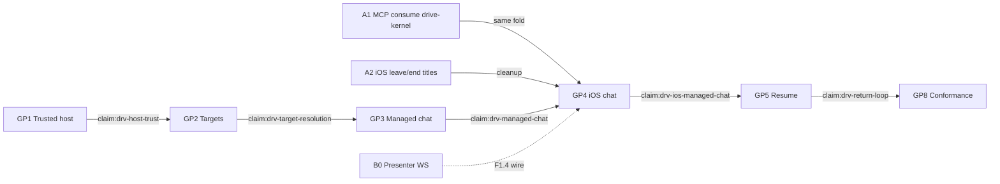

# Next steps · Drive Mode family

**Document type.** Pickup plan after the family ISA.
**Audience.** SE leads, PMs, agents picking the next slice.
**Status.** Living. Grounded 2026-08-24 in the ISA as-is. Now slices A1–A3, B0, C1–C4 landed 2026-08-29; next Cline slice is **B1**.
**Does not replace.** [claims-registry.yaml](../delivery/claims-registry.yaml) (Done SoT), [portfolio-now](../initiatives/portfolio-now/README.md) (golden-path sequencer), [repo-ownership](../initiatives/repo-ownership/README.md) (dedup order).
**Companion.** [ISA-DRIVE-MODE-FAMILY.md](ISA-DRIVE-MODE-FAMILY.md) is the analysis. This file is what to do with it.

No calendars. Status words cite `claim:<id>` when they exist.

---

## 1. How to use this file

Pick work from the claims registry. Use [BACKLOG.md](../delivery/BACKLOG.md) as the render. Use [portfolio-now](../initiatives/portfolio-now/README.md) for golden-path order. Use [repo-ownership](../initiatives/repo-ownership/README.md) for which repo owns a concept.

This file answers one question the three sequencers do not: **given the ISA findings, which of those rows is unblocked, which must join before iOS, and which must not start.**

Do not mint a fourth board. When a slice lands, advance the claim (or the repo-ownership step) and amend §5 here.

---

## 2. Reconcile the sequencers

[portfolio-now](../initiatives/portfolio-now/README.md) hand-back: start **GP1** and **GP2**, keep GP8 harness in parallel, then **GP3 → GP4 → GP5**.

The ISA: the drifted fold is what iOS actually runs. Close MCP → `@drive-mode/drive-kernel` **before expanding iOS onto Hub**.

Both are right if they are **tracks**, not a single queue:

| Track | What it proves | Where it lives |
|---|---|---|
| **A · Fold** | One `reduceRoom` on the path iOS polls | `drivemode-mcp` then `drive-ios` |
| **B · Host path** | Pair, target, managed chat on Cline | `cline-drivecode` |
| **C · Honesty** | Small defects that do not unlock GP4 | Cline / MCP / site / iOS |

**Hard join.** GP4 (iOS managed chat) waits on **B (GP3)** and **A (kernel consume)**. Building GP4 against the harness copy teaches the phone the wrong exclusivity rules.

GP1/GP2 do **not** wait on A. They are Cline-host work.

Caption:

- Solid arrows are hard joins. Dashed B0 is a Cline defect; do not block GP1 on it.
- A2 can start against today’s writer (leave/end already idempotent). Presenter exclusivity still waits on A1.
- Source: ISA §19; portfolio-now Now table; ADR-0056/0057.

---

## 3. Now — first slices

One PR per row. One repo per row. Stop when the acceptance line is true.

### Track A · Fold

| ID | Slice | Repo | Advances | Acceptance |
|---|---|---|---|---|
| **A1** | Replace `file:../../../collaboration-harness` with `@drive-mode/drive-kernel` | `drivemode-mcp` **landed** (`da78e3d` / #8) | `claim:drv-golden-path-contract` (GP0) | Writer typecheck + `bun test` against the generated bundle; map `work.plan`/`work.test` to kernel names; `packId` only on `work.generic`; `DriveLogEnvelope` not `LoggedEvent` |
| **A1b** | GitHub-archive `collaboration-harness` | `collaboration-harness` | repo-ownership step 2 | No remaining `file:` consumer; README already says archived |
| **A2** | Project `control.leave` and `control.end` into title cleanup | `drive-ios` **landed** (#13) | GP0 / later `claim:drv-presenter-native` | Unit test: leave/end drops a live Presenter without a trailing `title_revoked`; production still fail-closed |
| **A3** | Debug writer URL from discovery / printed URL, not `:4600` | `drive-ios` **landed** (#14) | NFR-C2 | Preview still allows loopback; identity is the discovered URL |

A1 landed. iOS still polls the MCP writer (Profile B); Presenter exclusivity on the phone is the kernel fold the writer now consumes, not a second harness copy. Do not start GP4 until B3 (GP3) also lands.

A1 mapping reminders (already decided, do not re-argue): [ADR-0056](../adr/ADR-0056-d1b-kernel-protocol-superset.md).

### Track B · Host path (`cline-drivecode`)

| ID | Slice | Claim | Acceptance |
|---|---|---|---|
| **B0** | Prove or wire `drive.presenter.*` on `hub-server-transport.ts` (ISA P-IF1) | **landed** (#40) | A WS client can `grant`/`transfer`/`revoke`/`status`; keep `drive.spotlight.set` as the compatibility alias |
| **B1** | Trusted host pairing | `claim:drv-host-trust` **planned** · **next** | Fresh client pairs, stores credential in platform secure storage, reconnects, cannot mutate another workspace |
| **B2** | Opaque target registry | `claim:drv-target-resolution` **planned** | Host resolves repo/folder refs, reports posture, rejects stale grants, does not leak raw paths |
| **B3** | Finish managed chat consumer contract | `claim:drv-managed-chat` **active_partial** | Create/list/send/cancel/resume against the catalog; typed events for output, approvals, failure, terminal state |

Catalog + CLI wiring landed (#35/#36). B3 is the **remote consumer contract**, not a second catalog.

### Track C · Honesty (do not let these become the sprint)

| ID | Slice | Repo | Why now |
|---|---|---|---|
| **C1** | Retarget Cline clone URL to `drive-mode/cline-drivecode`; decide whether iOS/MCP belong on the page | `site` **landed** (#3) | Cline URL is `drive-mode/cline-drivecode`; iOS row is Preview |
| **C2** | `pack_set` MCP enum matches the five packs on disk | `drivemode-mcp` **landed** (#11) | Schema/service split (ISA P-IF2) |
| **C3** | MCP `AGENTS.md` records ADR-0057 (Hub wins if both live) | `drivemode-mcp` **landed** (already on `main` before this pickup) | Dual “single writer” claims |
| **C4** | HANDOFF “MCP consumes drive-kernel” / “harness is archived” | `cline-drivecode` **landed** (#39) | Qualified as as-is in the ISA PR |

Honesty Now-row is closed except leftovers that are not this pickup (site #2 / mcp #7 identity markers, iOS #12 brand draft).

---

## 4. Next / later / never

### Next — after the GP4 join

| Item | Claim | Do not start until |
|---|---|---|
| GP5 durable resume | `claim:drv-return-loop` | GP4 |
| GP8 `drive-dev` cross-repo scenario | `claim:drv-cross-repo-conformance` | GP1–GP5 (harness for GP8 may be sketched in parallel) |
| GP6 remote call on the phone | `claim:drv-remote-call-binding` | GP4 + GP5 |
| GP7 native Presenter + generated Swift titles | `claim:drv-presenter-native` | GP6; generate Swift **before** claiming parity (ISA Q-F3) |
| GP9 release services | `claim:drv-release-services` | GP8 |

### Later — valuable, not this pickup

Cline-product residuals stay in [SYSTEMS-ANALYSIS.md](SYSTEMS-ANALYSIS.md) §9.4 and [BACKLOG.md](../delivery/BACKLOG.md) §B/C2–C4. Do not pull them into Now unless they unblock GP1–GP5:

- GATES feed ACs (`claim:drv-gates-feed`)
- Recruit Add / pack library
- CLI `call_join` parity
- Voice STT (browser-speechSynthesis is the beta floor)
- ux-quality phases, ADLC 3–7, demo-badge honesty
- Parked hosts (`cursor-drive` / `claude-drive` / `OperatorRole`) — repo-ownership D3

### Never (this cycle)

- Second daemon / `:7891`
- Pixel / WebRTC agent Spotlight
- Dual-writer snapshot merge
- Durable audio/transcripts without a visible debug setting
- Loosening site CSP to add a demo
- Re-adding in-tree `apps/drive-ios`
- Runtime sensing until [ADR-0037](../adr/ADR-0037-invocation-scoped-sensing.md) is accepted **and** its denylist/arming/retention exist
- Treating Profile B reset-on-restart as a bug (it is a documented non-goal until iOS is on Hub)

---

## 5. Who picks up what

| If you are in… | First slice | Do not start |
|---|---|---|
| `drivemode-mcp` | **A1b** wait (archive harness); otherwise idle | A Hub bridge, SQLite log, `@cline/*` imports |
| `drive-ios` | Idle until GP4 join (needs B3) | GP4 managed chat; App Store; loopback in Release |
| `cline-drivecode` | **B1** trusted host | GP4, GP6, GP7, WebRTC, in-tree iOS |
| `site` | Idle | JS, forms, analytics, CSP changes |
| `collaboration-harness` | **A1b** GitHub-archive | New protocol features |

Default: **B1** on `cline-drivecode`. Hub/CLI `profilesByParticipantId` webview typecheck is pre-existing on `main` (failed on #38 and #40); do not treat it as a B1 blocker.

---

## 6. Definition of ready (any Now slice)

1. Named claim or ISA finding ID in the PR.
2. One repo. No “and also the site” on a Cline PR.
3. Acceptance copied from the table above, not paraphrased into a new bar.
4. Evidence command that fails before the change (ADR-0026 when marking `verified_shipped`).
5. Cross-repo fold changes: after A1, `bun install --force` is gone; pin the kernel version so drift fails at install.

---

## 7. Open questions that still block a slice

| ID | Blocks | Default if silent |
|---|---|---|
| Q-F1 | ~~B0 intent~~ **resolved** (#40) | Missing WS cases were a defect; wired |
| Q-F2 | Whether Profile B survives GP4 | Keep no-Hub writer; Hub wins if both live |
| Q-F4 | ~~C1 product set~~ **resolved** (#3) | Cline URL retargeted; iOS is preview, not shipped |
| DEC-licence-visibility | Publishing/visibility moves | No SPDX/visibility change until an owner picks a row |

---

## 8. Document control

| Version | Change |
|---|---|
| 2026-08-24 | Initial pickup plan from family ISA; three tracks; GP4 hard join |
| 2026-08-29 | Tick A1–A3, B0, C1–C4 as landed; next slice is B1 (`claim:drv-host-trust`) |

When A1 lands, tick Track A, qualify HANDOFF as as-is, and point GP0’s remaining ACs at mobile conformance rather than kernel consume. **Done 2026-08-29** (mcp #8, ios #13/#14, cline #40/#39, site #3, mcp #11). Remaining GP0 ACs are mobile conformance, not kernel consume.
