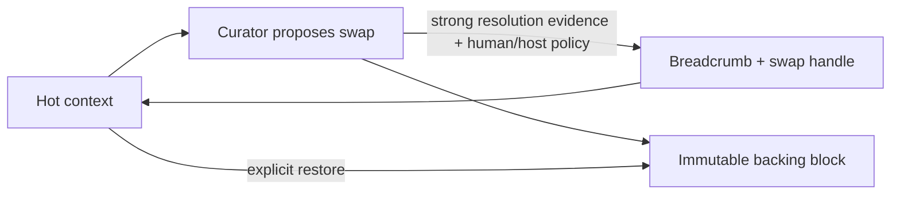

# Research 29 · Cross-session chat management

**Date:** 2026-08-14  
**Status:** research synthesis; implementation decisions remain Proposed  
**Related:** [ADR-0041](../adr/ADR-0041-cross-session-chat-catalog-authority.md), [initiative](../initiatives/cross-session-chat-management/)

## Question

How should Cline support durable organization of active and archived chats
across interactive, connector, resumed, reset, forked, and historical sessions
without creating another source of truth or allowing a plugin/model to mutate
user history implicitly?

## Evidence reviewed

This synthesis combines three evidence classes:

1. Harrison's Anthropic export: `conversations.json`, `memories.json`, and the
   22 exported project records under `projects/`.
2. Focused prior chats, especially:
   - `e2e5b04c-f01f-47d9-9109-3d82f520494e`, “Context swapping for AI chat
     memory management”;
   - `83d2be94-6eae-4dc9-b6a8-96760f0a61f8`, “Dynamic documentation with
     role-aware personalization”; and
   - `9f5778e2-0311-4830-9cf2-869e26c5043c`, “Building Claude like a Slay the
     Spire deck.”
3. The current `cline-drivecode` session, history, connector, fork, reset,
   persistence, and plugin authority paths, followed by an independent
   adversarial subagent review.

The export is private discovery evidence. Raw transcripts, summaries, project
prompts, and private memory are not product fixtures and must not enter the
plugin package, telemetry, or repository.

## Problem reconstructed from prior chats

The desired system is not merely a nicer history list.

- Long append-only chats retain stale errors, failed attempts, and bulky tool
  output. That can keep an agent anchored to a resolved problem.
- Starting a new chat fixes context quality but loses continuity unless a
  durable handoff is built manually.
- Project-level grouping is too coarse. Harrison's Thoughtbuilder design calls
  for knowledge projected per file and per agent, then cloned into a new chat.
- The original context-swapping design treats active context as a hot tier,
  summarized breadcrumbs as an index, and original blocks as a reversible
  backing store keyed to their source session.
- Living project files should remain distinct and current; they should not be
  collapsed into one giant summary merely to make a future chat possible.
- The Anthropic export contains conversations and projects as separate record
  families, but conversation records contain no project identifier. Exported
  project membership therefore cannot be reconstructed authoritatively.
- The immediate need is simpler than full semantic memory: see current work,
  intentionally archive dormant work, resume or fork it safely, and preserve
  lineage and transcripts.

The product sequence should therefore be:

1. authoritative chat catalog and lifecycle;
2. reliable resume/fork/reset/binding semantics;
3. handoff and context-snapshot artifacts;
4. reversible context swapping; and only then
5. per-file/per-agent knowledge projection and routing.

## What exists in Cline today

There is no singular chat authority.

| Concern | Current authority | Consequence |
|---|---|---|
| Session metadata | SQLite `sessions` rows | Execution status exists; organizational lifecycle does not. |
| Transcript | Per-session messages JSON | No cross-process writer lease or transcript revision. |
| Recovery metadata | Per-session manifest | Fallback can disagree with SQLite and has weaker lineage. |
| Live execution | Process-local runtime map | Not visible to a separate history command. |
| Connector continuity | External thread state plus bindings JSON | Duplicate writable mappings without database CAS. |
| Interactive selection | Process-local active session id | Not durable and not a cross-session catalog. |

Concrete findings:

- `apps/cli/src/session/session.ts::listSessions` accepts `workspaceRoot` but
  does not pass a workspace filter to core history.
- History is a synthesized display projection: it merges rows and manifests,
  hydrates titles/cost from messages, and repairs some legacy statuses.
- Lists sort by start time, so a recently resumed old session can remain buried.
- CLI history mutation helpers force the local backend and can bypass a hub
  that owns a live runtime.
- Interactive `/new` stops and preserves a session, while connector `/new`
  stops and permanently deletes it. Configuration changes use the destructive
  connector path too.
- Fork lineage is mutable metadata rather than a queryable relation.
- Row status has optimistic concurrency; transcript and binding files do not.
- Deletion removes the row before all artifact cleanup succeeds. A leftover
  manifest can later reappear through fallback history.

These are lifecycle-authority defects, not presentation defects.

## Domain model

“Chat” and “session” must be separate:

- A **chat** is the durable, user-organized continuity object.
- A **session** is one execution/transcript unit attached to a chat.
- A **binding** maps an interactive or connector surface to a chat/session.
- A **handoff** is a derived, reviewable continuity artifact.
- A **swap block** is a later reversible context-eviction record. It is not
  part of Milestone 0.

Three axes are independent:

| Axis | Examples |
|---|---|
| Organizational lifecycle | active, archived; deleting is an internal purge state |
| Execution status | idle, running, pending, completed, failed, cancelled |
| Surface binding | bound or unbound to interactive/connector thread |

A completed chat may remain active. A failed chat may be archived. An unbound
chat may remain active. No execution status implies archive.

## Recommended architecture

Create a core-owned `ChatCatalogService` beside runtime execution, backed by the
same SQLite database as sessions. It is the only lifecycle and binding writer.

```text
chats
  chat_id, workspace_key, catalog_state, head_session_id,
  parent_chat_id, title, title_source, source_kind,
  created_at, last_activity_at, archived_at, revision

chat_sessions
  chat_id, session_id, relation_kind, parent_session_id,
  ordinal, attached_at

chat_bindings
  binding_id, transport, instance_id, channel_id, thread_id,
  participant_scope, chat_id, session_id, revision, updated_at

chat_events
  event_id, chat_id, event_type, actor/source provenance,
  previous_revision, resulting_revision, payload, occurred_at

session_leases
  session_id, owner_id, lease_token, expires_at, revision
```

All mutations require an expected revision, an invocation/idempotency id, and
host-authenticated actor/source provenance. Runtime execution remains behind
`RuntimeHost`; catalog operations use a sibling local/hub port with one
conformance suite.

Plugins receive neither database access nor general lifecycle mutation. A
plugin may receive a bounded read-only summary. Archive, activate, bind, purge,
and lease operations remain host-owned human commands. Model tool input alone
is never authority to mutate chat lifecycle.

## Lifecycle recommendations

- First persisted root session creates one active chat atomically.
- Switching selection does not archive the previous chat.
- `/new` stops and unbinds the old session but does not silently classify the
  old chat as archived. Provide `/new --archive-current` as an explicit combined
  action.
- Connector reset must preserve the transcript and use the same stop/unbind
  semantics as interactive reset.
- Resuming an archived chat is an explicit activate-and-resume operation. It
  acquires the writer lease before a new turn can write.
- Fork and checkpoint restore create new active chats with structural lineage;
  the source chat is unchanged.
- Archive while running fails unless the human explicitly requests
  stop-and-archive.
- Purge is distinct from archive. It requires an archived non-running chat,
  writes a retryable deleting tombstone, removes bindings, and performs
  idempotent artifact cleanup before final row removal.
- A stale connector binding is cleared with CAS. Recovery creates explicit
  recovery lineage instead of pretending the missing transcript continued.

## Why `/new` should not silently archive

Archive means “remove from my active body of work,” not “this execution stopped.”
A user may start a clean context because the current chat is too large while
both lines of work remain active. Automatic archive would collapse the
organizational and execution axes that this design exists to separate. The UI
may recommend archiving and may offer an atomic combined command, but it should
not infer that decision.

## Deferred context-swapping layer

Once the catalog and lease model are authoritative, the prior context-swapping
idea can be added safely:



The stable keys must be chat/session/message/content-block identifiers, not
line numbers. Swapping must preserve originals, provenance, and restore audit.
False “resolved” detection, prompt-cache invalidation, privacy, retention, and
restoring toxic context are separate ADR concerns.

## Rejected shortcuts

- Add `archived=true` to free-form session metadata.
- Infer archive from completed/failed/age.
- Make the existing history formatter the lifecycle writer.
- Put the catalog in ADR Planner extension state.
- Let connector JSON and SQLite both be writable authorities.
- Let a model-facing tool archive, resume, or purge.
- Treat archive as deletion.
- Import private Claude transcripts as product fixtures.

## Open owner decisions

1. Legacy adoption UX: explicitly triage old sessions, or initially adopt all
   as active. Existing sessions must not be heuristically archived.
2. Whether `/new --archive-current` becomes the recommended UI default while
   plain `/new` remains preservation-safe.
3. Workspace identity beyond canonical local paths for clones, renames, and
   multi-device/hub operation.
4. Default retention and privacy purge policy.
5. When handoff/context-snapshot generation enters the roadmap after M0.

