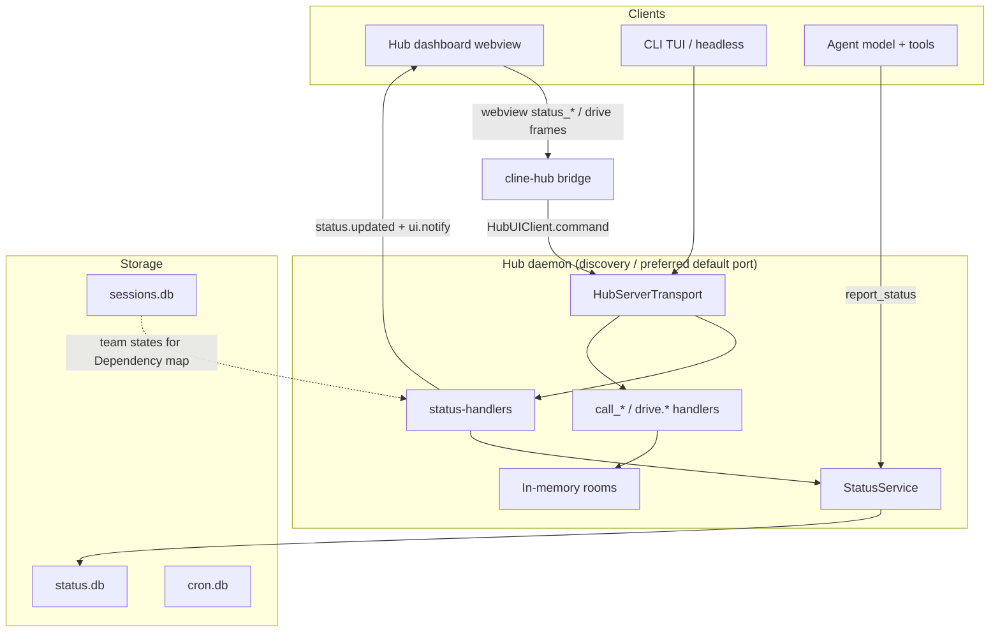
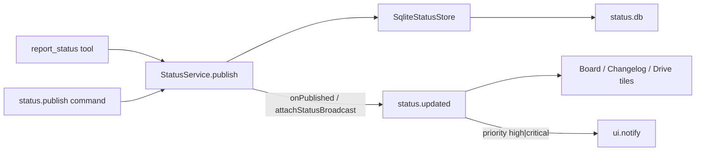
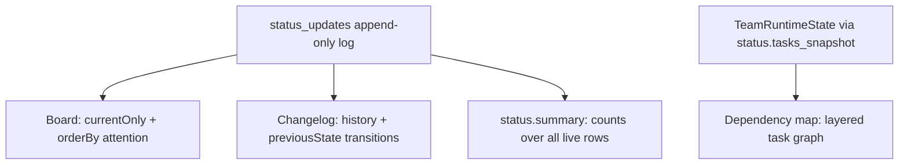
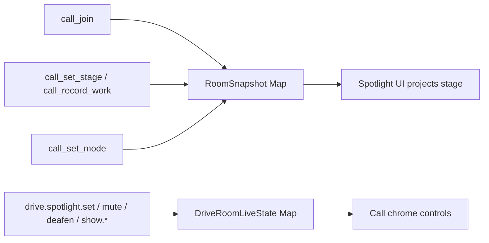
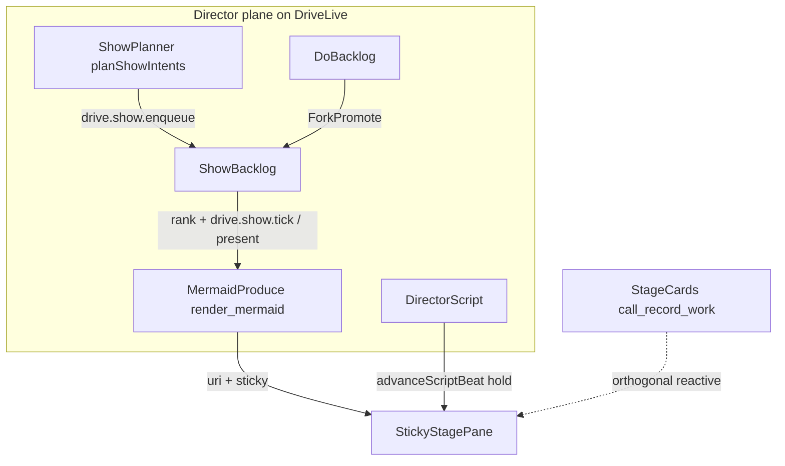
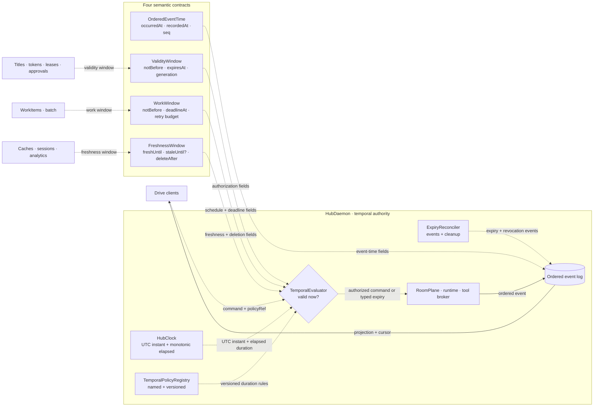

# Drivecode architecture: Status Hub, Drive UI, and protocol planes

Companion to [README](../design/wireframes/README.md) and [ADR-0005](../plans/cline-drivemode/adr/ADR-0005-status-hub.md).
This page is the diagram-first view of how the pieces fit. Schemas and op lists
live in the reference README; decisions live in the ADR.

## What this is (and is not)

| Term | Meaning here |
|---|---|
| **Status Hub** | Durable, queryable changelog for agent work (`status.db`, `status.*` hub ops, Board / Changelog / Dependency map). |
| **Drive UI** | Hub surfaces that sit on top of Cline: Drive tab home, call chrome, Spotlight, Drive Settings. |
| **Agent Host Protocol (AHP)** | A prior review finding — not a shipped protocol in this repo. It noted that `HubEventEnvelope` has `eventId` / `timestamp` but **no monotonic `seq`**, so clients cannot detect gaps. Status Hub’s `seq` exists to fix that class of bug for status. |
| **Branch name** `claude/agent-host-protocol-ui-demo-*` | Historical cloud-agent branch that shipped Status Hub + Drive landing. The name is a misnomer; prefer documenting against **current `main`**. |

Non-goals of this architecture:

- Not WebRTC / pixel screen share (human share is a structured Spotlight pin).
- Not room *snapshot* persistence. Per [ADR-0013](../plans/cline-drivemode/adr/ADR-0013-state-partition.md) the live `RoomSnapshot` is process memory only — but the room event log is durable and append-only, and `DriveRoomStore.hydrateFromLog` rebuilds the snapshot by folding it, so a hub restart does not end the room.
- Not a replacement for `sessions.db` lifecycle status (`running` / `ended`).

## System context



Two collaboration planes share the hub process but not storage (Director bags hang off the room live map — see Director / Show plane below):

1. **Status plane** — durable log; survives hub restart; cross-agent.
2. **Room plane** — roster, Spotlight/`stage`, mute/deafen. Derived state is ephemeral; the log it is folded from is durable.

## Product golden path (target; not end-to-end shipped)

```mermaid
flowchart LR
  User(["User opens Work"])
  Pair["Pair an authenticated HTTPS host"]
  Target["Choose an authorized target"]
  Thread["Create or resume a managed chat"]
  Ack["Immediate local acknowledgement"]
  Runtime["Cline runtime executes under host policy"]
  Commit["Hub commits ordered conversation + work events"]
  Project["Clients project response + typed work"]
  Call["Optional remote Call preset"]
  Presenter["Temporary exclusive Presenter grant"]
  Resume["End, reconnect, and resume by cursor"]
  Reconnect["Honest reconnect / pairing state"]
  Reauthorize["Revoked target reauthorization"]
  Failure["Typed failure + bounded retry"]

  User -->|"connection intent"| Pair
  Pair -->|"host identity + session"| Target
  Target -->|"opaque WorkTargetRef"| Thread
  Thread -->|"chat command"| Ack
  Ack -->|"authorized work item"| Runtime
  Runtime -->|"runtime result"| Commit
  Commit -->|"snapshot + cursor"| Project
  Project -->|"visible outcome"| User
  Project -.->|"call intent"| Call
  Call -->|"title request"| Presenter
  Presenter -->|"stage events"| Commit
  Commit -->|"durable history"| Resume
  Resume -->|"chat id + cursor"| Thread
  Pair -.->|"unavailable"| Reconnect
  Target -.->|"access revoked"| Reauthorize
  Runtime -.->|"provider or tool failure"| Failure
  Failure -->|"retry or revise"| Thread
```



“Happy path” means the success-only branch. **Golden path** is the better term
for Drive: it is the supported route with explicit authority, observability,
recovery, and truthful failure states. The minimum product proof is a user who
pairs a trusted host, selects a real target, sends a message, receives typed
agent work, and resumes the same chat after interruption. Call and Presenter
extend that path; they do not replace the chat proof.

### Implementation gap ledger

| Stage | Current evidence | Gap before the golden path is functional |
|---|---|---|
| Work entry | The standalone iOS app has the quiet target-aware composer, New Chat, and Call surfaces. | Release still needs a first-run connection path; the current usable world is a labeled preview. |
| Host trust | Cline owns the single-writer Hub and Release iOS rejects loopback/LAN endpoints. | Add discovery or pairing, authenticated HTTPS, host identity, reconnect state, and a reviewer-reachable deployment. |
| Target selection | `WorkTargetRef` is opaque by contract. | Replace `WorkTargetRef.previews` with host-resolved repository targets and security-scoped device targets; support revoke and reauthorize. |
| Managed chat | Cline has runtime, command, room-event, and projection primitives. | Add the chat catalog, stable chat ids, response streaming, persistence, resume, and the iOS binding. Today iOS appends a local user message and best-effort publishes `conversation.message`; it has no managed assistant turn. |
| Ordered return | Cline's room log, deterministic fold, Status plane, and typed stage cards are strong foundations. | Define the native chat command/projection contract and prove identity, target, writer generation, idempotency, gaps, and backpressure end to end. |
| Calls | Session lifecycle schemas and iOS call configuration UI exist. | Resolve presets through the host, create/join a real remote session, fan out invitations, and derive UI only from host events rather than local `inCall` state. |
| Presenter | Cline's Presenter/Director coordinator is on `main`. | Reconcile leave/end semantics in the standalone harness and MCP writer, make `room_end` idempotent, and teach iOS projections to consume the canonical cleanup. |
| Resume and history | Cline can rebuild room snapshots from its durable event log. | The standalone MCP writer is in-memory; connect iOS to the durable host and prove app kill, host restart, cursor reset, duplicate delivery, and offline recovery. |
| Verification | Each repository has focused unit coverage. | Add one versioned cross-repository test: coordinator → transport/writer → iOS projection, including revoked target, duplicate end, Presenter leave/end, reconnect, and process restart. |

Core golden-path exit criteria:

1. A clean install can pair a trusted host and list at least one real,
   authorized target without developer-entered URLs.
2. Sending creates or resumes a stable chat, acknowledges immediately, streams
   a managed response, and commits typed conversation/work events once.
3. Force-quitting the app and restarting the host preserves the chat and resumes
   from a cursor without duplicated work.
4. Call uses a host-resolved preset; Presenter remains exclusive, leaving
   revokes its holder, and repeated room end is a no-op.
5. Offline host, revoked target, expired authority, provider failure, and a
   cursor gap produce actionable typed states—never fake success or silent
   fallback.

### Four-PR integration checkpoint

Reviewed 2026-08-18 PT. These are recommendations, not merge status changes.
The older Cline [#15](https://github.com/drive-mode/cline-drivecode/pull/15)
is unrelated and is not part of this four-PR delivery set.

| PR | Recommendation | Evidence and required follow-up |
|---|---|---|
| Cline [#18](https://github.com/drive-mode/cline-drivecode/pull/18) | **Merge after marking ready.** | Documentation-only correction; mergeable and latest internal-link/Drive CI/Bugbot checks are green. It accurately records Cline #17 and the standalone iOS stack as merged. |
| Collaboration harness [#4](https://github.com/drive-mode/collaboration-harness/pull/4) | **Hold.** | The first review bug was only partly corrected: `endedRoomIds` is now cleared by *every* non-end operation, while Cline reopens an ended room only on successful `join`. A rejected or non-reopening op can therefore permit a second `control.end`. Move marker clearing to the successful reopen path and add the negative/idempotency test. Bugbot is the only check. |
| DriveMode MCP [#4](https://github.com/drive-mode/drivemode-mcp/pull/4) | **Hold behind harness #4.** | Stdio exposure was fixed, but `RoomService.end()` still appends a fresh `control.end` for every request, so the public writer operation is not idempotent like the coordinator. Add service/HTTP/stdio idempotency coverage and merge the harness dependency first. Bugbot is the only check. |
| Drive iOS [#9](https://github.com/drive-mode/drive-ios/pull/9) | **Update, then merge.** | The backend ladder is useful and honest, but its rung-0 snapshot should record the two blockers above, label suite counts as author-reported local runs where no CI exists, and link this golden-path contract. Keep the explicit post-merge Xcode/device rerun gap. |

Merge order after the two runtime defects are fixed and real checks are green:
**Cline #18 → harness #4 → MCP #4 → updated iOS #9**. Cline #18 is independent;
the remaining order preserves the runtime dependency and lets the final iOS
snapshot describe settled state.

## Layering

| Layer | Owner | Responsibility |
|---|---|---|
| Shared schemas | `@cline/shared` | `StatusUpdate`, query/page/summary zod; hub command/event names |
| Persistence | `@cline/core` | `SqliteStatusStore`, schema, FTS5-or-LIKE search |
| Service | `@cline/core` | `StatusService` publish/query/board/summary/prune + listeners |
| Agent ingress | `@cline/core` tools | `report_status` (attribution from tool context, never from the model) |
| Hub ingress | `@cline/core` | `status.*` commands; `status.updated` / `ui.notify` fan-out |
| Dashboard bridge | `apps/cline-hub` | Browser frames ↔ `HubUIClient` |
| UI lenses | hub webview | Drive home, Board, Changelog, Dependency map, Spotlight |

Dependency direction stays `shared → llms → agents → core → apps`.

## Publish paths

Every durable status must pass through `StatusService.publish`. Live UI and
notifications must hang off **service listeners**, not only the hub command
handler — otherwise tool publishes never reach the wire.



### Priority routing

| Priority | Effect |
|---|---|
| `low` / `normal` | Land in Hub only |
| `high` / `critical` | Hub + `ui.notify` interrupt |

## Query lenses



| Lens | Data | Sort / notes |
|---|---|---|
| Board | One live row per subject | Attention bands then `seq`; composite keyset paging |
| Changelog | Full history | Recency; shows `previousState → state` |
| Summary | Aggregates | Independent of any page (never count from a page) |
| Dependency map | Team tasks | Not `status.db`; empty until an active team has tasks |

`seq` is the resume cursor for the status log. Board paging uses
`(attention band, seq)` resolved in SQL so the wire cursor stays a plain `seq`.

## Protocol catalog (status plane)

### Hub commands

| Command | Role |
|---|---|
| `status.publish` | Insert update; supersede prior current for subject |
| `status.query` | Keyset-paged query |
| `status.current` | Latest live row for one subject |
| `status.board` | Forces current + attention order + history counts |
| `status.summary` | Whole-log live counts |
| `status.subjects` | Distinct subjects |
| `status.prune` | Delete superseded history (`before` and/or `keepPerSubject`) |
| `status.tasks_snapshot` | Team runtime states for Dependency map |

### Hub events

| Event | Role |
|---|---|
| `status.updated` | Full `StatusUpdate` including `seq` |
| `ui.notify` | Raised for high/critical publishes |

### Webview frames (browser ↔ dashboard)

| Inbound | Outbound |
|---|---|
| `status_query` / `status_board` / `status_subjects` / `status_summary` | `status_page` / `status_subjects_result` / `status_summary_result` |
| | `status_updated`, `status_error` |

### Agent tool

`report_status`: `subject`, `state`, `headline`, optional `detail` / `priority` /
`progress`. Session, agent, and workspace come from tool context.

## Drive / room plane (sibling)



| User-facing name | Wire name |
|---|---|
| Spotlight | `stage` (`StageState`, `call_set_stage`) |
| Drive Mode sub-modes | `call_set_mode` → native plan/act |
| Partner mute / deafen | `drive.*` live ops |

Rooms do not share a foreign key with Status Hub. Conventionally a room may
publish under `subject = "drive-room/<id>"`, but that is a string convention
only.

## Director / Show plane (sibling)

Third collaboration concern on the same hub process: **planned** Spotlight
artifacts via dual backlog + DirectorScript. Orthogonal to reactive StageCards.
Canonical names: [`.claude/diagram-conventions.md`](../../../.claude/diagram-conventions.md).
Cline skills: `diagram-first` (nest docs), `diagram-show` (stage present).
Ops: [hub-drive-ops.md](../plans/cline-drivemode/ops/hub-drive-ops.md).



- **Status plane** — durable log; survives hub restart.
- **Room plane** — roster, stage, mute/deafen; derived state ephemeral, source log durable.
- **Director plane** — Do/Show bags + script on `DriveRoomLiveState`; present is event-first (no WebRTC).

Do not conflate Status `DepMap` (team task edges) with `ShowBacklog` sticky diagrams.

## Temporal contract (designed; not fully shipped)

Drive already has time-sensitive fields in writer fences, session leases, chat
approvals, bounded caches, cron work, and provider credentials. Those paths do
not yet share one clock, one duration policy, or one set of boundary semantics.
The target is a small common temporal kernel—not a generic `TemporalEnvelope`
that erases the difference between event order, authority, work, and freshness.



- **Sequence orders truth.** A room `seq` / cursor, not a device timestamp,
  resolves event order. `occurredAt` records source time; `recordedAt` records
  the host commit instant.
- **The host decides validity.** Offline clients may display estimated remaining
  time but never self-authorize. Every privileged use rechecks scope, audience,
  generation, revocation, `notBefore`, and `expiresAt` with host time.
- **UTC and elapsed time are different tools.** UTC instants cross wire and
  storage boundaries. A monotonic clock measures timeouts, latency, and renewal
  intervals inside one process so wall-clock adjustment cannot extend work.
- **Cleanup is not correctness.** Expired grants, credentials, cache entries,
  and jobs fail at read or mutation time. The reconciler later emits any needed
  replayable expiry event and performs bounded cleanup.
- **Policy names replace scattered numbers.** A resource carries an immutable
  `policyRef`; duration values are versioned and changed centrally, with
  environment overrides constrained by policy minimums and maximums.

| Contract | Required semantics | Representative resources |
|---|---|---|
| `OrderedEventTime` | `occurredAt`, host `recordedAt`, monotonic `seq` / cursor; optional causal reference | room events, Status updates, title transfer, analytics source events |
| `ValidityWindow` | `issuedAt`, `notBefore`, `expiresAt`, `generation`, `policyRef`; issuer / audience / subject / scope where bearer authority exists | writer and room leases, access and capability tokens, approvals, `AgentTitleGrant` |
| `WorkWindow` | desired `notBefore`, hard `deadlineAt`, `maxAttempts`, `backoffPolicy`, delivery-lease state, `retentionUntil` | foreground runs, deferred `WorkItem`, batch, scheduled automation |
| `FreshnessWindow` | `freshUntil`; optional `staleUntil` only for non-security values; independent `deleteAfter` and policy hold | context cache, preload, summaries, projections, analytics and artifacts |

`AgentTitleGrant` is not a bearer token. It is an auditable host-side grant
reference with `issuedAt`, `notBefore`, `expiresAt`, `generation`, `revokedAt`,
and scoped bundle references. `Presenter` exclusivity is checked at every stage
mutation. A capability/access token is a credential. A **model token budget**
is a consumption limit. These three uses of “token” must not share a type.

### Simplification boundary

| Keep centrally | Remove or prohibit |
|---|---|
| `HubClock` port: UTC `now()` plus monotonic elapsed clock | client clocks deciding shared order or privilege |
| `TemporalPolicyRegistry`: immutable named/versioned duration policies | hard-coded domain TTLs and untyped seconds/milliseconds in clients |
| Pure evaluators for the four contracts | feature-specific interpretations of “expired” |
| One bounded `ExpiryReconciler` and one scheduler adapter | a scheduler or full-table expiry scanner per feature |
| Explicit adapters at provider and database edges | one polymorphic time envelope used for unrelated semantics |

This preserves the current single-writer model: temporal evaluation is a small
host library called by existing ports, not a new network service. Reconciliation
can later run as partitioned work, but losing it cannot re-enable expired
authority or permit a job to commit after its deadline.

### AWS and protocol mapping

| Mechanism | Drive interpretation |
|---|---|
| SQS delay / message timer | Short desired-start delay only; AWS caps message timers at 15 minutes. Use EventBridge Scheduler for longer or recurring starts. |
| SQS visibility timeout | Renewable delivery lease, not a business deadline or exactly-once lock. Standard delivery remains at least once, so every handler is idempotent and checks `deadlineAt` before side effects and commit. |
| EventBridge Scheduler | One-time / recurring start adapter with flexible windows for delay-tolerant work, bounded retry age, attempts, and DLQ. |
| DynamoDB TTL | Storage cleanup only. Expired records can remain readable until background deletion, so reads and mutations reject them synchronously. |
| JWT time claims | `exp`, `nbf`, and `iat` inform validity, combined with issuer, audience, subject, scope, token ID, generation, explicit token type, and bounded skew. |
| HTTP cache freshness | `freshUntil` and explicitly safe stale reuse follow freshness semantics; credentials, permission decisions, titles, and revocation state never use stale-while-revalidate. |

Primary references: [SQS visibility and at-least-once delivery](https://docs.aws.amazon.com/AWSSimpleQueueService/latest/SQSDeveloperGuide/sqs-visibility-timeout.html),
[SQS timers and EventBridge scheduling](https://docs.aws.amazon.com/AWSSimpleQueueService/latest/SQSDeveloperGuide/sqs-message-timers.html),
[EventBridge Scheduler](https://docs.aws.amazon.com/scheduler/latest/UserGuide/managing-schedule.html),
[DynamoDB expired-item behavior](https://docs.aws.amazon.com/amazondynamodb/latest/developerguide/ttl-expired-items.html),
[JWT claims (RFC 7519)](https://www.rfc-editor.org/rfc/rfc7519),
[JWT security guidance (RFC 8725)](https://www.rfc-editor.org/rfc/rfc8725), and
[HTTP caching (RFC 9111)](https://www.rfc-editor.org/rfc/rfc9111.html).

### Review outcome and migration order

The comprehensive canvas reviews this temporal section alongside every other
architecture section under the six Well-Architected pillars and the six system
pieces (people, data, hardware, software, processes, and networks). The
time-specific matrix adds 60 findings across events, leases, titles, tokens,
approvals, batch, caches, sessions, analytics, and operations.

| Order | Change | Why this order is simpler and safer |
|---|---|---|
| 1 | Publish timestamp vocabulary and units; add `HubClock` and fake-clock conformance tests | Removes seconds/milliseconds and wall-clock ambiguity before behavior changes. |
| 2 | Add immutable `TemporalPolicyRegistry` references and pure validity evaluators | Centralizes duration changes without moving storage or introducing a service. |
| 3 | Migrate writer/room leases, approvals, access/capability tokens, and `AgentTitleGrant` | Authority gets the strictest synchronous checks first; stale reuse is prohibited. |
| 4 | Add `WorkWindow` to foreground, deferred, scheduled, and batch work | Separates desired start, delivery lease, hard deadline, retry age, and retention. |
| 5 | Migrate caches, preload, summaries, and projections to `FreshnessWindow` | Makes safe reuse measurable after the authorization boundary is already sound. |
| 6 | Add bounded reconciliation, retention/deletion propagation, and temporal dashboards | Cleanup and evidence come last because correctness already rejects expired state synchronously. |

Required conformance cases are: just before / exactly at / just after a
boundary; wall-clock jump in both directions; process sleep or pause; delayed
reconciler; duplicate queue delivery; heartbeat loss; refresh stampede; offline
client resume; grant revocation during work; policy-version change; and a
result that finishes after `deadlineAt` but before it attempts to commit.

Do **not** add a distributed time service, a scheduler per feature, a
full-table TTL scanner, stale-while-revalidate for authority, or an exactly-once
queue promise. Revisit separate reconciliation workers only when measured
cleanup volume threatens foreground SLOs; revisit regional clock and epoch
design when Hub authority becomes multi-region active/active.

## UI map

| Route / surface | Role |
|---|---|
| Drive tab (`drive-view.tsx`) | Product home: tiles, Start a Drive call, links into Status Hub |
| Status Hub (`status-view.tsx`) | Board / Changelog / Dependency map |
| Chat + Join call | Live room entry; Spotlight + Drive Settings in chrome |
| HTML wireframe | Discord-like channels IA — prototype only |

## Data model sketch

```text
status_updates
  update_id PK
  seq              -- monotonic resume cursor
  subject          -- free-form identity (/ -delimited by convention)
  state            -- queued|running|blocked|done|failed|cancelled
  headline, detail?, priority, progress?
  session_id?, agent_id?, agent_name?, workspace_root?  -- attribution
  superseded_at    -- NULL = current row for subject
  created_at

PARTIAL UNIQUE (subject) WHERE superseded_at IS NULL
```

Retention: `prune` is explicit; default is keep-everything. Search: indexed
`LIKE`, upgraded to FTS5 when the runtime provides it (Bun yes; Node 22
`node:sqlite` often no).

## Testing matrix (review checklist)

| Area | What to verify |
|---|---|
| Store | Append + supersede; one current per subject; attention composite paging; FTS vs LIKE |
| Handlers | Every `status.*` op; high/critical → `ui.notify` |
| Broadcast | Tool `report_status` and command `status.publish` both fan out (`attachStatusBroadcast`) |
| Webview | Live splice respects active filters; Board counts match lens |
| Rooms | Status survives hub restart; rooms do too — the live `RoomSnapshot` is rebuilt by folding the durable event log (`hydrateFromLogSync` on `call_join`) |

## Related documents

- [drivecode README](../design/wireframes/README.md) — schema and op detail
- [skills inventory](skills-inventory.md) — in-repo skills vs `cline/skills`
- [ADR-0005](../plans/cline-drivemode/adr/ADR-0005-status-hub.md) — decisions D1–D10
- [ADR-0010](../plans/cline-drivemode/adr/ADR-0010-provider-harness-byok.md) — BYOK / topology
- [01-architecture.md](../plans/cline-drivemode/foundation/01-architecture.md) — hub as single writer
