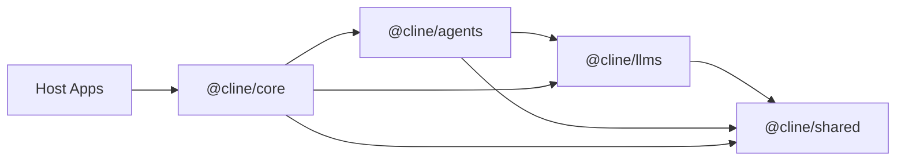
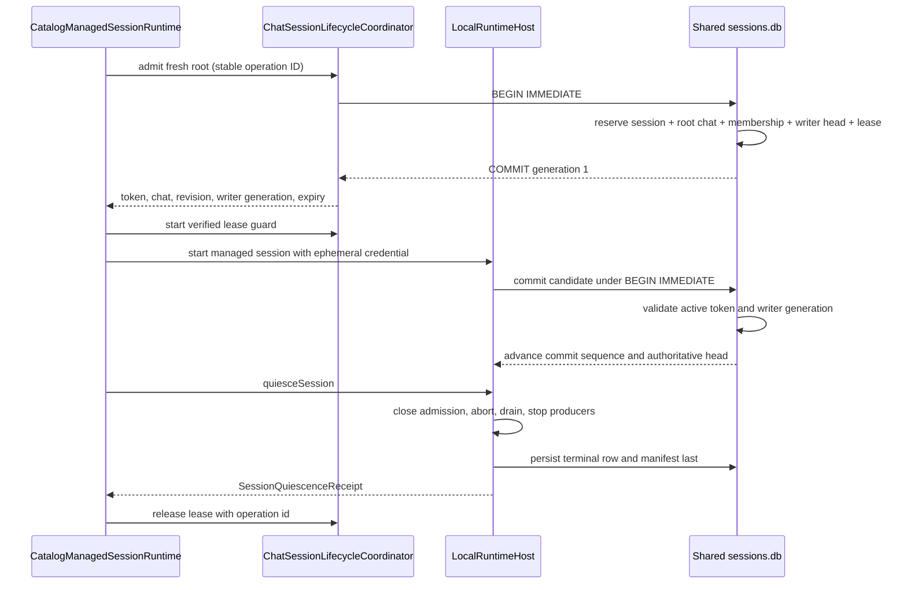

# Cline SDK Architecture

This document is the architecture source of truth for the Cline SDK repository. It describes how the system is organized, how components interact, and the design principles that guide development decisions.

**Who should read this?**
- SDK contributors working across multiple packages
- Developers building integrations or host applications using `@cline/core`
- Plugin authors understanding the runtime and extension systems

**What this covers:**
- Package boundaries and responsibilities
- Dependency direction and layering rules
- Runtime flows (local, hub-backed, remote-config managed)
- Design seams (repeated patterns instead of one-off integrations)
- Architectural constraints and why they exist

**What this is NOT:**
- An onboarding guide for new contributors (see README.md and CONTRIBUTING.md)
- A detailed API reference (see package READMEs and inline JSDoc)
- A user guide (see the main documentation)

## Layered Model

The workspace is organized as a layered runtime stack.

## Package Responsibilities

### `@cline/shared`

Owns reusable low-level contracts and infrastructure:

- shared types and schemas
- path resolution
- hook contracts/engine
- extension registry contracts
- prompt and parsing helpers
- storage path helpers
- remote-config schemas, managed instruction materialization, telemetry normalization, and blob upload primitives

Design rule:

- `shared` should not depend on higher-level runtime packages.

### `@cline/llms`

Owns model/provider runtime concerns:

- provider settings/config resolution
- model catalogs and manifests
- shared gateway-style provider contracts
- handler creation via an internal gateway registry
- AI SDK-backed provider execution code

Design rule:

- provider-specific behavior should be isolated here, not spread across `core` or apps.

### `@cline/agents`

Owns the stateless runtime loop:

- agent iteration loop
- tool orchestration
- runtime event emission
- hook/extension execution
- turn preparation before provider calls
- in-memory team/runtime primitives

Design rule:

- `agents` should not own persistent storage or host lifecycle concerns.

### `@cline/core`

Owns stateful orchestration:

- runtime composition
- session lifecycle
- storage and persistence
- config watching/loading and watcher projections
- settings listing and mutation orchestration
- default host tool assembly
- plugin discovery/loading
- default context compaction policy
- telemetry integration
- hub server and scheduled-runtime services under `src/hub/`
- hub discovery, the detached hub daemon, and the `@cline/core/hub/daemon-entry` subpath
- host-side hub client adapters (`NodeHubClient`, `HubSessionClient`, `HubUIClient`, `connectToHub`) exported from `@cline/core/hub`

Design rules:

- `core` is the app-facing orchestration layer over `agents`.
- hub-related modules live under `packages/core/src/hub/`, grouped by service:
  - `client/` contains host-facing hub clients and browser connection helpers
  - `daemon/` contains detached daemon startup, entrypoint, and local runtime handler wiring
  - `discovery/` contains endpoint defaults, discovery records, and workspace owner resolution
  - `server/` contains WebSocket server startup, native/browser socket adapters, server transport, server helpers, and `handlers/` for hub command dispatch
- settings mutations belong in core services and hub commands, not in host-specific file writes. Hosts should call the core settings facade or the `settings.*` hub command family and react to `settings.changed`.

## Runtime Flows

### Local In-Process Runtime

1. Host constructs a `RuntimeHost` through `@cline/core`.
2. `@cline/core` selects `LocalRuntimeHost` through `packages/core/src/runtime/host.ts`.
3. Hosts normalize broad local config into `RuntimeSessionConfig` plus `localRuntime` overrides before calling `RuntimeHost.start(...)`.
4. `@cline/core` prepares a local bootstrap artifact from `localRuntime`, then builds the runtime from it.
5. `@cline/core` creates an `Agent` from `@cline/agents`.
6. `@cline/agents` runs the loop using `@cline/llms` handlers.
7. `@cline/core` persists state, artifacts, and metadata.

Completion telemetry is anchored to the assistant's explicit completion
declaration, not session shutdown. After each agent turn, the local
runtime inspects `AgentResult.toolCalls` and emits `task.completed` the
moment a successful `submit_and_exit` (the SDK analog of original
Cline's `attempt_completion`) is observed. `shutdownSession(...)`
retains a fallback emission for completed sessions that finished
without an explicit completion-tool observation, so non-interactive
runs not using the yolo preset still produce a `task.completed` signal.
Each session emits at most one `task.completed`. See `DOC.md` for the
event payload and `source` field.

### Hub-Backed Runtime

1. Host constructs a `RuntimeHost` through `@cline/core`.
2. `@cline/core` selects `HubRuntimeHost` or `RemoteRuntimeHost` through `packages/core/src/runtime/host.ts`.
3. When no compatible local hub is already discovered, `@cline/core` can spawn a detached hub daemon and reconnect through discovery.
4. Hosts attach and detach from shared sessions without stopping the authority runtime, so another client can keep streaming or resume the same session later.
5. The hub-hosted runtime executes the agent loop using `@cline/agents` and `@cline/llms`.
6. `@cline/core` hub services broker sessions, events, approvals, schedules, and client-owned runtime capabilities such as session-local tool executors.
7. Hub event forwarding preserves structured streaming lifecycle boundaries: text/reasoning deltas, final text/reasoning completion, tool start/finish, and agent done events are translated across the hub transport so host UIs can reliably close loading/streaming state.
8. Hub client adapters exported from `@cline/core/hub` (`NodeHubClient`, `HubSessionClient`, `HubUIClient`, `connectToHub`) translate command/reply and event streams into host-facing APIs.
9. Hub `session.get` records include both canonical root-session usage and explicit aggregate usage from the hub-owned `RuntimeHost`, so attached clients can intentionally render either root-only or root-plus-teammate costs without replaying event streams.

Workspace bootstrap is owned by the runtime that executes the session. Hub
clients preserve an omitted `cwd` and `workspaceRoot` across the transport so
the hub-side execution host can place the session in the shared chat
workspace on its own filesystem at
`<cline-data-dir>/workspaces/chat` (by default
`~/.cline/data/workspaces/chat`). The chat workspace is seeded with an
`AGENTS.md` rules file that tells the agent to treat the session as a chat
and to create a named project folder only when the user asks for one.
The resolved paths are returned in the session snapshot and are the source of
truth for client-side manifests; transport clients must not invent a local path
for a remote runtime.

Detached daemon startup retries transient `ETXTBSY` spawn failures before
polling discovery. This covers package-manager updates that replace the CLI
binary immediately before a command restarts the shared hub.

Local hub discovery also carries the authentication contract for the shared
daemon. On startup, the hub server generates a cryptographically random
per-process auth token, stores it in the owner discovery record, and writes that
record with owner-only file permissions. Local clients resolve the token from
the discovery file at connection time rather than embedding it in endpoint URLs.
The server validates the token with a constant-time comparison before accepting
`/hub` WebSocket upgrades or `/shutdown` requests; WebSocket clients send it via
the `Sec-WebSocket-Protocol` header and shutdown requests use an
`Authorization: Bearer` header. Unauthenticated local processes can still probe
public health/build metadata, but they cannot attach to sessions, issue
commands, or stop the daemon.

Local hub rediscovery is limited to managed shared-daemon endpoints obtained
through discovery or `ensure*HubServer(...)` startup paths. Explicit endpoints,
including loopback URLs such as `ws://127.0.0.1:<port>/hub`, are sticky exact
targets: reconnects may retry the same socket URL, but command recovery and
startup-deadlock recovery must not replace them with the workspace-discovered
hub. This keeps custom local hubs and remote hubs from silently drifting to a
different process.

### Interactive CLI Startup

1. `apps/cli` owns OpenTUI startup and must render the first frame without waiting for detached hub startup.
2. Interactive sessions use `backendMode: "auto"` so an already-compatible hub can be reused immediately, while a missing hub is only prewarmed in the background and the TUI falls back to a local runtime for responsiveness.
3. Hub-required flows such as `cline hub`, schedules, connectors, and `--zen` may still call the explicit ensure path because those commands require a live hub before proceeding.
4. Resume hydration is deferred until after `renderOpenTui()` so loading previous messages cannot block initial TUI paint.
5. Any future CLI/TUI startup work should follow the same rule: daemon startup, discovery polling, provider catalog refreshes, file indexing, and resume reads must be background or user-action gated unless a command explicitly requires their result before output.

### Connector Persistence and Recovery

1. `@cline/shared/db` owns the low-level SQLite connector store and the one-time legacy JSON import.
2. Dashboard configuration and CLI connection state are recorded separately. Configuration edits replace only dashboard-owned connector and security flags in stored reconnect arguments, preserving CLI-only runtime options, and refresh arguments only for connectors that have previously started successfully.
3. `@cline/core` owns connector autostart persistence and reconnect orchestration. The detached hub daemon is the sole startup reconnect owner, preventing dashboard startup from racing it and launching duplicate processes.
4. Detached connector starts are persisted only after a child process is created. Internal detached children preserve that state when they exit, while a clean user-interactive exit disables autostart.
5. CLI and dashboard hosts pass their connector CLI launch specification through the detached process environment. The package-owned daemon entrypoint uses that specification to start connector reconnect wrappers without importing application code.
6. The detached hub entrypoint exposes `hubDaemonReady`, which resolves only after the WebSocket server is listening. It begins reconnect attempts after signaling readiness, and reconnect failures remain best-effort rather than taking down the hub.

### Remote-Config Managed Runtime

1. A host or core wrapper fetches a normalized `RemoteConfigBundle`.
2. `@cline/shared/remote-config` caches the bundle when configured.
3. Shared remote-config materializes managed rules/workflows/skills under workspace-local `.cline/<plugin>/`.
4. Shared remote-config derives generic OpenTelemetry config and session blob upload metadata from the bundle.
5. `@cline/core` exposes the app-facing integration wrapper that applies extensions, telemetry, and session metadata to `StartSessionInput`.
6. `@cline/core` consumes the prepared local overrides during local bootstrap.

This keeps reusable remote-config behavior in `shared` while the session-specific bridge remains in `core`.

## Design Seams

The codebase relies on a few repeated seams instead of one-off integration paths.

### 1. Config Watchers

Core uses file-based discovery and watchers for:

- rules
- workflows
- skills
- agents
- hooks
- plugins

Design implication:

- new instruction sources should usually materialize into files and reuse watcher-based loading instead of inventing parallel in-memory execution paths.
- in `packages/core`, config-facing discovery, parsing, watching, and slash-command projection live under `src/extensions/config`

### 2. Runtime Builder Inputs

`DefaultRuntimeBuilder` composes a runtime from generic inputs:

- tools
- hooks
- extensions
- user instruction watcher
- telemetry

Design implication:

- higher-level integrations should prefer feeding those seams rather than patching agent internals directly.
- the local runtime bootstrap lives in `packages/core/src/services/local-runtime-bootstrap.ts` and feeds the builder rather than bypassing it

### 3. Runtime Host Boundary

Core exposes one shared execution boundary: `RuntimeHost`.

Concrete implementations:

- `LocalRuntimeHost` for in-process execution
- `HubRuntimeHost` for shared local hub execution
- `RemoteRuntimeHost` for explicit remote hub endpoints

Design implication:

- host selection happens in `packages/core/src/runtime/host.ts`
- `ClineCore` delegates uniformly to `RuntimeHost` and does not branch on local vs hub behavior
- transport-specific translation belongs inside concrete hosts, not in top-level orchestration
- `RuntimeHost` inputs stay transport-safe, while `ClineCore.start(...)` is the app-facing facade that normalizes broad local config before delegation
- `RuntimeSessionConfig` is transport-neutral across local, shared hub, and remote hub modes; host-local bootstrap concerns stay under `localRuntime`
- client-local runtime behaviors that must survive hub mode, such as `defaultToolExecutors`, are attached at session start and proxied through hub capability requests instead of changing host selection
- pending prompt list/update/delete are exposed through the grouped
  `ClineCore.pendingPrompts` service. Usage summary lookup and active-session
  model switching are also service-style capabilities exposed through
  `ClineCore` when the concrete transport implements them. These service APIs
  are intentionally outside the minimal `RuntimeHost` primitive vocabulary.
- The usage service's `getAccumulatedUsage(sessionId)` method returns a summary
  with two explicit buckets: `usage` for the root/lead agent and
  `aggregateUsage` for root plus teammates/subagents. Local execution tracks
  root usage and teammate usage as separate buckets, then derives aggregate
  totals from those buckets while telemetry remains scoped to the primary
  lead/root agent.

#### Catalog-managed session authority

Cross-session chat management adds a trusted-core composition above
`RuntimeHost`; it does not add a lease credential to generic hub commands.
`CatalogManagedSessionRuntime` acquires authority through
`ChatSessionLifecycleCoordinator`, supplies the ephemeral credential only to a
co-located `LocalRuntimeHost`, and returns sanitized chat/revision/expiry state.

The durable fence has two counters with different meanings:

- lease `revision` advances for acquire, renewal, and release CAS/audit;
- `writer_generation` advances only when writer authority is newly created or
  replaced and is the stale-writer fencing generation.

Catalog-managed transcripts, compaction sidecars, manifests, row metadata, and
status updates publish through the same SQLite transaction boundary. File
artifacts are immutable candidates; `session_writer_heads` selects the
authoritative candidate and advances a per-session commit sequence only after
the transaction validates the active token and exact writer generation.
Generic session create/replace/delete and credential-free resume paths reject
managed sessions.

Fresh roots use a registration-before-write transaction. The catalog may
insert a new inert session row or validate an exact prior reservation, but it
creates the root chat/membership, writer head, and initial lease in the same
`BEGIN IMMEDIATE` transaction. Conflicts roll the reservation back. Exact
operation replay returns sanitized current state and never returns the
plaintext lease token again. Initial messages and manifest files are immutable
generation candidates; they are not created until the admitted fence is
available. Session materialization uses `ON CONFLICT DO UPDATE` so catalog
foreign-key identity is preserved.

Fork, checkpoint-restore, config-restart, and recovery starts use the same
registration-before-write boundary through transactional related admission.
Branch relations create a derived chat; successor relations advance the
existing active chat under revision and current-head CAS. In either topology,
the inert session reservation, structural membership, writer head generation
1, and first hash-only lease commit together before host startup. Failed chat
or lineage checks roll the reservation back, and exact replay never reissues a
lost plaintext credential.

`CatalogManagedSessionRuntime.startRoot(...)`, `startRelated(...)`,
`restoreCheckpoint(...)`, and `resume(...)` share one guard-before-bootstrap
path. The guard verifies
authority and installs expiry and renewal watchdogs before execution-host
startup; the host receives the credential only through trusted in-process
composition. Public results contain chat/session IDs and revision/expiry only.

Managed checkpoint restore separates planning from mutation. A read-only
preparation step validates the source checkpoint and derives the exact
messages, checkpoint metadata, and worktree plan. The runtime then admits the
`checkpoint_restore` branch atomically and installs its lease guard. Only while
that guard is resident may it open a worktree restore transaction, apply the
checkpoint, and start the replacement host. Checkpoint refs and the worktree
transaction commit after successful guarded startup; startup or apply failure
stops the guard without releasing uncertain authority and rolls the worktree
back. The restore target must equal the replacement session workspace. Generic
Core restore remains blocked in managed composition.

`ClineCore.create({ backendMode: "local", chatLifecycle: ... })` is the explicit
managed-local composition root. It constructs or validates a
`CoreSessionService`, derives the exact database directory and tenant through
`catalogStorageIdentity()`, eagerly initializes `SqliteChatCatalogService`,
then builds the local port, coordinator, writer verifier, host, and managed
runtime in that order. Managed mode rejects `auto`, hub, remote, file-backed,
cross-database, and cross-tenant configurations before runtime startup; the
legacy file fallback remains available only to unmanaged local sessions.

Confirmed local lifecycle mutations use the optional host-owned
`chatLifecycle.confirm` bridge. Core sends the host UI only the action,
aggregate kind/ID, and observed revision. Invocation identity and the random
256-bit credential remain internal. Approval mints a short-lived grant bound to
the hidden invocation and exact aggregate revision; decline or a missing bridge
fails before grant issuance. The local authority consumes the resulting issued
context once. Hosts must connect this callback only to an explicit human
interaction, never to model output or request metadata.

`ClineCore.chatLifecycle` is a stable sanitized facade. Unmanaged Core
instances expose the same methods but return `unsupported_capability`, so app
code does not interpret a missing facade as permission to fall back to generic
lifecycle calls. Managed Core rejects generic `start` and guarded-session
`stop` and `send`, plus generic checkpoint `restore` because it can start a
replacement session internally; stable operation and session IDs are required. Managed turns
run only under the resident lease guard. After the host has durably advanced
the fenced session row, Core records chat activity from that authoritative
timestamp and updates the guard's chat revision before the next mutation.
Queued turns preserve the host's no-immediate-result behavior. Start
preparation, bootstrap retention, telemetry, stop cleanup, and Core disposal
preserve the existing Core ordering. Managed disposal quiesces and releases
guards before the host and owned SQLite connections close. CLI and connector
composition must remain disabled until every lifecycle caller converges;
partial cutover is forbidden.

Lost live-lease recovery is also part of the sanitized facade. The coordinator
reads the current active lease, asks the host for a `revoke_lease` confirmation
bound to that lease revision, revokes with a deterministic operation step, and
acquires a replacement generation before installing the new guard and starting
the host. The stale token immediately fails the durable writer-generation
fence, while the caller receives only the replacement revision and expiry.

Binding lookup, bind, and reset are part of that same facade in managed-local
composition. Lookup hides bindings whose retained workspace evidence is
outside the Core scope. Bind requires a resident guarded session and uses
stable operation identity plus expected binding revision. Reset is not client
detachment: it quiesces the host, stops lease renewal, CAS-unbinds the observed
binding, and releases the exact writer lease through deterministic saga step
IDs. A failed saga retains its original reset operation identity for retry;
ordinary connector shutdown must preserve the binding and use managed stop
instead of reset.

Archive, activate, rename, and purge also cross only the sanitized facade.
Ordinary archive rejects a running member. Explicit stop-and-archive obtains
human confirmation before quiescing resident sessions, then commits lifecycle
and optional binding clear in one catalog transaction. Rename is a
non-destructive human mutation with stable invocation identity and chat
revision CAS; it records `manual` title provenance without changing activity
ordering. Purge requires an archived, quiescent chat and one-time confirmation,
writes tombstones before cleanup, and keeps the catalog in deleting/error state
until strict idempotent cleanup succeeds. The cleanup adapter checks claim
cancellation before every destructive effect, deletes checkpoint refs
strictly, verifies filesystem removal, and returns only a content-bound receipt.
Hub v1 exposes matching strict schemas and dispatch, but production capability
remains disabled until authenticated workspace scope owns the managed runtime.

The first Hub-scope security slice is intentionally internal and
unadvertised. `HubWorkspaceCapabilityAuthority` issues CSPRNG 256-bit,
digest-only, short-lived, one-time workspace capabilities; consuming one
creates an immutable server identity containing connection, principal, tenant,
canonical workspace, epoch, transport, and authentication time. Workspace
revocation advances the epoch before invalidating pending grants and active
identities. `HubServerTransport.openConnection(...)` accepts only an identity
issued by its private authority, revalidates that identity for every command,
and releases it when the handle closes. Direct/contextless transport dispatch
rejects every `chat_catalog.*` command even when a catalog host is configured.
Core also verifies that host-issued catalog authority exactly matches the
authenticated identity; registration metadata cannot substitute any field.
Every browser socket now receives an explicit per-connection transport handle.
`HubServerTransport` reserves public client IDs to that handle, rejects
cross-handle registration/update/unregister and command spoofing, scopes event
subscriptions to the same owner, and removes clients, subscriptions, and
session participation on close. The browser's duplicate-ID map is only an
additional perimeter check.

Workspace selection is separated from capability minting by
`HubWorkspaceCapabilityRegistry`. Trusted in-process enrollment accepts an
existing directory, resolves symlinks to its canonical real path, binds it to
tenant and principal, and returns a random 256-bit opaque ID. Registry list and
mint surfaces contain no path; mint resolves only an opaque ID under the
already-authenticated tenant/principal. Unknown and cross-owner IDs share one
generic error. Unregister removes enrollment before advancing the authority
epoch, invalidating pending grants and active identities. M0 registry state is
process-local by design, so restart invalidates IDs and requires trusted
re-enrollment rather than reviving stale path-derived authority.

Trusted in-process hosts may list opaque registrations and issue one-time
credentials. A dedicated WebSocket subprotocol consumes the credential before
upgrade, never downgrades an invalid presented credential to daemon-token or
Origin authentication, binds the resulting identity to the socket transport,
rejects replay, and closes the affected socket after epoch revocation. There is
no HTTP mint route.

`NodeHubClient` requests a fresh workspace capability before every physical
socket through an injected provider. Concurrent connection attempts share one
acquisition, an explicit close cancels a pending acquisition before any socket
opens, provider failures are sanitized, and neither the credential nor the
daemon token is cached or combined in the workspace subprotocol. The
in-process adapter mints only by the registry's opaque workspace ID.

Trusted in-process hosts may also request catalog confirmation for an active
workspace connection. Core derives the opaque workspace registration from the
unforgeable identity, normalizes the exact operation target, and gives the
human callback a frozen pathless prompt with no invocation ID or credential.
Prompts are bounded and abort on timeout, close, epoch revoke, or shutdown.
Callback failures are sanitized; Core rechecks the same identity after the
callback and after asynchronous host authorization immediately before catalog
entry. Confirmation credentials are one-time, digest-only at rest, bounded,
never connection-ID reusable, and revoked connection-wide before socket close.

Authenticated workspace runtimes now have a process-local ownership kernel.
`HubWorkspaceManagedCorePool` derives its unambiguously encoded key only from
the private authority's tenant, principal, canonical workspace, workspace
epoch, authority class, immutable audience, policy epoch, and full connection
policy digest. Concurrent socket requests for the same scope single-flight one
factory result, while same-class audiences never share a Core. The pool
rechecks authority after asynchronous construction, aborts and bounds
factory/retirement/disposal waits, disposes a late result after revocation,
replaces an old epoch, and retires workspace runtimes on revoke, unregister, or
server shutdown. Configuring this factory without workspace authority fails
startup. A managed server admits only exact client bookkeeping and the strict
projection/lifecycle/runtime wires below. It rejects raw `chat_catalog.*`
before catalog/Core entry and rejects all legacy runtime, schedule, drive,
status, settings, global client-list, and other command routes. Bound and
direct legacy event subscriptions remain disabled; managed clients receive
only workspace- and audience-bound sanitized projections.

Hub lifecycle v1 defines an exhaustive strict request and result registry for
14 commands: root/related/checkpoint start, resume, lost-lease recovery, turn,
binding lookup/bind/reset, archive/activate/rename/purge, and stop. Callers
select only opaque host profiles and optional workspace-relative working
directories. Start profiles are admission-only and reject prompts; managed
turns start only through `chat_lifecycle.run_turn` after resident ownership is
registered. The wire rejects paths, credentials, authority claims, unknown
fields, traversal-shaped session IDs, malformed results, and protocol drift.
The server resolves requested working directories with `realpath`, rejects
symlink escapes, and removes the relative hint before adapter invocation.
Session artifact sinks independently enforce one-segment IDs, canonical
containment, and no directory symlink. Chat projections omit the
canonical workspace key; turn results contain bounded sanitized summaries,
not messages or tool calls; empty turn/binding results use explicit `null`.
Every successful admission also returns a strict descriptive authority with
profile ID/revision, authority class, policy epoch, and canonical allowed-mode
ceiling. It returns neither credentials nor connection/execution-policy
digests.
The authenticated handler freezes normalized input, supplies the trusted
adapter with the server identity and connection abort signal, rechecks
authority after every await, and validates output before transmission.
Arbitrary adapter errors and catalog error details are not reflected to the
client. The trusted adapter still owns profile resolution, connector
provenance, and the final cancellation fence immediately before mutation.

Managed event v1 exposes one strict `chat.changed` projection. Its payload is
limited to event/aggregate revisions, occurrence time, optional path-safe
session scope, and an optional sanitized pathless chat snapshot. It admits no
prompt, transcript, assistant body, reasoning, tool call, credential, actor,
client, or workspace-path field. Subscription setup requires a successfully
registered client owned by the same authenticated transport. Core constructs
the workspace runtime, validates every adapter emission, reapplies the optional
session filter, and suppresses malformed or post-revocation output. Listener
cleanup remains bound to connection close. Generic wildcard Hub events remain
disabled on managed servers.

Catalog schema v5 adds immutable audience ownership to chats, bindings,
retained purge state, and event delivery scope. A copied pre-v5 database
upgrades in two transactions: phase one freezes strict writer-fenced profile
evidence, records the legacy event high-water, quarantines rows, and revokes
legacy writers; phase two maps only exact frozen evidence. Missing, malformed,
or ambiguous evidence remains non-runnable `audience_unassigned`. Historical
unscoped events are audit-only. A later explicit human assignment is append-only
and emits the first scoped event without reactivating the writer lease.

CA-0 defines the separate reconciliation contract and CA-1 implements its
still-unadvertised server authority. `chat_projection.v1` contains only bounded
`list` and `get`: every result carries an opaque snapshot identity and
authoritative catalog sequence. The server materializes one sanitized SQLite
cut and binds continuation cursors to the same audience, query, page size,
snapshot, and authenticated connection. The client additionally permits at
most one request to consume a continuation cursor. Aggregate output is byte
bounded. Included session and binding summaries carry authoritative total
counts, so a bounded subset is never mistaken for complete lineage. Projection
schemas contain no workspace path, authority selector, credential, lease state,
transcript, prompt, provider configuration, or raw catalog mutation surface.

The additive reconciled lifecycle envelope carries `catalogSequence` and a
listener-relative `previousDeliveredSequence`. Its fenced subscription starts
after the projection cut and reports ready only with the accepted cursor and
processed-through sequence. The server reads only the authenticated audience's
event-time projections, advances a separate scanned cursor across foreign,
legacy, and otherwise hidden global rows, chains only successfully delivered
events, rejects cursors ahead of the durable head, and withholds ready if
delivery is not admitted. Client code applies each event before committing
its checkpoint; a malformed event, failed application, broken chain, invalid
ready acknowledgement, or unavailable replay releases the stream and fails
closed. Applied projection state is published to facade observers only after the
same event's checkpoint advances. `NodeHubClient` can carry a lifecycle cursor
provider and readiness acknowledgement, re-evaluating the latest checkpoint on
every physical subscription. The current daemon deliberately does not
advertise or select the implemented route while the one production release
gate remains off.

Hub runtime v1 adds 12 strict operations for a session already admitted by
managed lifecycle: abort, durable reclaim, approval/capability response,
pending-prompt reads/mutations, sanitized messages/checkpoints/usage/compaction
reads, and trusted manual compaction. Runtime events use one strict sequenced
projection. The server validates every result/event before transmission,
omits paths and provider payloads, and closes a slow socket when a high-priority
reply or runtime event cannot enter the byte-bounded outbound queue. For
assistant deltas, `sessionSequence` is an inclusive end and an optional start
declares at most 256 contiguous source events. Only the WebSocket delivery layer
creates multi-event ranges. It merges only the globally newest adjacent queued
entry for the same subscription/session/run/kind, edits it in place, preserves
endpoint metadata, and never crosses a semantic event or reply. Reaching a
text/range limit starts a new singleton.

Each resident managed session also owns an opaque process-local stream epoch
and a byte/count-bounded journal of deep-frozen sanitized singleton events.
The epoch survives durable writer rekey and changes on unregister/recreate,
adapter restart, or safe sequence rollover. A fresh strict subscription
installs its listener and returns an atomic ready cursor, including sequence
zero for a quiet session. On one genuine same-connection forward gap, the
strict client releases the old transport fence, presents its last accepted
`(streamId, sessionSequence)` cursor, and accepts only the exact contiguous
retained suffix. The source's ready cutoff may arrive after newer contiguous
live output; it is accepted only on the requested stream and between the
requested and already delivered cursors, inclusive. Replay admission failure,
stale epoch, eviction, discontinuity, a cutoff outside that interval, timeout,
cancellation, or a second gap is terminal; provider execution and persistence
reconstruction are forbidden. Runtime journal metadata capacity is reserved
before a durable lifecycle start/resume path, so exhaustion fails before Core
creates resident state or a writer lease.

Strict runtime subscriptions are session-scoped. Global managed subscriptions
carry lifecycle events only and cannot silently degrade into a partial runtime
feed after reconnect. The central WebSocket resource policy defaults to 256
active or in-flight subscriptions per physical connection. Both the socket
adapter and Hub connection transport enforce the cap before source creation;
identical fenced retries remain idempotent. The socket adapter converges one
bounded desired set through a coalescing reconciliation runner. Physical
sources retain exact admission-generation identity, callbacks verify that
identity before delivery, and ingress changes across asynchronous setup restart
from physical cleanup before another source is admitted.

A physical reconnect is not authorized to replay automatically. Node reports
`session_reclaim_required` immediately on physical loss, before autonomous
retry, and exposes the exact registered physical connection generation.
`ManagedSessionController` then retains the last accepted cursor, replays one
stable reclaim operation across uncertain replies, validates an exact
one-generation advance, and admits the new cursor subscription against that
exact connection generation. Both reclaim-command send and subscription
admission compare the generation synchronously. A queued frame from a retired
socket is ignored, so neither a later reconnect nor old physical output can
cross the authority fence.

The reclaim result includes only sanitized authority metadata plus
`ownerTransferred`. If a durable rekey committed but its target disappeared, a
new physical connection may replay the same operation only to observe the
committed generation with `ownerTransferred: false`. That receipt never moves
the process-local owner. The controller creates a new operation against the
observed generation and completes another durable rekey before subscribing.
All connects, commands, retries, and readiness waits share a bounded recovery
deadline. Dispose sends the exact operation through
`chat_runtime.session.reclaim.cancel` on the captured generation without
closing the shared Hub client. Cancellation aborts renewable/startup/drain
waits before the durable callback; after durable work starts, the successor is
installed and its connection owner is orphaned instead of rolling authority
back. The current owner retains its exact reclaim intent independently of the
bounded response-replay cache, so receipt eviction cannot erase post-commit
cancellation authority. Journal entries—including sanitized orphan terminal
events—may survive these in-process rekeys, while live fanout remains current-
owner-only.

Managed callback authority is closed-world and profile-owned. The first
supported name is `tool_executor.askQuestion`, granted only by the interactive
production profile revision 2 / policy epoch 2. The factory includes the
immutable manifest in the managed execution-policy digest, injects the
corresponding in-process executor, and registers the same manifest with the
resident runtime owner. The broker emits only exact bounded
`{ question, options }` requests and accepts only exact `{ answer }` results.
It never emits `AgentToolContext`, workspace metadata, or functions. Responses
must match connection, session, run, request, capability, and recorded expiry,
and are consumed once; timeout, abort, disconnect, owner transition, stop, run
end, or disposal cancels pending work with a fixed safe failure.

Resident writer authority is also a callback fence. The catalog-managed lease
guard exposes one trusted in-process abort signal through `ClineCore`; the
managed adapter binds it to the resident owner, preserves it across durable
rekey, and removes the listener on unregister or disposal. Renewal or
writer-fence loss marks the active run aborting and cancels callbacks before the
Core run settles. Managed stop first prepares the adapter—fencing the run and
cancelling callbacks—before awaiting Core stop, avoiding a callback-timeout
deadlock.

The physical WebSocket path preserves subscription-before-command ordering per
socket: a command waits for earlier subscribe/unsubscribe setup, while commands
remain mutually concurrent so capability responses and aborts can resolve an
active turn. Strict runtime subscriptions also carry a fresh opaque transport
fence captured by their exact server listener and echoed outside the event
envelope. Node routes fenced frames only to the matching live listener and
uses an acknowledgement watchdog for every physical fence, so stale queued or
in-flight output cannot enter a replacement subscription and silent setup
cannot hang indefinitely. Subscription setup that settles after socket close
releases immediately. Loopback conformance covers one-time workspace
capability, registration, profile start, callback event/response, terminal
turn, stop cancellation, late-response rejection, and physical additive-range
delivery without a manufactured gap, plus exact one-shot recovery from a
physical delivery gap. Replacement-socket conformance additionally covers
three fresh one-time capabilities and registrations, a lost committed reclaim
reply, a second socket loss during reclaim, same-intent receipt reconciliation,
a second durable rekey, cursor replay, and readiness in that order.

The owner-authenticated selector-free control plane, fresh-per-socket provider,
production profile registry, concrete managed-Core factory, lifecycle/runtime
adapters, durable resident reclaim, and host-owned manual-compaction receipt
state machine are composed but inert. Production confirmation delivery,
manual-compaction authorization/races, production adoption of the controller,
and all-caller cutover are still open. The one daemon release gate therefore
remains hard off and managed capabilities stay unadvertised in production.

The CA-0 caller seam is the separate Core-owned `ManagedHubChatClient`, not a
mode on legacy `HubSessionClient`. Creation first probes the public pathless
`/version` metadata and requires independent `chat_projection.v1`,
`chat_lifecycle.v1`, and `chat_runtime.v1` support before invoking a workspace
capability provider or constructing a socket transport. Its options accept no
daemon token, workspace selector, audience selector, or authority-class
selector. It hydrates one bounded projection cut, reaches reconciled lifecycle
ready, then exposes semantic lifecycle operations and a separately bounded
resident-session registry. Each admission reserves capacity atomically,
creates one controller over the facade's shared runtime adapter, and withholds
the session handle until the exact-generation runtime subscription is ready;
its operation identity remains leased through that readiness boundary.
Per-session disposal drains reclaim cancellation without closing the shared
transport; repeated, concurrent, and global disposal share a drain barrier
covering pre-controller admissions, starting controllers, and failure-launched
reclaim cancellation before transport teardown. Unknown command outcomes retain
only operation ID, strict command kind, and an intent digest in a bounded map
that rejects new intent before send when full; terminal rejection clears the
intent. Approval and capability responses retain exact session/run/request
correlation and are one-shot. No facade method accepts or emits
`chat_catalog.*`.

`LocalRuntimeHost` registers a lifecycle epoch before its first startup await.
Quiescence closes turn and persistence admission synchronously, waits for
startup and active turns, drains the ordered write queue, shuts down agent,
team/runtime, and plugin producers, then persists terminal state last. Any
cleanup or terminal-persistence failure withholds the receipt. The managed
runtime releases authority only after a receipt; otherwise it retains the lease
until explicit recovery or expiry.

### 4. Settings Mutation Boundary

Core owns settings snapshots and mutations through `packages/core/src/settings`.
The hub exposes the same path through `settings.list` and `settings.toggle`.

Design implication:

- hosts should not mutate skill, tool, MCP, provider, or other settings files directly
- domain-specific persistence helpers, such as skill markdown frontmatter writes, stay internal to the owning settings provider/service
- successful hub-backed mutations return an updated settings snapshot and publish `settings.changed` with the changed settings types
- CLI settings surfaces may keep local snapshot rendering for startup responsiveness, but mutation flow must refresh the relevant watcher before reloading UI data

### 5. Session Startup Bootstrap

`ClineCore.create(...)` exposes a generic `prepare(input)` hook.

Design implication:

- higher-level packages can prepare workspace-scoped runtime state before a session starts
- core stays unaware of enterprise-specific contracts
- cleanup stays at the host boundary rather than inside the agent loop

### 6. Logging

Cross-package logging uses a small injected interface exported from `@cline/shared`:

- **`BasicLogger`** — required `debug` and `log`; optional `error`. Hosts map these to their backend (Pino, VS Code `OutputChannel`, etc.). Many runtime options take `logger?: BasicLogger`; when omitted, components skip logging or use `noopBasicLogger` where a full object is required.
- **`BasicLogMetadata`** — optional structured fields (`sessionId`, `runId`, `providerId`, `toolName`, `durationMs`, …) plus `severity` on `log` when a single method must represent both informational and warning-style messages (for example the CLI Pino bridge maps `severity: "warn"` to Pino `warn`).

Naming clarity:

- **`CliLoggerAdapter` (CLI)** — a **host bundle**: holds the raw `pino` logger (for file paths, rotation, and CLI-only concerns) and exposes `.core: BasicLogger` for anything that consumes the SDK contract. It is not an `ITelemetryAdapter`.
- **`TelemetryLoggerSink` (`@cline/core`)** — an **`ITelemetryAdapter`** that mirrors telemetry events and metrics into a `BasicLogger`. It is a telemetry sink, not a host logging implementation.

The agent and other call sites route former `info` / `warn` semantics through `log` (warnings include `severity: "warn"` in metadata). Errors prefer `error` when implemented; otherwise `log` with `severity: "error"` is used as a fallback.

Design implication:

- logging is injectable and transport-agnostic, allowing host environments (CLI, VS Code, browser) to wire their own backends
- do not hardcode logging calls; accept a `logger?: BasicLogger` parameter instead

### 7. Storage Adapters

Stateful persistence should be isolated behind adapter/service layers.

Design implication:

- file-backed, SQLite-backed, RPC-backed, and enterprise-specific persistence should share service logic where possible and isolate backend differences in adapters.

### 8. Extension and Hook System

Extensibility is split deliberately:

- extensions register runtime contributions
- hooks intercept lifecycle stages

Design implication:

- additive runtime behavior should usually enter through these extension points instead of bespoke special-case host code.

### 9. Context Compaction

Context compaction is owned by `core`.

- `@cline/agents` owns the generic turn-preparation seam:
  - run normal lifecycle hooks
  - allow hosts to project message history or system prompt before the provider call
  - keep its canonical runtime transcript append-only when a projection is returned
- `@cline/core` owns compaction policy:
  - inject a prepare-turn pipeline for root sessions
  - choose between built-in strategies through a registry map
  - persist the latest compacted working context as a session compaction artifact
  - keep compaction logic out of the low-level agent message builder

Design implications:

- compaction is a context-pipeline concern owned by `core`
- canonical session history lives in the session messages artifact at full fidelity; compaction state lives separately in `${sessionId}.compaction.json`
- resume loads the canonical transcript for history/debugging and, when present, reuses the latest compaction state only after validating a hash of the canonical prefix covered by that state; valid state is projected by appending canonical messages written after the compaction boundary
- sessions that were already persisted with compacted messages before this model are best-effort only because the omitted original transcript is not recoverable from the compacted artifact
- `agents` stays focused on the stateless loop and provider/tool orchestration
- delegated/subagent flows should inherit compaction behavior through core session config, not through a separate agent-level compaction hook surface

### 10. Extension Layering Inside Core

`packages/core/src/extensions` is split by concern:

- `extensions/config`: config loaders, parsers, watchers, and watcher projections such as runtime slash-command expansion
- `extensions/plugin`: runtime plugin discovery, loading, and sandboxing
- `extensions/context`: core-owned context/message pipeline concerns such as compaction

Design implications:

- avoid mixing config discovery code into runtime/plugin code
- avoid creating thin runtime wrapper files when a helper is fundamentally projecting watcher state

## Architectural Constraints

### Keep `agents` Stateless

Do not move these concerns into `@cline/agents`:

- session persistence
- provider settings storage
- RPC lifecycle
- host-specific approvals
- remote-config policy caching

### Keep `core` Generic

Do not make `@cline/core` organization- or provider-specific.

If a capability is truly generic and app-facing, add a generic core seam. Reusable remote-config parsing, materialization, and upload primitives belong in `@cline/shared/remote-config`.

### Use One-Way Optional Layers

Optional higher-level integrations may depend on lower layers.
Lower layers should not depend on optional feature packages.

For remote config, that means shared owns the reusable bundle/materialization/blob primitives and core owns only the session-oriented wrapper exported to apps.

## File-Based And Event-Driven Automation (`ClineCore` / `CronService`)

`@cline/core` ships a file-based automation subsystem under
`packages/core/src/cron/`. It lets operators author recurring and one-off
tasks as Markdown files under global `~/.cline/cron/` by default, and
event-driven tasks as `events/*.event.md` specs. All trigger kinds run
through the same durable queue and runtime handlers. `ClineCore` exposes the
SDK-facing `cline.automation.*` entry points; `CronService` is the internal
orchestrator used by core and hub layers.

### Layers

1. **Spec parser** (`cron/specs/cron-spec-parser.ts`): parses YAML frontmatter + body
   into a `CronSpec` discriminated union (`one_off | schedule | event`).
   Types live in `@cline/shared` under `src/cron/cron-spec-types.ts`
   so other packages can consume them without the YAML parser. Schedule
   expressions and timezones are validated before a spec can become
   runnable.
2. **Store** (`cron/store/sqlite-cron-store.ts`): owns `cron.db` at
   `resolveCronDbPath()` (default `.cline/data/db/cron.db`). Schema is
   bootstrapped from `cron/store/cron-schema.ts` — sessions and cron live in separate
   DBs so their lifecycles stay decoupled.
3. **Reconciler** (`cron/specs/cron-reconciler.ts`): scans the configured cron specs
   directory (global `~/.cline/cron/` by default, or workspace-scoped when
   configured), parses each file independently, and upserts spec state.
   Invalid specs are recorded
   with `parse_status='invalid'` so state is durable rather than silently
   dropped. Files that disappear between scans get `removed=1` and their
   queued runs are cancelled.
4. **Watcher** (`cron/specs/cron-watcher.ts`): `node:fs watch({ recursive: true })`
   with a ~250ms per-path debounce. Watcher events always trigger a
   re-reconcile — the reconciler is always the source of truth, not the
   watcher stream.
5. **Materializer** (`cron/runner/cron-materializer.ts`): turns file-triggered specs into
   queued `cron_runs`. One-off: at most one run record per `(spec_id,
   revision)`, including failed runs so specs do not retry accidentally.
   Schedule: "one overdue catch-up on startup then advance" using
   timezone-aware `getNextCronTime`.
6. **Event ingress** (`cron/events/cron-event-ingress.ts`): accepts already-normalized
   `AutomationEventEnvelope` values, persists them into `cron_event_log`,
   matches enabled event specs by `event_type` plus declarative filters,
   applies dedupe/debounce/cooldown policy, and enqueues `cron_runs` with
   `trigger_kind='event'`. It never executes agents directly. Plugins can
   declare `automationEvents` and submit normalized events through
   `ctx.automation.ingestEvent(...)`; sandboxed plugins forward those events
   through the core plugin event bridge.
7. **Runner** (`cron/runner/cron-runner.ts`): polls `cron.db`, atomically claims
   queued runs, executes them via the existing `HubScheduleRuntimeHandlers`
   (`startSession` → `sendSession` → `stopSession` / `abortSession`),
   renews the run claim while execution is active, writes a markdown report
   per run, and transactionally updates status. File specs can constrain
   tool availability, config extension loading (`rules`, `skills`,
   `plugins`), session source, and a notes directory that is injected into
   the system prompt. Event runs include the normalized trigger event context
   in the prompt.
8. **Reports** (`cron/reports/cron-report-writer.ts`): writes
   `.cline/cron/reports/<run-id>.md` with run frontmatter plus
   `## Summary`, `## Usage`, `## Tool Calls`, and, for event runs,
   `## Trigger Event` sections.
9. **Service** (`cron/service/cron-service.ts`): orchestrates all of the above.
   `ClineCore.create({ automation })` owns the SDK-facing lifecycle and exposes
   `cline.automation.*` methods. Hub-side callers can submit normalized events
   through the `cron.event.ingest` command.

The detached hub daemon passes its workspace root as `cronOptions`, so
normal CLI/hub startup watches `${workspaceRoot}/.cline/cron/` without a
custom host needing to opt in.

Programmatic hub schedules are stored as `cron_specs` with source
`hub-schedule` and execute through the same `cron_runs`
claim/requeue/report flow as file-backed one-off, recurring, and
event-driven specs. The hub schedule command surface remains a thin adapter;
there is no separate schedules table, schedule store, or schedule runner.

## Navigating the Codebase

### Starting Points by Task

**I want to understand the agent loop and tool execution:**
- Start: `packages/agents/src/agent.ts` — the stateless runtime loop
- Then: `packages/agents/src/agent-step.ts` — individual iteration steps
- Extensions: `packages/core/src/extensions/plugin/` — plugin discovery and sandboxing

**I want to understand session persistence and state:**
- Start: `packages/core/src/runtime/host/local-runtime-host.ts` — local session lifecycle
- Then: `packages/core/src/runtime/orchestration/` — session orchestration
- Settings: `packages/core/src/settings/` — settings mutation and state

**I want to understand the hub system:**
- Start: `packages/core/src/hub/server/` — WebSocket server and hub command handlers
- Clients: `packages/core/src/hub/client/` — host-side hub clients
- Transport: `packages/core/src/hub/runtime-host/` — hub-backed runtime hosts

**I want to add a new tool:**
- Tools registry: `packages/core/src/extensions/tools/` — built-in tool definitions
- Tool execution: `packages/agents/src/tool-use.ts` — how tools are called
- Plugin tools: `packages/core/src/extensions/plugin/` — plugin-registered tools

**I want to understand settings and configuration:**
- Watcher system: `packages/core/src/extensions/config/` — file watching and loading
- Provider config: `packages/core/src/runtime/config/` — provider settings resolution
- Settings services: `packages/core/src/settings/` — settings state and mutation

**I want to add a new runtime feature (hook/extension):**
- Hook contracts: `packages/shared/src/hooks/` — hook types and engine
- Plugin system: `packages/core/src/extensions/plugin/` — plugin discovery and execution
- Runtime builder: `packages/core/src/services/local-runtime-bootstrap.ts` — how runtime is composed

### File Naming Conventions

- `*.ts` — TypeScript source
- `*.test.ts` — unit tests (Vitest)
- `*.e2e.test.ts` — end-to-end tests requiring full integration
- `*.ts` in examples — runnable example files (plugins, hooks)
- `*.md` files in `apps/examples/` — documentation and markdown-based specs (cron, events)

### Key Type Locations

- **`ClineCore`** — `packages/core/src/index.ts` — the main SDK orchestrator
- **`Agent`** — `packages/agents/src/agent.ts` — the agent loop
- **`RuntimeHost`** — `packages/core/src/runtime/host/runtime-host.ts` — execution abstraction
- **`AgentPlugin`** — `packages/shared/src/plugin/` — plugin contract
- **`CronSpec`** — `packages/shared/src/cron/cron-spec-types.ts` — automation specs

## Publishability Constraint

This repo has both publishable SDK packages and internal workspace packages.

Architectural consequence:

- internal packages must not accidentally become part of the publishable SDK surface
- release automation should only target the intended published packages
- internal code may compose with published packages, but published packages should not take hard dependencies on internal-only workspace layers unless you explicitly intend to publish that integration

### Published Packages

The following packages are published to npm:

- `@cline/shared` — shared types, contracts, and low-level utilities
- `@cline/llms` — provider integrations and model manifests
- `@cline/agents` — the agent loop and tool orchestration
- `@cline/core` — the main SDK with session management, hub, and configuration

### Internal Apps

The following workspace apps are internal and not published as SDK packages:

- `apps/cli` — CLI implementation
- `apps/webview` — VS Code webview
- `apps/examples` — example plugins and integrations
